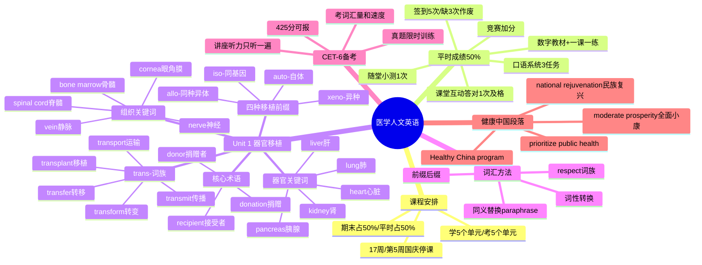

# 知识框架与思维导图 — 大学英语（医学人文英语）

---

## 一、Mermaid 思维导图

---

## 二、层级知识框架

### 1. 课程体系

- **教材**：English for Medical Humanities（第三版）+ 一课一练（第三版）
- **范围**：8个单元中学5个、考5个
- **平台**：超星（数字教材+一课一练）+ 口语系统

### 2. 成绩体系

- **期末考试 50%**：Passage A + 一课一练题型
- **平时成绩 50%**
  - 签到（5次随机）
  - 随堂小测（1次）
  - 课堂互动（回答问题）
  - 口语任务（3个）
  - 章节测验+任务点
  - 竞赛（加分）

### 3. Unit 1 器官移植知识网

- **核心主题**：organ transplant
- **词族**：trans-（from...to...）
  - transplant / transmit / transfer / transform / transport
- **器官英文**：heart, kidney, liver, lung, pancreas, intestine
- **组织英文**：bone marrow, cornea, nerve, vein, spinal cord
- **人物角色**：donor（捐赠者）↔ recipient（接受者）
- **定义**：medical procedure moving an organ from donor to recipient
- **移植前缀**：auto- / iso- / allo- / xeno-
- **其他关键词**：donation, allocation, immunosuppressing, ventilator, trauma

### 4. 词汇学习方法

- **构词法**：prefix（前缀）+ suffix（后缀）+ root（词根）
- **同义替换**：paraphrase = synonym替换 + 句式变换
- **respect词族**：respect（方面/尊敬）、respective（各自的）、respectful（恭敬的）、respectable（值得尊敬的）

### 5. CET-6 与医学英语

- **CET-6**：听力为讲座（只听一遍），考词汇量和做题速度
- **METS医护英语**：三级易、四级稍难
- **作文大赛**：联盟杯，下学期参加
