# 第1课：课程安排与考核要求 — 知识点总结（期末考试扩写版）

> 科目：大学英语（医学人文英语）Humanistic Medical English (I)
> 上课日期：2026-09-08（周一下午，凌极智慧语言实验室，机房上课）
> 教材：English for Medical Humanities (I)《医学人文英语》+《一课一练》
> 说明：本课为课程导论 + 健康中国主题段落 + Unit 1 器官移植入门。英语课无统一指定教材版本，重点是**考核要求、医学英语学习方法、课堂活动安排**。

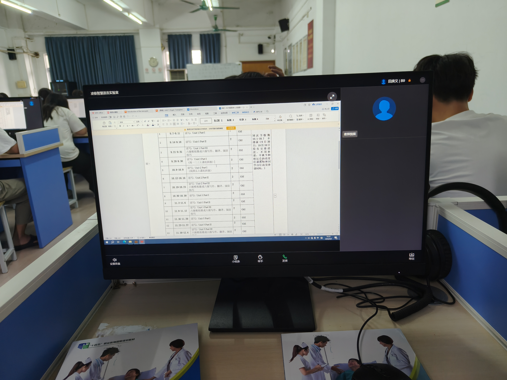

---

## 一、课程基本安排

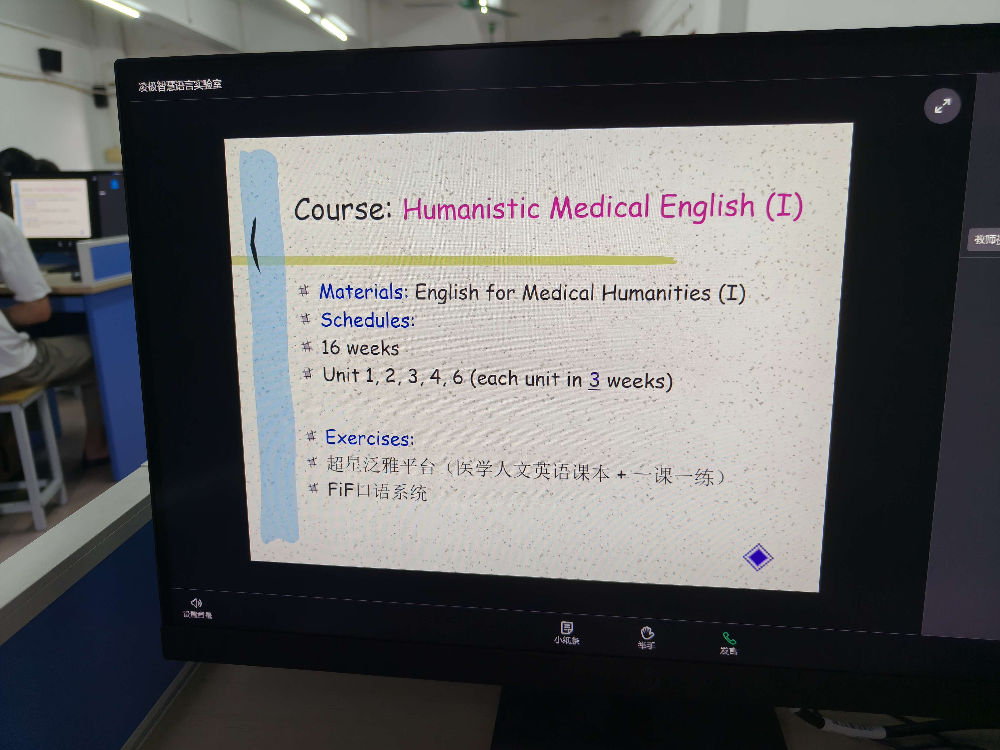

- **课程名称**：Humanistic Medical English (I)（医学人文英语 上册）。
- **教材**：English for Medical Humanities (I)（主教材）+《一课一练》（配套练习）。
- **学期周数**：共 **16周**；全书8个单元，**只学5个、只考5个**，即 **Unit 1、2、3、4、6**，每个单元约用 **3周** 讲完。
- **练习平台**：
  - **超星泛雅平台**（医学人文英语课本 + 一课一练，分别进入两门课程完成）；
  - **FiF 口语系统**（口语训练）。

---

## 二、考核与成绩构成【重点】

### 2.1 总成绩 = 期末考试(50%) + 平时成绩(50%)

本学期起期末考试占比由以往30%~40%提高到 **50%**，平时成绩也占 **50%**。老师原话："你们要小心啊，按照以往很多同学期末考试都不及格，都是全靠平时成绩来拉高的，所以这回50%了。"

### 2.2 平时成绩细项（一项都不能丢）

| 项目 | 规则 |
|------|------|
| **签到** | 一学期不定期发 **5次** 签到；被抓到 **3次缺勤**，平时成绩作废 |
| **课堂互动** | 最低要求：一学期至少**答对1次**才能及格；约 **6~7次** 可达满分 |
| **随堂小测** | 全学期仅 **1次**（学完第3个单元后） |
| **数字教材任务** | 章节测验 + 任务点；做完章节测验后**必须自己再点任务点**，否则系统不计成绩 |
| **一课一练** | 同步在超星完成 |
| **口语作业** | FiF系统共3个任务，**严禁机器代读** |
| **竞赛** | 超星通知栏发布，可额外加分 |

【考点】老师原话："我一般一个学期是不定期发5次签到的，5次签到你别给我抓到三次哦，抓到三次的话就50分也没用。""我的最低要求，一个学期下来你如果想及格至少回答一次……如果想要满分的话，可能要回答6~7次。"

### 2.3 FiF 口语作业安排

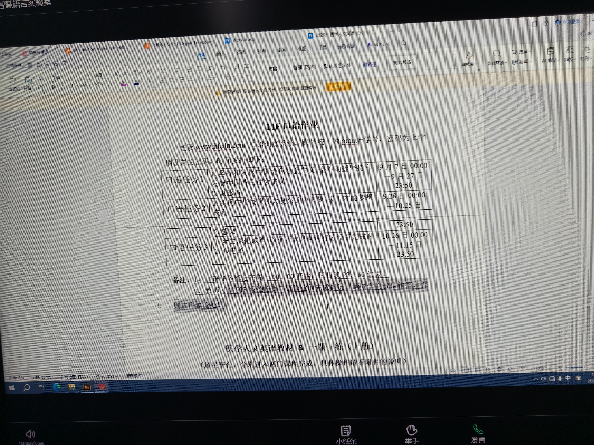

- **登录**：www.fifedu.com，账号统一为 **gdmu + 学号**，密码为上学期设置的密码。
- **时间规则**：口语任务一律 **周一 00:00 开始、周日 23:50 结束**；教师可在FiF系统检查完成情况，**请诚信作答，否则按作弊论处**。
- 口语任务内容涵盖"坚持发展中国特色社会主义""重感冒""感染""改革开放""心电图"等话题的朗读与复述。

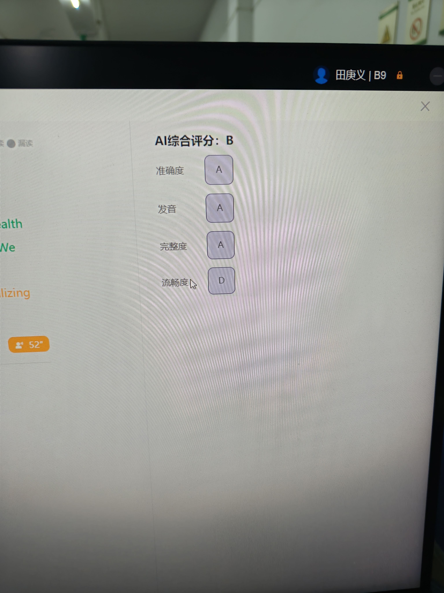

> FiF系统从**准确度、发音、完整度、流畅度**四个维度给AI评分（如准确度A、发音A、完整度A、流畅度D），录音时要注意流利度，不要卡顿。

### 2.4 截止时间（全年级统一，过时不候）

| 内容 | 截止时间 |
|------|----------|
| 第1、2单元 | **11月1日** |
| 第6单元 | **12月25日** |
| 第3~5单元及口语任务 | 每周日 |

【考点】老师强调："过时不候，老师没办法单独给你们开。"

---

## 三、健康中国主题段落（Promote a Healthy China）

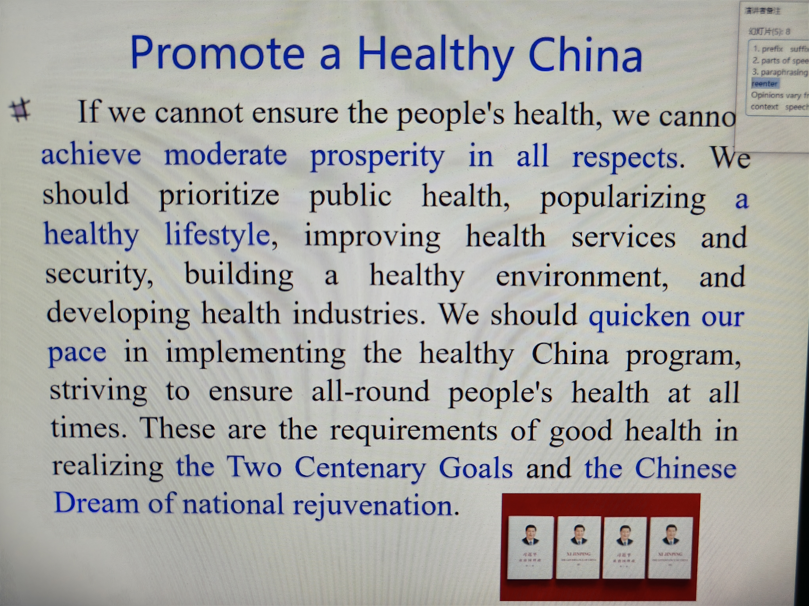

本课第一段口语朗读材料选自"健康中国"主题，是听力口语训练与翻译的重要语料。原文要点：

> "If we cannot ensure the people's health, we cannot achieve moderate prosperity in all respects. We should prioritize public health, popularizing a healthy lifestyle, improving health services and security, building a healthy environment, and developing health industries. We should quicken our pace in implementing the Healthy China program... striving to ensure all-round people's health... These are the requirements of good health in realizing the Two Centenary Goals and the Chinese Dream of national rejuvenation."

**关键表达与翻译**：

| 英文 | 中文 | 注意点 |
|------|------|--------|
| moderate prosperity in all respects | 全面小康 | respect 此处=**方面**（aspects），不是"尊敬" |
| prioritize public health | 优先发展公共卫生 | prioritize 动词，名词 priority |
| popularize a healthy lifestyle | 普及健康生活方式 | popularize = 推广、普及 |
| the Two Centenary Goals | 两个一百年奋斗目标 | |
| national rejuvenation | 民族复兴 | re- = again/back |
| the Chinese Dream | 中国梦 | |

【考点】老师特别提醒：**respect** 在 "in all respects" 中意为"方面"，不是"尊敬"；背单词要回忆前后缀、词性、近义词和同义替换（paraphrase）。

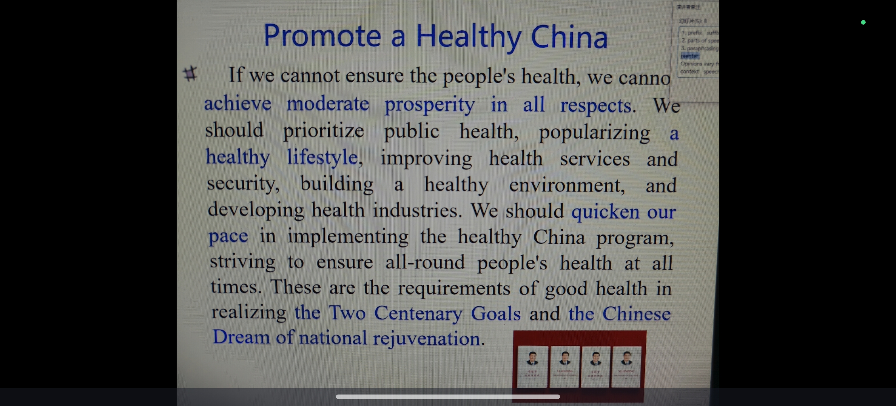

---

## 四、Unit 1 器官移植（Organ Transplantation）核心词汇

### 4.1 可移植的器官（Organs）

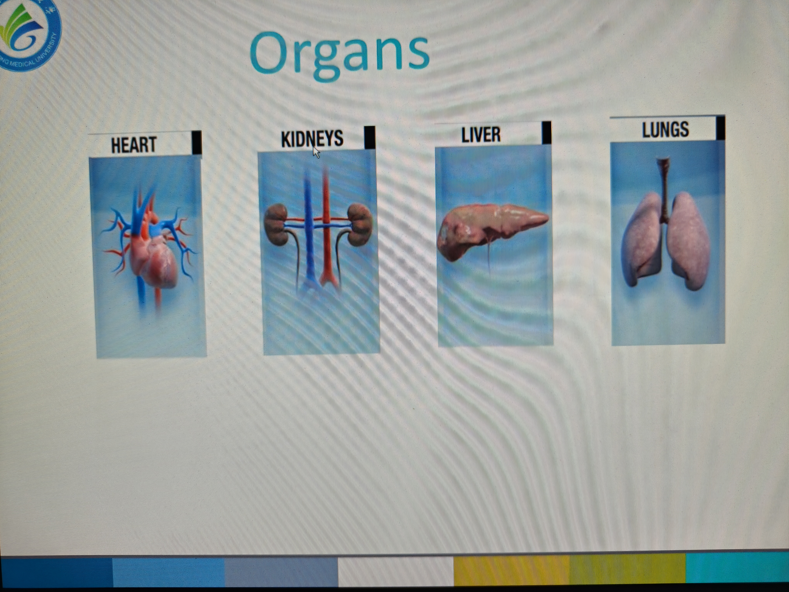

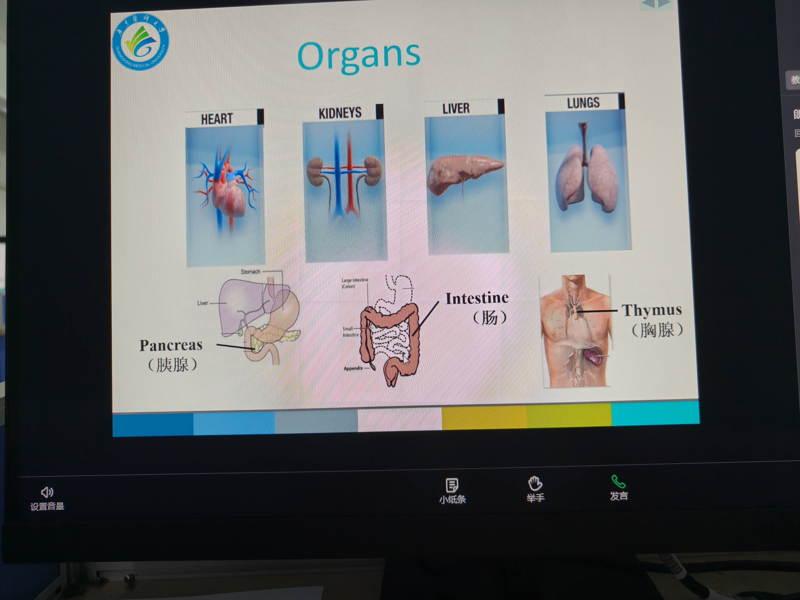

| 英文 | 中文 |
|------|------|
| heart | 心脏 |
| kidneys | 肾 |
| liver | 肝 |
| lungs | 肺 |
| pancreas | 胰腺 |
| intestine | 肠 |
| thymus | 胸腺 |

【考点】老师说："到时候的随堂小测，我就是选一个来考。"这些器官名要会认、会读、会拼。

### 4.2 可移植的组织（Tissues）

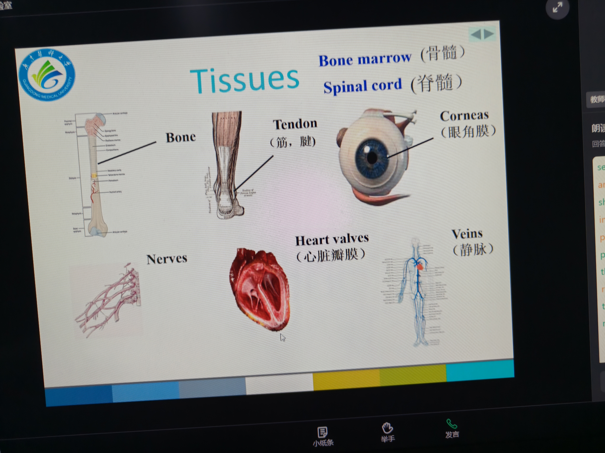

| 英文 | 中文 |
|------|------|
| bone marrow | 骨髓 |
| spinal cord | 脊髓 |
| tendon | 筋、腱 |
| cornea | 眼角膜（复数加s） |
| heart valves | 心脏瓣膜 |
| veins | 静脉 |
| nerves | 神经 |
| bone | 骨 |

### 4.3 移植主题核心词汇表（Vocabulary）

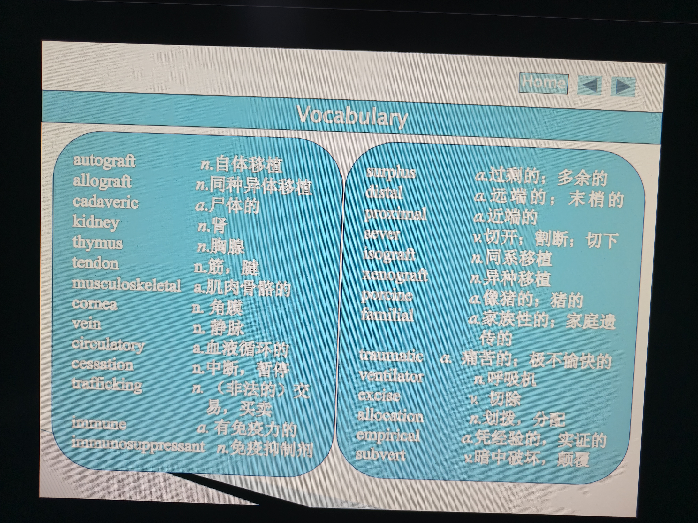

| 英文 | 词性 | 中文 |
|------|------|------|
| autograft | n. | 自体移植 |
| allograft | n. | 同种异体移植 |
| cadaveric | a. | 尸体的 |
| kidney | n. | 肾 |
| thymus | n. | 胸腺 |
| tendon | n. | 筋，腱 |
| musculoskeletal | a. | 肌肉骨骼的 |
| cornea | n. | 角膜 |
| vein | n. | 静脉 |
| circulatory | a. | 血液循环的 |
| cessation | n. | 中断，暂停 |
| immune | a. | 有免疫力的 |
| immunosuppressant | n. | 免疫抑制剂 |
| surplus | a. | 过剩的；多余的 |
| distal | a. | 远端的；末梢的 |
| proximal | a. | 近端的 |
| sever | v. | 切开；割断；切下 |
| isograft | n. | 同系移植 |
| xenograft | n. | 异种移植 |
| porcine | a. | 猪的 |
| familial | a. | 家族性的；家庭遗传的 |
| traumatic | a. | 痛苦的；极不愉快的 |
| ventilator | n. | 呼吸机 |
| excise | v. | 切除 |
| allocation | n. | 划拨，分配 |
| empirical | a. | 凭经验的，实证的 |
| subvert | v. | 暗中破坏，颠覆 |

### 4.4 课文复习（Review）要点

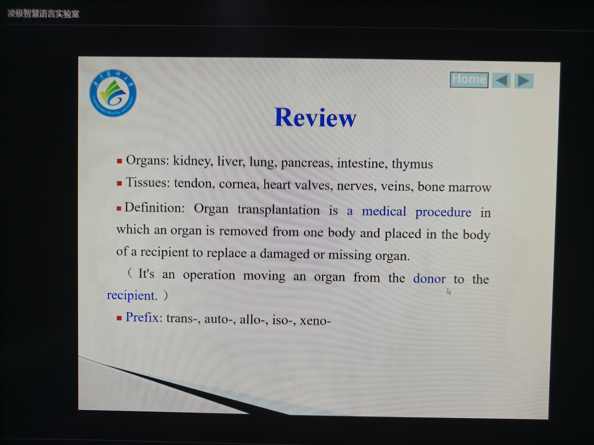

- **器官移植定义**："Organ transplantation is a medical procedure in which an organ is removed from one body and placed in the body of a recipient to replace a damaged or missing organ."（一句话版：It's an operation moving an organ from the donor to the recipient.）
- **关键人物**：捐赠者 = **donor**（D-O-N-O-R），接受者 = **recipient**（**不是 receiver**）。老师金句："Every donor has the potential to save up to nine lives."
- **前缀（prefix）**：**trans-, auto-, allo-, iso-, xeno-** 五种移植分类前缀。
  - **trans-**：from...to...（由此及彼）—— transplant（移植）、transmit（传播）、transfer（转移）、transform（转变）、transport（运输）。
  - **auto-**：自体；**iso-**：同系；**allo-**：同种异体；**xeno-**：异种。
- **brain（脑）目前还不能移植**，其余器官随技术发展均可移植。

---

## 五、课后作业（Homework）

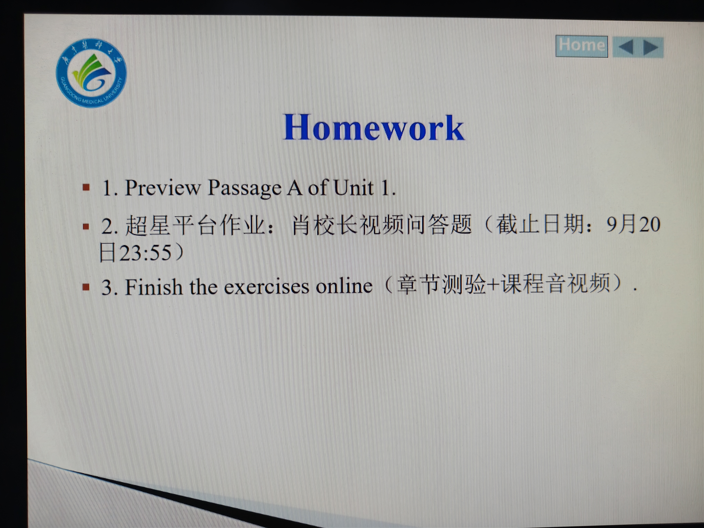

1. **Preview Passage A of Unit 1**（预习第一单元课文A）。
2. **超星平台作业**：肖校长视频问答题，截止 **9月20日 23:55**。
3. **Finish the exercises online**：完成章节测验 + 课程音视频。

---

## 六、医学英语学习方法与应试要点

1. **构词法记单词**：前缀（prefix）+ 后缀（suffix）+ 词根（root），尤其医学术语大量用前缀表关系（trans-/auto-/allo-/iso-/xeno-）。
2. **词性转换**：背单词时连同词性、同义词一起记。
3. **同义替换（paraphrase）**：近义替换 + 句式变换，是阅读和翻译的核心能力。
4. **考试以 Passage A 和《一课一练》为主**，题型与 CET-4 类似。
5. **CET-6**：425分以上可报考；听力改为讲座（只听一遍），考词汇量和做题速度；建议用近三年纸质真题限时训练。
6. **其他证书**：METS医护英语（三级较易、四级稍难）、联盟杯作文大赛可积极参加。

---

## 七、构词法详解：trans- 词族与医学前缀

医学英语词汇的记忆核心是**拆解构词**：一个长单词 = 前缀（prefix）+ 词根（root）+ 后缀（suffix）。掌握常见前缀，就能"见词知义"。

### 7.1 trans- 词族（"由此及彼、跨越"）

| 单词 | 词性 | 中文 | 构词拆解 |
|------|------|------|----------|
| transplant | v./n. | 移植 | trans-(跨)+plant(种植) |
| transmit | v. | 传播、传导 | trans-(跨)+mit(送) |
| transfer | v. | 转移、转学、转车 | trans-(跨)+fer(带) |
| transform | v. | 转变、改造 | trans-(跨)+form(形态)；transform A into B |
| transport | v. | 运输 | trans-(跨)+port(运) |
| translate | v. | 翻译 | trans-(跨)+late(携带) |

### 7.2 四种移植前缀（Unit 1 核心）

| 前缀 | 含义 | 移植词 | 说明 |
|------|------|--------|------|
| **auto-** | 自、自身 | autograft 自体移植 | 同一人体内移植（如自体皮肤移植） |
| **iso-** | 同、等 | isograft 同系移植 | 遗传基因型相同个体间（如同卵双生） |
| **allo-** | 异、别 | allograft 同种异体移植 | 同种不同基因型个体间（最常见） |
| **xeno-** | 异、异种 | xenograft 异种移植 | 不同物种间（如猪器官到人） |

### 7.3 respect 词族（老师当堂举例）

| 单词 | 词性 | 含义 |
|------|------|------|
| respect | n./v. | 方面 / 尊敬 |
| respective | a. | 各自的 |
| respectful | a. | 恭敬的（对人） |
| respectable | a. | 值得尊敬的 |

【考点】在 "moderate prosperity in all respects" 中，respect = 方面（=aspects），不是"尊敬"。这种一词多义、熟词生义是阅读高频考点。

---

## 八、期末考试与 CET-6 备考要点

1. **考试题型**：与 CET-4 级别类似，**以 Passage A 和《一课一练》为主**；全书只学5个单元、只考5个单元。
2. **段落匹配题**：选项从不照抄原文，要找同义替换；讲座听力只听一遍。
3. **CET-6**：425分以上可报考；听力改为讲座（lecture listening），取消新闻；考词汇量和做题速度。建议用近三年（2023/2024/2025）纸质真题分段限时训练。
4. **METS 医护英语**：三级较易、四级稍难，建议尝试丰富履历。
5. **作文大赛**：联盟杯下学期还有，积极参加可加分。

---

## 九、本课高频考点速记清单

1. 总成绩：期末 **50%** + 平时 **50%**；5次签到缺3次作废；互动答对1次及格、6~7次满分。
2. 只学5个单元（1/2/3/4/6），考试以 **Passage A + 一课一练** 为主。
3. donor = 捐赠者，recipient = 接受者（不是 receiver）。
4. respect 在 "in all respects" 中 = **方面**。
5. 五种移植前缀：**trans- / auto- / allo- / iso- / xeno-**。
6. 可移植组织：bone marrow、cornea、nerve、vein、spinal cord、heart valves、tendon。
7. FiF口语三个任务，周一00:00开、周日23:50关，严禁代读。
8. 健康中国核心短语：moderate prosperity（全面小康）、national rejuvenation（民族复兴）、prioritize public health。
