# 第1课：课程介绍与课堂要求 — 知识点总结（期末考试扩写版）

> 科目：生物化学与分子生物学（Biochemistry and Molecular Biology）
> 授课教师：黄勤英教授（广东医科大学 基础医学院）
> 上课日期：2026-09-08（周二，第1次理论课）
> 上课用教材：科学出版社《生物化学与分子生物学》（案例版 第3版，刘新光、罗德生主编，2021，ISBN 978-7-03-068591-9）
> 说明：本总结以老师课堂录音转写内容为主；标【教材补充·人卫第9版】者为参考人卫第9版（周春燕、药立波主编）补充，非上课教材，仅用于把核心知识点讲透。

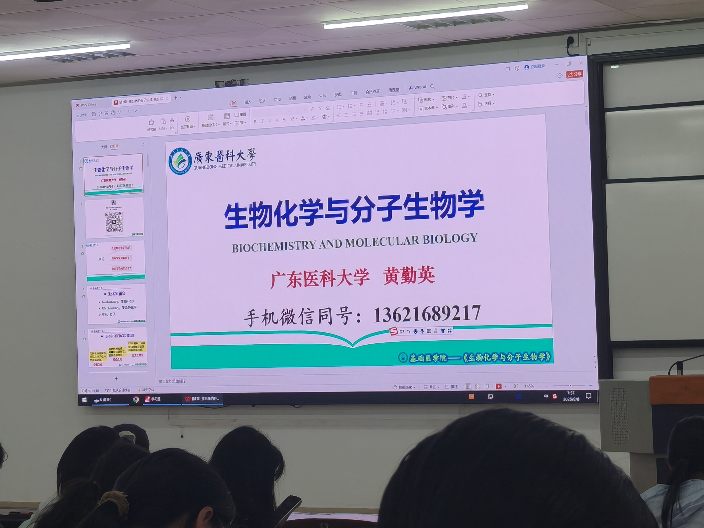

---

## 一、课程定位：生化到底学什么、为什么学、怎么学

### 1.1 什么是生物化学与分子生物学

**定义先行。** 生物化学（Biochemistry）是研究生命现象化学本质的学科，它用化学的原理和方法，在分子水平上研究生物体的物质组成、结构与功能，以及生命活动过程中一切化学变化及其与生理功能的关系。一句话概括老师原话："生物化学其实也就是生物学和化学相结合，研究的是生命的化学。"

分子生物学（Molecular Biology）则是在生物化学基础上，以核酸和蛋白质等大分子为研究对象，着重从基因的复制、转录、翻译及其调控角度去揭示生命活动的机制。老师形象地说："分子生物学其实就是一个工具，研究生命活动的工具。"两门课在本课程中合并讲授，合称"生物化学与分子生物学"。

### 1.2 学习范围：静态生化 + 动态生化 + 分子生物学 三大块

老师把整个课程内容切成三块，这是本课程的总骨架，必须先在脑子里建立起来：

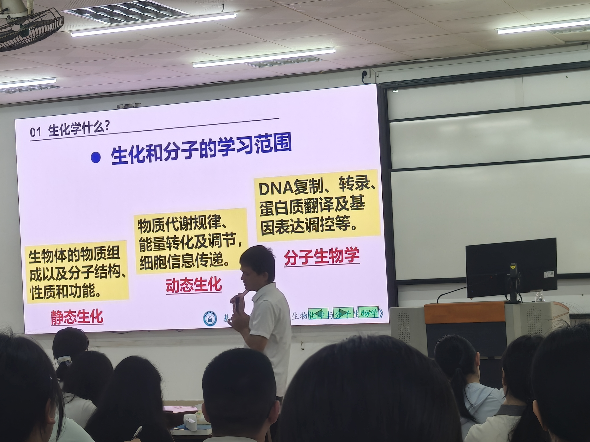

| 层次 | 英文 | 研究对象 | 典型内容 |
|------|------|----------|----------|
| **静态生化** | static biochemistry | 生物大分子的物质组成与分子结构、性质和功能 | 蛋白质、核酸、酶、维生素的结构与功能 |
| **动态生化** | dynamic biochemistry | 物质代谢规律、能量转化及调节、细胞信息传递 | 糖、脂、氨基酸、核苷酸代谢，生物氧化 |
| **分子生物学** | molecular biology | 遗传信息的传递与表达调控 | DNA复制、转录、蛋白质翻译、基因表达调控 |

【教材补充·人卫第9版】这一"静态—动态—信息"三段式划分是国内教材的通用框架：静态解决"是什么"，动态解决"怎么变"，分子生物学解决"信息怎么传"。记忆口诀：**结构→代谢→遗传**。

### 1.3 为什么医学生必须学生化

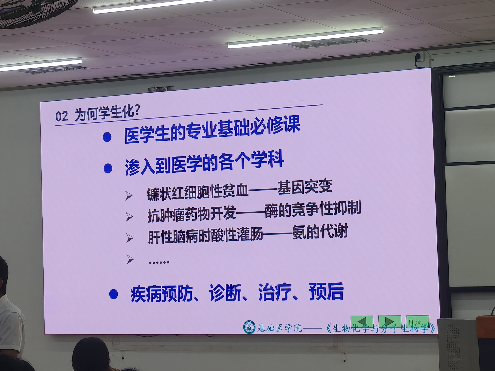

生化不是一门孤立的课，它是渗透到医学各个学科的**专业基础必修课**。老师举了三个把生化知识点直接对应到临床/药学的例子，这种"生化—临床"对应关系考试常以选择题出现：

- **镰状红细胞性贫血** → 根本原因是**基因突变**（血红蛋白β链第6位谷氨酸→缬氨酸）；
- **抗肿瘤药物开发** → 很多抗肿瘤药本质是**酶的竞争性抑制剂**（抑制肿瘤细胞内关键酶）；
- **肝性脑病时酸性灌肠** → 背后是**氨的代谢**紊乱（血氨升高干扰脑能量代谢）。

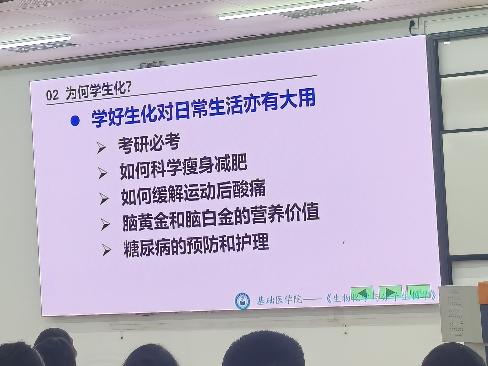

老师还强调，学好生化对日常生活也有大用：考研必考、如何科学瘦身减肥、如何缓解运动后酸痛（乳酸代谢）、脑黄金/脑白金（DHA）的营养价值、糖尿病的预防和护理等。临床医生想搞科研、评职称，生化与分子生物学是绕不开的工具。**【考点】** 考研西医综合中生化与分子生物学约占 **20%以上** 分值。

### 1.4 怎么学：老师给出的方法论

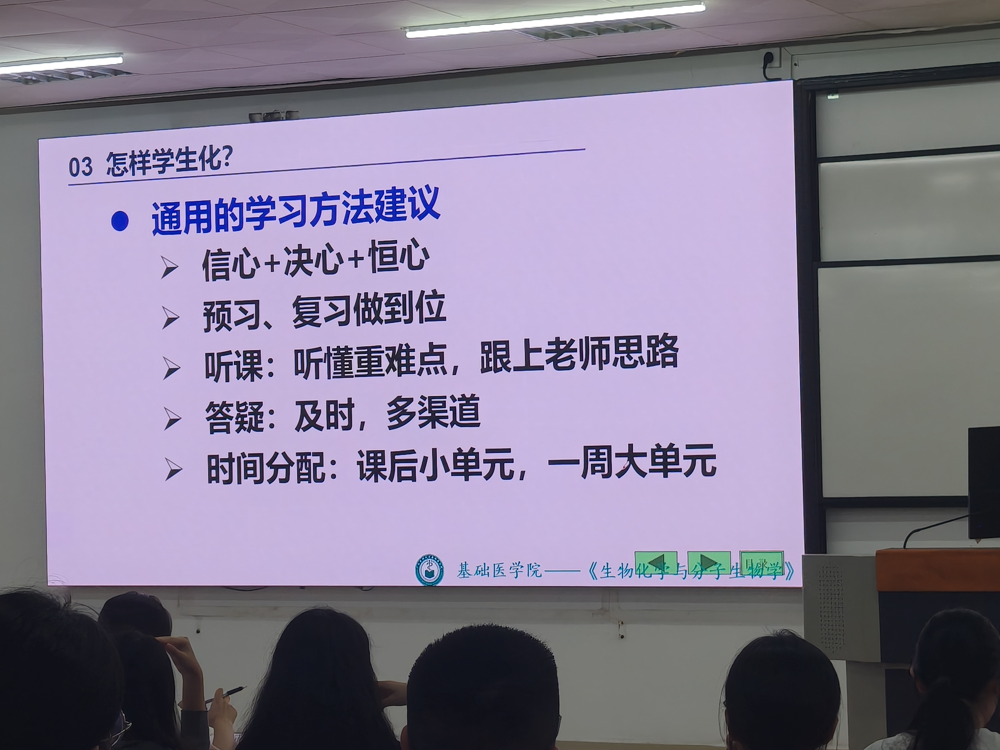

1. **信心 + 决心 + 恒心**：生化内容多、前后联系紧，不能靠考前突击。
2. **预习、复习做到位**：课前粗读，课后当天整理。
3. **听课：听懂重难点，跟上老师思路**。
4. **答疑：及时、多渠道**（线下答疑或线上微信）。
5. **时间分配：课后小单元复习，一周大单元串联**。

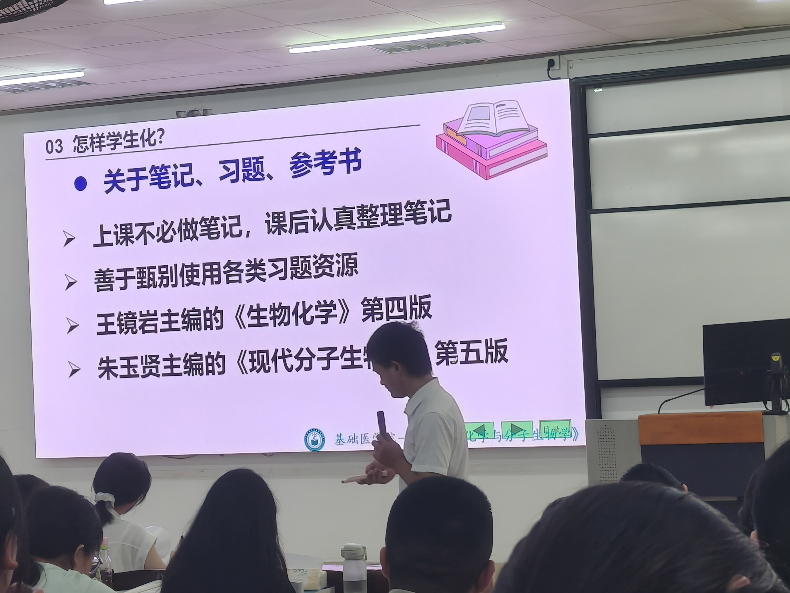

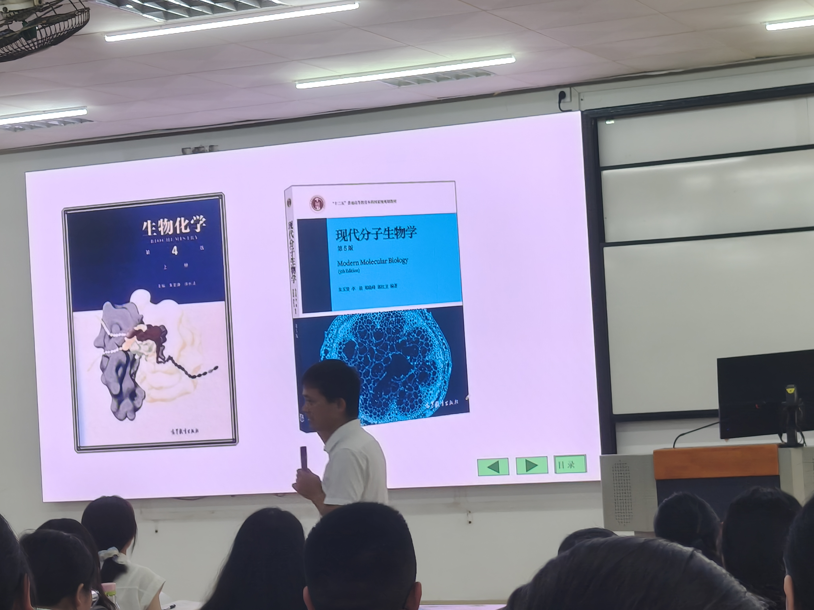

**关于笔记**：【考点】老师明确说"上课没必要做笔记，因为你记了笔记就跟不上老师的思路了"，**课后要认真整理笔记**——"讲得再好，又有PPT，又有老师，但又不是你们的；课后你自己整理一下，把这些知识点串联起来，那就是你们的了。"课后整理的过程才是内化的关键。

**参考书**：老师推荐王镜岩主编《生物化学》（第4版）、朱玉贤主编《现代分子生物学》（第5版），建议找电子版。**习题资源要善于甄别使用**，不要盲目刷题。

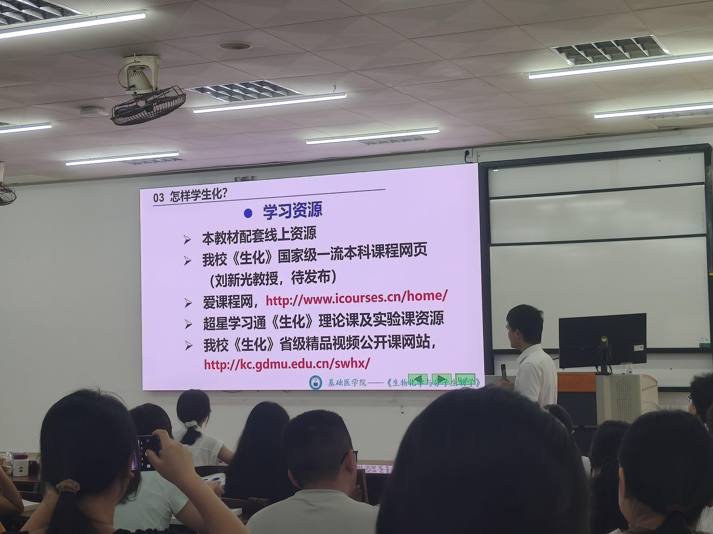

**学习资源**：本教材配套线上资源；学校《生化》国家级一流本科课程网页；爱课程网（icourses.cn）；超星学习通上的理论课及实验课资源；学校省级精品视频公开课（kc.gdmu.edu.cn/swhx/）。

---

## 二、考核方式与成绩构成（务必吃透）

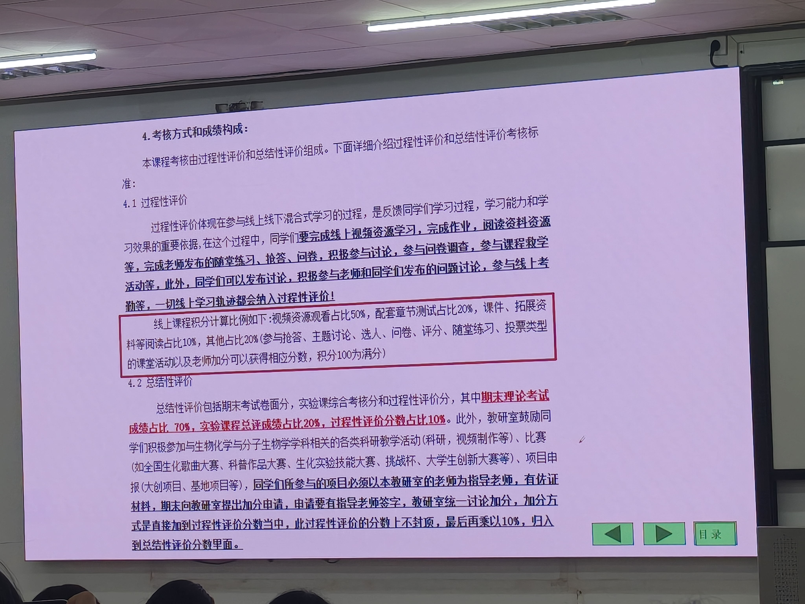

### 2.1 总成绩 = 期末卷面70% + 实验课20% + 过程性评价10%

本课程考核由**过程性评价**和**总结性评价**两部分组成。总结性评价 = 期末考试卷面分 + 实验课综合考核分 + 过程性评价分，其比例为：

| 组成部分 | 占总成绩比例 |
|----------|--------------|
| **期末理论考试（卷面）** | **70%** |
| **实验课总评成绩** | **20%** |
| **过程性评价分数** | **10%** |

### 2.2 过程性评价（线上课程积分，100分为满分）

过程性评价体现在线上线下混合式学习过程，所有线上学习轨迹都计入。线上课程积分计算比例：

- **视频资源观看占 50%**
- **配套章节测试占 20%**
- **课件、拓展资源等阅读占 10%**
- **其他占 20%**（参与抢答、主题讨论、选人、问卷、评分、随堂练习、投票等课堂活动，以及老师加分）

此外，教研室鼓励学生参加与本学科相关的科研教学活动、比赛（全国生化歌曲大赛、科普作品大赛、生化实验技能大赛、挑战杯、大创项目等），经指导老师签字、教研室讨论后可直接加到过程性评价分中，**过程性评价上不封顶**，最后乘以10%归入总结性评价。

### 2.3 双轨制要求【考点】

- **总评合格 + 卷面合格**，两者缺一不可。老师原话："不管总评成绩怎么样，你卷面成绩也要合格。"
- 建议卷面目标 **72分以上**，确保稳过。
- 老师特别提醒："这个课有同学到了大五还在补考，大家争取一次通过。"

---

## 三、蛋白质的分子组成（正文开始）

### 3.1 蛋白质的定义【考点】

**蛋白质（protein）** 是由许多**氨基酸**通过**肽键（peptide bond）**相连所形成的**高分子含氮化合物**。老师强调："这个是重点，很有可能会考。"

这条定义要拆开记三层：基本单位是氨基酸 → 连接键是肽键 → 整体属性是高分子、含氮。

### 3.2 组成元素与含氮量【考点·重中之重】

蛋白质的主要元素为 **C、H、O、N、S**；不同蛋白质含氮量十分接近，**平均含氮量约为 16%**。老师原话："这个特点是重点的重点考点，重要的考点。它平均含氮量16%，这个经常考。"

**凯氏定氮法（Kjeldahl method）** 公式：

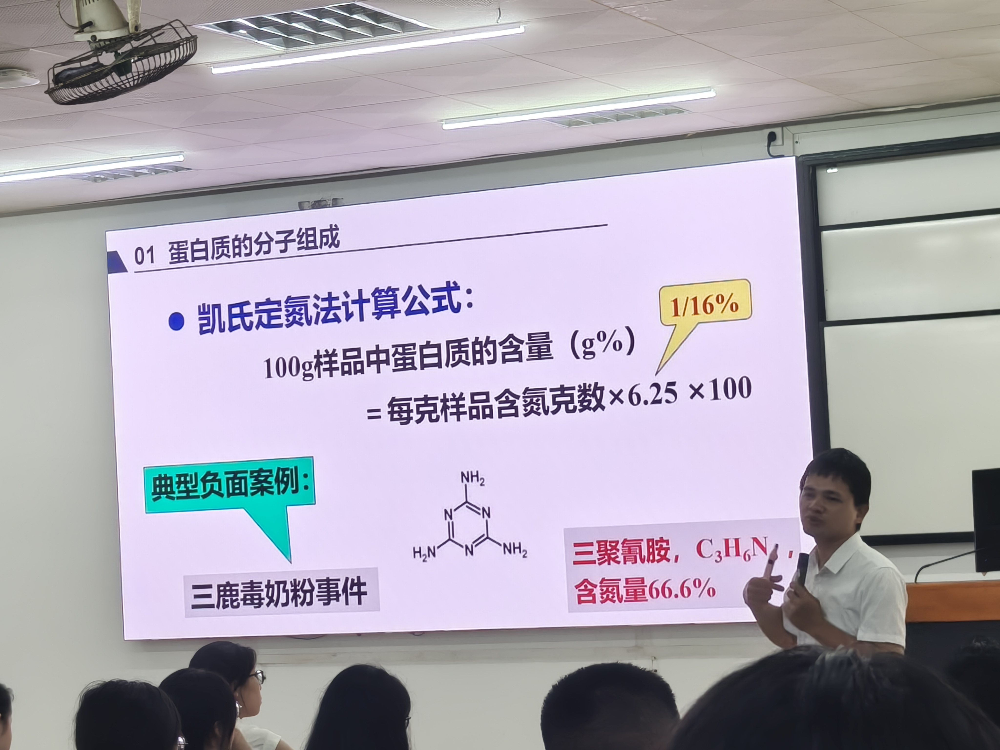

> **100g 样品中蛋白质含量（g%）= 每克样品含氮克数 × 6.25 × 100**

其中 **6.25 = 100 ÷ 16**，即"只要知道样品含氮量，除以16%（=×6.25）就能推算出蛋白质含量"。原理：因为各类蛋白质含氮量都在16%左右，测出总氮就能反推总蛋白。

**典型反面案例——三鹿毒奶粉事件**：三聚氰胺（melamine，分子式 C₃H₆N₆）含氮量高达 **66.6%**，不法分子把它掺进牛奶，凯氏定氮法只测总氮、不分辨氮来自真蛋白还是三聚氰胺，于是"低蛋白奶"被测成"高蛋白"。婴幼儿长期摄入三聚氰胺会在泌尿系统形成结石。这个案例把"含氮量16%"和"凯氏定氮法的局限"两个考点串了起来。

**蛋白质能否供能？** 理论上蛋白质可氧化供能，但正常情况下机体主要由**糖和脂肪**供能；只有在长期饥饿、能量极度匮乏时才会分解蛋白质供能。

### 3.3 组成人体蛋白质的氨基酸共 20 种【考点】

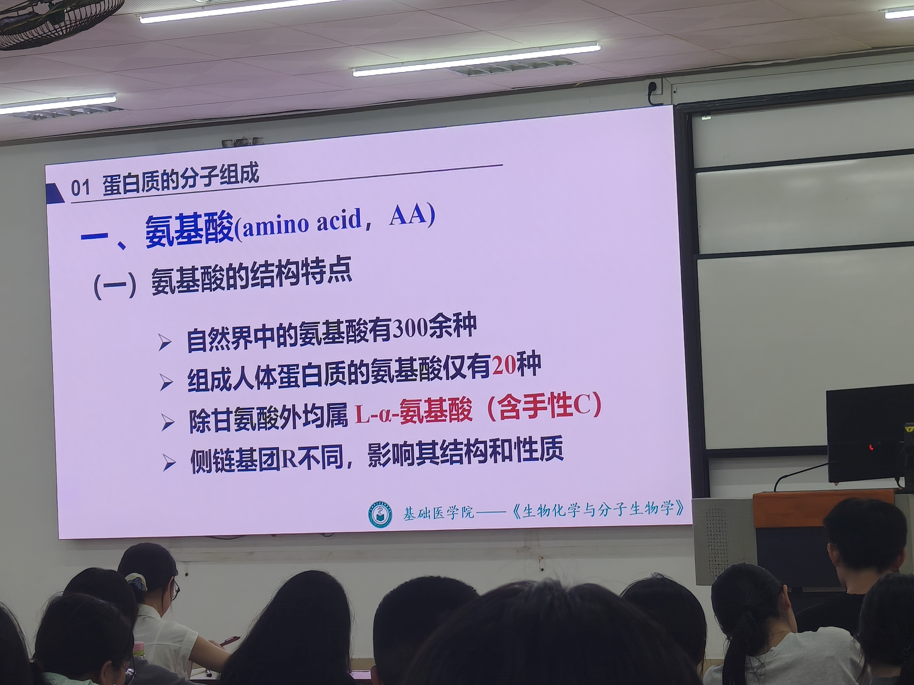

- 自然界中的氨基酸有 **300余种**，但组成人体蛋白质的氨基酸**只有20种**（称为"标准氨基酸"或"编码氨基酸"）。
- 除**甘氨酸（Gly）**外，其余19种均为 **L-α-氨基酸**（含手性碳原子）。
- 各种氨基酸主链结构相同，差别在于**侧链基团 R** 不同，R 基团决定了每种氨基酸的结构、带电、极性和功能。

**L-型与D-型的判断**：将α-碳原子上的-COOH写在上、-R写在下、主链竖置，-NH₂在左侧为 L-型，在右侧为 D-型（与甘油醛类比）。人体蛋白质只用 L-型。

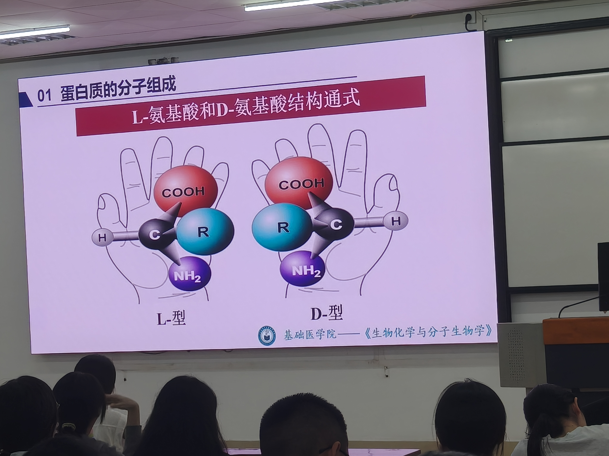

### 3.4 20种氨基酸按 R 基团的结构和理化性质分 5 类【考点】

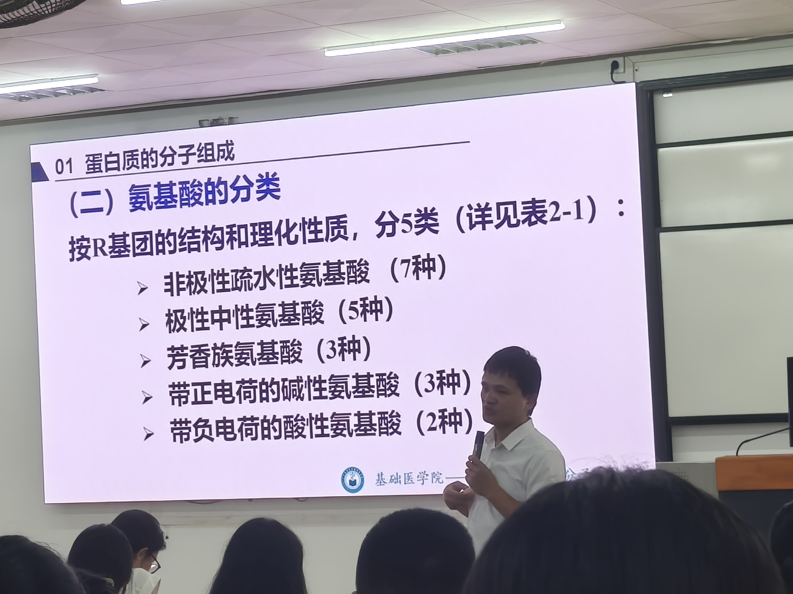

老师强调："氨基酸的分类以及它的R基团的结构和理化性质，分五类，这个是重点。"5类及每类种数必须记牢：

| 类别 | 种数 | 成员（三字母/单字母） | 记忆要点 |
|------|------|------------------------|----------|
| 非极性疏水性氨基酸 | 7种 | 甘氨酸Gly(G)、丙氨酸Ala(A)、缬氨酸Val(V)、亮氨酸Leu(L)、异亮氨酸Ile(I)、脯氨酸Pro(P)、甲硫氨酸Met(M) | R为脂肪烃/环，疏水 |
| 极性中性氨基酸 | 5种 | 丝氨酸Ser(S)、苏氨酸Thr(T)、半胱氨酸Cys(C)、天冬酰胺Asn(N)、谷氨酰胺Gln(Q) | 含羟基/巯基/酰胺基，极性但中性 |
| 芳香族氨基酸 | 3种 | 苯丙氨酸Phe(F)、酪氨酸Tyr(Y)、色氨酸Trp(W) | 含苯环；**280nm紫外吸收** |
| 碱性氨基酸（带正电） | 3种 | 精氨酸Arg(R)、赖氨酸Lys(K)、组氨酸His(H) | R含碱性基团，生理pH下带正电 |
| 酸性氨基酸（带负电） | 2种 | 天冬氨酸Asp(D)、谷氨酸Glu(E) | R含羧基，生理pH下带负电 |

**【考点·易考】酸性氨基酸只有两种：天冬氨酸Asp 和 谷氨酸Glu**（"天冬谷，算酸性"）。碱性氨基酸三种：精、赖、组（"捡来精组"）。

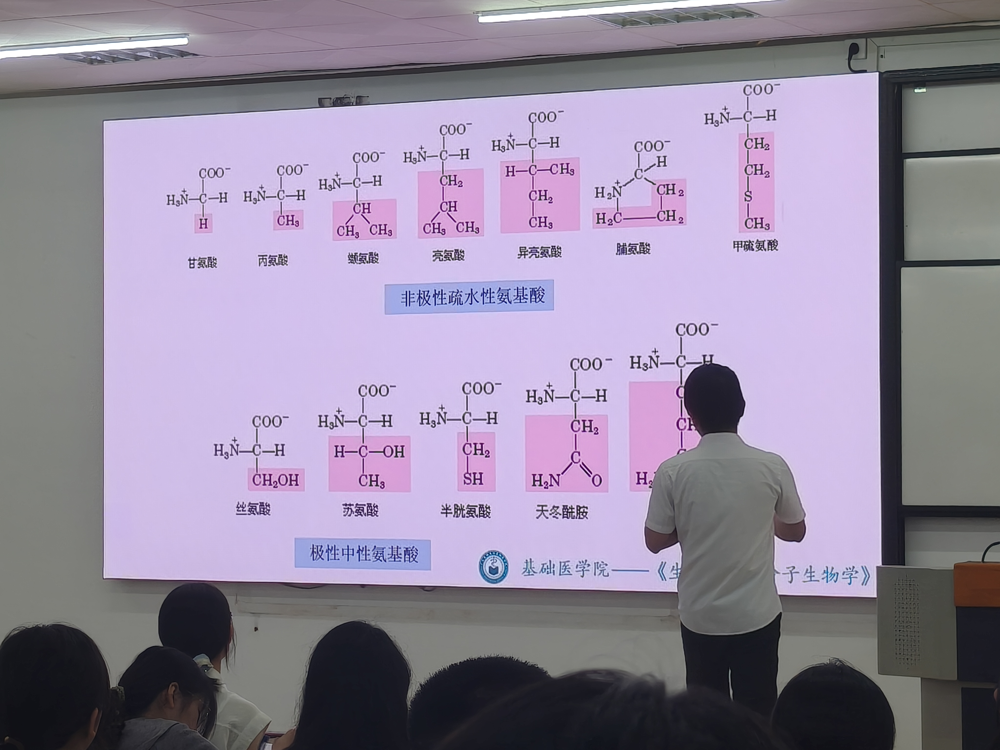

**几个特殊氨基酸必须单独记**【教材补充·人卫第9版】：

- **脯氨酸（Pro）**：是唯一的**亚氨基酸**（α-亚氨基酸），其侧链与α-氨基缩合成五元环，破坏α-螺旋，常出现在β-转角处。
- **半胱氨酸（Cys）**：侧链含**巯基（-SH）**，两个半胱氨酸可脱氢形成**二硫键（-S-S-）**，是唯一能参与形成共价交联的氨基酸。
- **甘氨酸（Gly）**：R基就是一个H，α-碳上连两个氢，**没有手性碳**，因此是唯一无L/D之分的氨基酸，也是分子量最小的氨基酸。
- **组氨酸（His）**：侧链为咪唑基，pKa≈6.0，在生理pH下既能质子化又能去质子化，是酶活性中心最常见的催化基团。

---

## 四、氨基酸的理化性质

### 4.1 两性解离与等电点（pI）【考点·常考】

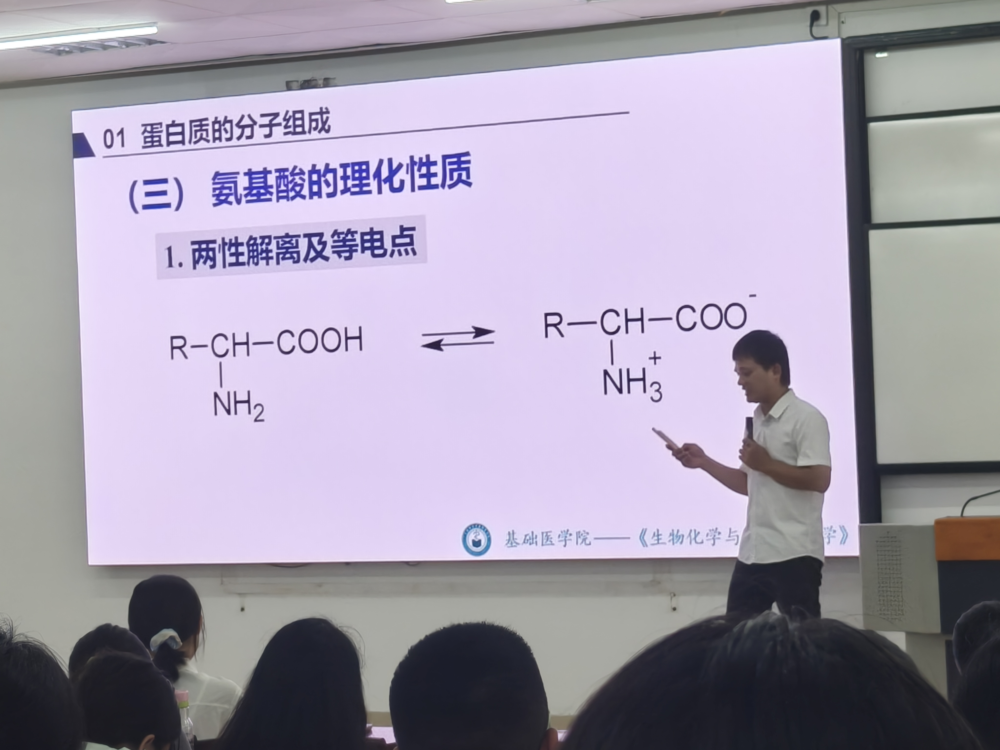

氨基酸分子上同时含有**酸性基团（-COOH，可释放H⁺）**和**碱性基团（-NH₂，可接受H⁺）**，因此既能像酸一样解离、又能像碱一样解离，这种性质称为**两性解离**。

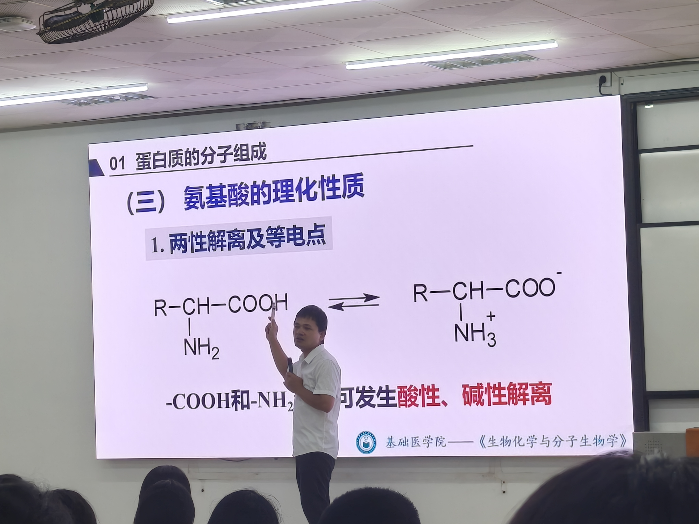

在某一pH下，氨基酸解离成阳离子和阴离子的趋势及程度相等，所带**净电荷为零**，呈电中性，此时溶液的pH值就称为该氨基酸的**等电点（isoelectric point, pI）**。

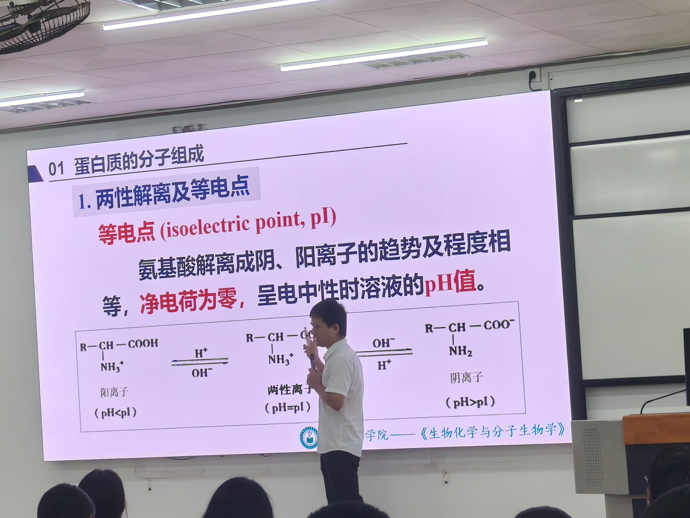

**pH 与 pI 的关系（必背）**：

| 溶液pH | 主要存在形式 | 净电荷 | 电泳方向 |
|--------|--------------|--------|----------|
| pH < pI | 阳离子（正离子） | 正 | 向负极移动 |
| pH = pI | 两性离子（兼性离子） | 零 | 不移动 |
| pH > pI | 阴离子（负离子） | 负 | 向正极移动 |

【考点】老师原话："等电点这个概念也是常考的。"记忆要点：pH比pI小（偏酸）时，氨基多质子化，氨基酸带正电。

### 4.2 茚三酮反应

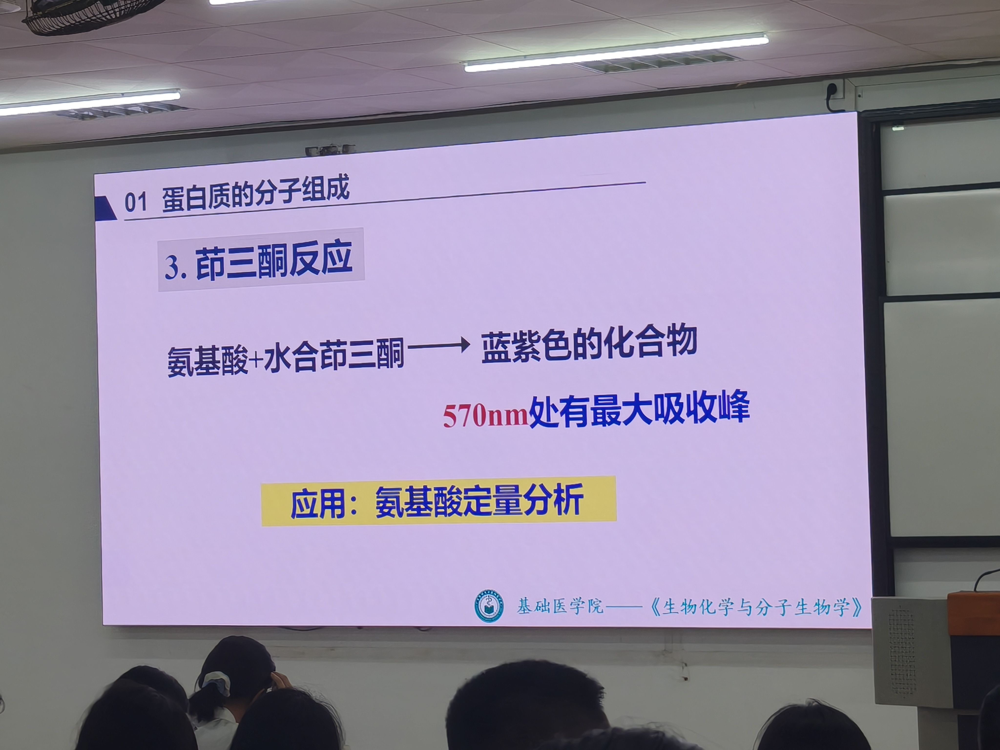

氨基酸与**水合茚三酮**共热，生成**蓝紫色化合物**，该化合物在 **570nm** 波长处有最大吸收峰。**应用：氨基酸的定量分析**。注意：脯氨酸与茚三酮反应生成的是黄色化合物（区别于其他氨基酸的蓝紫色），这是一个易混点。

### 4.3 紫外吸收【考点】

**色氨酸（Trp）和酪氨酸（Tyr）** 的芳香环在 **280nm** 波长处有最大紫外吸收峰，且吸光度与蛋白质含量成正比，因此可用于**快速、粗略地测定蛋白质浓度**。精确测定则用**福林酚试剂法（Lowry法）**，反应物在 **510nm** 有最大吸收，需酶标仪检测；实验要求每个样品至少做 **3个以上重复** 取平均值以减小误差。

---

## 五、肽与肽键

### 5.1 肽、肽键的定义【考点】

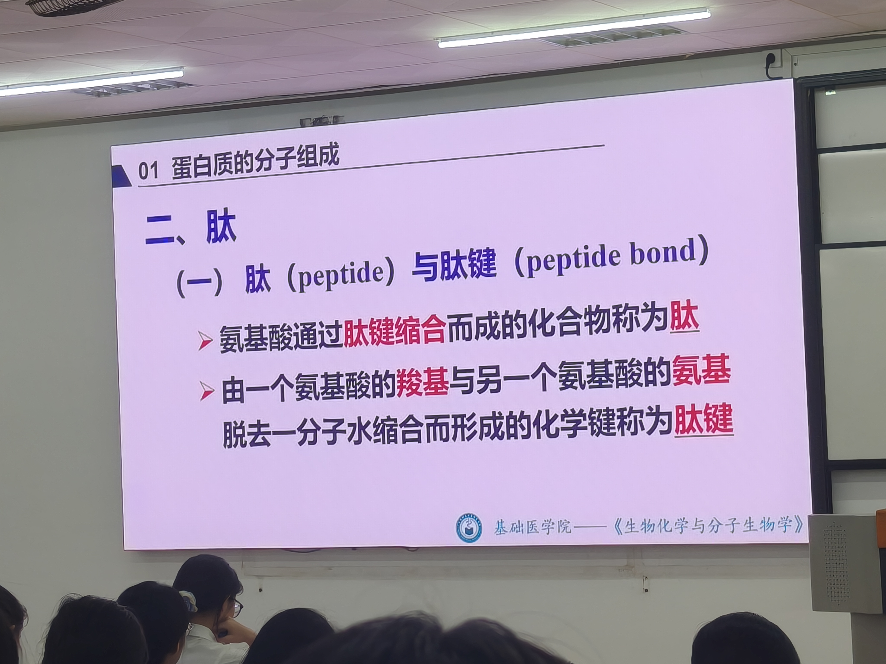

- **肽（peptide）**：氨基酸通过肽键缩合而成的化合物。
- **肽键（peptide bond）**：由一个氨基酸的**α-羧基**与另一个氨基酸的**α-氨基**脱去**一分子水**缩合形成的共价键，结构为 **-CO-NH-**。

### 5.2 肽键的结构特点【考点·必背】

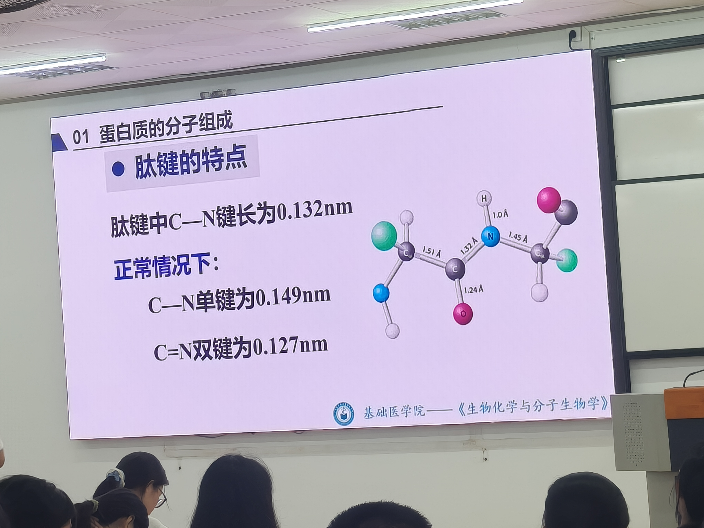

1. **部分双键性质**：肽键中的 C–N 键长为 **0.132nm**。正常 C–N 单键为 **0.149nm**，C=N 双键为 **0.127nm**——0.132nm 介于二者之间，说明 C–N 具有部分双键性质，**不能自由旋转**。
2. **肽平面（肽单元/peptide unit）**：参与肽键的 6 个原子（Cₐ₁、C、O、N、H、Cₐ₂）位于同一平面，称为肽平面，这是二级结构的基本单位。
3. **反式构型**：肽键中与 C–N 相连的氧原子和氢原子呈**反式构型**（位于肽键两侧），比顺式稳定。

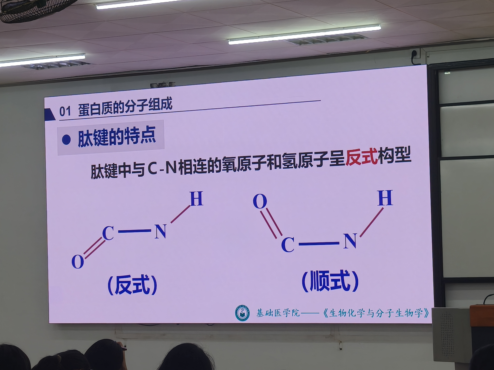

【易混辨析】肽键是共价键（主链连接键），不是维持高级结构的非共价键；不要把"肽键"和"维持三级结构的疏水键/氢键"混为一谈。

### 5.3 肽链的命名、书写与分类

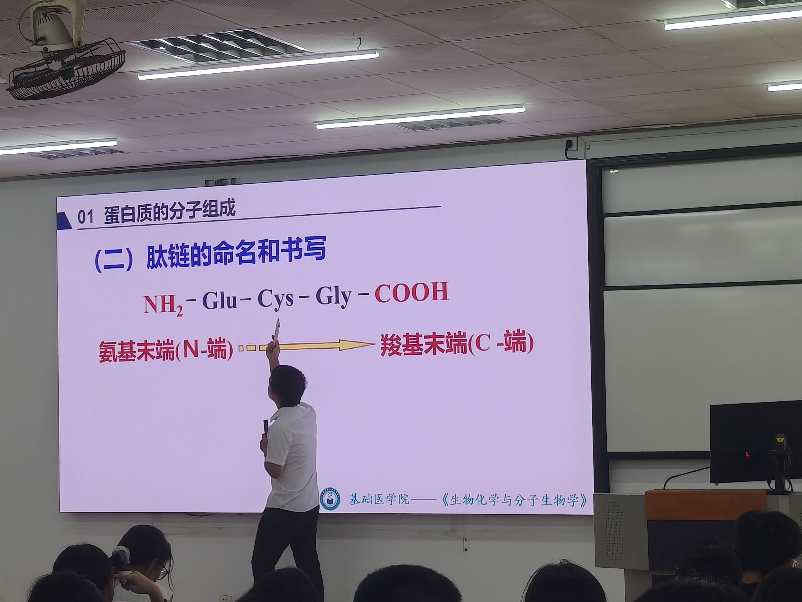

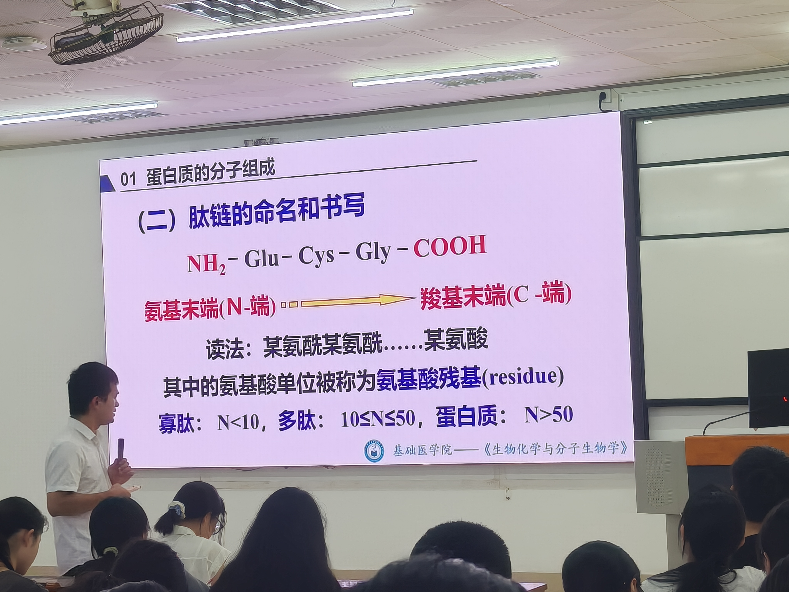

- **书写方向**：一律从 **N-端（氨基末端）→ C-端（羧基末端）**。例：NH₂-Glu-Cys-Gly-COOH。
- **读法**：从N端向C端读作"某氨酰—某氨酰—……—某氨酸"（最后一个氨基酸保留"酸"字）。
- **氨基酸残基（residue）**：肽链中的每个氨基酸单位（脱水缩合后已不完整）。
- **寡肽、多肽、蛋白质的界限**：

| 类别 | 氨基酸残基数 N |
|------|----------------|
| 寡肽（oligopeptide） | N < 10 |
| 多肽（polypeptide） | 10 ≤ N ≤ 50 |
| 蛋白质（protein） | N > 50（界限不绝对） |

### 5.4 天然存在的活性肽——谷胱甘肽（GSH）【考点】

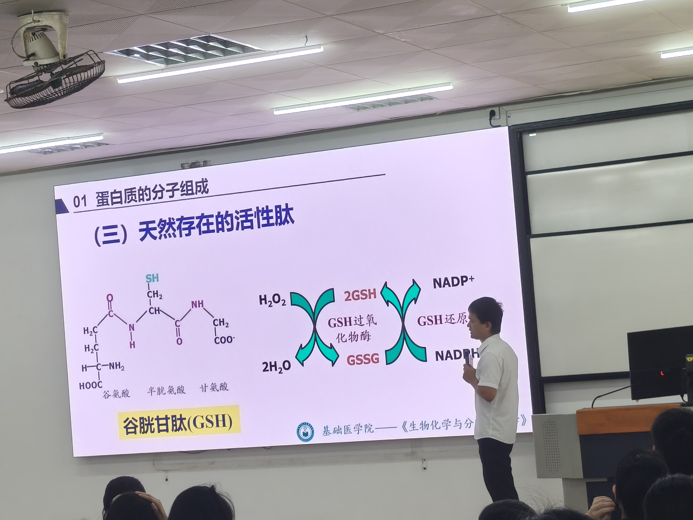

**谷胱甘肽（glutathione, GSH）** 是由 **谷氨酸（Glu）+ 半胱氨酸（Cys）+ 甘氨酸（Gly）** 组成的三肽。它是体内重要的**天然还原剂**，通过半胱氨酸的巯基（-SH）来清除体内的氧化性物质（如过氧化氢 H₂O₂）和毒素。

其氧化还原循环为：在**GSH过氧化物酶**催化下，2分子 GSH 把 H₂O₂ 还原为 2H₂O，自身被氧化成 GSSG（氧化型谷胱甘肽）；再在**GSH还原酶**催化下，由 NADPH + H⁺ 供氢，GSSG 重新还原为 2GSH。这一循环是体内重要的抗氧化防线。

---

## 六、蛋白质的分子结构（四个层次）【重点】

蛋白质结构分为四个层次：一级、二级、三级、四级。其中二级、三级、四级合称**高级结构（空间构象）**。

### 6.1 一级结构（primary structure）

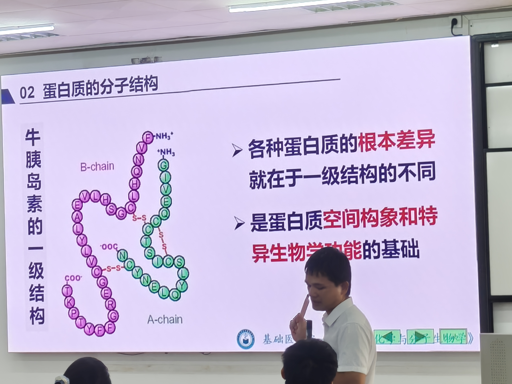

- **定义**：多肽链中从 N-端到 C-端的**氨基酸排列顺序**。
- **主要化学键**：**肽键**（基本）和**二硫键**（共价键，连接两条链或链内）。
- **经典例子**：牛胰岛素由 A、B 两条链组成，A链21个氨基酸、B链30个氨基酸，共含3个二硫键（A链链内1个 + A、B链间2个）。
- **意义**：【考点】"各种蛋白质的**根本差异**就在于一级结构的不同"，它是蛋白质**空间构象和特异生物学功能的基础**，"最简单但最重要，就像盖楼的地基"。

### 6.2 二级结构（secondary structure）

- **定义**：多肽链**主链**原子（不包括侧链 R）的局部空间排列，即主链骨架原子的相对位置。
- **主要化学键**：**氢键**。
- **四种基本类型**：α-螺旋、β-折叠、β-转角、无规卷曲。

**α-螺旋（α-helix）**【考点·参数必背】：

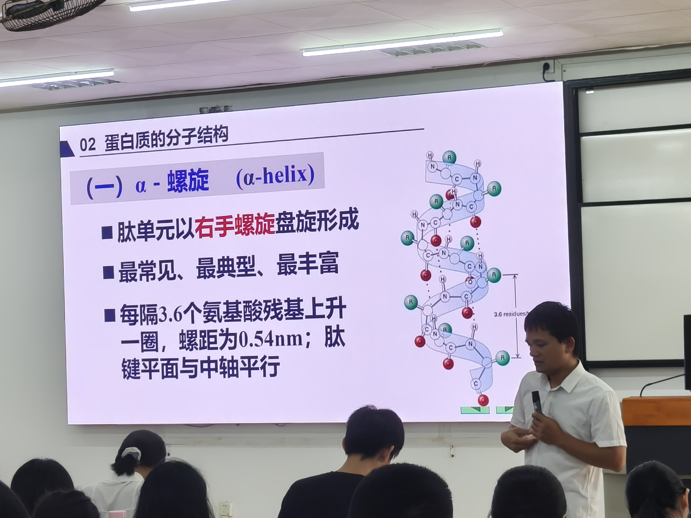

- 多肽链主链以**右手螺旋**盘绕上升；
- **每隔 3.6 个氨基酸残基上升一圈**，螺距为 **0.54nm**；
- 肽键平面与螺旋中轴大致平行；
- 氢键方向基本平行于螺旋长轴（由每个肽键的 N-H 与它后面第4个残基的 C=O 形成氢键）。

**β-折叠（β-pleated sheet）**【考点】：

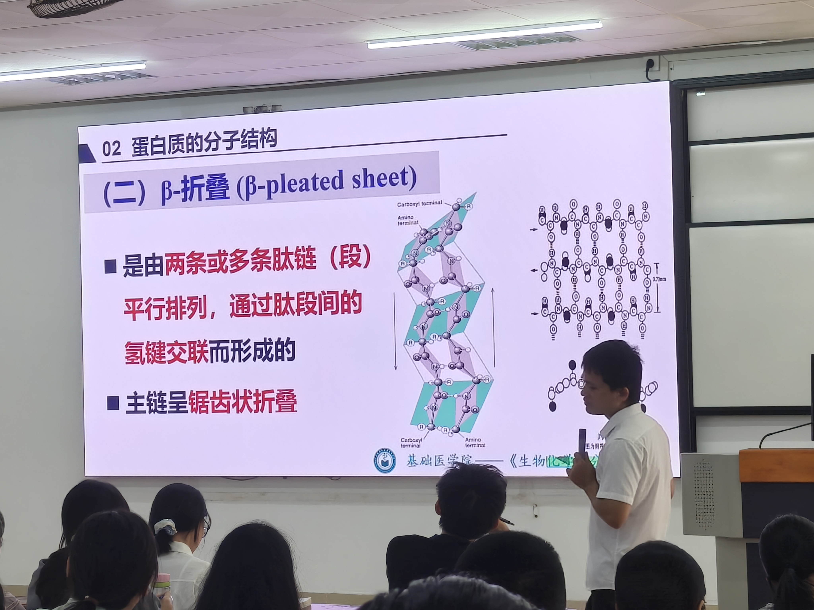

- 由两条或多条肽链（段）**平行排列**，通过肽段之间的**氢键交联**形成；
- 主链呈**锯齿状折叠**；
- 分**平行**（所有肽链N→C同向）和**反平行**（肽链方向相反）两种，反平行更稳定。

**无规卷曲（random coil，有序非重复结构）**：

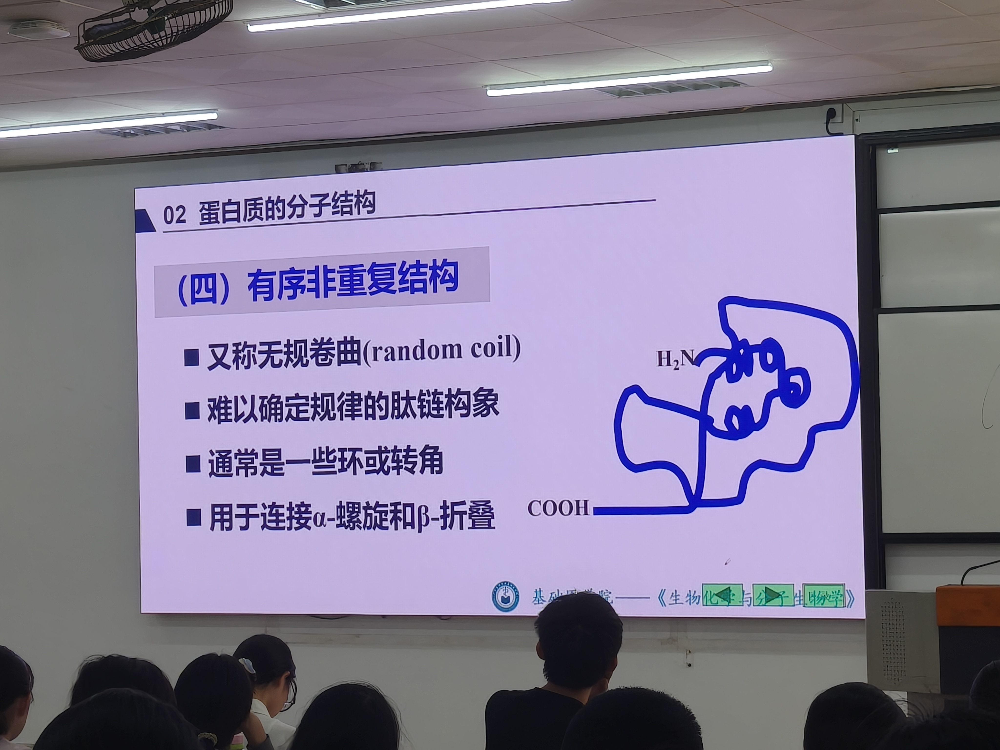

- 指难以确定规律的肽链构象，通常是一些环或转角，用于连接 α-螺旋和 β-折叠，并非真正"无规则"。

**超二级结构与模体（motif）**：

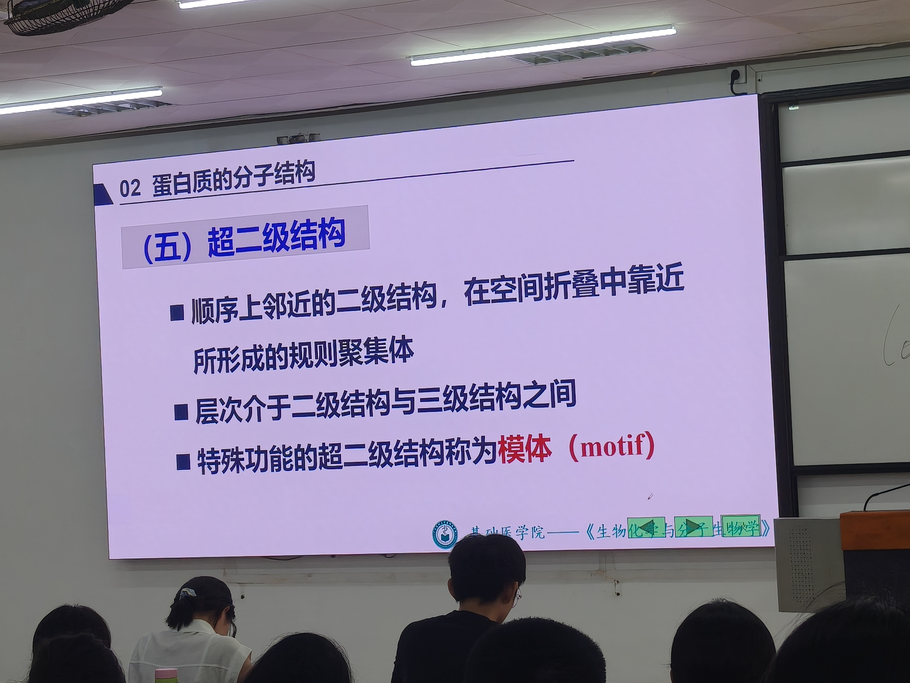

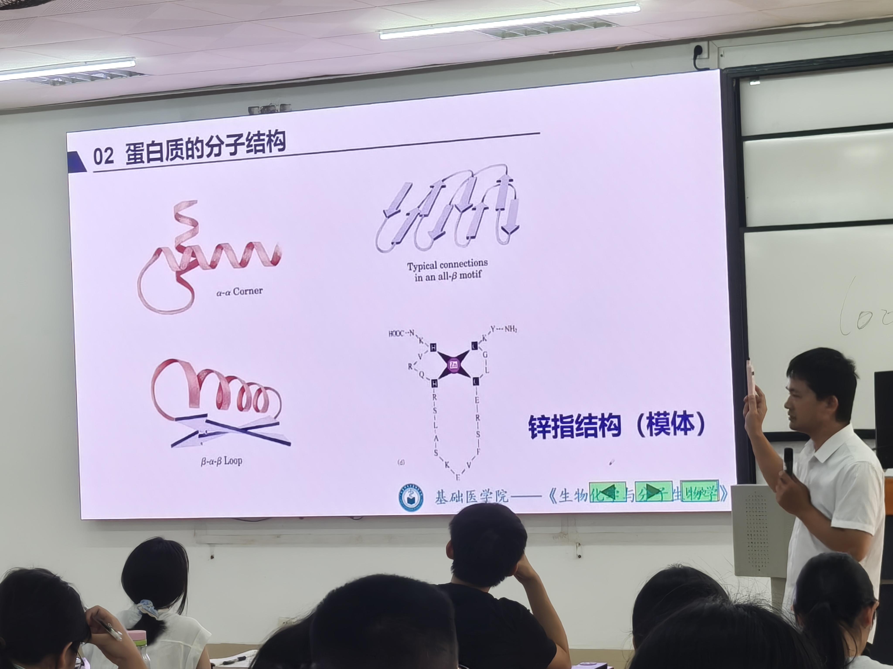

- **超二级结构**：顺序上邻近的二级结构在空间折叠中靠近所形成的规则聚集体，层次介于二级与三级之间。
- **模体（motif）**：具有特殊功能的超二级结构。例如 α-α 转角、β-α-β 环、锌指结构（zinc finger，靠锌离子稳定的常见DNA结合模体）。

### 6.3 三级结构（tertiary structure）

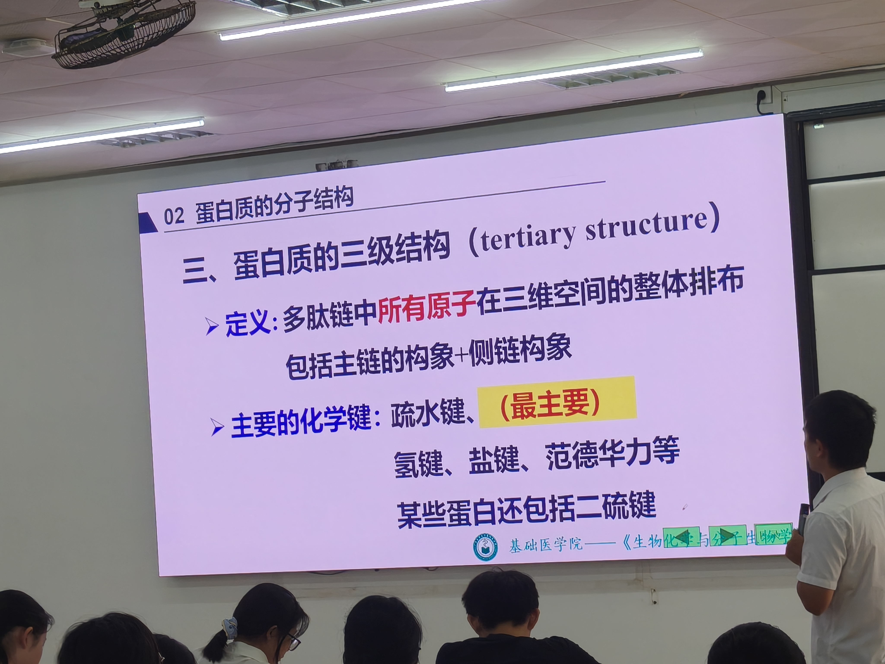

- **定义**：整条多肽链中**所有原子**（主链 + 侧链）在三维空间的整体排布，包括主链构象和侧链构象。
- **主要化学键**：**疏水键（最主要）**、氢键、盐键（离子键）、范德华力等；某些蛋白质还包括二硫键。

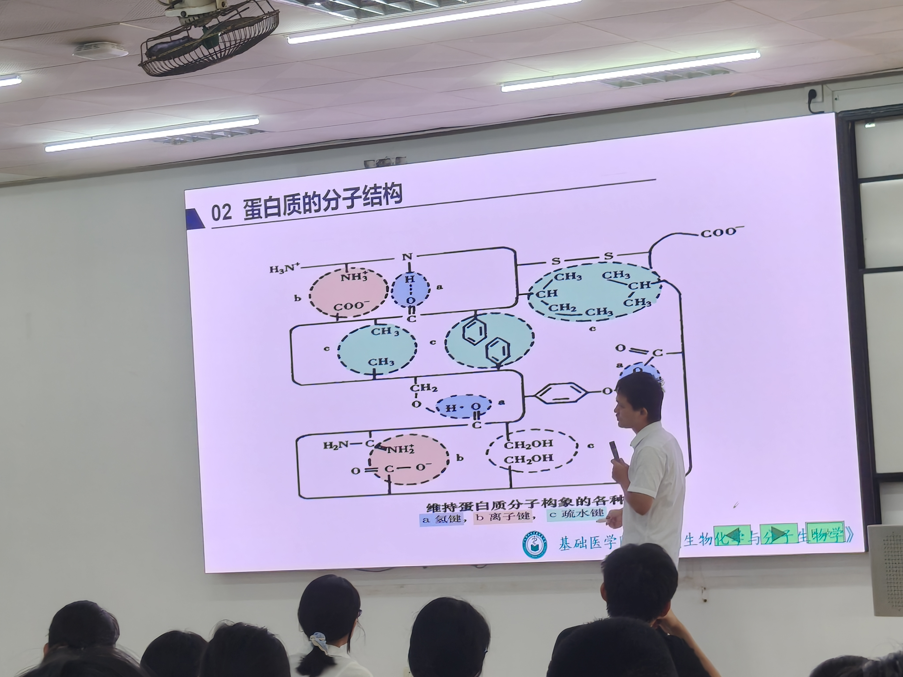

**结构域（domain）**：

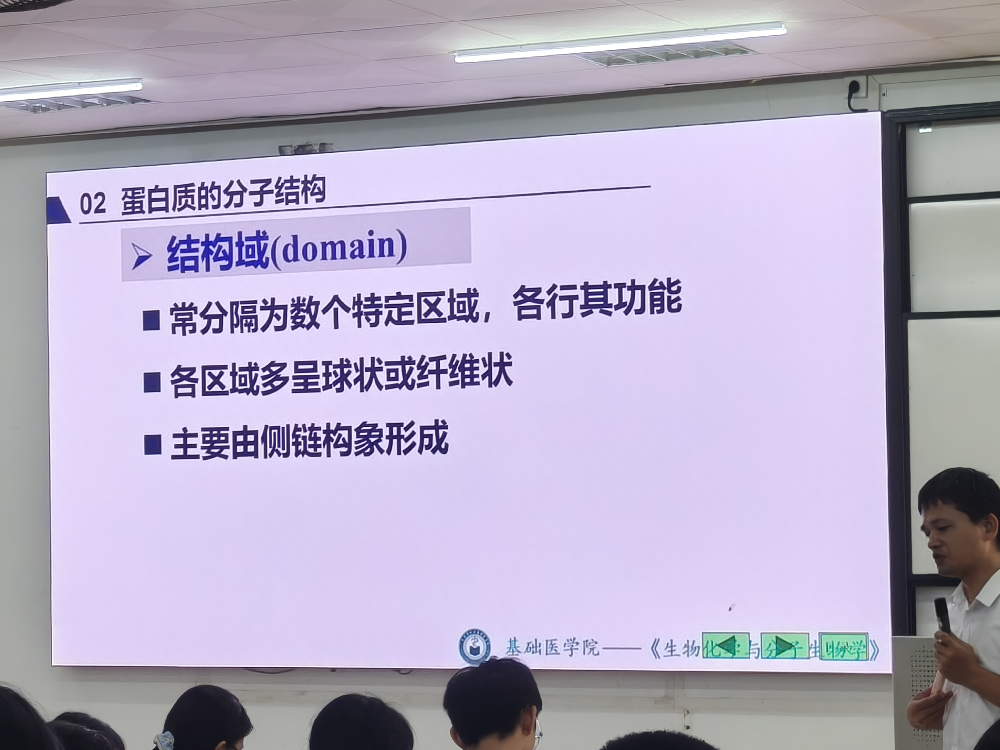

- 对于较大的蛋白质，三级结构常分隔为数个相对独立、紧密的区域，各区域各行其功能，称为结构域；各区域多呈球状或纤维状，主要由侧链构象形成。

### 6.4 四级结构（quaternary structure）

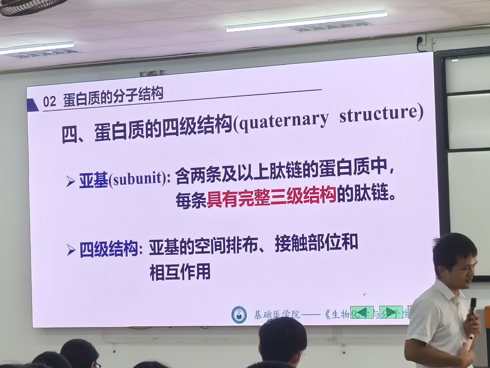

- **亚基（subunit）**：在含两条及以上肽链的蛋白质中，每条具有**完整三级结构**的肽链称为一个亚基。
- **四级结构定义**：亚基之间的空间排布、接触部位和相互作用。

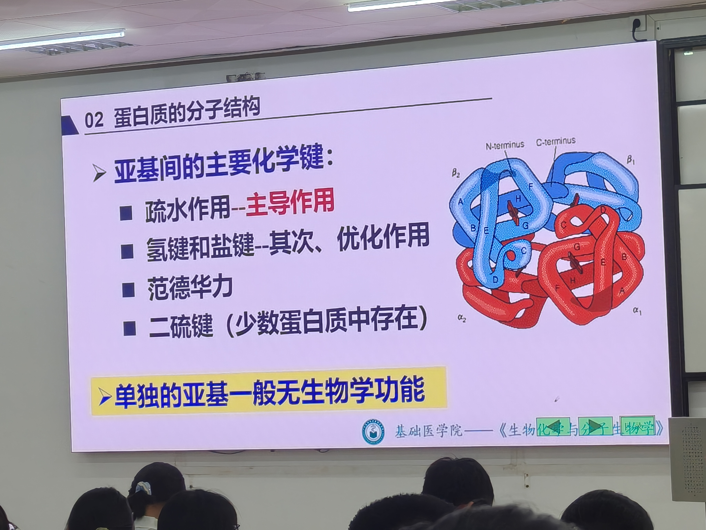

- **亚基间主要化学键**：**疏水作用起主导**，氢键和盐键起其次、优化作用，此外还有范德华力，少数蛋白含二硫键。
- **重要结论**：【考点】**单独的亚基一般没有生物学功能**，只有组装成完整的多聚体才表现功能。经典例子是**血红蛋白（hemoglobin, Hb）**，由 **α₂β₂** 四个亚基组成。

### 6.5 四级结构总览对比表【易混辨析】

| 级别 | 定义 | 侧链是否参与 | 主要化学键 | 是否需多条肽链 |
|------|------|--------------|------------|----------------|
| 一级 | 氨基酸排列顺序 | 否（只看顺序） | 肽键、二硫键 | 否 |
| 二级 | 主链局部空间排列 | 否 | 氢键 | 否 |
| 三级 | 整条链所有原子三维排布 | 是 | 疏水键（最主）、氢键、盐键、范德华力、二硫键 | 否（单链即可） |
| 四级 | 亚基的空间排布与相互作用 | 是 | 疏水作用主导、氢键、盐键、范德华力 | **是**（≥2亚基） |

> 【口诀】一级靠肽键，二级靠氢键，三级疏水最关键，四级亚基靠疏水。

---

## 七、本课高频考点速记清单

1. 蛋白质平均含氮量 **16%**，凯氏定氮法 **蛋白含量 = 含氮量 × 6.25**（6.25=100/16）。
2. 组成人体蛋白质氨基酸 **20种**，除甘氨酸外均为 **L-α-氨基酸**。
3. 氨基酸分 **5类**；酸性氨基酸仅 **Asp、Glu** 两种；碱性氨基酸 **Arg、Lys、His** 三种。
4. **等电点 pI**：净电荷为零时溶液pH；pH<pI带正电，pH>pI带负电。
5. 肽键 **C-N 键长 0.132nm**，有部分双键性质、不能自由旋转、反式构型。
6. 肽链书写 **N端→C端**；寡肽<10、多肽10~50、蛋白质>50。
7. α-螺旋 **3.6个残基/圈、螺距0.54nm**，右手螺旋；β-折叠靠链间氢键。
8. 三级结构以**疏水键最主要**；四级结构靠亚基间**疏水作用主导**，单独亚基一般无功能。
9. 谷胱甘肽 GSH = Glu-Cys-Gly，是体内天然还原剂。
10. 总成绩：期末卷面 **70%** + 实验 **20%** + 过程性评价 **10%**，且卷面须合格。
