# 第2课：蛋白质结构复习 — 知识点总结（期末考试扩写版）

> 科目：生物化学与分子生物学（Biochemistry and Molecular Biology）
> 授课教师：黄勤英教授（广东医科大学 基础医学院）
> 上课日期：2026-09-10（周四，第2次理论课）
> 上课用教材：科学出版社《生物化学与分子生物学》（案例版 第3版）
> 说明：本课为"蛋白质结构与功能"的系统复习+核酸开篇。标【教材补充·人卫第9版】者为参考人卫第9版补充，非上课教材。

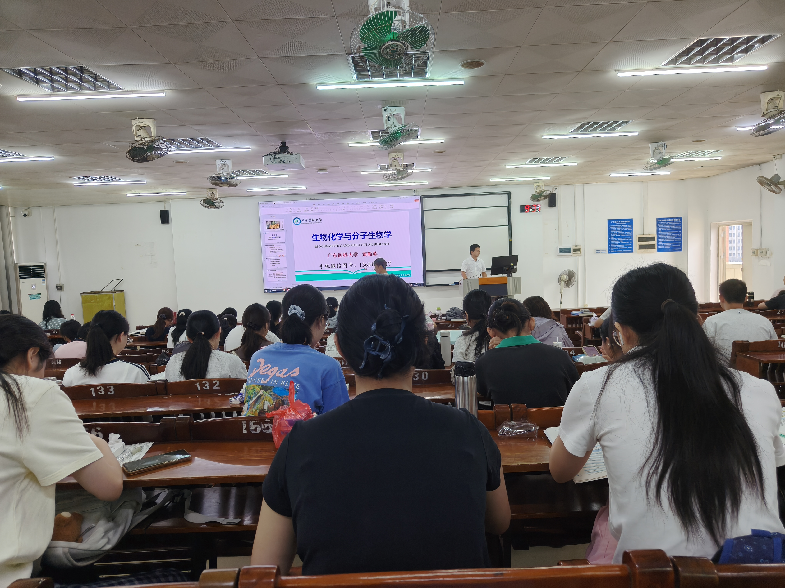

---

## 一、蛋白质一级结构与功能的关系

### 1.1 一级结构是功能的基础

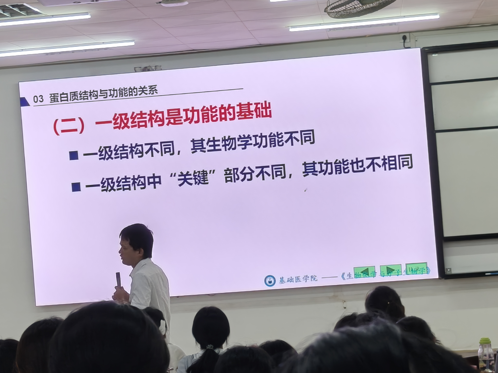

**核心原理：结构决定功能。** 一级结构（氨基酸排列顺序）是蛋白质行使生物学功能的分子基础。老师讲了两层意思：

1. **一级结构不同，其生物学功能不同**——不同蛋白质本来就是靠一级结构区分的。
2. **一级结构中"关键"部分不同，其功能也不相同**——哪怕只差一两个氨基酸，只要是关键部位（如活性中心、结合位点），功能就可能丧失或改变。

**经典对比——升压素与缩宫素**：

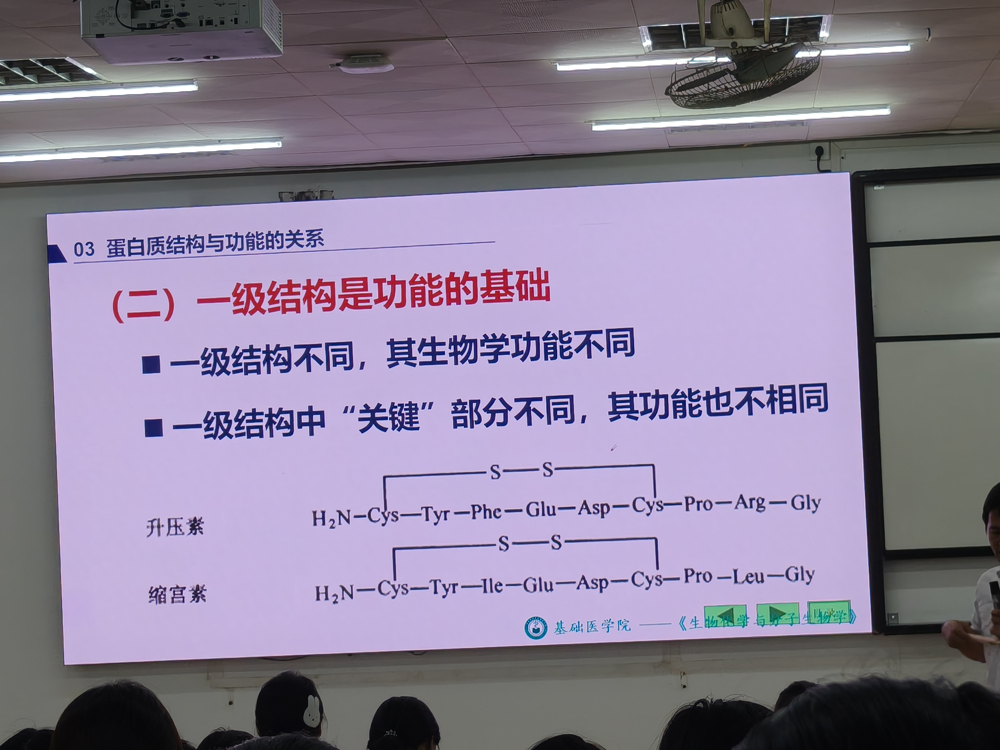

两者都是9肽，且都含一个二硫键，但序列中只有第3位和第8位两个氨基酸不同，功能却截然不同：

| 激素 | 序列（H₂N-…-Gly） | 功能 |
|------|--------------------|------|
| **升压素（抗利尿激素，ADH）** | Cys-Tyr-**Phe**-Glu-Asp-Cys-Pro-**Arg**-Gly | 升血压、抗利尿 |
| **缩宫素（催产素，oxytocin）** | Cys-Tyr-**Ile**-Glu-Asp-Cys-Pro-**Leu**-Gly | 促进子宫收缩、排乳 |

这一例完美说明：**关键部位的少数氨基酸差异足以改变蛋白质功能**。

### 1.2 一级结构改变与分子病【考点】

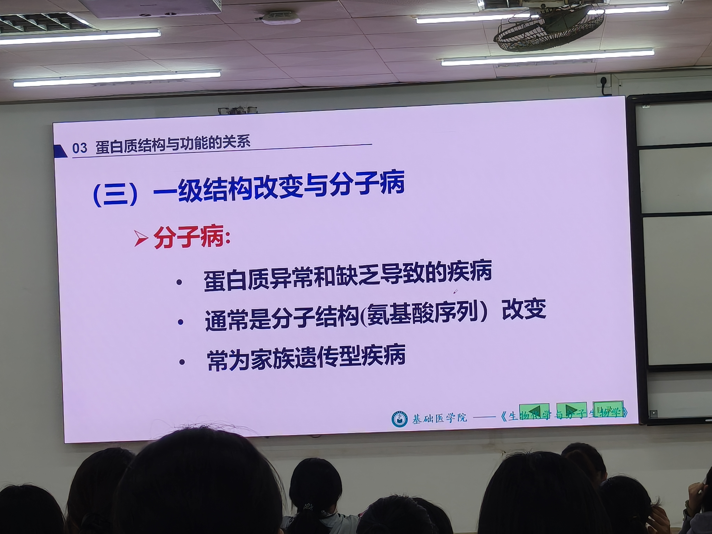

- **分子病（molecular disease）**：由于DNA突变导致蛋白质分子结构（氨基酸序列）异常或蛋白质缺乏所引起的疾病，通常具有家族遗传性。
- **典型案例——镰状红细胞性贫血（sickle-cell anemia）**：血红蛋白β链第6位本应是**谷氨酸（Glu，酸性、带负电、亲水）**，被突变为**缬氨酸（Val，疏水）**，仅一个氨基酸之差，血红蛋白在氧分压低时聚集成纤维状，把红细胞扭成镰刀形，变形能力差、易破裂溶血，导致严重贫血。这是"一个氨基酸改变→一种疾病"的教科书级例证。

### 1.3 同源蛋白质与进化【教材补充·人卫第9版】

不同物种中行使相同功能的同源蛋白质（如细胞色素c），其一级结构的相似程度反映亲缘关系远近：亲缘越近，氨基酸序列差异越小。这为生物进化提供了分子证据。

---

## 二、蛋白质空间构象与功能的关系

### 2.1 血红蛋白与肌红蛋白：空间构象决定功能【考点】

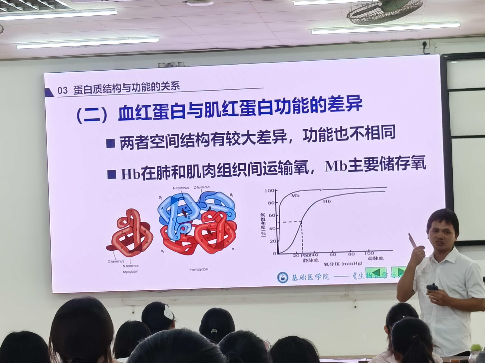

- **肌红蛋白（myoglobin, Mb）**：单链蛋白（1个亚基），主要存在于肌肉，功能是**储存氧**，其氧解离曲线为**直角双曲线**——在氧分压很低时也能结合氧。
- **血红蛋白（hemoglobin, Hb）**：由4个亚基（α₂β₂）组成，主要在血液中**运输氧**，其氧解离曲线为**S形（Sigmodal）**——亚基间存在**正协同效应**：第一个亚基结合氧后，其余亚基对氧的亲和力依次升高，使曲线呈S形，从而在肺部高氧分压处高效结合氧、在外周低氧分压处高效释放氧。

**别构效应（allosteric effect）/协同效应**：Hb与O₂结合时，一个配体结合引起亚基构象变化、进而影响其他亚基对配体亲和力的现象。这是多亚基蛋白调节功能的重要方式。【易混】Mb是单链，无协同效应，曲线为双曲线；Hb是四聚体，有协同效应，曲线为S形。

### 2.2 蛋白质构象改变与疾病【考点】

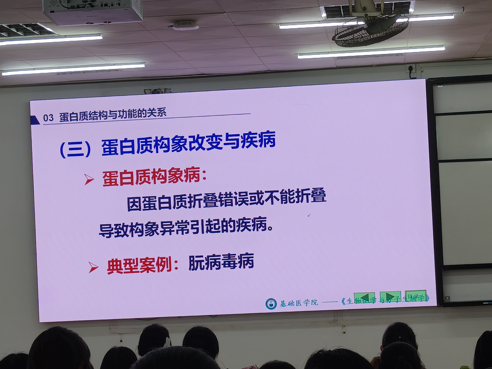

- **蛋白质构象病（conformational disease）**：因蛋白质**折叠错误或不能正确折叠**，导致构象异常所引起的疾病。注意：这类病一级结构往往没变，变的是**空间构象**。
- **典型案例——朊病毒病（prion disease）**：

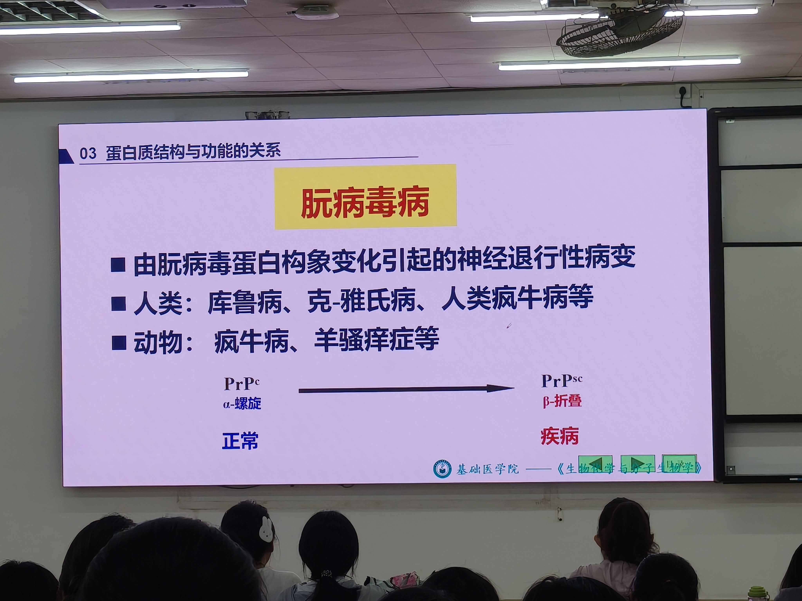

正常朊蛋白 **PrPᶜ**（cellular）富含 **α-螺旋**，对蛋白酶敏感、无致病性；当它错误折叠成致病型 **PrPˢᶜ**（scrapie）后，大量转变为 **β-折叠**，对蛋白酶抵抗、在脑组织内聚集沉淀，引起神经退行性变。

| 类型 | 代表疾病 |
|------|----------|
| 人类 | 库鲁病（Kuru）、克-雅氏病（CJD）、人类疯牛病（vCJD） |
| 动物 | 疯牛病（BSE）、羊瘙痒症（scrapie） |

老师原话："这个是典型的例子，可能会考。"【考点】记住：**一级结构没变，只是α-螺旋→β-折叠的构象转变**。

### 2.3 复性经典实验——核糖核酸酶A（RNase A）【教材补充·人卫第9版】

Anfinsen 实验：用尿素（破坏非共价键）+ β-巯基乙醇（还原二硫键）使核糖核酸酶变性、活性丧失；透析去除变性剂后，酶又自发恢复天然构象和活性。**结论：蛋白质的一级结构包含了其形成正确高级结构的全部信息**。老师强调：理论上复性可行，但实际实验室中非常困难（容易聚集）。

---

## 三、蛋白质的理化性质及应用

### 3.1 两性解离与等电点【考点】

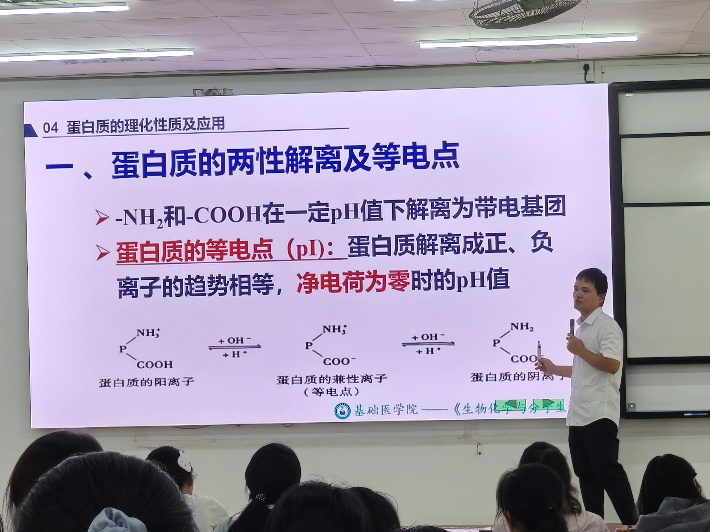

蛋白质如同氨基酸，其分子上的 -NH₂（碱性）和 -COOH（酸性）在一定 pH 下可解离为带电基团，故也是两性电解质。

- **蛋白质等电点（pI）**：蛋白质解离成正、负离子的趋势相等，**净电荷为零时溶液的pH值**。老师原话："这个概念很有可能会考。"
- pH < pI 时蛋白质带正电（阳离子），pH > pI 时带负电（阴离子），pH = pI 时净电荷为零、溶解度最小、最易沉淀。
- 这一性质是**电泳**和**离子交换层析**分离蛋白质的原理基础。

### 3.2 蛋白质的胶体性质

蛋白质分子量大（通常>1万），在水溶液中形成亲水胶体。维持其胶体稳定性的两个因素是：**①表面水化膜（水合膜）②表面同种电荷**。若去除这两个因素（如把溶液pH调至pI并加入脱水剂），蛋白质就易从溶液中析出沉淀。

### 3.3 蛋白质的变性、沉淀与凝固【考点·重点】

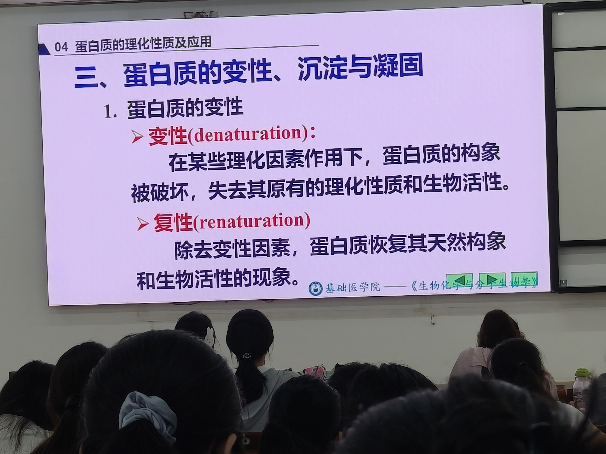

**变性（denaturation）定义**：在某些理化因素作用下，蛋白质的**空间构象被破坏**，从而失去其原有的理化性质和生物学活性。

**复性（renaturation）定义**：除去变性因素后，蛋白质**恢复其天然构象和生物活性**的现象。

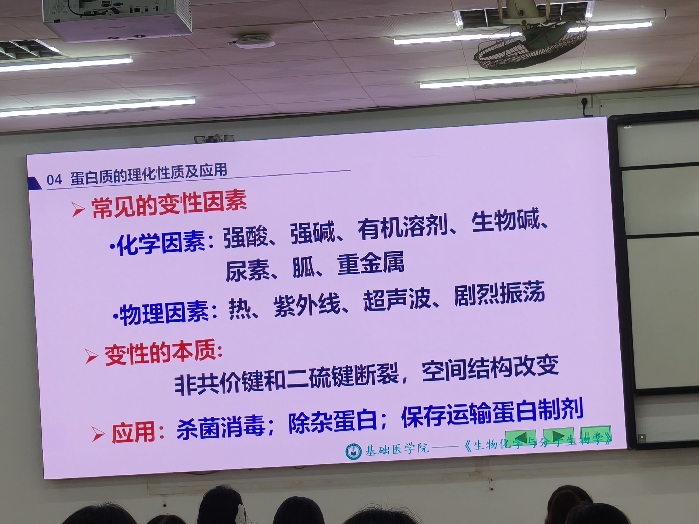

- **常见变性因素**：
  - **化学因素**：强酸、强碱、有机溶剂、生物碱试剂、尿素、胍、重金属盐；
  - **物理因素**：热（加热）、紫外线、超声波、剧烈振荡。
- **变性的本质**：**非共价键（氢键、疏水键、范德华力、盐键等）和二硫键断裂**，空间结构改变；但**一级结构（肽键、氨基酸序列）保持不变**。
- **变性后变化**：生物学活性丧失、溶解度降低（易沉淀）、结晶能力丧失、易被蛋白酶消化、紫外吸收等理化性质改变。
- **应用**：杀菌消毒（使微生物蛋白变性）、除杂蛋白、保存运输蛋白制剂（注意防止变性）。

**75%酒精消毒原理**【考点】：75%（体积分数）酒精既能使细菌蛋白变性、又能渗入菌体内部；若用95%~100%酒精，会使细菌表面蛋白迅速凝固形成一层保护膜，酒精反而难以进入，杀菌效果反而下降。

### 3.4 蛋白质的沉淀【易混辨析：变性 vs 沉淀】

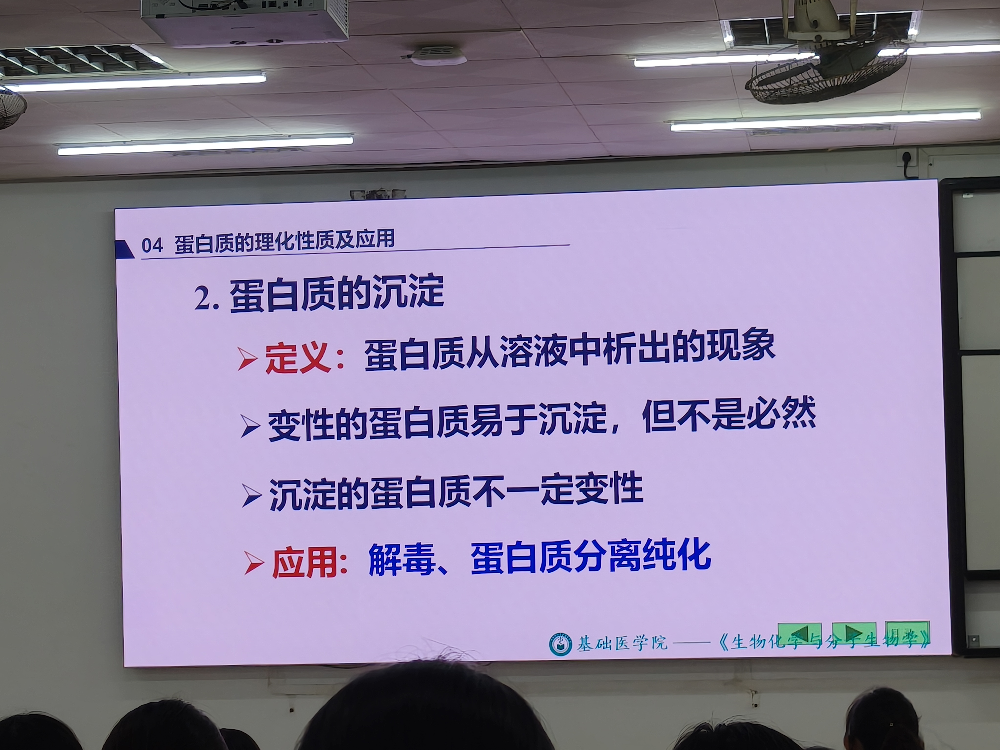

- **沉淀（precipitation）定义**：蛋白质从溶液中析出的现象。
- **变性与沉淀的关系（高频易错）**：
  - 变性的蛋白质**易于沉淀**，但**不一定沉淀**（如在溶液中未析出）；
  - 沉淀的蛋白质**不一定变性**（如等电点沉淀、盐析——去除了水化膜/电荷但构象未破坏，仍可复性）。

| 对比项 | 变性 | 沉淀 |
|--------|------|------|
| 本质 | 空间构象破坏 | 从溶液中析出 |
| 一级结构 | 不变 | 不变 |
| 两者关系 | 变性易沉淀但不必然 | 沉淀不一定变性（盐析不变性） |
| 复性 | 去除变性因素后可能复性 | 盐析可逆，加热凝固不可逆 |

**应用**：解毒（如重金属中毒用蛋白/牛奶结合重金属）、蛋白质分离纯化（盐析、等电点沉淀）。

### 3.5 蛋白质的呈色反应【考点】

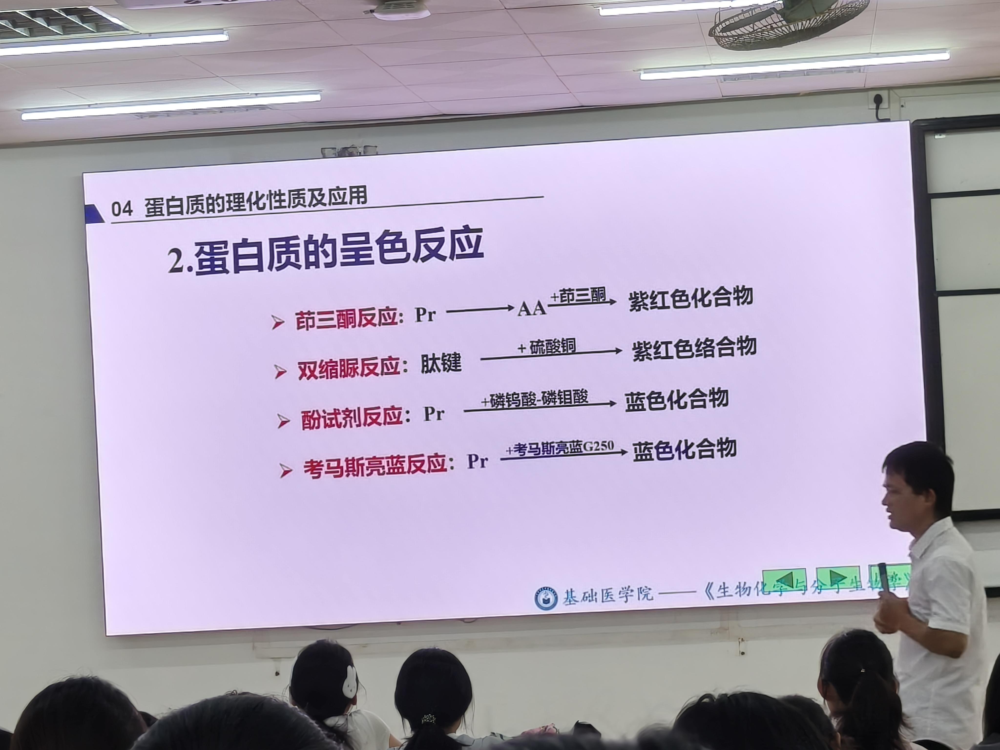

| 反应名称 | 作用对象 | 试剂 | 颜色 | 用途 |
|----------|----------|------|------|------|
| **茚三酮反应** | 蛋白质→水解为氨基酸 | 水合茚三酮 | 蓝紫色（570nm） | 氨基酸定量 |
| **双缩脲反应** | **肽键** | 硫酸铜（碱性） | 紫红色络合物 | 检测肽键，定量蛋白 |
| **酚试剂反应（Lowry法）** | 蛋白质 | 磷钨酸-磷钼酸 | 蓝色化合物（510nm） | 较精确测蛋白浓度 |
| **考马斯亮蓝反应（Bradford法）** | 蛋白质 | 考马斯亮蓝G250 | 蓝色化合物 | 快速、灵敏测蛋白 |

【易混】双缩脲反应针对**肽键**（故二肽以上均可），不针对游离氨基酸；茚三酮反应针对氨基酸。

---

## 四、核酸的结构与功能（开篇）

### 4.1 体内重要的游离核苷酸及其衍生物

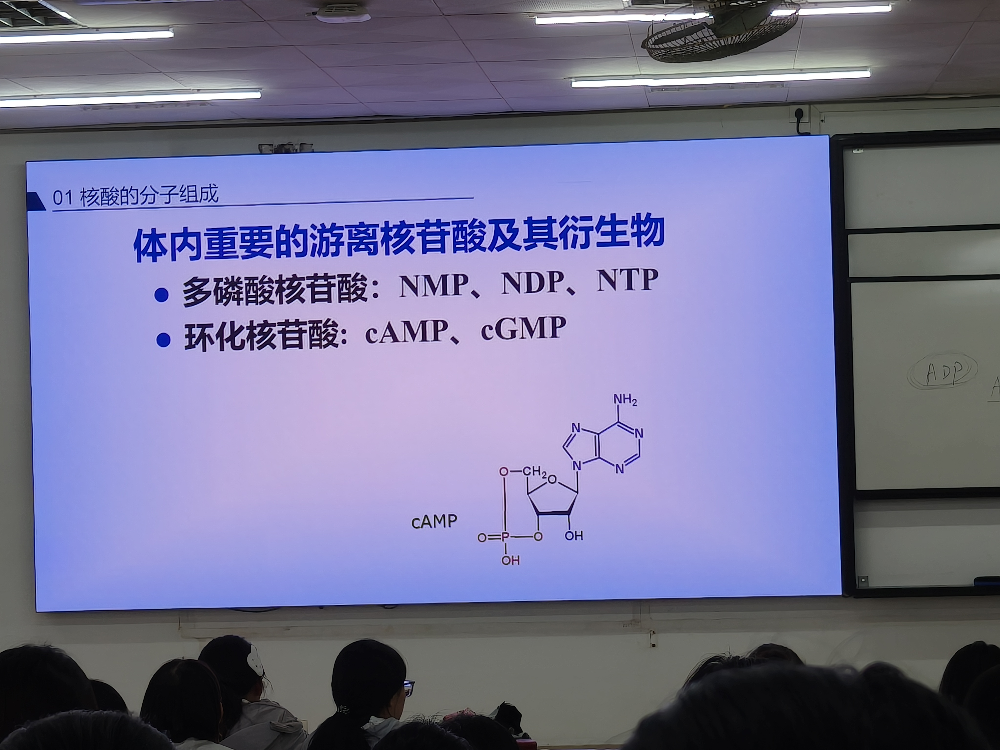

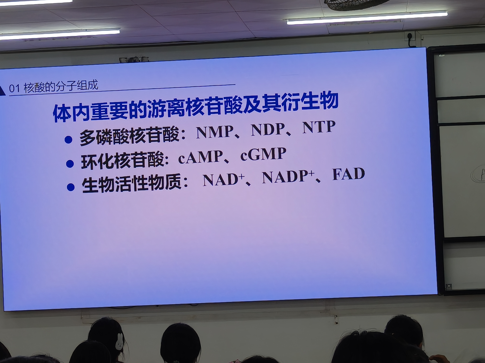

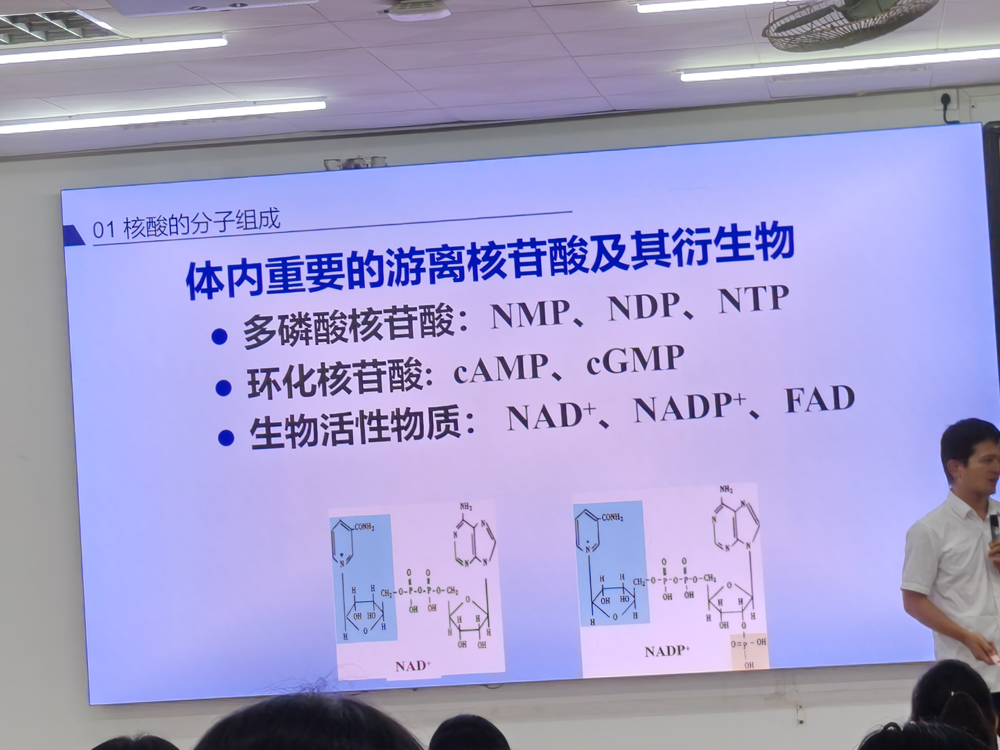

游离核苷酸及其衍生物有三类重要成员：

1. **多磷酸核苷酸**：NMP（一磷酸核苷）、NDP（二磷酸）、NTP（三磷酸）。其中 **ATP** 是生命活动**最直接的供能物质**，含高能磷酸键。
2. **环化核苷酸**：**cAMP、cGMP**，作为**信号转导的第二信使**（激素等第一信使作用于膜受体后，细胞内产生cAMP）。
3. **生物活性物质**：**NAD⁺、NADP⁺、FAD**，它们是多种脱氢酶的辅酶，在生物氧化中传递氢（递氢体）。

### 4.2 核酸的一级结构

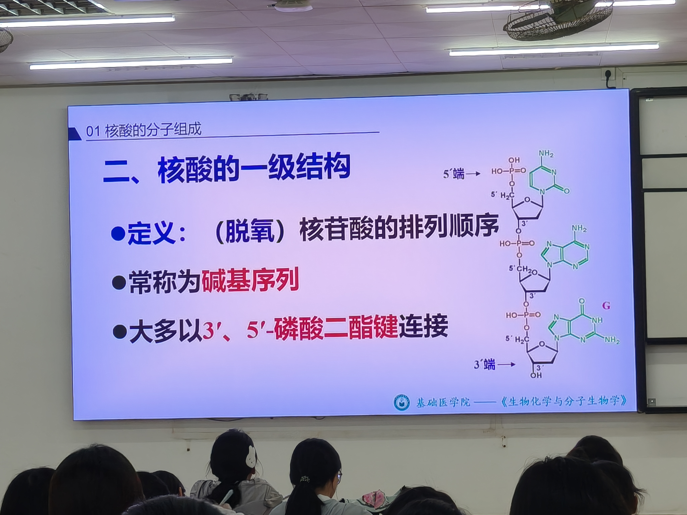

- **定义**：核酸中（脱氧）核苷酸的**排列顺序**，由于核苷酸之间的差异主要在碱基，故**常称为碱基序列**。
- **连接键**：前一个核苷酸的3'-羟基与后一个核苷酸的5'-磷酸脱水形成 **3',5'-磷酸二酯键**，从而把成千上万个核苷酸连成线性长链。
- **链的方向**：有 **5'-端** 和 **3'-端**，书写一律从 **5'→3'**。

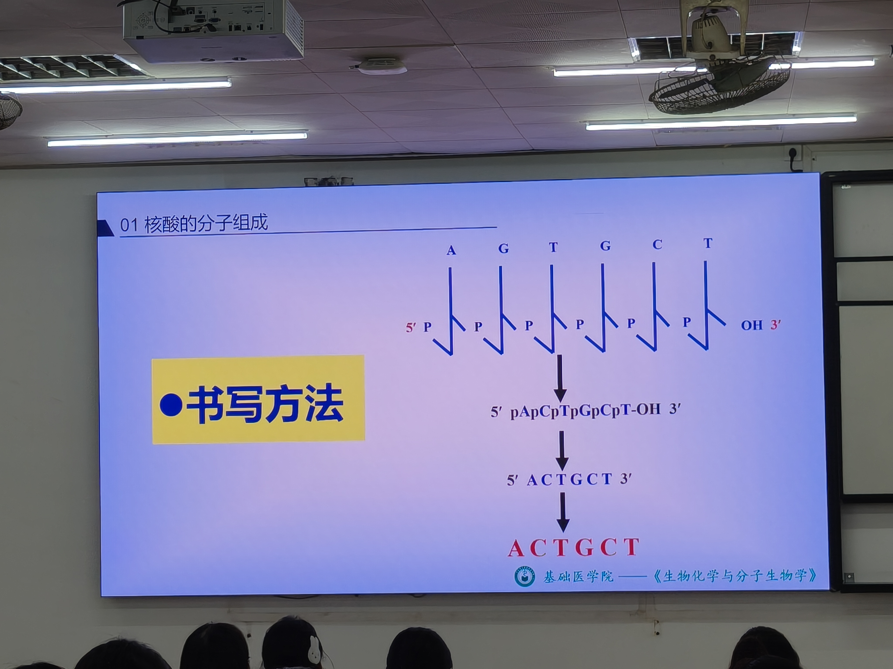

书写简化举例：从完整结构式逐级简化为 `5' pApCpTpGpCpT-OH 3'` → `5' ACTGCT 3'` → 直接写 `ACTGCT`。

### 4.3 DNA双螺旋结构模型【重点·全为考点】

**提出依据**：

![DNA双螺旋结构提出的依据：Chargaff规则[A]=[T][G]=[C]、碱基组成有种属特异性无组织特异性、A-T G-C氢键配对、X射线衍射图谱](./照片/18_DNA双螺旋提出依据Chargaff.jpg)

- **Chargaff 规则**：所有DNA中 **[A] = [T]**，**[G] = [C]**，即嘌呤总数 = 嘧啶总数；且碱基组成具有**种属特异性**（不同物种不同），但**无组织特异性**（同一物种不同组织碱基组成相同）。
- A-T、G-C 以氢键配对在能量上合理。
- **X-射线衍射图谱分析**（罗莎琳德·富兰克林的数据是关键证据）。
- 模型由 **Watson 与 Crick** 于1953年提出。

**双螺旋模型要点**：

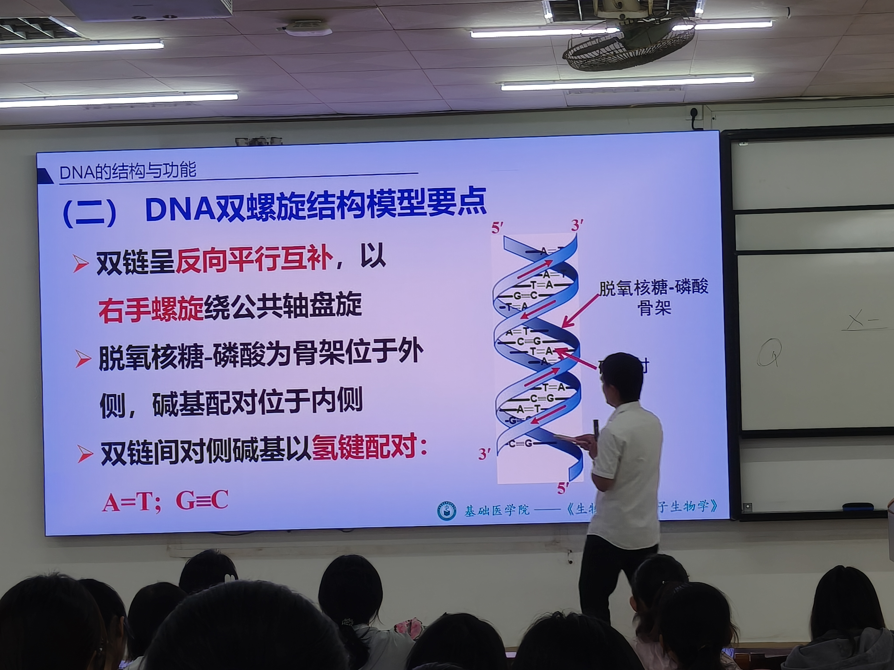

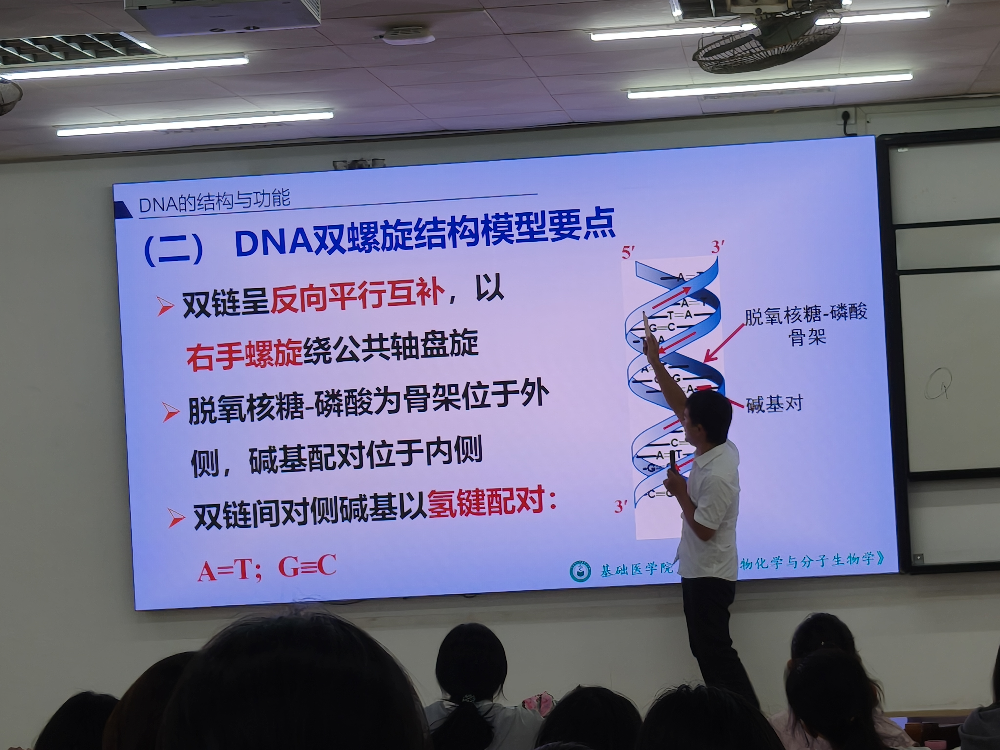

1. 两条脱氧核苷酸链**反向平行、右手螺旋**，绕同一公共轴盘旋；
2. **脱氧核糖-磷酸骨架位于外侧**，碱基位于**内侧**；
3. 双链间对侧碱基以**氢键**配对：**A=T（2个氢键）**，**G≡C（3个氢键）**。

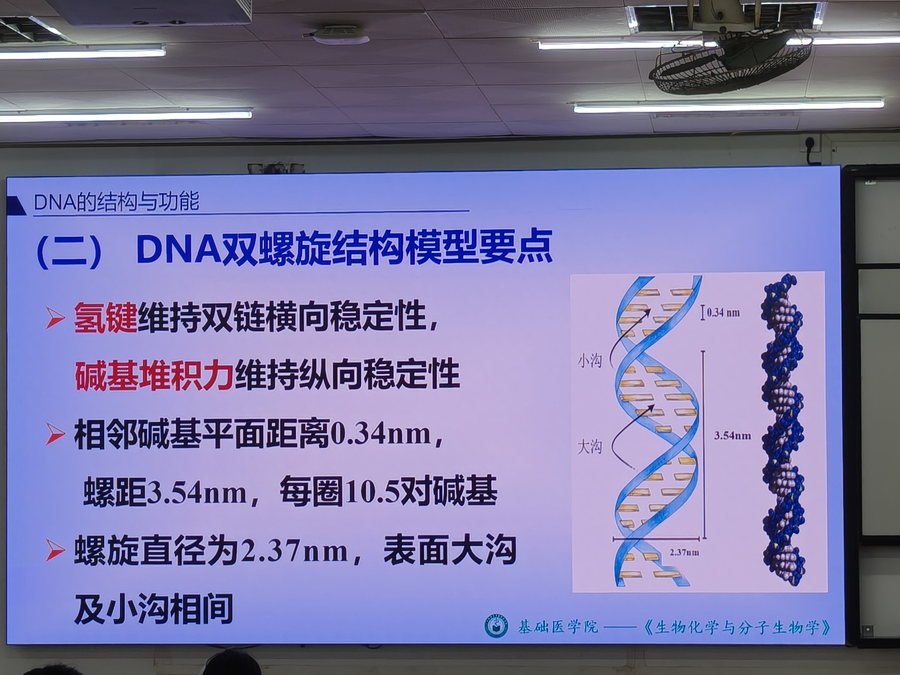

4. **稳定性**：**氢键**维持双链的**横向**稳定性，**碱基堆积力**维持**纵向**稳定性；
5. **几何参数（必背）**：相邻碱基平面距离 **0.34nm**，每圈约 **10.5对碱基**，螺距约 **3.54nm**，螺旋直径约 **2.37nm**；
6. 螺旋表面有**大沟和小沟**相间，是蛋白质识别DNA碱基信息的场所。

【易考结论】G-C含量越高，DNA越稳定（G≡C有3个氢键，比A=T的2个更牢）。【教材补充·人卫第9版】课堂讲授采用每圈约10.5对碱基、螺距3.54nm的B型DNA数据；人卫教材常取整为10bp/圈、3.4nm螺距，考试以老师课件数据为准。

---

## 五、20种标准氨基酸详解（考试必考的细节）【教材补充·人卫第9版】

本课复习反复回到氨基酸，这里把20种标准氨基酸按侧链R基一次列全，务必做到"看到三字母缩写能认出、知道分类和特殊性质"。

### 5.1 非极性脂肪族/疏水性氨基酸（7种）

| 名称 | 三字母 | 单字母 | R基特点 |
|------|--------|--------|---------|
| 甘氨酸 | Gly | G | R=H，**唯一无手性碳**，不具L/D构型 |
| 丙氨酸 | Ala | A | R=CH₃，最简单的疏水侧链 |
| 缬氨酸 | Val | V | 支链异丙基 |
| 亮氨酸 | Leu | L | 支链，疏水 |
| 异亮氨酸 | Ile | I | 含第二个手性碳 |
| 脯氨酸 | Pro | P | **唯一的亚氨基酸**，侧链与α-氨基成环，破坏α-螺旋 |
| 甲硫氨酸（蛋氨酸） | Met | M | 含S，是起始密码子对应的氨基酸 |

### 5.2 极性中性氨基酸（5种）

| 名称 | 三字母 | 单字母 | R基特点 |
|------|--------|--------|---------|
| 丝氨酸 | Ser | S | 含羟基-CH₂OH |
| 苏氨酸 | Thr | T | 含羟基，含第二个手性碳 |
| 半胱氨酸 | Cys | C | 含**巯基(-SH)**，两分子可脱氢成二硫键 |
| 天冬酰胺 | Asn | N | 含酰胺基 |
| 谷氨酰胺 | Gln | Q | 含酰胺基 |

### 5.3 芳香族氨基酸（3种）

| 名称 | 三字母 | 单字母 | R基特点 |
|------|--------|--------|---------|
| 苯丙氨酸 | Phe | F | 含苯环 |
| 酪氨酸 | Tyr | Y | 含酚羟基，**280nm紫外吸收** |
| 色氨酸 | Trp | W | 含吲哚环，**280nm紫外吸收最强** |

### 5.4 酸性氨基酸（2种，带负电）与碱性氨基酸（3种，带正电）

| 名称 | 三字母 | 单字母 | 类别 |
|------|--------|--------|------|
| 天冬氨酸 | Asp | D | 酸性 |
| 谷氨酸 | Glu | E | 酸性 |
| 精氨酸 | Arg | R | 碱性（胍基） |
| 赖氨酸 | Lys | K | 碱性（ε-氨基） |
| 组氨酸 | His | H | 碱性（咪唑基，pKa≈6.0，酶活性中心常见） |

【记忆口诀】酸性"天冬谷"；碱性"赖精组"；芳香族"苯酪色"。

---

## 六、二级结构各类型的细节补充【教材补充·人卫第9版】

除α-螺旋、β-折叠外，二级结构还包括：

- **β-转角（β-turn）**：常发生在肽链进行 **180°回折** 处，通常由4个氨基酸残基组成，第一个残基的C=O与第四个残基的N-H形成氢键，使肽链转向。脯氨酸（Pro）常出现在转角处。
- **无规卷曲**：并非真正"无序"，而是没有确定周期性的局部构象，多为连接区段。

【易混辨析】一级结构 vs 高级结构：一级结构只指氨基酸排列顺序（由肽键维系），是一维的；二级、三级、四级统称高级结构（空间构象），由氢键、疏水键等维系，是三维的。一级结构变了高级结构往往随之改变，但高级结构改变（如变性、朊病毒病）一级结构可以不变。

---

## 七、变性与复性的机制再深入

- **变性的化学键层次**：变性只破坏维系空间构象的**非共价键（氢键、疏水键、范德华力、盐键）和二硫键**，**不破坏肽键**，故一级结构（氨基酸序列）完整。这就是为什么变性蛋白可在去除变性剂后部分复性。
- **复性的前提**：一级结构必须完整，且变性条件温和（如温和的尿素可透析除去）。若肽键已被蛋白酶水解或二硫键错配严重，则不能复性。
- **凝固（coagulation）**：变性的蛋白质若进一步聚集、凝结（如煮鸡蛋蛋白），则为不可逆，不能复性。

---

## 八、核酸碱基与连接键细节【教材补充·人卫第9版】

- **碱基**：
  - 嘌呤碱：**腺嘌呤（adenine, A）、鸟嘌呤（guanine, G）**；
  - 嘧啶碱：**胞嘧啶（cytosine, C）、胸腺嘧啶（thymine, T）、尿嘧啶（uracil, U）**。
  - **DNA含T不含U；RNA含U不含T**；A、G、C为二者共有。
- **戊糖**：RNA为**核糖**，DNA为**2'-脱氧核糖**（2'位羟基脱氧）——这使DNA更稳定，适合作为遗传物质长期保存。
- **连接键**：核苷=碱基+戊糖（糖苷键）；核苷酸=核苷+磷酸（磷酸酯键）；多核苷酸链靠 **3',5'-磷酸二酯键** 连接。
- **多磷酸核苷酸**：NMP→NDP→NTP，磷酸基团逐级增加；ATP含两个高能磷酸键，水解时释放大量自由能，是细胞的"能量货币"。

---

## 九、本课高频考点速记清单

1. 一级结构是功能基础；关键氨基酸改变→功能改变（升压素vs缩宫素仅差2个氨基酸）。
2. 分子病：镰状红细胞贫血——β链第6位 **Glu→Val**。
3. Mb单链储氧（双曲线）；Hb四亚基运氧（S形曲线，有协同效应/别构效应）。
4. 构象病：朊病毒病 **PrPᶜ（α-螺旋）→PrPˢᶜ（β-折叠）**，一级结构不变。
5. 变性：空间构象破坏、一级结构不变、生物活性丧失；本质是**非共价键+二硫键断裂**。
6. 沉淀≠变性：变性易沉淀但不必然；沉淀不一定变性（盐析不变性）。
7. 75%酒精消毒原理；核酸：磷酸二酯键连接、5'→3'书写。
8. DNA双螺旋：反向平行右手螺旋、骨架在外碱基在内、**A=T(2氢键)/G≡C(3氢键)**、相邻碱基0.34nm、螺距3.54nm、每圈10.5bp、直径2.37nm。
9. 横向稳定靠**氢键**，纵向稳定靠**碱基堆积力**；Chargaff规则 [A]=[T]、[G]=[C]。
10. ATP直接供能；cAMP/cGMP为第二信使；NAD⁺/NADP⁺/FAD为递氢体。
