# 生物化学 第3课：DNA超螺旋结构与RNA结构功能（含核酸理化性质与酶学开篇）

> 授课时间：2026-09-15（周二）08:50–10:25 | 转写 1053 行
> 本章主题：核酸结构功能章节收尾（超螺旋→组蛋白→RNA→理化性质→变性复性）+ 酶学开篇
> 【教材补充·人卫第9版】参考教材《生物化学与分子生物学》第9版（周春燕、药立波主编）——注：上课教材为科学出版社案例版第3版，两版核心知识点通用

---

## 一、DNA的超螺旋结构（三级结构）

### 1. 概念

**DNA双螺旋（二级结构）在空间进一步盘绕、扭曲所形成的构象，称为超螺旋结构（supercoil）。**

老师比喻：老式电话机的话筒线——先把线拧一下，再用力一扯，线就会自身再绕成螺旋。DNA双螺旋就像这根电话线，超螺旋就是"螺旋的螺旋"。

【教材补充】定义：松弛的环状双螺旋DNA在不破坏双螺旋结构的前提下，其螺旋轴自身发生扭转，形成螺旋轴的螺旋，即超螺旋结构。

### 2. 超螺旋 vs 线性DNA的电泳行为（考点）

- 超螺旋结构比线性DNA**更紧凑**，电泳时受到的**凝胶排阻阻力更小**
- 结论：**超螺旋DNA跑得比线性DNA快**（后面生化实验课"提取质粒DNA做酶切跑电泳"会验证）

### 3. 分类：正超螺旋 vs 负超螺旋

| 类型 | 扭转方向 | 特点 |
|------|---------|------|
| 正超螺旋（positive supercoil） | 螺旋轴**顺**双螺旋方向扭转 | 扭转过度（overwound） |
| 负超螺旋（negative supercoil） | 螺旋轴**逆**双螺旋方向扭转 | 天然DNA（如质粒）以负超螺旋为主 |

### 4. 原核生物DNA的超螺旋

- 原核生物DNA以**环状**为主（无游离末端）
- 大部分以负超螺旋形式存在
- **约每200 bp形成一个负超螺旋**（考点数字：200 bp）
- 真核生物DNA是线性的（课堂思考题：环形vs线性DNA在复制/转录上有何区别）

### 5. 真核生物DNA的高级结构——组蛋白与核小体

真核染色体 = DNA + **组蛋白**（及其他蛋白质），而非单纯的DNA双螺旋。

#### 组蛋白的5种类型与分工

| 组蛋白 | 位置 | 作用 |
|--------|------|------|
| **H1** | 核小体**外侧**（"打结的绳子"） | 稳定核小体结构，起"扎口"作用 |
| **H2A、H2B、H3、H4** | 核小体**内部**，被DNA包裹 | 各2分子组成**八聚体**，作为DNA缠绕的"线轴" |

【教材补充】核心组蛋白八聚体 = H2A、H2B、H3、H4 各 2 分子；约 **146 bp** DNA 在八聚体上缠绕 **1¾圈（1.75圈）**；相邻核小体之间的连接区DNA约 **60 bp**。核小体 = 核心颗粒 + 连接区DNA，电镜下呈"串珠状"。

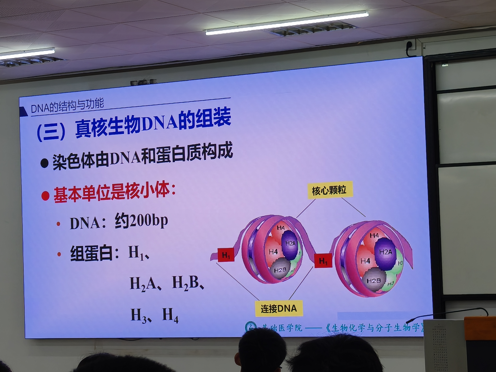

📝 **批注**：本课第一张PPT。染色体 = DNA + 蛋白质；基本单位是**核小体**——DNA约 **200 bp**（课堂值）缠绕在组蛋白（H₁、H₂A、H₂B、H₃、H₄）上。注意图上"核心颗粒"（组蛋白八聚体+缠绕DNA）与"连接DNA"、外侧H₁的位置关系——这就是核小体的完整结构。

#### 组蛋白的功能（老师强调"不是白存在的"）

1. **接收信号**：DNA复制、转录的指令先传给组蛋白，组蛋白被**修饰标记**（甲基化/乙酰化等）
2. 标记后，**拓扑异构酶**先解开DNA高级结构 → **解链酶（解旋酶）**打开双链 → 复制/转录得以进行
3. 组蛋白与**DNA损伤、疾病发生**密切相关：组装异常→染色体结构异常→疾病

#### 核小体的逐级折叠（DNA压缩层次）

DNA双螺旋 → 核小体（串珠）→ 核小体规则排列成平面 → 螺线管/更高层次折叠 → 成熟染色体（交叉形）

老师比喻：就像班级排队，每个核小体在什么位置是"提前安排好的"，与信号传导密切相关。

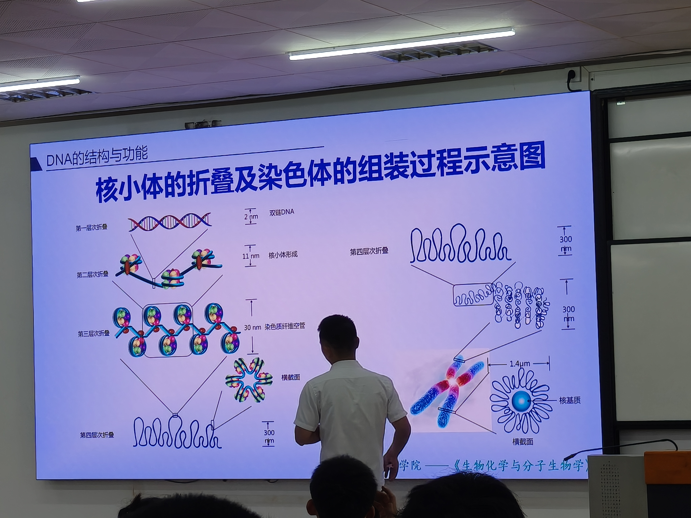

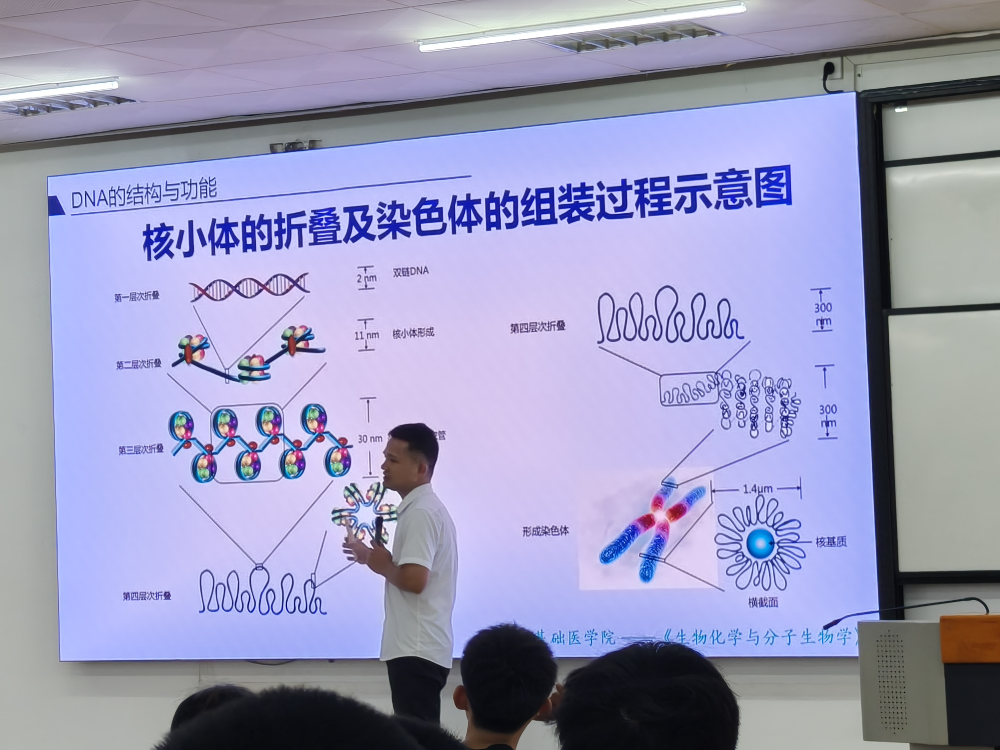

📝 **批注**：核小体→染色体的四级折叠过程与尺寸（必背链条）：
**双链DNA（2 nm）→ 核小体（11 nm）→ 染色质纤维/螺线管（30 nm）→ 更高层次折叠（300 nm）→ 中期染色体（1.4 μm）**。第二张为老师讲解时的同页拍摄，可对照记忆"第一层次折叠~第四层次折叠"的术语（第四层次折叠后"形成染色体"，与核基质相连）。

---

## 二、DNA的功能（考点）

| 功能 | 说明 |
|------|------|
| **遗传信息的载体** | 基因来自父母，DNA是遗传信息的物质基础 |
| **复制模板** | 为DNA复制提供模板 |
| **转录模板** | 为RNA转录提供模板 |

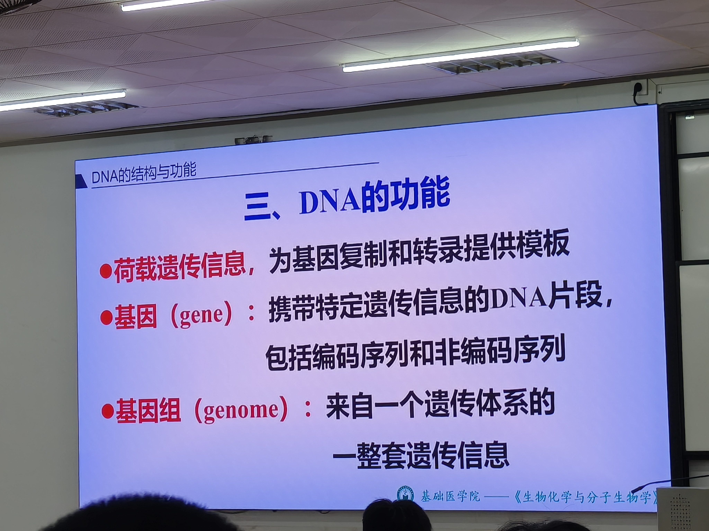

📝 **批注**：PPT原文。**基因**（gene）= 携带特定遗传信息的DNA片段，包括编码序列和非编码序列；**基因组**（genome）= 来自一个遗传体系的一整套遗传信息。注意基因≠整条DNA，只是其中有功能的片段。

**基因（gene）**：携带特定遗传信息的**DNA片段**——不是整条DNA，而是其中一段有特定功能的区域，可单独拿出来进行基因表达，对生命活动起调控作用。

- 基因包含**编码序列** + **非编码序列**
- **非编码序列**（位于编码序列前）：起**启动子（promoter）**、**增强子（enhancer）**作用——没有它，转录翻译无法启动
- **内含子**（真核基因内的非编码序列）约占基因组的 **30%**（考点数字）：转录后需被剪除；部分内含子可能维持基因组稳定；内含子/非编码序列是**研究较少的"未知领域"**

**基因组（genome）**：每个细胞都有一套完整的遗传信息（全套基因）。

**分子病/遗传病举例**：隐性基因突变——本代不表现（隐性携带），若配偶也携带相同隐性基因，下一代可能发病。

**DNA双螺旋模型要点回顾（老师明说"必考"）**

| 要点 | 内容 |
|------|------|
| 螺旋方向 | **右手螺旋**（不是左手） |
| 碱基位置 | 位于双螺旋**内侧** |
| 磷酸-戊糖（脱氧核糖）骨架 | 位于双螺旋**外侧** |
| 碱基配对 | A=T（**2个氢键**）、G≡C（**3个氢键**） |
| 螺距/单位 | 每约10对碱基旋转一周（教材标准：螺距3.4 nm） |

> ⚠️ 转写纠正：老师课堂说"每1.5个点生成一根"应为**每10对碱基旋转一圈**（转写错误/口误，以教材为准）。

---

## 三、RNA的结构与功能

### 1. RNA的一般结构特点

- **单链**为主（绝大部分是单链，不是双链）
- 单链内部可自身互补配对，形成**茎环（发夹）结构**
- **碱基数量不对称**：RNA中A与U、C与G的数量**不一定相等**（DNA双链中A=T、C≡G是相等的）
  - 考点：若题目说某mRNA转录后A=U、C=G数量相等，那这个说法是**错误的**
- RNA含**稀有碱基（修饰碱基）**，tRNA中尤其多
- 主要三类（重点掌握）：**mRNA、tRNA、rRNA**；其他RNA了解即可

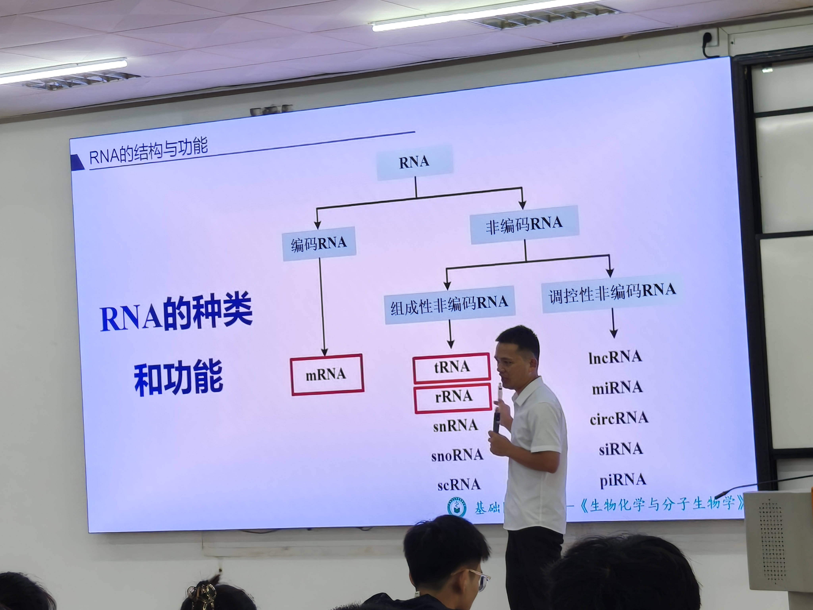

📝 **批注**：本课PPT将RNA分为**编码RNA（mRNA）**与**非编码RNA**；非编码RNA又分**组成性非编码RNA**（tRNA、rRNA、snRNA、snoRNA、scRNA）与**调控性非编码RNA**（lncRNA、miRNA、circRNA、siRNA、piRNA）。考试以三大类（mRNA/tRNA/rRNA）为主，其余了解名称即可。

### 2. mRNA（信使RNA，messenger RNA）

**含量**：约占总RNA的 **3%–5%**（含量少）
**种类**：非常非常多——因为蛋白质种类≈mRNA种类（蛋白质以mRNA为模板合成）

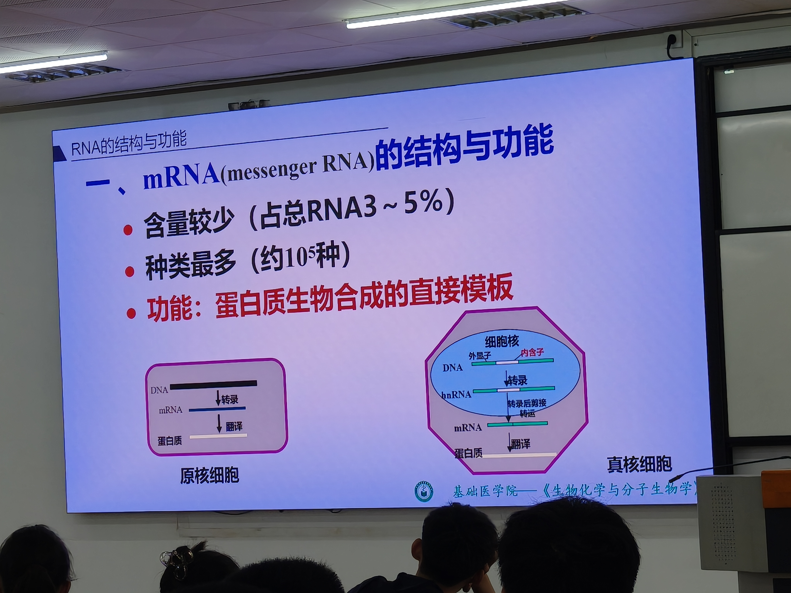

📝 **批注**：mRNA三大要点：①含量较少（占总RNA **3%~5%**）；②种类最多（约 **10⁵** 种）；③功能是**蛋白质生物合成的直接模板**。右侧两图对比：原核细胞DNA→mRNA→蛋白质（无核膜，边转录边翻译）；真核细胞DNA→hnRNA→转录后剪接→mRNA→蛋白质（剪接发生在细胞核内，切除内含子、拼接外显子）。

#### 功能

- **蛋白质合成的模板**（把DNA上的遗传信息带到核糖体）

#### 真核mRNA的成熟加工

真核基因转录后需加工才能成为成熟mRNA（原核细胞转录后可直接翻译）：

1. **剪接**：切除**内含子**，把外显子拼接起来
2. **5'端加帽**：形成**帽子结构 m⁷GpppN**（7-甲基鸟苷帽子）
3. **3'端加尾**：加**polyA尾巴（多聚腺苷酸尾）**

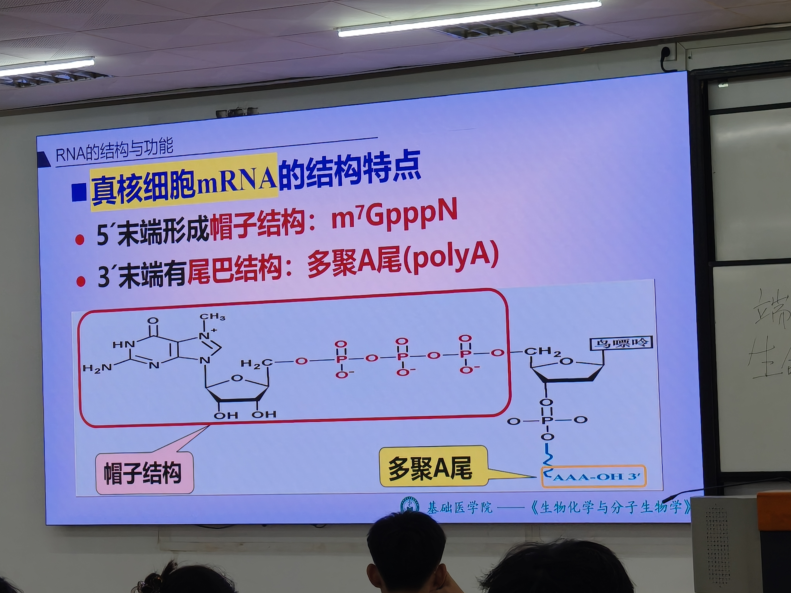

📝 **批注**：真核mRNA两大端部结构：5'末端**帽子结构 m⁷GpppN**（7-甲基鸟苷，促进翻译起始、增强稳定性）；3'末端**polyA尾**（多聚A尾，核孔"通行证"）。图中同时标出鸟嘌呤与AAA-OH 3'端。

| 结构 | 位置 | 主要作用（考点） |
|------|------|------------------|
| 帽子结构 m⁷GpppN | 5'端 | 促进核蛋白体（核糖体）与mRNA结合、加速翻译起始、增强mRNA稳定性；"通关"识别 |
| polyA尾巴 | 3'端 | 核孔**识别"通行证"**（mRNA从细胞核运出到胞质）；维持mRNA稳定性 |
| 起始密码子 | AUG（编码区起点） | 启动翻译 |
| 终止密码子 | UAA / UAG / UGA | 终止翻译（没有它mRNA会过长、徒增负担） |
| 三联体密码 | 每3个核苷酸编码1个氨基酸 | 遗传密码的基本单位 |

- 密码子方向：5'→3'阅读
- AUG在DNA模板中对应的是ATG（T替代U）；UAA对应TAA、UAG对应TAG、UGA对应TGA

> ⚠️ **重要纠正（老师口误点）**：课堂上老师把"帽子结构"讲成"随年龄增长越来越短的生命时钟"。**教材中"生命时钟"指的是染色体末端的端粒（telomere）**——端粒随细胞分裂而缩短，与衰老相关；而mRNA的5'帽子结构（m⁷GpppN）并不会随年龄变短。两者是不同概念，考试务必区分。

### 3. tRNA（转运RNA，transfer RNA）

**特点**（老师比喻：体积小、身体好的"搬运工"）：

| 特点 | 说明 |
|------|------|
| 分子量小 | "搬运工不能太胖"，灵巧精致 |
| 非常稳定 | 才能胜任搬运工作 |
| 稀有碱基多 | 修饰碱基比例高（比mRNA多） |
| 3'端 | **CCA-OH**结构——**连接氨基酸**的关键部位（可连接20种常见氨基酸） |
| 5'端 | 多为G |

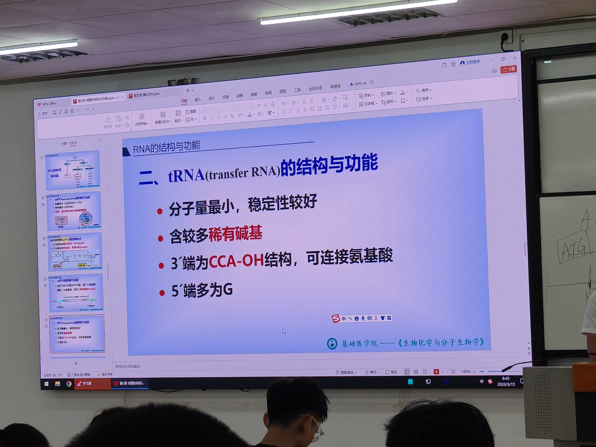

📝 **批注**：tRNA四大特点速记：①**分子量最小**、稳定性较好；②含较多**稀有碱基**；③3'端为 **CCA-OH**（可连接氨基酸）；④5'端多为 **G**。

**二级结构——三叶草形**（考点，可能考）：

- **三环四臂（四臂四环）**：
  - **氨基酸臂**（3'端CCA-OH，接纳氨基酸）
  - **DHU环**（二氢尿嘧啶环）
  - **反密码子环**（识别mRNA密码子的关键）
  - **TΨC环**
  - **额外环**（可变环，很小，了解）

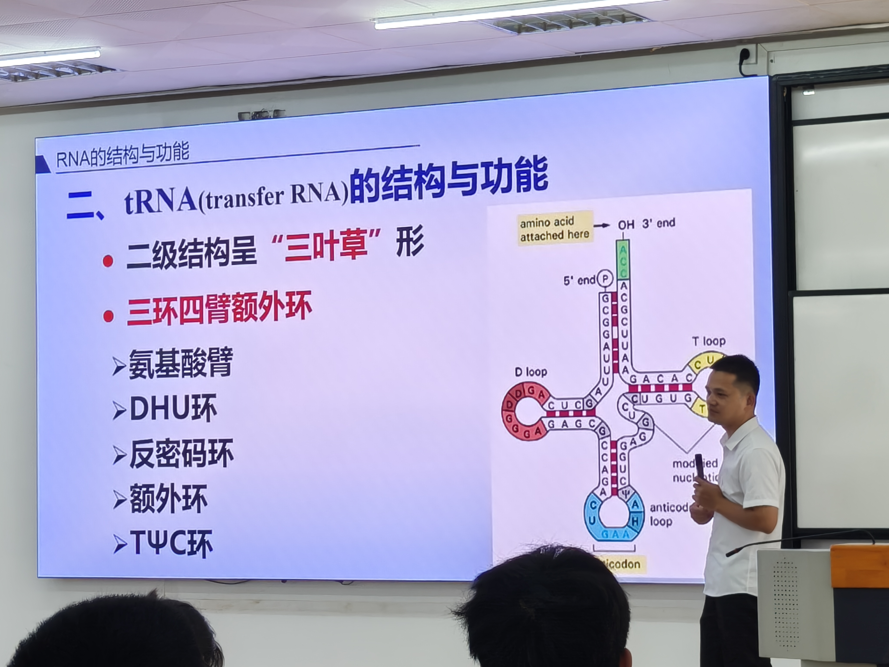

📝 **批注**：tRNA三叶草形二级结构图（中英对照）：**氨基酸臂**（amino acid attached here，3'端CCA-OH）、**DHU环**（D loop）、**反密码子环**（anticodon loop，图中标注mod nucleo修饰核苷酸）、**TΨC环**（T loop）、**额外环**。记住"三环四臂"考法。

**三级结构**：三叶草进一步折叠成**倒L形**（像"刀L型"），是运输氨基酸的成熟稳定构象。

**功能**：搬运氨基酸到核糖体，参与蛋白质翻译——tRNA通过反密码子与mRNA上的密码子**反向互补配对**，把正确氨基酸送到正确位置。

> 反密码子书写方向：tRNA反密码子按5'→3'书写，与mRNA密码子配对时注意反向互补（课堂例题：mRNA密码子 GUC ↔ tRNA反密码子 GAC 需按方向调换）。

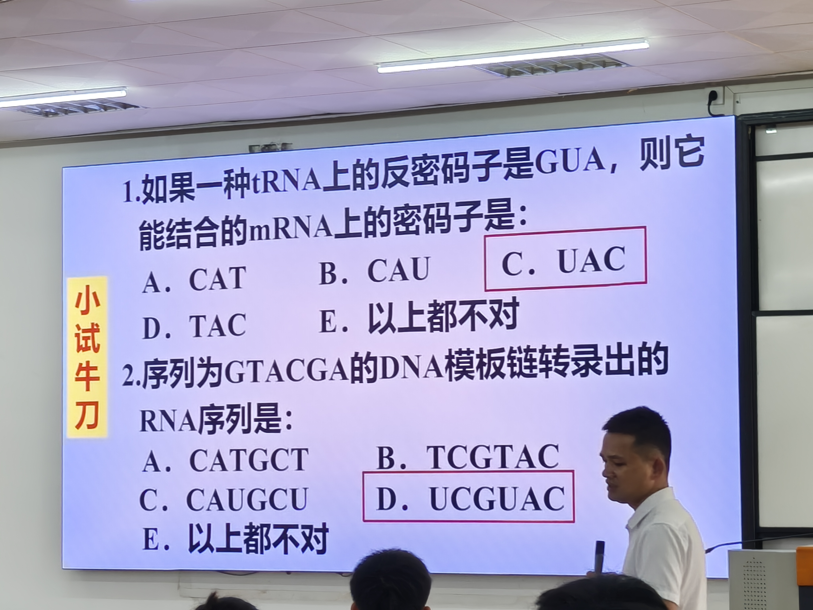

📝 **批注**：课堂"小试牛刀"真题（红色框=正确答案）：①tRNA反密码子 **GUA** → 结合的mRNA密码子是 **UAC**（选C）；②DNA模板链 **GTACGA** → 转录出的RNA序列是 **UCGUAC**（选D，T→U、按碱基互补）。两道题都是"反密码子/模板链→产物"的必考题型，请动手再算一遍。

### 4. rRNA（核糖体RNA，ribosomal RNA）

**含量**：占总RNA比例**最多**
**功能**：与核糖体蛋白质共同组成**核糖体**，为蛋白质合成（翻译）提供**场所**

**核糖体大小亚基（考试常考，必记）**：

| 生物 | 小亚基 | 大亚基 | 完整核糖体 |
|------|--------|--------|-----------|
| 原核生物 | 30S | 50S | 70S |
| 真核生物 | 40S | 60S | 80S |

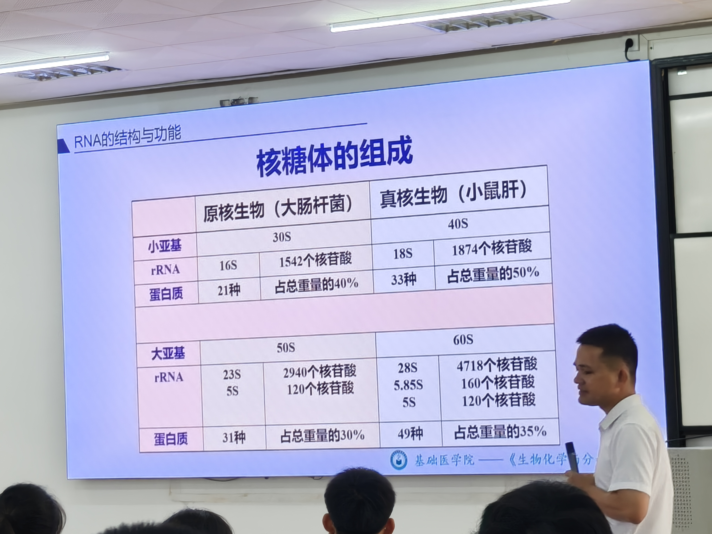

📝 **批注**：核糖体组成表（原核=大肠杆菌、真核=小鼠肝）：小亚基原核30S（16S rRNA、1542核苷酸、21种蛋白、占40%）vs 真核40S（18S rRNA、1874核苷酸、33种蛋白、占50%）；大亚基原核50S（23S+5S rRNA、蛋白占30%）vs 真核60S（28S+5.8S+5S rRNA、蛋白占35%）。**真核rRNA更长、蛋白种类更多**。

**沉降系数S**：表示离心时颗粒沉降到管底的速度（S越大沉得越快）。注意S值**不可简单相加**（30S+50S=70S而非80S，因为沉降系数受形状和质量共同影响）。

**真核 vs 原核核糖体蛋白数量**：真核生物无论是小亚基还是大亚基结合的蛋白质数量**都比原核生物多**（因为真核要合成的蛋白质更多、更复杂，需更多加工场所）。

**翻译过程简述（了解）**：mRNA通过小亚基→tRNA携带氨基酸（CCA端）进入→tRNA反密码子与mRNA密码子配对→氨基酸通过**肽键**与已合成的多肽链脱水缩合→mRNA不断向前滑动（每3个密码子移动一次）→肽链延长。

**三类RNA功能一句话总结**（老师提问回顾）：

| RNA | 功能 |
|-----|------|
| mRNA | 提供蛋白质合成的**模板** |
| tRNA | **搬运**氨基酸（"一般因工"→搬运工） |
| rRNA | 与蛋白质组成核糖体，为蛋白质合成提供**场所** |

---

## 四、核酸的理化性质

| 性质 | 内容（考点） |
|------|-------------|
| 两性电解 | 含磷酸基（酸性）+ 碱基（碱性），是两性电解质 |
| 粘度 | **双链 > 单链**；DNA的粘度比RNA大 |
| 酸性 | 核酸和核苷酸都有较强的酸性（磷酸基贡献） |
| 紫外吸收 | **260 nm** 处有最大吸收峰 |

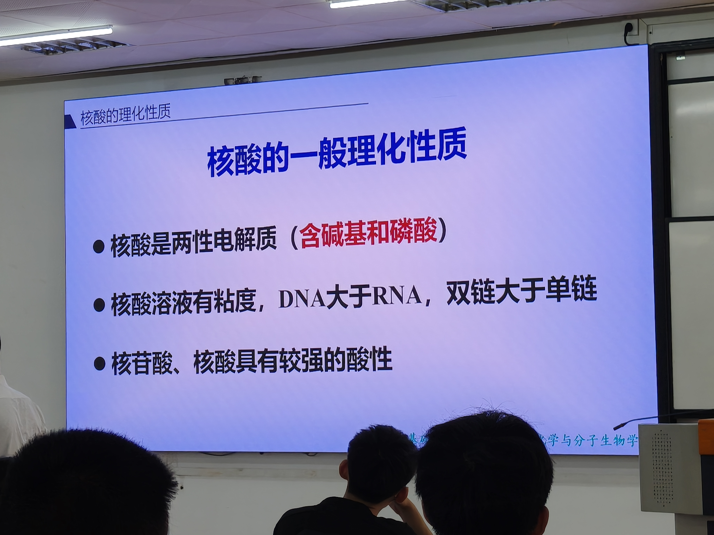

📝 **批注**：PPT原文三条：①核酸是**两性电解质**（含碱基和磷酸）；②核酸溶液有**粘度**，DNA>RNA、双链>单链；③核苷酸、核酸有较强**酸性**。

> ⚠️ **转写纠正**：老师口误说"核酸在280 nm吸收最大"——**正确是260 nm**（280 nm是蛋白质的最大吸收波长，因含芳香族氨基酸）。核酸浓度测定用 **A260**。

**A260的应用（了解，但现在实验室多用自动检测仪）**：

- 1 cm比色皿、波长260 nm、吸光度A=1.0 时：
  - 双链DNA ≈ **50 μg/ml**
  - 单链RNA ≈ **40 μg/ml**
- **纯度鉴定：A260/A280 比值**
  - DNA：比值越接近 **1.8**，纯度越高
  - RNA：比值越接近 **2.0**，纯度越高
  - 意义：提取的核酸常混有组蛋白、组织碎片等杂质，纯度影响科研数据准确性

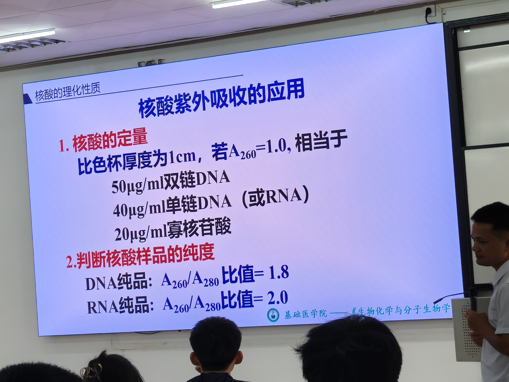

📝 **批注**：紫外吸收应用PPT：①**核酸定量**——比色杯厚度1 cm、A₂₆₀=1.0 时 ≈ 50 μg/ml双链DNA / 40 μg/ml单链DNA（或RNA）/ 20 μg/ml寡核苷酸；②**纯度判断**——DNA纯品 A₂₆₀/A₂₈₀=1.8，RNA纯品=2.0。这两个比值是常考点。

---

## 五、DNA变性、复性与分子杂交

### 1. DNA变性（denaturation）

**定义**：在某些理化因素作用下，DNA双螺旋的**碱基间氢键断裂**，双链解开成为单链的过程。

**化学本质**：氢键断裂（非共价键破坏）——**不改变一级结构（核苷酸序列）**。

**变性因素**：高温（加热）、酸、碱、尿素、有机溶剂等（都能破坏氢键）。

**变性后的理化性质变化**：

| 指标 | 变性后变化 |
|------|-----------|
| A260紫外吸收 | **升高**（增色效应） |
| 粘度 | 下降 |
| 生物活性 | 丧失 |

**与蛋白质变性的对比（考点思路）**：

| 对比项 | 蛋白质变性 | DNA变性 |
|--------|-----------|---------|
| 破坏的结构 | 空间结构（四级/三级等） | 双链间氢键 |
| 复性难度 | 非常困难（成本极高，实验室通常弃用沉淀蛋白） | **容易**——撤除变性因素后约90%以上可自动恢复双螺旋 |
| 体内后果 | — | 体内DNA变性/损伤→疾病 |

**体内DNA损伤修复机制**：体内有一套"巡逻维修系统"——DNA损伤处先被**甲基化标记**→工具酶（**拓扑异构酶、DNA连接酶、DNA聚合酶**等）携带原料（脱氧核糖核苷酸）来修复→DNA损伤修复。紫外线、烧焦食物、化学刺激物都会损伤DNA，轻度可修复，**过度损伤超出修复能力→基因出问题→疾病**。

### 2. DNA的热变性（与PCR相关，了解）

- 约 **90多℃** 时双链完全解开——这是PCR技术中"变性"步骤的原理
- 影响热变性温度的因素：
  - **GC含量**：G≡C有3个氢键（比A=T的2个多），结合更牢固；GC含量高→变性温度高。**PCR引物设计时GC含量一般不超过60%**，否则引物与模板结合困难（退火困难）
  - **DNA均一性**：全部超螺旋或全部线性的均一DNA变性同步；超螺旋+线性混合的DNA变性不齐（参考蛋白质均一性：单聚体/二聚体/四聚体混合物在色谱上出现宽而低的峰）

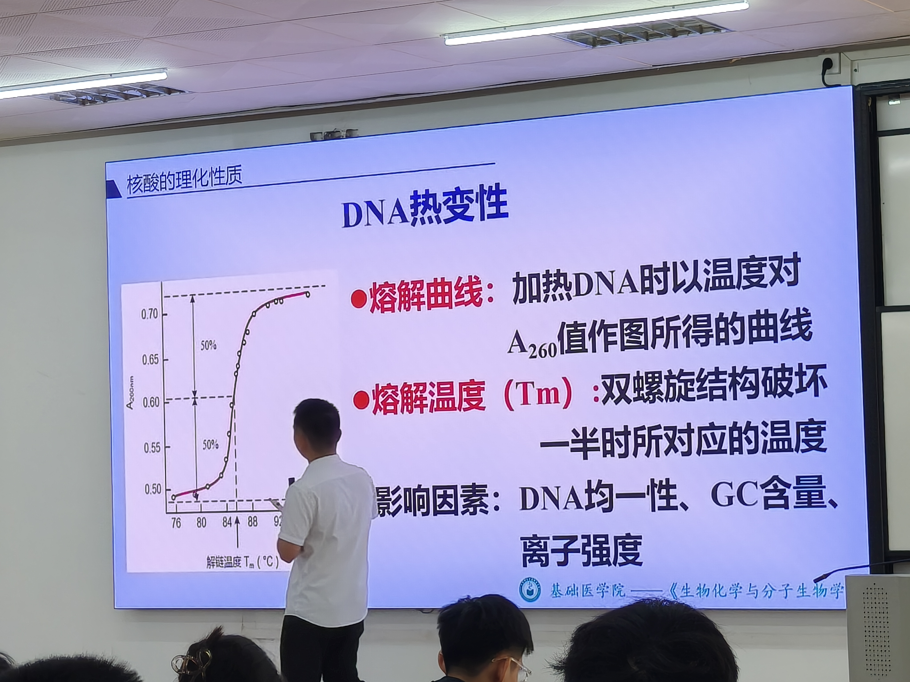

📝 **批注**：**熔解曲线**：加热DNA时以温度对A₂₆₀值作图所得曲线（S形）；**熔解温度 Tm**：双螺旋结构破坏一半（增色效应达50%）时所对应的温度。影响因素：DNA均一性、**GC含量**、离子强度。图中纵轴A₂₆₀nm、横轴温度（76~92℃）、50%处即Tm。

### 3. 复性（renaturation）与退火

- **复性**：撤除变性因素，两条互补单链在合适条件下自动恢复双螺旋（比蛋白质复性简单太多）
- **退火（annealing）**：热变性后缓慢冷却，互补链重新配对的过程——也是PCR中引物与模板结合的步骤
- 课堂实例：合成链A + 互补链B，按1:1混合，加热95℃变性→自然冷却→A与B互补配对成双链

### 4. 核酸分子杂交（hybridization，了解）

**定义**：在合适条件（温度、缓冲液）下，具有互补序列的核酸单链形成稳定**杂交双链**的过程。

**类型**：DNA-DNA、DNA-RNA、RNA-RNA都可以杂交。

**体内实例**：转录时mRNA与DNA模板短暂配对（转录后mRNA脱离DNA运往胞质）。

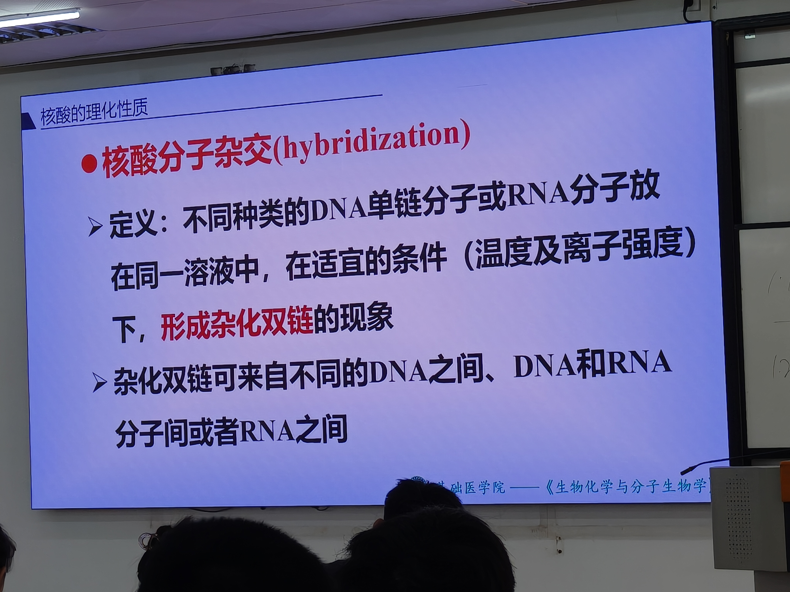

📝 **批注**：分子杂交定义（PPT原文）：不同种类的DNA单链分子或RNA分子放在同一溶液中，在适宜条件（温度及离子强度）下形成**杂化双链**的现象。杂化双链可来自不同DNA之间、DNA和RNA之间或RNA之间。

---

## 六、酶学开篇（下一章《酶与维生素》预告）

> 老师说：酶这一章内容多，特别是"酶的抑制剂"部分不好理解，是相对难点。下面为本课已讲内容。

### 1. 酶的发展史（了解）

| 时间/人物 | 事件 |
|-----------|------|
| 中国2000年前 | 已会酿酒制酱（无系统文字记载） |
| 巴斯德（Pasteur） | 认为发酵是酵母活细胞活动的结果 |
| 1877年 Kühne | 首次提出"酶"（enzyme）这个词 |
| 1897年 Buchner | 无细胞发酵技术诞生（证明离体提取物也能发酵） |
| 1926年 Sumner | 从刀豆中提取出**脲酶结晶**（证明酶是蛋白质） |
| 现代 | 发现**核酶**（RNA催化剂）、**脱氧核酶**（DNA催化剂） |

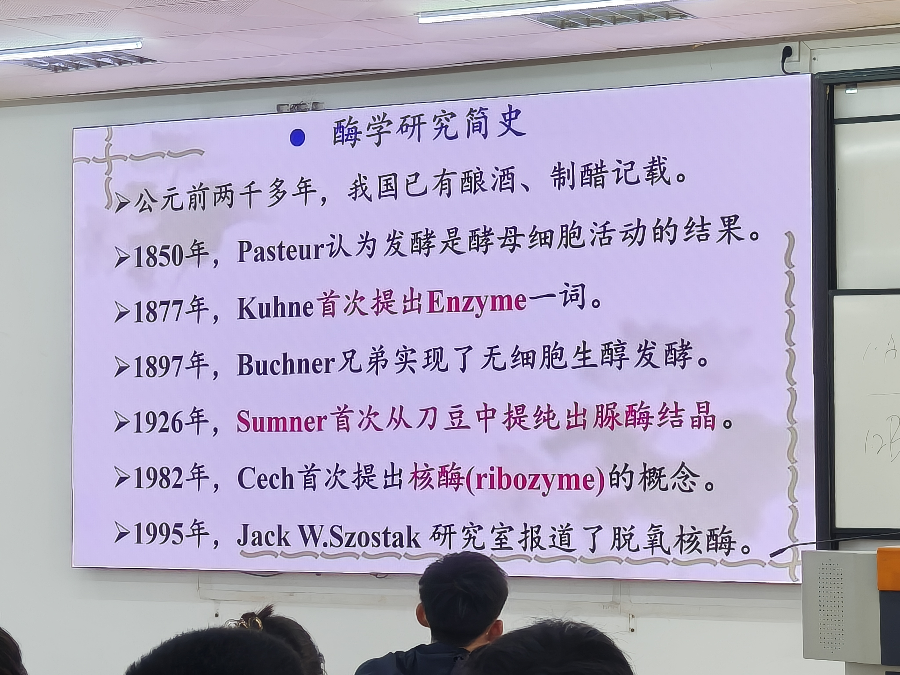

📝 **批注**：发展史时间线（PPT原文）：公元前两千多年我国已有酿酒制醋记载 → 1850年Pasteur认为发酵是酵母细胞活动结果 → **1877年Kühne首次提出Enzyme一词** → **1897年Buchner兄弟实现无细胞发酵**（离体提取物也能发酵）→ **1926年Sumner首次从刀豆提纯脲酶结晶**（证明酶是蛋白质）→ 1982年Cech首次提出核酶(ribozyme)概念 → 1995年Szostak研究室报道脱氧核酶。

### 2. 酶的定义（易错点）

**酶（enzyme）**：由**活细胞产生的、能催化特定化学反应的蛋白质**。

⚠️ 注意：定义说"蛋白质"，是因为绝大多数酶是蛋白质；但**核酶（ribozyme）是RNA**、脱氧核酶是DNA。所以考题"酶就是蛋白质"——**错**！酶还可能包含部分核酸。

**酶促反应通式**：E + S（底物）→ E + P（产物）

- 酶催化底物转化为产物，但**反应前后酶本身性质不变**（"你来上课，上完课你还是你"——老师比喻）

### 3. 酶按分子结构分类

| 类型 | 定义 | 举例 |
|------|------|------|
| **单体酶** | 只有一条多肽链（经折叠组装执行功能） | — |
| **寡聚酶** | 由多个相同或不同亚基组成 | 磷酸果糖激酶（糖代谢重要酶） |
| **多酶体系** | 几种不同功能的酶聚合在一起完成复杂任务 | 丙酮酸脱氢酶复合体（举例） |
| **多功能酶** | 一个酶具有多种功能/催化多种底物 | 甲基化酶（可甲基化A也可甲基化C）；蛋白激酶可磷酸化多种蛋白质 |

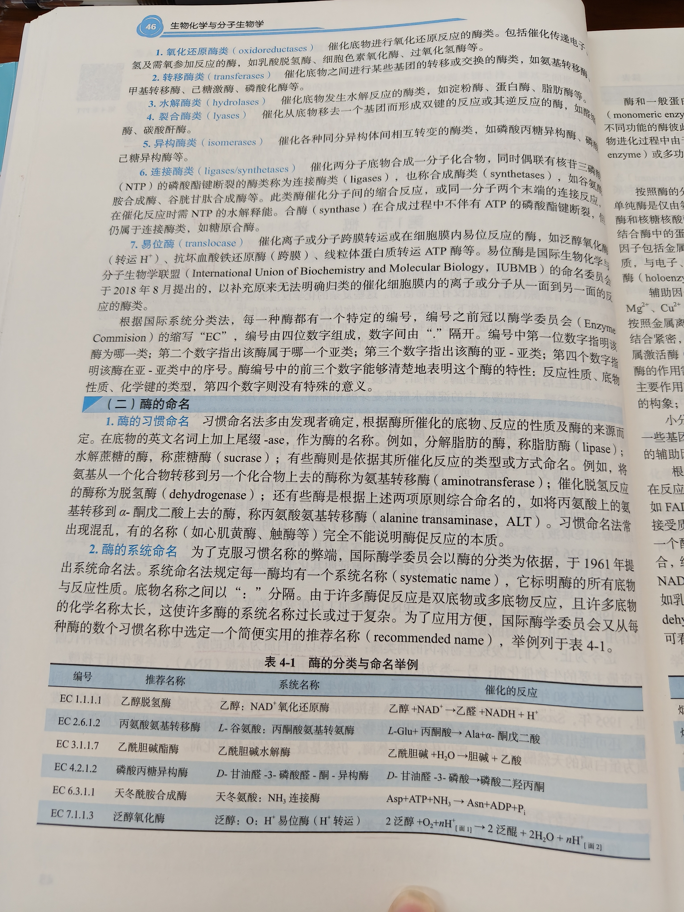

📝 **批注**：教材第46页（用户拍摄）。**酶分类**（国际酶学委员会EC分类，7大类）：1氧化还原酶类（乳酸脱氢酶）、2转移酶类（氨基转移酶）、3水解酶类（淀粉酶/蛋白酶）、4裂合酶类（醛缩酶）、5异构酶类（磷酸丙糖异构酶）、6连接酶类/合成酶（谷氨酰胺合成酶，需NTP；注意"合酶"不伴ATP断裂）、7易位酶（2018年新增，跨膜转运）。**命名**：习惯命名（底物+ase，如脂肪酶）vs 系统命名（1961年提出，标明所有底物与反应性质，如"乙醇：NAD⁺氧化还原酶"）+推荐名称；EC编号四位数字（类.亚类.亚亚类.序号）。

### 4. 酶的分子组成

| 类型 | 组成 | 举例 |
|------|------|------|
| **单纯酶** | 仅由氨基酸（多肽链）组成 | 脲酶、淀粉酶、酯酶 |
| **结合酶（全酶）** | 酶蛋白 + 辅助因子 | 绝大多数酶 |

**全酶 = 酶蛋白（决定反应特异性）+ 辅助因子（决定反应类型和性质）**

- **酶蛋白**：空间结构决定其催化特异性（结构决定功能）
- **辅助因子**：参与电子、质子或化学基团的连接与传递，决定反应类型与性质

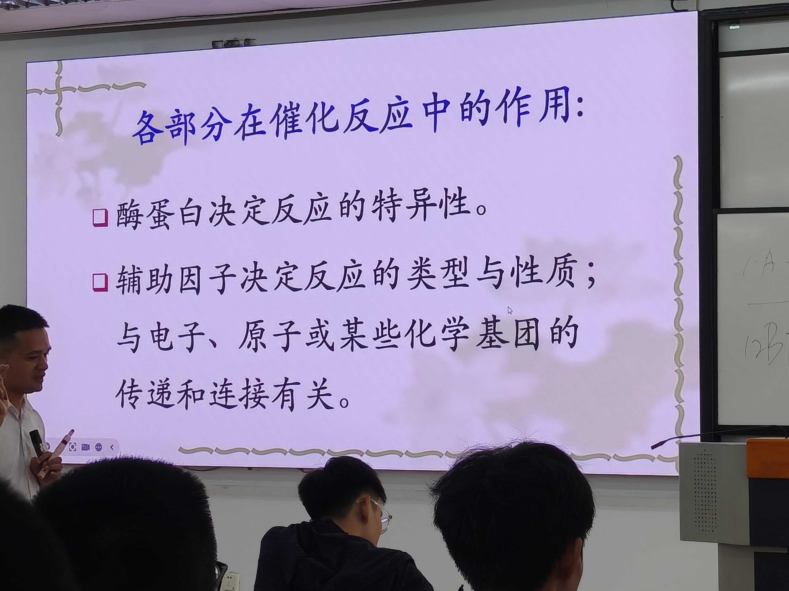

📝 **批注**：PPT原文：**酶蛋白决定反应的特异性**；**辅助因子决定反应的类型与性质**，与电子、原子或某些化学基团的传递和连接有关。

**辅助因子分类**：

| 种类 | 作用 |
|------|------|
| 小分子有机化合物 | 多为维生素或其衍生物（如辅酶A类），参与电子质子传递 |
| 金属离子 | 铁、锌、钙、镁等；参与反应、**连接酶与底物的桥梁**（金属离子位于酶活性中心）、稳定酶构象、中和电荷 |

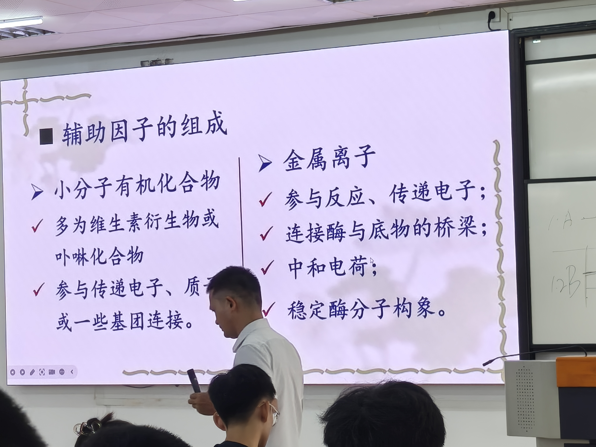

📝 **批注**：辅助因子=小分子有机化合物（多为维生素衍生物或卟啉化合物，参与传递电子、质子或一些基团连接）+ 金属离子（参与反应、传递电子；**连接酶与底物的桥梁**；中和电荷；**稳定酶分子构象**）。

**辅酶 vs 辅基（易混考点，老师重点强调）**：

| 对比项 | 辅酶（coenzyme） | 辅基（prosthetic group） |
|--------|------------------|--------------------------|
| 与酶蛋白结合 | **疏松**（非共价） | **紧密**（共价键） |
| 能否透析/超滤除去 | **能** | 不能 |
| 别名 | **金属激活酶**（金属离子不直接参与反应，仅辅助） | **金属酶**（金属离子直接参与反应，在活性中心，是连接酶与底物的桥梁） |

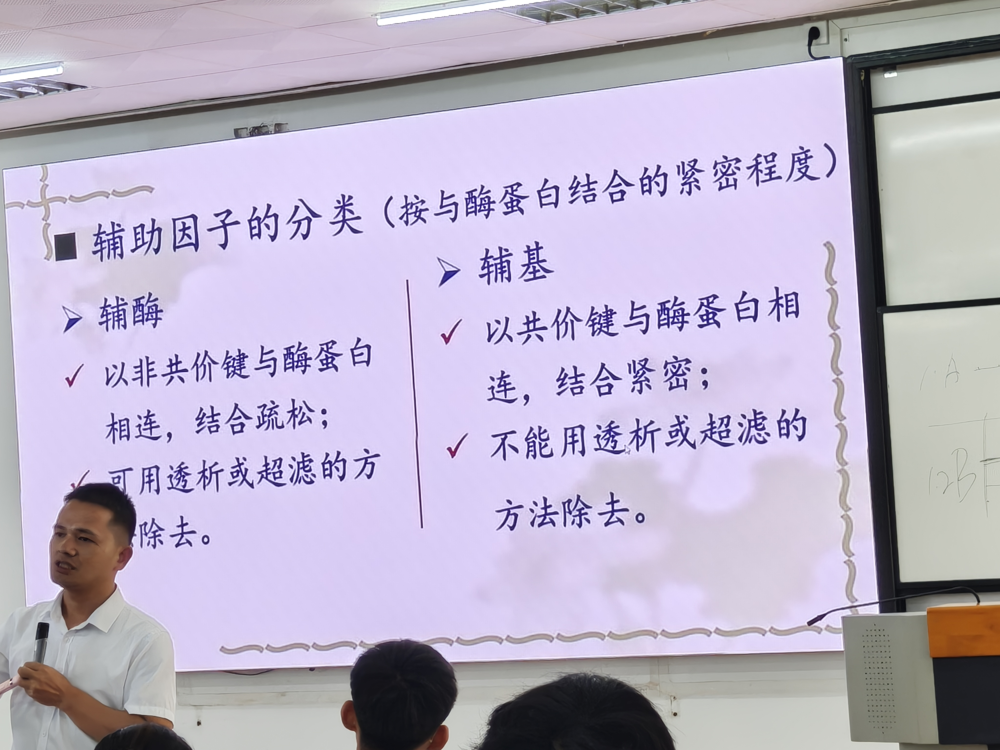

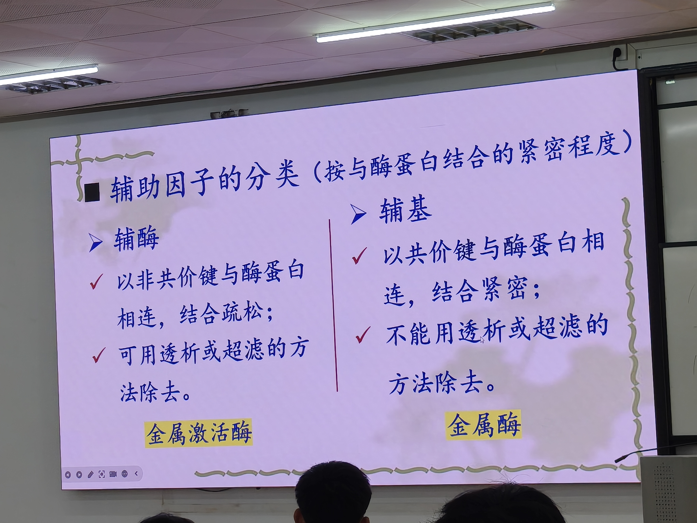

📝 **批注**：辅酶/辅基对比（PPT原文）：辅酶以**非共价键**与酶蛋白相连、结合疏松、**可用透析或超滤除去**（→金属激活酶）；辅基以**共价键**相连、结合紧密、**不能用透析或超滤除去**（→金属酶）。第二张补充了"金属激活酶/金属酶"对应关系。

**超滤原理（老师补充）**：超滤管有半透膜——小分子（如辅酶）可穿过膜被离心除去；生物大分子（酶蛋白）不能穿过。多次换液稀释可除掉结合疏松的辅酶。

**常见辅酶/辅基（老师指出标红部分常考）**：

| 名称 | 类别 |
|------|------|
| NAD⁺（烟酰胺腺嘌呤二核苷酸） | 辅酶 |
| NADP⁺（烟酰胺腺嘌呤二核苷酸磷酸） | 辅酶 |
| FAD（黄素腺嘌呤二核苷酸） | 辅基 |
| FMN（黄素单核苷酸） | 辅基 |
| 叶酸（及四氢叶酸） | 常考（老师强调） |

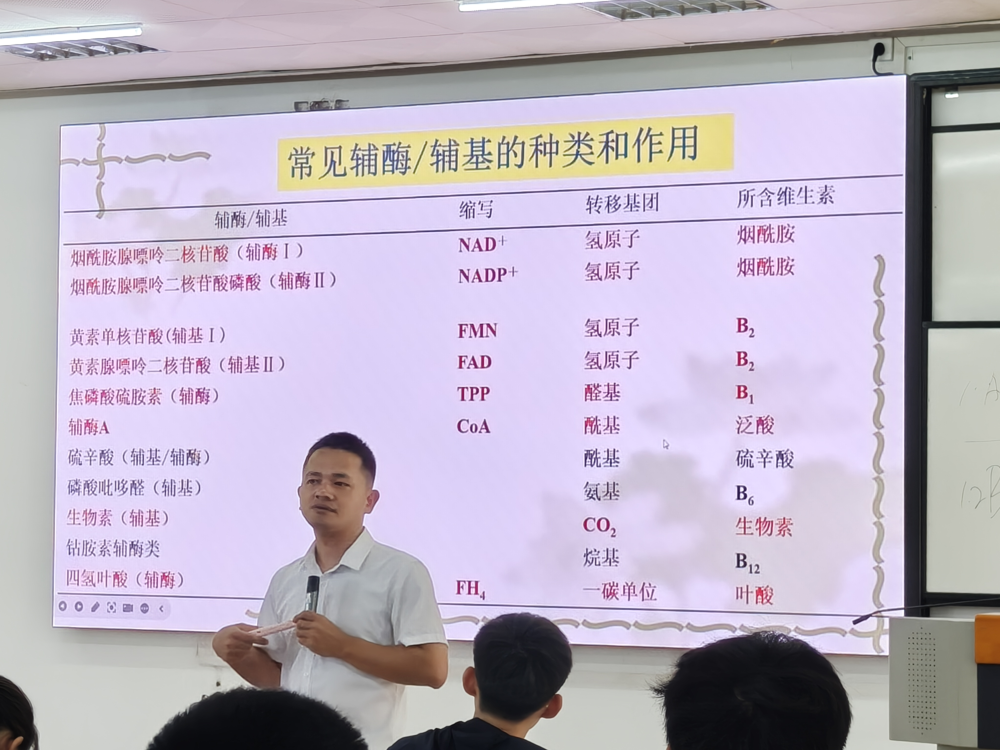

📝 **批注**：常考辅酶/辅基一览（含缩写、转移基团、所含维生素）：**NAD⁺/NADP⁺**（辅酶，转移氢原子，含烟酰胺/B₃）、**FMN/FAD**（辅基，转移氢原子，含维生素B₂）、**TPP**（辅酶，转移醛基，含B₁）、**CoA**（辅酶，转移酰基，含泛酸）、**硫辛酸**（转移酰基）、**磷酸吡哆醛**（辅基，转移氨基，含B₆）、**生物素**（辅基，转移CO₂）、**钴胺素辅酶**（转移烷基，含B₁₂）、**四氢叶酸FH₄**（辅酶，转移一碳单位，含叶酸）。常考配对：FMN/FAD→B₂、TPP→B₁、CoA→泛酸、FH₄→叶酸。

### 5. 酶的活性中心（本课重点）

**定义（3个要点，考点）**：酶分子中能与底物**特异性结合**、并**催化底物转化为产物**的具有**特定三维结构**的区域。

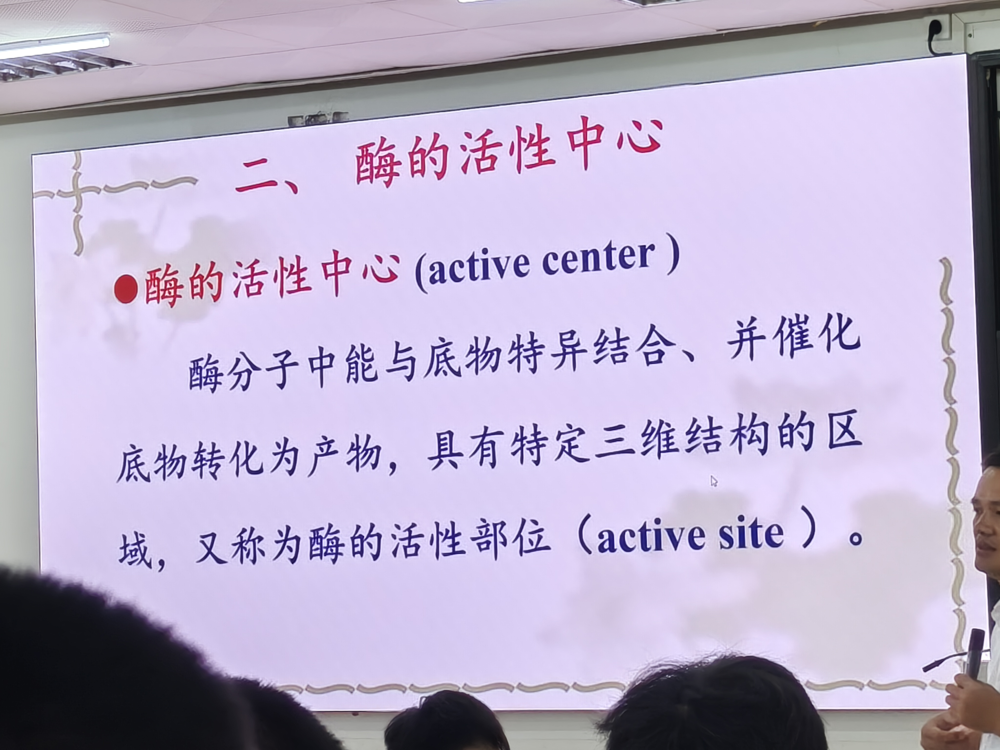

📝 **批注**：活性中心（active center/active site）定义（PPT原文）：酶分子中能与底物特异结合、并催化底物转化为产物、具有**特定三维结构**的区域，又称酶的活性部位。

**必需基团（essential group）**：酶分子中与酶活性密切相关的化学基团。

**活性中心内的基团**：

| 基团 | 作用 |
|------|------|
| **结合基团** | 与底物结合，把底物固定在活性中心（决定专一性） |
| **催化基团** | 催化底物化学键断裂/形成，转化为产物（决定催化能力） |

**活性中心以外的必需基团**：维持酶活性中心的**空间构象稳定**，保证活性中心能顺利接纳底物（如谷氨酸侧链带负电与精氨酸/赖氨酸带正电形成**离子键**稳定结构；离子键破坏→活性中心解体）。

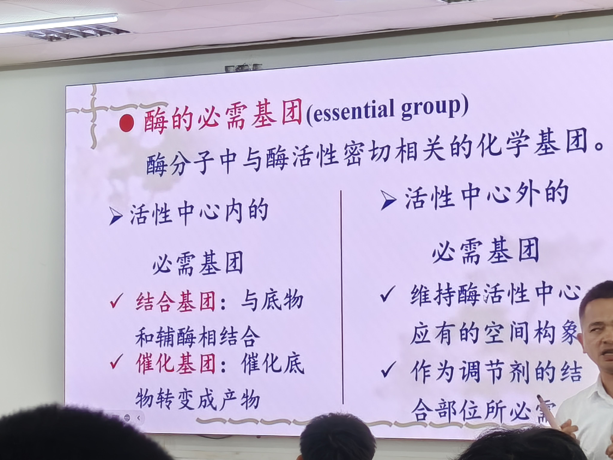

📝 **批注**：必需基团（essential group）分类：**活性中心内**——结合基团（与底物和辅酶相结合）+ 催化基团（催化底物转变成产物）；**活性中心外**——维持酶活性中心应有的空间构象 + 作为调节剂的结合部位所必需。

**验证活性中心的方法（科研思路）**：

- 酶的活性中心一般由 **1~5个氨基酸** 组成，很多酶只有一个关键氨基酸
- **定点突变**（如把关键谷氨酸突变为丙氨酸/半胱氨酸）→ 活性丧失 → 说明该残基是活性中心必需氨基酸
- 必须与**野生型（未突变）酶做对照**；若突变后仍有活性，可能是有杂酶污染
- 一个酶可能有**多个活性中心**（分布在不同结构域），突变其中一个活性会降低或消失

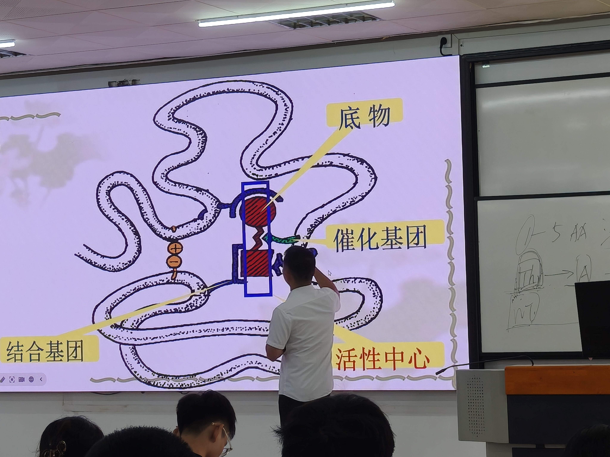

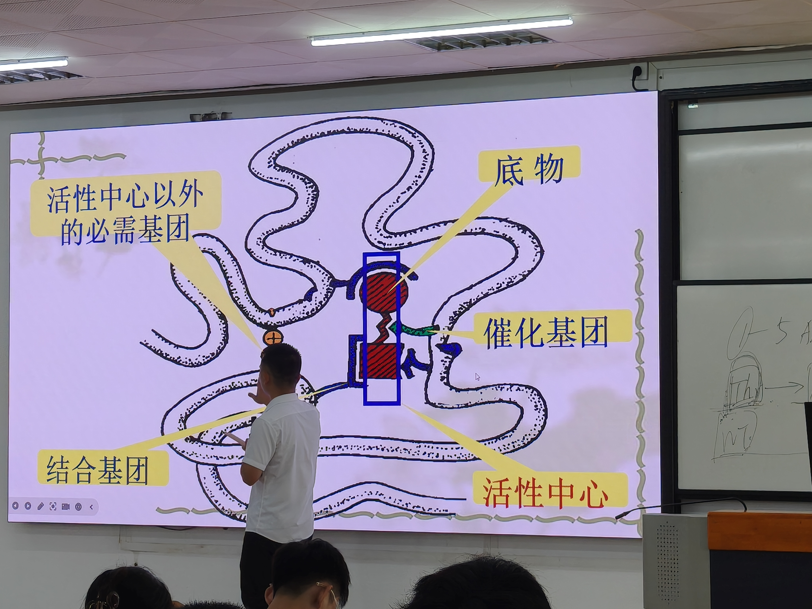

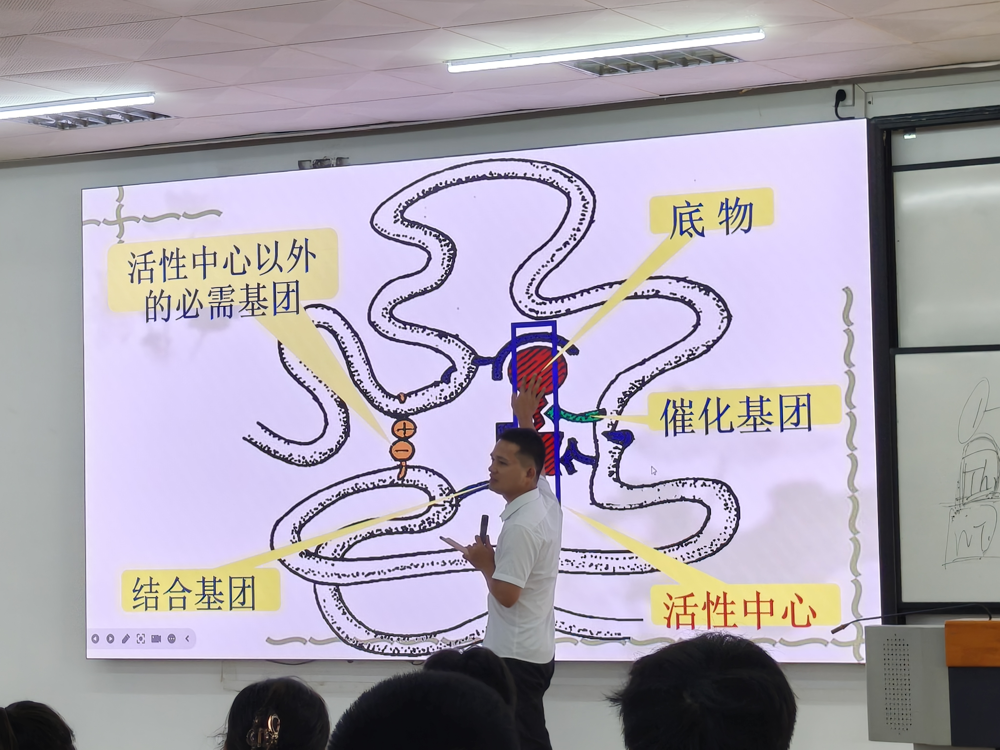

📝 **批注**：酶结构示意图三连拍（老师讲解时拍的）。看懂这张图=理解活性中心：折叠的多肽链围出一个凹陷区域（**活性中心**），**结合基团**固定**底物**，**催化基团**催化底物转变；活性中心以外的必需基团维持整个活性中心的空间构象。图中"5 AA"表示活性中心常由约1~5个氨基酸组成。

---

## 七、本课必背数字与考点速记

| 数字/内容 | 含义 |
|-----------|------|
| 200 bp | 原核生物负超螺旋间隔 ≈ 核小体基本单位 |
| 146 bp + 60 bp | 核小体核心DNA缠绕长度 + 连接区DNA |
| 30% | 内含子（非编码序列）占基因组比例 |
| 3%–5% | mRNA占总RNA的比例 |
| 260 nm | 核酸最大紫外吸收波长 |
| 280 nm | 蛋白质最大紫外吸收波长 |
| A260/A280 ≈ 1.8 / 2.0 | DNA / RNA 纯度指标 |
| 50 μg/ml / 40 μg/ml | A260=1.0时的 dsDNA / ssRNA 浓度 |
| 90多℃ | DNA热变性完全解链温度 |
| 30S+50S=70S / 40S+60S=80S | 原核 / 真核核糖体 |
| AUG / UAA、UAG、UGA | 起始密码子 / 终止密码子 |
| 10对碱基/圈、3.4 nm螺距 | DNA双螺旋参数 |
| A=T 2氢键 / G≡C 3氢键 | 碱基配对 |

---

## 八、下节课预告

- 酶继续：酶促反应特点与机制、影响因素（温度、pH、抑制剂等）——老师说抑制剂部分较难，提前预习
- 转写中老师提到：酶只催化**符合热力学规律**（从高能到低能）的反应

---

## 转写错误纠正记录（本课）

| 转写原文 | 正确内容 |
|----------|---------|
| "核酸在280nm吸收最大" | **260 nm**（280 nm是蛋白质） |
| "帽子结构是生命时钟" | 生命时钟是**端粒**（telomere）；mRNA帽子结构是m⁷GpppN |
| "每1.5个点生成一根" | 每**10对碱基**旋转一圈 |
| "专利" | 端粒（telomere） |
| "一般因工" | 搬运工（tRNA功能） |
| "软病毒"等（上节课） | 见 _术语纠正对照表.md |
