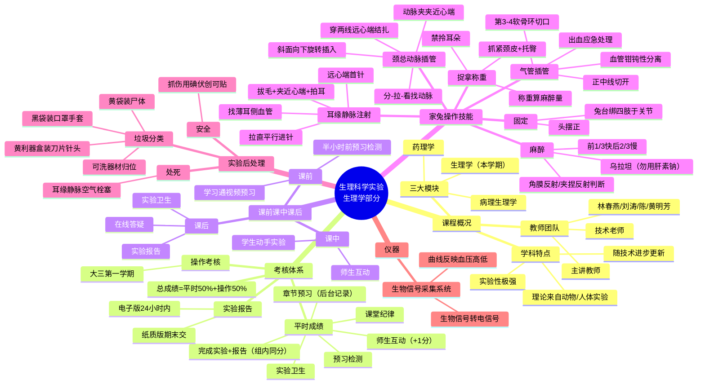

# 03 生理科学实验（医学机能学实验）— 知识框架与思维导图

## 一、Mermaid 思维导图

---

## 二、层级列表版

### 1. 课程概况
- 三大模块：生理学（本学期）、病理生理学、药理学
- 学科特点：实验性极强，理论来自动物/人体实验
- 教师团队：主讲+林春燕、刘涛、陈老师、黄明芳+技术老师

### 2. 考核体系
- 总成绩 = 平时成绩50% + 大三操作考核50%
- 平时成绩：章节预习、预习检测、师生互动（+1分）、完成实验+报告（组内同分）、纪律、卫生
- 实验报告：电子版24h内；纸质版期末交（4元/本）

### 3. 教学流程
- 课前：学习通视频预习到能复述步骤 + 预习检测
- 课中：互动答疑 + 学生动手为主
- 课后：卫生 + 报告 + 在线答疑

### 4. 核心操作技能
1. **捉拿称重**：抓紧颈皮、托臀；禁拎耳；称重算麻醉量
2. **麻醉**：乌拉坦；前1/3快推镇静，后2/3边推边观察；角膜反射/夹捏反射判断深度；不追求一动不动
3. **固定**：兔台、四肢绑于关节处、头摆正
4. **耳缘静脉注射**：
   - 找耳郭薄、毛稀侧
   - 拔毛→夹近心端→轻拍→血管充盈
   - 拉直、先斜后平行进针
   - 捏针推药，阻力大即重进
   - 远心端首针，留余地
5. **气管插管**：
   - 正中线第一刀
   - 切肌肉层后血管钳钝性分离，禁锐性切割
   - 第3、4软骨环间切口，不切环间
   - 堵管：拔管、抬臀、吸血
6. **颈总动脉插管（最难）**：
   - 分（分肌肉）—拉（拉出伴行血管神经）—看（辨认游离）
   - 左侧颈总动脉
   - 远心端结扎，近心端备用；动脉夹夹近心端
   - 靠远心端剪口
   - 提线、指垫、斜面向下、带旋转插入

### 5. 实验后处理
- 处死：耳缘静脉空气栓塞
- 垃圾分类：黄袋尸体、黄利器盒刀片针头、黑袋口罩手套、可洗器材归位
- 值日：送尸体袋、倒黑垃圾、男生洗兔笼
- 安全：抓伤用碘伏+创可贴

### 6. 仪器与理论结合
- 生物信号采集系统（放大器）：生物信号→电信号→曲线
- 用理论预测实验结果，异常即操作有误

---

## 三、本轮扩写补充：剂量数字、评分与易混辨析（2026-09-10）

- **麻醉剂量（必背）**：乌拉坦**20%**溶液，**1 g/kg = 5 mL/kg**；前1/3快推、后2/3边打边观察；麻醉判断=角膜反射+夹捏反射+趴伏。
- **操作评分满分10分**：麻醉成功+3（失败强绑手术台1分）、气管插管+2、左侧动脉插管+3/右侧+2/失败+1、家兔存活+2；老师只指导不动手。
- **易混辨析**：
  - 急性实验（短/麻醉干扰）vs 慢性实验（长期/自然）；
  - 在体（完整机体）vs 离体（取出器官、条件单纯）；
  - 组织剪（钝头粗大）vs 眼科剪（细小尖弯，仅神经血管气管）；组织镊（有齿）vs 眼科镊（细尖无齿）；
  - 乌拉坦=麻醉、肝素钠=抗凝（误注则不麻醉）、生理盐水=补液。
- **器械**：手术刀仅切皮肤肌肉层；血管钳（止血钳）钝性分离；动脉夹夹近心端；注射器/头皮针耳缘静脉给药。
- **垃圾分类**：黄色尸体袋（仅尸体）、黄色利器盒（刀片/堵塞头皮针/碎玻璃）、黑色垃圾袋（口罩手套兔毛）；注射器/动脉插管清洗归位不可丢。
