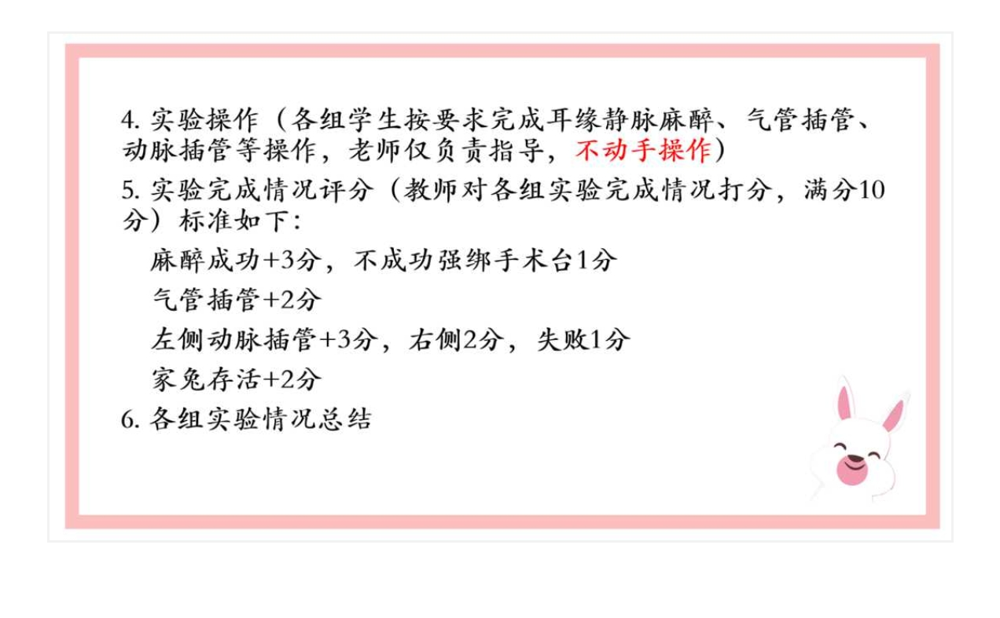

# 第1课 课程介绍与家兔操作练习 — 知识点总结（考试版）

> 课程：03 生理科学实验（医学机能学实验，Physiological Science Experiment）
> 授课时间：2026-09-08
> 内容：课程介绍、常用手术器械、家兔捉拿/麻醉/耳缘静脉注射/气管插管/颈总动脉插管操作、实验室规则与动物伦理
> 本学期内容：三大模块之**生理学部分**

---

## 一、课程定位与教师团队

### 1.1 课程三大组成部分

生理科学实验课（医学机能学实验）共包含三个模块：
- **生理学（Physiology）**部分——本学期所学；
- **病理生理学（Pathophysiology，病生学）**部分；
- **药理学（Pharmacology）**部分。

> 本学期所有实验均为**生理学部分**内容。

### 1.2 任课教师团队
- 主讲教师：生理教育部教师；
- 其他教师：林春燕老师、刘涛老师、陈老师、黄明芳老师；
- 另有技术老师负责实验技术支持。

### 1.3 课程性质
- 生理学是一门**实验性非常强**的学科；
- 教材中所有结论、知识点（如血压影响因素、呼吸调节因素及呼吸频率/深度变化等），**均来自动物实验和人体实验**；
- 生理学一直在更新改革：早期因实验技术条件限制，部分结论不准确；技术进步后知识随之修正跟进。

---

## 二、实验教学目的与目标

### 2.1 两大目的
1. **验证理论**：回到实验课堂，用动物实验验证教科书中的经典理论知识。例如：血压的生理影响因素；呼吸的调节因素及该因素增强时呼吸频率是增快还是减弱；心输出量、动脉血压测定、神经兴奋性、呼吸频率与深度变化等。
2. **培养动手能力**：临床医学学生必须以动手实验为基础。

### 2.2 教学目标
- 掌握**常规的、正确的**实验操作方法（"装、拿、夹、固"）；
- 掌握**生物信号采集系统（BL-420/放大器，Biological Signal Acquisition System）**的使用：肉眼无法直接观察血压升降等生物信号，该仪器将**生物信号转换为计算机可识别的电信号**，通过屏幕曲线的高低判断血压等指标；
- 结合理论知识分析实验结果，巩固理论。

---

## 三、授课形式与考核方法

### 3.1 授课形式（课前—课中—课后）

| 阶段 | 要求 |
|------|------|
| 课前 | 完成学习通章节预习视频；不是看一遍即可，要**看到关掉视频后仍能复述第一步、第二步、第三步做什么**的程度 |
| 课前 | 上课前**提前半小时**在学习通发放**预习检测**，检测预习效果 |
| 课中 | 可提问、师生互动；大部分时间由学生动手实验，教师按需指导 |
| 课后 | 完成实验卫生要求、撰写实验报告；可在线答疑 |

> 【考点】老师特别强调："看一遍记不住；若不预习，课堂上老师再放一遍既浪费操作时间，又完不成实验（实验时间较长）。"后台会记录倍速播放（1.5倍、2.5倍）、拖动进度条、观看次数。

### 3.2 成绩构成
- **最终成绩 = 平时成绩（50%）+ 考核成绩（50%）**；
- 考核在**大三第一学期**进行，考核内容为**操作**；
- 本学期只能在学习通看到"生理学部分平时成绩"，最终总成绩要到大三才公布。

#### 平时成绩构成
1. 章节预习（有分，后台记录观看行为）；
2. 预习检测完成情况（有分）；
3. 师生互动：课堂回答问题好者平时分**加1分**；
4. **完成实验 + 实验报告**：占平时分近一半（满分约8–10分），**以组为单位评分**，组内同学分数相同；
5. 课堂纪律：保持安静、注意安全；
6. 实验卫生：未达标将扣分。

---

## 四、实验卫生、动物伦理与垃圾处理

### 4.1 动物伦理与家兔处死
- **处死首选：耳缘静脉空气栓塞法（Air embolism）**——向耳缘静脉持续推注空气，致空气栓塞死亡；打一管不够可继续打；
- 次选（实在打不进去时）：夹闭气管窒息法（老师认为较残忍，尽量不用）；
- 体现动物伦理：尽量减少动物痛苦。

### 4.2 垃圾分类（必须严格遵守）

| 物品 | 投放位置 |
|------|----------|
| 家兔尸体 | **黄色专用尸体袋**（只装尸体，禁止装兔毛、口罩、垃圾等） |
| 一次性手术刀片、堵塞的头皮针（耳缘静脉用）、破损玻璃仪器 | **黄色利器盒**（水池边） |
| 注射器、夹子、动脉插管等可重复使用器材 | **不可丢弃**，清洗后按原位晾挂摆放 |
| 口罩、手套等一次性用品 | **黑色垃圾袋**（教室后方） |
| 兔毛、粪便等水池堵塞物 | 值日同学夹起后放入黑色垃圾袋 |

### 4.3 值日与安全
- 黄色尸体袋由值日同学送到**尸体回收站**（快递站附近）；
- 黑色垃圾袋由值日同学扔到**货梯旁大垃圾桶**；
- **男生负责**清洗兔笼粪便后还回动物中心；
- 被动物抓伤：后方药箱备有**碘伏、创可贴**，用于消毒止血；
- 实验台由各组自行擦净，仪器洗净晾好。

### 4.4 实验报告要求
- **电子版**：下节课开始有实验作业，老师发放后 **24小时内** 完成；
- **纸质版**：期末结束所有实验后统一上交；作业本4元/本，由学委找老师购买；
- 本课为操作练习，**无实验报告**。

---

## 五、常用手术器械识别与使用（易混辨析表）

| 器械 | 英文 | 用途 | 正确用法/持法 |
|------|------|------|---------------|
| 手术刀 | Scalpel | 切开皮肤、肌肉层（**只切到肌肉层为止**） | 切皮后即停用，深层禁用 |
| **组织剪** | Tissue scissors ( Mayo ) | 剪皮下组织、肌肉等较坚韧组织 | 钝头、较粗大；**逆着毛**剪毛 |
| **眼科剪** | Eye scissors ( Iris scissors ) | 只用于**神经、血管、气管**等柔软组织 | 细小、尖头，分直/弯；弯剪用于精细分离 |
| **组织镊** | Tissue forceps | 夹持较坚韧组织、皮肤 | 有齿，夹持力强 |
| **眼科镊** | Eye forceps | 提起神经、血管等脆弱组织 | 细尖、无齿，不可夹粗组织 |
| **止血钳/血管钳** | Hemostat ( Forceps ) | **钝性分离**肌肉、止血、夹持 | 弯/直两种；分离时靠其开合撑开组织，而非剪切 |
| **动脉夹** | Artery clip / Bulldog clamp | 夹闭颈总动脉**近心端**止血 | 轻夹，勿用力过大损伤血管 |
| 注射器 | Syringe | 耳缘静脉注射麻醉药/药液 | 选合适针头，排气泡 |
| 头皮针 | Scalp vein needle | 耳缘静脉注射常用 | 连接注射器软管，便于固定 |

【考点】老师反复强调器械选择：**切到肌肉层后必须改用血管钳做钝性分离，禁止用手术刀或组织剪直接切割深层组织**。原因：颈部血管丰富、走向不明，直接切割易伤及肌肉深部血管，导致持续出血，家兔可能在实验未完成时死亡。

---

## 六、家兔操作四大模块（本次重点）

> 流程总览：**捉拿称重 → 麻醉与固定 → 耳缘静脉注射 → 气管插管 → 颈总动脉插管**。

### 6.1 捉拿与称重
- **捉拿手法**：一手抓紧家兔**颈部皮肤**（不要捏气管），另一手**托住臀部**；
- **禁止拎耳朵**：动物全部重量系在耳朵上会非常疼痛，导致拼命挣扎、易划伤操作者；且兔子惊恐后耳缘静脉注射难以配合；
- **称重目的**：根据体重计算**麻醉药用量**。

### 6.2 麻醉（关键参数必背）

| 项目 | 内容 |
|------|------|
| **麻醉药** | **乌拉坦（urethane，氨基甲酸乙酯 ethyl carbamate）** |
| **配制浓度** | **20%**（即 20 g/100 mL） |
| **剂量** | **1 g/kg 体重**；换算为 20% 溶液即 **5 mL/kg** |
| **给药途径** | **耳缘静脉** |

【考点·高频警示】老师强调：桌面上同时有**肝素钠（Heparin，抗凝剂）**和**生理盐水**，**千万不要与乌拉坦混淆**！往届曾有学生知道用乌拉坦，却误把肝素钠推入，结果兔子"肚子还红波乱跳"（麻醉始终未生效）。

**给药速度（必背）**：
- 前 **1/3** 推注可稍快——目的是让家兔**快速镇静**下来；
- 后 **2/3** 必须**边打边观察**，不能一次性推完（个别体质差者快速推注可致呼吸抑制、窒息死亡）。

**麻醉深度判断指标（三看）**：
1. **角膜反射（corneal reflex）**：用手轻触眼睑，不再眨眼反射消失；
2. **夹捏反射/疼痛反射**：夹捏肢体皮肤/夹捏耳根，无明显反应；
3. **肌张力与呼吸**：家兔已无力站起、全身趴伏于手术台，呼吸平稳。

> 【考点】老师提醒：**不要追求"一动不动"**——一动不动说明已经死了；达到"不怎么挣扎"即可。

#### 为什么选乌拉坦？（机制理解）
乌拉坦（氨基甲酸乙酯）对中枢神经系统产生温和而持久的抑制，麻醉平稳、动物苏醒后一般无明显毒性反应，特别适合需要**数小时持续观察血压、呼吸变化**的急性在体实验；其缺点是过量可抑制呼吸中枢、降低体温，故必须严格按体重计算剂量、慢速给药。临床/教学中与之对比：**戊巴比妥钠**起效快但抑制深、易致低血压，**乙醚**吸入麻醉苏醒快但刺激呼吸道、易燃易爆；本课程统一使用乌拉坦，剂量固定为 20% 溶液 1 g/kg，务必背熟并在每次实验前按实际体重换算（如 2 kg 家兔 → 20% 溶液 10 mL）。

#### 为什么"前快后慢"？
前 1/3 快速推注可使血药浓度迅速跨过麻醉阈值，让家兔由躁动迅速转入镇静，减少挣扎、便于保定；若全程匀速，家兔会在长时间疼痛挣扎中耗氧、挣扎也增加心脏负担。后 2/3 慢速则是因为接近麻醉阈值后，单位时间进入的药量即可显著加深抑制，此时边推边看，一旦出现呼吸变浅、瞳孔散大、黏膜发绀应立即停止给药，必要时人工辅助呼吸。这一"先快后慢"原则与临床静脉全麻给药逻辑一致，是机能实验的通用经验。

### 6.3 固定
- 待家兔麻醉倒后，用**兔台（手术台）**固定；
- 绑四肢：用绑带在**关节处**打结固定（折一半、撑开），**不要绑在腹掌/脚掌处**（易滑脱）；绑带不要过松；
- **头部必须摆正、四肢绑紧后再剪毛、切开**——头部偏斜会导致切口偏斜。

### 6.4 耳缘静脉注射
#### 6.4.1 找静脉
- 耳缘静脉（marginal ear vein）位于**耳背部**：
  - **边缘一侧**耳郭**薄、毛稀**，隐约可见血管——此为注射侧；
  - 另一侧耳郭**厚、毛密**，看不到血管——非注射侧；
  - 可用手触摸辅助判断厚薄。

#### 6.4.2 注射前准备（四步）
1. **拔毛**：①暴露血管；②拔毛刺激血管，使其进一步扩张充盈；
2. **轻拍**耳郭，刺激血管扩张；
3. **夹住近心端**：使耳缘静脉回流受阻、血管充盈浮起（类似人静脉扎止血带）；
4. 待血管充分充盈后再进针，不可急于进针。

#### 6.4.3 进针手法
- 将耳朵**拉直**后进针（不可弯着耳朵进针）；
- 角度：开始略斜，随后**平行于血管**进针；
- 推药：**捏着已进入血管的针头**推药；
- 若阻力很大推不动：说明针已堵塞或刺到血管壁，**不可猛推**，应拔出重新进针。

#### 6.4.4 进针位置
- **第一针从远心端开始**；
- 原因：第一次进针失败可向近心端方向再扎第二针、第三针，为后续尝试留出余地，也给老师协助留出可扎距离；
- **禁止猛推**：猛推会使双耳肿胀如"猪头"，再也无法注射。

#### 6.4.5 家兔保定（固定）要领
- **严禁掐脖子**：往年有学生几人按压家兔颈部致其窒息死亡，尚未注射就已死亡；
- 推荐方法：①先用手**捂住家兔眼睛**（看不见则不那么害怕）；②一手固定头部（防止头部甩动带动耳朵），由**臂力较大的男生**完成最佳；③同侧手臂夹住家兔身体；④另由1–2名同学按压后半身；
- 原则：按住即可，**不要按死、不要掐死**。

### 6.5 气管插管（Tracheal intubation）
#### 6.5.1 颈部切开
- 先**用手摸准气管位置**（家兔气管很明显）；
- 头部摆正、四肢绑紧后再剪毛、切开；
- **第一刀必须下在气管正中间**。

#### 6.5.2 组织分离
| 器械 | 用途 |
|------|------|
| 手术刀 | 切开皮肤、肌肉层（到肌肉层为止） |
| **血管钳（弯/直）** | **钝性分离**肌肉 |
| 眼科镊 | 提起组织 |
| 眼科剪（小弯剪） | 只用于神经、血管等柔软组织；**逆着毛**剪 |

#### 6.5.3 气管切口位置
- 在**第3、4气管软骨环**之间做切口（可自上而下数环辨认）；
- 必须切在**软骨环**上，而非**环间膜**：切环间易造成**内膜出血**，血液流入气管并堵塞导管。

#### 6.5.4 气管堵塞的应急处理
- 表现：插管处冒血泡（"滋滋"声）、家兔挣扎、**嘴唇发紫（缺氧）**；
- 处理：立即拔出气管插管，将家兔臀部一端**抬高**，吸出气管内血液，处理后再插回。

### 6.6 颈总动脉插管（三个操作中最难）
#### 6.6.1 找颈总动脉（三步要领：分、拉、看）
- **分**：将气管旁的肌肉分开；
- **拉**：用器械将组织拉出——可见**颈总动脉与迷走神经伴行**（颈总动脉不在皮下，而在气管旁肌肉深处）；
- **看**：辨认伴行的动脉与神经，游离出颈总动脉；
- 本实验取**左侧颈总动脉**。

#### 6.6.2 穿线与夹闭
- 游离后穿**两根丝线**：
  - **远心端**结扎（扎紧）；
  - **近心端**的线**不结扎**，留作备用；
- 用**动脉夹**夹闭**近心端**。

#### 6.6.3 剪口与插管
- 剪口位置：**靠近远心端**剪一小斜口；
- **不可太靠近心端剪**——否则插入后无结扎固定位置，会出血；
- 手法：①一手提起远心端结扎线；②另一手指腹轻轻垫在血管下辅助；③带着**旋转**将插管**斜面向下**插入；
- **为什么斜面向下**：血管被剪开后切口边缘会微微翘起；若斜面向上，翘起的血管壁会阻碍插管；斜面向下则可顺利滑入；
- 血管张力强、有回缩力，需**带旋转对抗阻力**送入。

---

### 6.7 常见错误与纠正（操作考核高频失分点）

| 常见错误 | 后果 | 正确做法 |
|----------|------|----------|
| 拎耳或掐脖保定 | 兔剧痛挣扎、窒息死亡 | 抓紧颈皮+托臀/捂眼保定，不掐脖 |
| 误把肝素钠当麻醉药 | 家兔不麻醉、无法继续 | 三核对：药名、浓度、剂量 |
| 一次推完全量乌拉坦 | 呼吸抑制、家兔死亡 | 前1/3快、后2/3慢，边推边看 |
| 第一针打在近心端 | 后续无法再扎 | 从远心端开始，留余地 |
| 猛推致双耳肿胀 | 血管塌陷、再也打不进 | 阻力大即拔针重进，不猛推 |
| 深层用刀剪直切 | 误伤颈部血管、失血 | 切肌肉层后改用血管钳钝性分离 |
| 气管切在环间膜 | 内膜出血、堵管 | 切第3、4软骨环上 |
| 动脉剪口靠近心端 | 无处结扎、出血 | 靠远心端剪口 |
| 动脉插管斜面向上 | 翘起血管壁阻挡、插不进 | 斜面向下、带旋转送入 |

> 操作考核评分逻辑与上表一致：麻醉、气管插管、动脉插管、家兔存活四项分别计分，任一步骤失误都会连锁影响后续分数。本组应**分工明确**——一人保定、一人注射、一人记录时间与反应，互相提醒，避免单人忙中出错。

---

## 七、实验操作评分标准（老师课件原文）

> 上图为老师课件所示本次（及同类家兔手术）操作评分标准，教师对各组实验完成情况打分，**满分10分**：
> - **麻醉成功 +3分**（不成功、强绑手术台只计1分）；
> - **气管插管 +2分**；
> - **左侧动脉插管 +3分，右侧 +2分，失败 +1分**；
> - **家兔存活 +2分**。
>
> 老师仅负责指导、**不动手操作**；各组学生须按要求独立完成耳缘静脉麻醉、气管插管、动脉插管等操作。

---

## 八、易混概念对比（考试常考）

### 8.1 急性实验 vs 慢性实验

| 比较项 | 急性实验（Acute experiment） | 慢性实验（Chronic experiment） |
|--------|-------------------------------|-------------------------------|
| 动物状态 | 麻醉下在体/离体，手术一次完成 | 手术后恢复、清醒后长期观察 |
| 持续时间 | 数小时内完成 | 数天、数周甚至更久 |
| 优点 | 条件可控、即时观察、重复性好 | 接近自然生理状态、可作长期动态观察 |
| 缺点 | 麻醉/手术创伤干扰大 | 周期长、影响因素多、饲养要求高 |
| 本课程 | 家兔血压、呼吸实验属**急性在体实验** | — |

### 8.2 在体实验 vs 离体实验

| 比较项 | 在体实验（In vivo） | 离体实验（In vitro） |
|--------|----------------------|----------------------|
| 定义 | 麻醉动物体内，保持完整机体联系 | 取出器官/组织/细胞，在人工条件下观察 |
| 本课程例子 | 家兔颈总动脉插管测血压 | 离体肠管、离体蛙心灌流 |
| 优点 | 完整神经体液调节，贴近整体 | 条件单纯、易控制单一变量 |
| 缺点 | 干扰因素多 | 脱离整体，结果有局限性 |

### 8.3 组织剪 vs 眼科剪 / 组织镊 vs 眼科镊

| 器械 | 大小/头型 | 适用组织 |
|------|-----------|----------|
| 组织剪 | 大、钝头 | 皮肤、肌肉等坚韧组织 |
| 眼科剪 | 细小、尖/弯 | 神经、血管、气管等柔软组织 |
| 组织镊 | 有齿、粗 | 夹持坚韧组织 |
| 眼科镊 | 无齿、细尖 | 提起脆弱组织 |

### 8.4 乌拉坦（麻醉）vs 肝素钠（抗凝）vs 生理盐水

| 试剂 | 作用 | 误注后果 |
|------|------|----------|
| **乌拉坦（20%）** | 全身麻醉 | ——正确使用 |
| **肝素钠** | 抗凝（防凝血） | 误当麻醉药注入 → 兔子不麻醉、"肚子红波乱跳" |
| **生理盐水** | 补液/稀释 | 误注 → 同样无麻醉效果 |

---

## 九、学习与操作要求总结

- 提前通过学习通视频熟悉步骤和操作要领；复习相关理论；**预测实验结果**——经典实验一定可重复，结果必在一定范围内（如预期血压升高却测得降低，说明操作有误）；
- 课堂保持安静、注意安全（防止兔子跑掉、被针扎或被兔抓伤）；
- 操作原则：动作轻柔、止血彻底、按规范使用器械、爱护实验动物；
- 做完实验完成实验报告，结果分析整理后上交。

### 动物伦理的延伸思考

机能实验课与医学伦理学课程在"善待实验动物"这一点上是相通的。国际上通行"**3R原则**"——**替代（Replacement）**尽可能用非生命材料替代活体动物、**减少（Reduction）**在保证实验数据有效的前提下减少使用数量、**优化（Refinement）**改进操作与麻醉以减轻动物痛苦。本课要求"动作轻柔、麻醉适度、操作迅速、处死人道"，正是3R原则在本科教学中的具体落实。同学们在练习中既要追求技术熟练，也要建立对生命的敬畏心：每一只实验兔都为医学知识的传承付出了代价，规范操作本身就是对动物最大的尊重。

---

## 十、本课高频考点速查

| 考点 | 答案 |
|------|------|
| 麻醉药 | 乌拉坦（urethane，氨基甲酸乙酯） |
| 浓度 / 剂量 | 20% ；1 g/kg = 5 mL/kg |
| 给药途径 | 耳缘静脉 |
| 推药节奏 | 前1/3稍快（快速镇静），后2/3边打边观察 |
| 麻醉判断 | 角膜反射消失、夹捏反射消失、全身趴伏 |
| 进针点 | 耳缘静脉**远心端**开始 |
| 近心端处理 | 夹闭使血管充盈 |
| 钝性分离器械 | 血管钳（止血钳），禁刀剪直切深层 |
| 气管切口 | 第3、4软骨环上（非环间膜） |
| 动脉插管 | 左颈总动脉；远心端结扎、近心端动脉夹；斜面向下旋转插入 |
| 处死方法 | 耳缘静脉空气栓塞 |
| 评分 | 麻醉+3、气管插管+2、左动脉+3/右+2/失败+1、家兔存活+2，满分10 |
