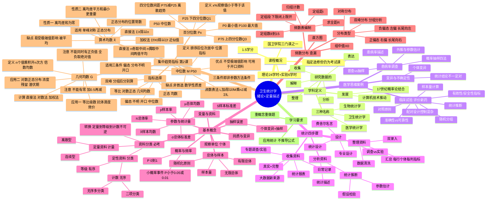

# 04 卫生统计学 — 知识框架与思维导图

## 一、Mermaid 思维导图

---

## 二、层级列表版

### 1. 课程概况
- 1.5学分；理论24 + 实验6学时
- 指定选修，仍为考试课
- 国卫学院三门课：卫生统计学、预防医学、循证医学

### 2. 学科定义与发展
- 统计学：数据的收集、整理、分析、解释、表达
- 发展：17世纪概率论结合 + 计算机技术推动
- 医学/卫生/生物统计学原理相同，应用场景不同

### 3. 统计学思维
- 临床试验：对照、随机分组、配对、样本量计算、指标选择、准确性/可靠性、统计推断
- 患病率调查：普查 vs 抽样；概率抽样四法（简单随机、分层、系统、整群）；患病率描述；外推
- 变异：个体差异是统计学存在的前提；统计结论仅供参考

### 4. 统计工作四步骤
1. **设计**（先导）：专业设计 + 统计设计；调查 vs 实验
2. **收集资料**：统计报表、日常记录、专题设计；大数据；真实、完整
3. **整理资料**：双录入、数据清洗、汇总
4. **分析资料**：统计描述 + 统计推断（参数估计、假设检验）

### 5. 基本概念（重点）
- 观察单位（个体）
- 同质与变异
- 总体（有限/无限）与样本（随机、有代表性）
- 参数（总体、未知、希腊字母）vs 统计量（样本、已知、拉丁字母）
- 变量与资料
- **资料三分类（必考）**：
  - 定量（计量/数值变量）：连续型、离散型
  - 计数（无序分类）：二项、无序多分类
  - 等级（有序分类）：有顺序
  - 转换方向：定量→等级→计数，不可逆
- 抽样误差：个体变异 + 随机抽样
- 概率（0~1）、频率（估计概率）、小概率事件（P<0.05/0.01）

### 6. 学习要求
- 应用统计，重方法使用场合与概念理解；
- 多做题；
- 基本概念融入小题或大题小问考查。

### 7. 频数分布（第1课查漏）
- 频数表编制：求全距R → 定组数（8~15）→ 定组距i → 定组段（下限闭上限开）→ 归组计数；
- 组中值 X₀ =（下限+相邻较大组下限）/2；
- 直方图：连续型资料，直方面积表频数，无间隔；
- 分布类型：对称分布、正偏态（右偏，长尾向右）、负偏态（左偏，长尾向左）、双峰分布（分组分析）。

### 8. 集中趋势指标（第2课·重点）
#### 8.1 算术均数（X̄）
- 计算：直接法 ΣX/n；加权法 ΣfX₀/Σf（近似值，差0点几正常）；
- 性质一：Σ(x−X̄)=0（正负抵消）；
- 性质二：Σ(x−X̄)² ≤ Σ(x−A)²（离均差平方和最小，更重要，关联最小二乘法/回归）；
- 适用：单峰对称/正态分布；双峰分布应分组分析；
- 缺点：易受极端值影响（"被平均"）；
- 正态分布的位置常数（峰的位置=均数）。

#### 8.2 几何均数（G）
- 定义：n个观测值乘积开n次方，又称倍数均数；
- 计算：直接法、对数法（取对数→求均数→反对数）、加权法；
- 应用：①等比级数（抗体滴度/效价——看到直接选G）；②对数正态分布（有害物质浓度、农药残留、传染病潜伏期）；
- 注意：①不能有零（加0.5算完再减）；②不能同时有正负值（全负先取绝对值算完加负号）。

#### 8.3 中位数（M = P₅₀）
- 定义：排序后位次居中的值，位置指标，不是算出来的；
- 计算：直接法（n奇取中间，n偶取中间两值平均）；频数表法 M = L + (i/f_M)(n/2 − Σf_L)；
- 优点：不受极端值影响，可用于开口资料；
- 缺点：非首选（数学性质较差，难以开发统计方法）；
- 适用三条件（=非参数方法条件）：①偏态分布；②分布类型不明；③开口资料。

#### 8.4 百分位数（Pₓ）
- 定义：x%的观察值≤该值；
- 特殊值：P₅₀=中位数，P₂₅=下四分位数(Q₁)，P₇₅=上四分位数(Q₃)，P₀=最小值，P₁₀₀=最大值；
- 四分位数：P₂₅、P₅₀、P₇₅三个数合称；
- 四分位数间距 = P₇₅ − P₂₅（描述偏态资料离散趋势，下节课内容）。

#### 8.5 指标选择总结
| 分布类型 | 首选指标 |
|----------|----------|
| 正态/近似正态 | 算术均数 |
| 等比级数/对数正态 | 几何均数 |
| 偏态/分布不明/开口 | 中位数 |
| 双峰 | 分组后分别计算 |
