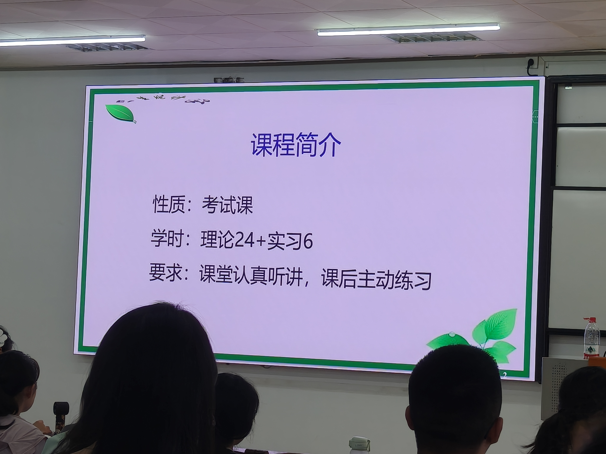

# 第1课：课程导论与基本概念 — 知识点总结（期末考试扩写版）

> 科目：卫生统计学（Health Statistics）
> 上课日期：2026-09-09（周三，第1次理论课）
> 性质：考试课（虽为指定选修，但按考试课要求）；学分1.5；理论24学时 + 实习6学时（两次）。
> 说明：本课为统计学入门，核心是**基本概念、统计思维、资料类型**。考试会把这些概念融进小题直接考，或在大题里作为小问考查。

---

## 一、什么是统计学

### 1.1 定义【考点】

**统计学（statistics）** 是研究数据的收集、整理、分析、解释和表达的科学。老师原话："统计学就是跟数据打交道——数据的收集、整理、分析、解释和表达；重点在于如何分析、解释和表达。"

- **卫生统计学（Health statistics）**：公共卫生学院开设，覆盖临床与公共卫生问题的统计学。
- **医学统计学（Medical statistics）**：临床医学院校开设，针对医学问题。
- **生物统计学（Biostatistics）**：用于生物学研究；国外所说的 biostatistics 大致相当于国内的医学统计学。

【学习定位】老师强调："这不是数学课，是应用统计——掌握方法怎么用、用在什么场合就行；公式推导不要花时间，重点理解概念，多做题。"

### 1.2 统计学与概率论的关系

现代统计学以**概率论（probability theory）**为理论基础。描述一个随机现象发生可能性的大小用概率 P 表示。大数据时代（手环、电子病历等）数据来源更广泛，但"数据量大"不等于"分析就自动正确"，统计思维依然不可或缺。

---

## 二、统计工作的基本步骤【考点】

统计工作分为**四个步骤**，环环相扣，设计先行：

| 步骤 | 内容 | 关键点 |
|------|------|--------|
| **① 设计（design）** | 专业设计 + 统计设计 | **是先导**，最重要 |
| **② 收集资料（collection）** | 取得真实、完整的原始数据 | 数据要真实、完整 |
| **③ 整理资料（sorting）** | 录入、核查、汇总 | 双录入交叉核查、数据清洗 |
| **④ 分析资料（analysis）** | 统计描述 + 统计推断 | 描述规律、推断总体 |

老师引用费舍尔（Fisher）的名言："做完实验再找统计学家，无异于请他做尸体解剖。"——强调**设计必须在实验开始之前**就做好。

- **收集资料**：来源包括统计报表（卫生年鉴）、日常工作记录、专项调查/实验。老师强调："资料收集要真实、完整。数据失去真实性，再高级的统计方法也只能搞出错误结果。"
- **整理资料**：包括①录入（提倡**双录入**交叉核查）、②核查（**数据清洗/数据筛选**，纠正错误）、③汇总（原则：**每行一个观察对象，每列一个指标**）。
- **分析资料**：
  - **统计描述**：用统计指标、统计表/图概括资料的数量特征和分布规律；
  - **统计推断**：用样本信息推断总体，包括**参数估计**和**假设检验**。

---

## 三、统计思维：为什么必须讲对照、随机、样本量

### 3.1 对照原则【考点】

老师举例："一组病人用药血压下降就说药有效，这个结论不严谨，很难推广……要找多一组平行对照，假定两组各方面条件一致，血压差异就反映药物差异。"这就是预防医学里反复强调的**对照原则**，从卫生统计学讲到预防医学、循证医学都会一直讲。

### 3.2 样本量（sample size）【考点】

- "人太少结果波动性很大，很多统计规律也看不出来；人太多经费不够、管理困难——要用样本量计算找到最小需求。"
- **反面案例**："12例病人中1例压疮，就说压疮发生率8.33%——样本量太少，结果不可信；下次12例0例就变0了。"

### 3.3 随机分组与混杂因素【考点】

- **错误示范**："按周一到周三入院分对照组、周四周五分新药组——老教授坐诊收疑难重症、年轻医生收轻症，会显得新药效果更好，因为没有控制混杂因素。"
- **正确做法：随机分组（random allocation）**，使每个研究对象被分到各组的机会均等，平衡已知和未知的混杂因素。
- **配对设计（paired design）**："实验组找一个40岁男性轻症，对照组也找40岁左右男性轻症——把年龄、性别、病情严重程度这些混杂因素控制住。"
- **混杂因素（confounding factor）**：干扰因果推断的外部因素（如上述的医生资历、病情轻重）。

### 3.4 准确性与可靠性【考点·易混】

| 概念 | 英文 | 含义 |
|------|------|------|
| **准确性（真实性）** | validity / accuracy | 测出来的值**接近真实值**的程度 |
| **可靠性（重复性/精密度）** | reliability / precision | **重复测量结果波动小**的程度 |

老师原话："准确性是测出来的值接近真实值；可靠性是重复测量结果波动小。又不准又不可靠的仪器只能换新的。"

---

## 四、几个核心概念

### 4.1 总体与样本【考点·易混】

- **总体（population）**：根据**研究目的**确定的、同质的所有观察单位某种变量值的集合。
  - **有限总体**：有明确时间、空间范围（如某年某医院的全部住院病人）；
  - **无限总体**：无时空限制，是抽象总体。
- **样本（sample）**：从总体中**随机抽取**的、有代表性的一部分观察单位。
- **样本量（sample size）**：样本中观察单位的个数。
- **观察单位（个体，observation unit/individual）**：研究目的所界定的观察对象（一个人、一只鼠、一个样品）。
- **抽样必须遵循随机化原则**：每个个体被抽中的机会均等，没有偏性。

【易混辨析】总体 vs 样本：

| 对比项 | 总体 | 样本 |
|--------|------|------|
| 定义 | 研究目的确定的全体 | 从总体随机抽取的部分 |
| 范围 | 有限或无限 | 总体的子集 |
| 研究方式 | 普查 | 抽样研究 |
| 特点 | 通常不易直接获得 | 必须有代表性、随机抽取 |

### 4.2 同质与变异

- **同质（homogeneity）**：观察对象具有的相同特征（如研究某地成年男子身高，"该地、成年、男性"就是同质基础）。
- **变异（variation）**：在同质基础上，个体之间的差异（并非"突变"）。变异是统计的前提——没有变异就不需要统计学。

### 4.3 参数与统计量【考点·符号不能乱】

| 概念 | 英文 | 反映 | 已知/未知 | 符号 |
|------|------|------|-----------|------|
| **参数（parameter）** | parameter | **总体**特征 | 通常**未知** | **希腊字母** |
| **统计量（statistic）** | statistic | **样本**特征 | 由样本算出、**已知** | **拉丁字母** |

具体对应（必背）：

| 指标 | 总体参数 | 样本统计量 |
|------|----------|------------|
| 均数 | **μ**（mu） | **X̄**（x-bar） |
| 标准差 | **σ**（sigma） | **S** |
| 率 | **π**（pi） | **p** |

老师原话："参数反映总体特征，一般未知，用希腊字母；统计量反映样本特征，用拉丁字母——符号严格规定不能乱用。"

【易混辨析】参数 vs 统计量：参数是总体的、未知的、希腊字母；统计量是样本的、已知的、拉丁字母。

### 4.4 抽样误差【考点】

- **抽样误差（sampling error）**：由**随机抽样**造成的样本统计量与总体参数之间、以及各样本统计量之间的差异。
- **根本原因**：**个体变异 + 抽样**。只要是随机抽样，抽样误差就不可避免，但它有规律、可以估计（如用标准误衡量）。

### 4.5 概率与小概率事件【考点】

- **概率（probability, P）**：随机事件发生可能性大小的度量，取值 **0~1**。P=0 是不可能事件，P=1 是必然事件。
- **频率（frequency）**：n 次重复实验中某事件发生 m 次，m/n 即频率；当实验次数足够大时，频率可用来估计概率。
- **小概率事件（rare event）**：发生概率 **小于 0.05 或 0.01** 的事件。
- **小概率原理**：小概率事件在**一次实验中基本不会发生**。这是统计推断（假设检验）的逻辑基础——结合反证法：如果在某假设下出现了小概率事件，就怀疑该假设不成立。

> 【数字标注】统计学中常用的显著性水平 **α = 0.05**（或 0.01），即当 P ≤ α 时认为差异有统计学意义。

---

## 五、资料类型（本章最重要、必考）【考点】

老师原话："这一页是我们这堂课最重要的，也是个重点、必考的内容——做统计工作第一步就是分清资料属于哪一类，否则后面统计方法选择会出错。"

### 5.1 三大资料类型总览

| 资料类型 | 又称 | 定义 | 举例 | 有无单位 |
|----------|------|------|------|----------|
| **计量资料（定量资料/数值变量资料）** | quantitative / measurement / numerical variable | 用仪器、工具测量，数值大小有**数量意义** | 身高、体重、血压、血红蛋白 | **有单位** |
| **计数资料（无序分类资料）** | counting / unordered categorical | 清点互斥类别个数 | 男女、阴阳、血型、职业 | 无单位 |
| **等级资料（有序分类资料）** | ranked / ordinal | 类别之间有**程度顺序** | 疗效（治愈>好转>无效>死亡）、尿蛋白（-/+ /++ /+++） | 无单位 |

【易混】心理量表分数**没有单位但大小有意义，仍属定量（计量）资料**。

### 5.2 定量（计量）资料再分两类

- **连续型（continuous）**：可取任意值，如身高、体重（数轴上连续）。
- **离散型（discrete）**：只能取整数值，如就诊人数、住院天数。

### 5.3 计数（无序分类）资料再分两类

- **二项分类（binary）**：两类互斥，如男/女、阴/阳、有/无。
- **无序多分类（nominal）**：≥3类且无先后顺序，如血型（A/B/O/AB）、肤色、职业。

> 【易混陷阱】老师举例："管腔结构部位上、中、下只是不同位置，没有排序关系，是**无序多分类**，不是等级资料。"——判断关键看类别之间有没有"程度高低"的内在顺序。

### 5.4 资料类型的转换

- 资料只能**由精到粗**单向转换：**定量 → 等级 → 计数**。
- 反过来**不可逆**（不能把计数还原成精确的定量）。
- 即使把等级资料数量化赋值（如治愈=4、好转=3…），它**仍不等同于定量资料**，统计方法不能混用。

### 5.5 资料类型判别对比表【易混辨析】

| 对比项 | 计量资料 | 计数资料 | 等级资料 |
|--------|----------|----------|----------|
| 本质 | 测量数值 | 清点类别 | 有序类别 |
| 类别间有无顺序 | — | 无 | **有** |
| 有无单位 | 有 | 无 | 无 |
| 举例 | 身高175cm | 男/女各若干 | 痊愈/显效/好转 |
| 平均指标 | 均数 | 率/构成比 | 中位数/秩和 |

---

## 六、变量与数据

- **变量（variable）**：观察单位的某项特征/属性（如性别、身高、血型）。
- **数据（data）**：变量值的集合。资料类型就是按变量取值的类型来分的。

---

## 七、常用抽样方法【教材补充】

抽样研究是从总体中抽取样本推断总体，抽样方法分概率抽样和非概率抽样两类：

| 方法 | 类型 | 做法 | 特点 |
|------|------|------|------|
| **简单随机抽样** | 概率抽样 | 每个个体被抽中机会均等（抽签、随机数字表） | 最基本，总体大时不便 |
| **系统抽样** | 概率抽样 | 按固定间隔（如每隔k个）抽取 | 简便，但有周期性误差风险 |
| **分层抽样** | 概率抽样 | 先按特征分层（如年龄），再层内抽样 | 误差小，代表性好 |
| **整群抽样** | 概率抽样 | 随机抽"群"（如整班），查群内全部 | 方便，但误差较大 |
| **便利抽样** | 非概率抽样 | 就近、方便选取（如门诊偶遇） | 代表性差，易偏倚 |

【易混辨析】普查（census）是调查总体中全部个体；抽样研究只查样本、用样本推断总体。调查某时点某病现患人数用**患病率（prevalence）**；追踪新发病人数用**发病率（incidence）**（后续预防医学讲）。

---

## 八、统计思维总结：三条主线

1. **变异是绝对的**：同质个体间总有变异，正是变异才需要用统计方法找规律。
2. **用样本推断总体**：通过随机抽样、计算统计量，去估计/检验未知的总体参数；抽样误差不可避免但可控。
3. **小概率原理做推断**：把"一次实验中基本不发生的小概率事件"当作反证，若真发生了就怀疑原假设——这就是假设检验的思想。

老师强调："这些基本概念考试会融进小题直接考，或在大题里作为小问考查。"务必把资料三类型、参数vs统计量、总体vs样本、概率与小概率事件这几组辨析记牢。

---

## 八补、频数分布与分布类型【第1课查漏·教材补充】

> **【查漏说明】** 本课因走错课室仅听了约25分钟B站网课，以下内容为第1课末尾或第2课开头应掌握的**频数分布表与分布类型**知识，是连接"基本概念"与"集中趋势指标"的桥梁。结合科学出版社《卫生统计学（案例版第2版）》第二章补充。

### 8补.1 频数分布表的编制【考点】

**频数分布表（frequency distribution table）**：将原始数据按组段分组后，清点各组段内观察值个数（频数 f）形成的表格。用于揭示数据的分布特征和分布类型。

**编制步骤**（以连续型定量资料为例）：

1. **求全距（range, R）**：R = 最大值 − 最小值，反映数据的总变异范围；
2. **定组数**：通常设 **8~15 个组段**。例数少（n<30）组数可少些，例数多组数可多些；组数过多或过少都不利于显示分布特征；
3. **定组距（class interval, i）**：i ≈ R/组数，常取整数便于分组。组距为相邻两组段下限值之差；
4. **定组段**：第一组段应包含最小值，最后一组段应包含最大值。组段写法为"下限~上限"，遵循**"下限闭、上限开"**原则（即包含下限，不包含上限，如"12~24"包含12但不包含24，24归入下一组）；
5. **归组计数**：统计每个组段内的观察值个数（频数 f），并计算累计频数和累计频率。

**组中值（class mid-value, X₀）**：每个组段的代表值，X₀ =（本组段下限 + 相邻较大组段下限）/ 2，近似等于（下限+上限）/2。组中值是加权法计算均数的关键。

### 8补.2 频数分布表的用途【考点】

1. **揭示频数分布的特征**：集中趋势（central tendency）和离散趋势（dispersion）；
2. **揭示频数分布的类型**：对称分布 vs 偏态分布（正偏态/负偏态）；
3. **便于发现极端值和可疑值**：远离主体的数据可能是录入错误或特殊个体；
4. **便于进一步计算统计指标和统计分析**：加权法计算均数、中位数等均基于频数表。

### 8补.3 频数分布图【教材补充】

- **直方图（histogram）**：以组段为横轴、频数（或频率）为纵轴，用直方面积表示各组段频数大小的图形。用于展示连续型定量资料的分布。
- 直方图与直条图（bar chart）的区别：直方图的直方面积表示频数，各直方之间**无间隔**（连续型资料）；直条图的直条高度表示数值，各直条之间**有间隔**（分类资料）。

### 8补.4 频数分布的类型【考点·必考·与第2课直接关联】

| 分布类型 | 特征 | 典型例子 | 集中趋势首选指标 |
|----------|------|----------|-----------------|
| **对称分布** | 以峰为中心左右两侧频数对称 | 身高、体重、血压、血红蛋白 | 算术均数 |
| **正偏态（右偏）** | 峰在左，长尾向右延伸，极端大值 | 收入、抗体滴度、有害物质浓度、潜伏期 | 中位数/几何均数 |
| **负偏态（左偏）** | 峰在右，长尾向左延伸，极端小值 | 考试高分扎堆、死亡率年龄分布 | 中位数 |
| **双峰分布** | 有两个峰，提示数据异质性 | 混合人群（如男女身高合并） | 分组后分别计算 |

**正偏态 vs 负偏态的判断**【易混】：
- 看**长尾**的方向：长尾向右 → 正偏态（右偏）；长尾向左 → 负偏态（左偏）；
- 看**峰值**位置：峰在左 → 正偏态；峰在右 → 负偏态；
- 老师课堂讨论："峰值在左就称为右偏态，峰值在右称为左偏态"——即偏态名称看的是**长尾方向**而非峰值位置。

> 【与第2课关联】第2课的食物中毒潜伏期例题正是**正偏态分布**——大部分人潜伏期短（峰在左），少数人潜伏期很长（长尾向右），因此不宜用均数，应用中位数。

### 8补.5 算术均数的直接法【第1课查漏】

第2课从加权法开始讲均数计算，直接法是基础：

**直接法（小样本）**：

$$\bar{X} = \frac{X_1 + X_2 + \cdots + X_n}{n} = \frac{\sum X_i}{n}$$

- 样本均数用 $\bar{X}$（x-bar）表示，总体均数用 $\mu$（mu）表示；
- 直接法用原始数据逐个相加，结果精确；
- 当 n 较大时，先编制频数表再用加权法（第2课内容）。

---

## 九、本课高频考点速记清单

1. 统计学定义：数据的**收集、整理、分析、解释、表达**，重点在分析与解释。
2. 统计工作四步：**设计→收集→整理→分析**；设计是先导（Fisher名言）。
3. 总体 vs 样本：总体据研究目的确定；样本须**随机抽取**有代表性。
4. 参数（总体、未知、希腊字母 μ/σ/π）vs 统计量（样本、已知、拉丁字母 X̄/S/p）。
5. 抽样误差：个体变异 + 抽样，不可避免但可估计。
6. 概率 P∈[0,1]；**小概率事件 P<0.05（或0.01）**，一次实验基本不发生；显著性水平 **α=0.05**。
7. 资料三类型：**计量（定量，有单位）/ 计数（无序分类）/ 等级（有序分类）**。
8. 资料只能定量→等级→计数由精到粗转换，**不可逆**。
9. 对照原则、随机分组、配对设计、控制混杂因素。
10. 准确性（接近真值）vs 可靠性（重复稳定）。
