# 第2课：均数性质与几何均数 — 知识点总结（期末考试扩写版）

> 科目：卫生统计学（Health Statistics）
> 上课日期：2026-09-11（周五，第2次理论课）
> 教材：科学出版社《卫生统计学（案例版第2版）》丁元林/王彤主编，ISBN 978-7-03-050816-4
> 说明：本课核心是**定量资料集中趋势的描述指标**——算术均数、几何均数、中位数及百分位数。考试重点在于**各指标的适用条件与选择判断**，计算题为辅。

---

## 一、频数表与加权法计算均数（承上启下）

### 1.1 频数表回顾【教材补充】

在第1课末尾或本课开头，老师回顾了**频数分布表（frequency distribution table）**的编制。频数表是将原始数据按组段分组后，清点各组段频数（f）形成的表格。编制步骤：

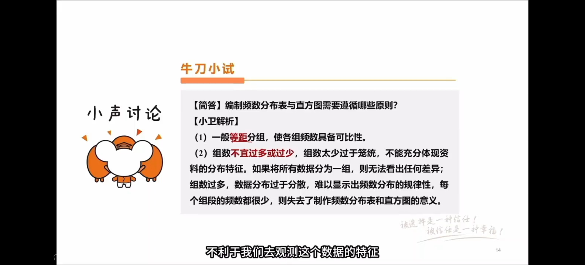

1. **求全距（range, R）**：R = 最大值 − 最小值；
2. **定组数**：通常 8~15 组，例数少则组数少，例数多则组数多；
3. **定组距（class interval, i）**：i ≈ R/组数，常取整数便于分组；
4. **定组段**：第一组段包含最小值，最后一组段包含最大值；组段写法为"下限~上限"，遵循"下限闭、上限开"原则（即含下限不含上限）；
5. **归组计数**：统计每个组段内的观察值个数（频数 f）。

**组中值（class mid-value, X₀）**：每个组段的代表值，X₀ =（组段下限 + 相邻较大组段下限）/ 2，近似等于（下限+上限）/2。

### 1.2 加权法计算均数【考点】

当观察值个数较多（已编制成频数表）时，用**加权法（weighted method）**计算均数：

$$\bar{X} = \frac{f_1 X_1 + f_2 X_2 + \cdots + f_k X_k}{f_1 + f_2 + \cdots + f_k} = \frac{\sum f X_0}{\sum f}$$

式中：
- $f$ 为各组段的频数（权数）；
- $X_0$ 为各组段的组中值；
- $\sum f = n$ 为总例数。

**权数 f 的意义**：老师原话——"加权法的这个权数呢，就是它对应的权数，为什么它是一个权数？因为我们在计算分子的时候，你的 f 越大的话，那它在这个分组里面的成分是不是就越大？所以呢它就起到一个加权的作用。"

**加权法结果为近似值**【考点·重要提醒】：老师原话——"我们加权法计算出来的均数，它往往是一个近似的值。所以你如果直接把算了，跟你的这个频数表算出来的不一样的话，那非常的正常。但是这种差异呢也就差个 0 点几。如果你发现差很多的话，应该能自己算错数了。"

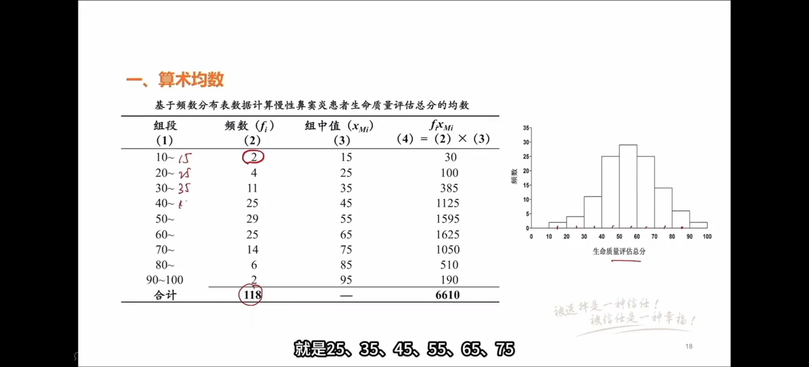

> 【易混辨析】直接法 vs 加权法：直接法用原始数据逐个相加除以 n，结果精确；加权法用组中值代替组内所有数据，结果为近似值。两者在数据量大时差异很小（0点几），差异大说明计算有误。

---

## 二、算术均数的两个重要性质【考点·必考】

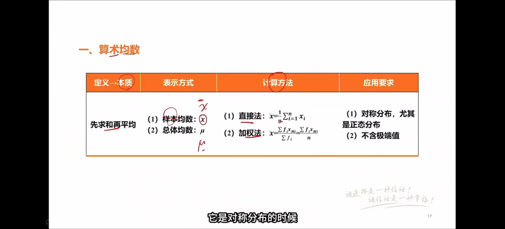

### 2.1 性质一：离均差之和等于零

$$\sum_{i=1}^{n} (x_i - \bar{X}) = 0$$

**原理**：每个观测值与均数的差（离均差），有正有负——大于均数的观测值离均差为正，小于均数的为负，等于均数的为零。正负相互抵消，总和恰好为零。

老师原话："离均差之和等于零，为什么会出现这种现象？其实就是因为每一个观测值和它的均数之间的差。有些人是大于零，有些人是小于零，有些人可能刚好等于零就死掉了，所以这个时候有正有负加起来就变成零。"

**意义**：这一性质说明均数是数据的"平衡点"——以均数为中心，两侧偏差等量抵消。

### 2.2 性质二：离均差平方和最小（更重要）

$$\sum_{i=1}^{n} (x_i - \bar{X})^2 \leq \sum_{i=1}^{n} (x_i - A)^2$$

其中 A 为任意常数。

**原理**：将离均差平方后，正负号消失，所有项均为非负值。可以证明（对 A 求导令其为零），当且仅当 A = X̄ 时，平方和取得最小值。

老师原话："这一个叫做离均差平方和，那这个离均差平方和它小于什么呢？小于我们把这个 X̄ 换成一个任意的 A，都比它要小。这个就是它第二个性质，这个性质更加重要。因为呢，我们后面讲到最小二乘法，也就是我们的回归的一个基本原理之后，其实跟它是有一定关系的。"

**与最小二乘法的关系**【教材补充·后续关联】：线性回归中，回归线的参数估计正是基于"使残差平方和最小"的原则（最小二乘法，least squares method）。均数的这一性质是最小二乘法的基础——均数可以看作是对数据的"零阶回归"（用一个常数拟合所有数据点，使平方误差最小）。

> 【考点对比】两个性质的区别：性质一是"和为零"（代数平衡），性质二是"平方和最小"（最优拟合）。性质二更重要，因为它直接关联后续的回归分析与方差分析。

---

## 三、均数的适用条件与缺点

### 3.1 均数的适用条件【考点·必考】

**均数适用于描述单峰对称分布，特别是正态分布或近似正态分布资料的集中趋势。**

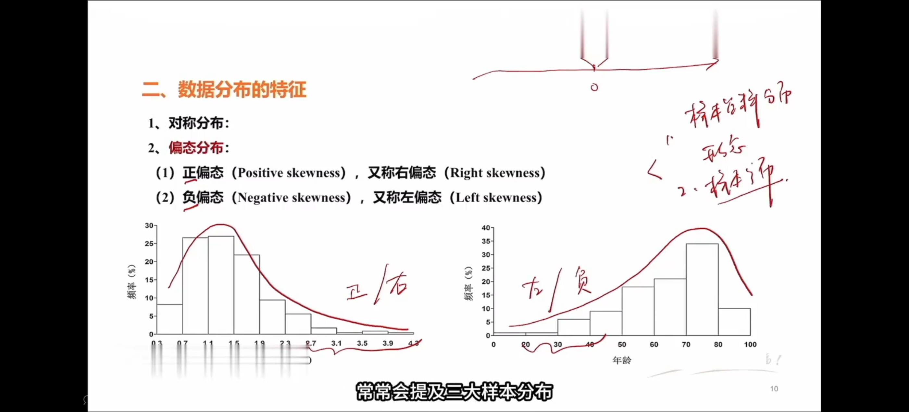

老师原话："首先大家知道均数它适用于描述我们单峰对称分布。什么是单峰对称分布呢？……只有一个峰，而且我们如果以这个峰画一条对称轴的话，两边的这个频数是不是对称的，这种就叫做单峰对称分布。"

**关键要点**：
1. **单峰（unimodal）**：分布只有一个高峰；
2. **对称（symmetric）**：以峰为中心，左右两侧频数分布对称；
3. **正态分布（normal distribution）**：是单峰对称分布的典型代表，呈钟形曲线，中间高、两边低、左右对称。

**双峰分布（bimodal distribution）的处理**：老师原话——"如果它不是对称分布，或者说它不止一个峰的话……叫做双峰分布。双峰分布的话，说明它的这个数据本身有异质性，最好把它们分成之后再分别的去分析，而不是用一个均数就去概括它。"

> 【考点】老师强调："尤其是这个资料是正态分布或者是近似正态分布资料的话，不用考虑别的了，优先考虑我们的算术均数来描述它的集中趋势。"

### 3.2 均数是正态分布的位置常数【考点】

老师原话："均数在描述正态分布的特征方面有重要的意义。正态分布的特征首先正态分布本身就是一个对称分布。它是一个钟形曲线嘛，中间高两边低左右对称，那这个时候它峰的这个位置就是它的什么，就是它的均数，所以我们的均数是它的位置常数。"

正态分布由两个参数决定：
- **位置参数**：均数 μ（决定曲线中心位置）；
- **形态参数**：标准差 σ（决定曲线宽窄/离散程度）。

> 此内容下节课（离散趋势与正态分布）还会详细展开。

### 3.3 均数的缺点：易受极端值影响【考点·必考】

老师原话："均数有很多毛病，其中一个最重要的毛病是什么呢？就是它很容易受到极端值的影响，譬如说我们有一个词叫做被平均……我们如果用媒体报道当地人的这个收入水平啊，他用的是平均收入的话，那可是他就非常的不专业，因为平均收入意味着如果这个地区有一些亿万富豪，那你的工资水平要跟他一起来平均一下，显得你很富有。"

**经典例子**：
- 5人血清抗体效价：1, 10, 100, 1000, 10000, 100000（实际为6个值，老师举例为5个：1, 10, 100, 1000, 10000）
- 算术均数 = (1+10+100+1000+10000)/5 = 2222.2（老师说22222是口误，实际5个数的均数是2222.2）
- 这个均数比5个数据中的4个都大得多，不能代表"居中位置"

**为什么均数首选但有缺点**：老师原话——"虽然均数的计算很容易受到极端值的干扰，但是因为它有良好的数学性质，使得我们在后续的应用之中会比较方便，所以大家都喜欢用均数来进行描述。"

> 【临床联系】报告收入水平时，专业做法是报告**中位数**而非均数，因为收入数据通常呈正偏态分布（少数人收入极高）。

---

## 四、几何均数（Geometric Mean, G）【考点·重点】

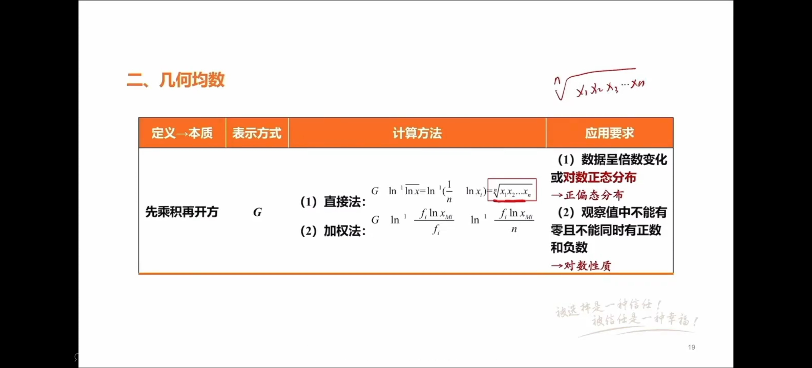

### 4.1 定义

**几何均数**用大写 **G** 表示，指 n 个观测值相乘后开 n 次方根：

$$G = \sqrt[n]{X_1 \times X_2 \times \cdots \times X_n} = \left(\prod_{i=1}^{n} X_i\right)^{1/n}$$

又称**倍数均数**，因为它适用于呈倍数关系的资料。

老师原话："几何均数的符号呢？用大 G 来表示，它指的是我 n 个观测值之间互相相乘之后再开 n 次方根。这一个 n 次方根就是它的均数，所以它又叫做倍数均数。"

### 4.2 计算方法

#### 方法一：直接法（n 较小时）

$$G = \sqrt[n]{X_1 \cdot X_2 \cdots X_n}$$

若有相同观测值，如三个相同的 X，则为 $X^3$ 后开方。

老师原话："当我们 n 比较小的时候，或者说你手上握着计算器的时候呢，我们就用直接法来算……把它们累乘起来，然后开 n 次方。"

#### 方法二：对数法（n 较大时）

对各观测值取对数 → 求对数的算术均数 → 求反对数：

$$\lg G = \frac{\sum \lg X_i}{n}, \quad G = \lg^{-1}\left(\frac{\sum \lg X_i}{n}\right)$$

老师原话："如果你的 n 很大，你手上又没有计算器的时候呢……把它们取对数之后求出对数的均数，再求它的反对数。当然这两个方法算的结果都是一样的。"

**原理**：取对数将乘法转化为加法（$\lg(ab) = \lg a + \lg b$），将开方转化为除法，从而可以用算术均数的方法计算。

#### 方法三：加权法（频数表资料）

$$\lg G = \frac{\sum f \cdot \lg X_0}{\sum f}, \quad G = \lg^{-1}\left(\frac{\sum f \cdot \lg X_0}{\sum f}\right)$$

老师原话："当我们的资料出现相同值过多的情况下，或者说我们是频数表资料的话呢，我们就用加权法来计算，其实加权法它差别就差在什么地方，分子这里考虑乘上一个权数 f，其他地方都没有什么不同。"

**课堂例题**：50名麻疹易感儿接种疫苗后血凝抑制抗体滴度，加权法计算：
1. 将滴度倒数（1, 2, 4, 8…）取对数；
2. 各对数乘以对应频数 f，求和得 86.995；
3. 除以总例数 50，得对数均数 1.7399；
4. 求反对数得 G ≈ 54.9 ≈ 55（老师说54，实际计算约54.9）；
5. 结论：平均滴度为 1:55（或 1:54）。

### 4.3 几何均数的应用场合【考点·必考】

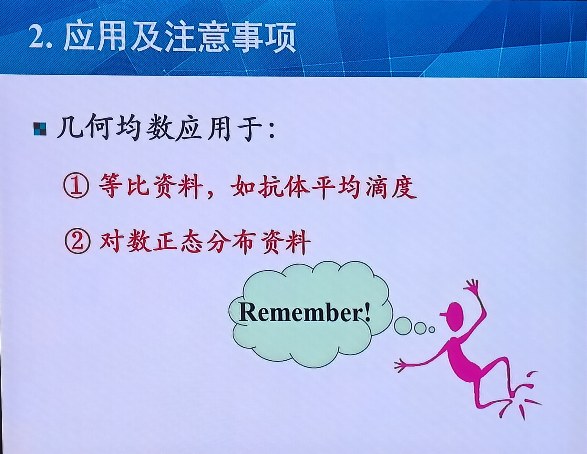

#### 场合一：等比级数资料（几何级数资料）

**等比级数（geometric series）**：观测值之间呈倍数关系。

老师原话："遇到等比级数资料，等比级数的意思就是这些资料之间，它互相成一种倍数的关系，这个叫等比级数。等比级数还有一个别称叫做几何级数，所以大家知道为什么叫做几何均数啊。"

**医学中的典型应用**：**抗体滴度（antibody titer）/ 效价（potency）**。

老师原话："在我们医学研究里面啊，现在呢比较少见，反正大家看到**滴度和效价**这两个词呢，你就不用想了，直接填我们的几何均数就行了。"

> 【考点·秒杀技巧】题干中出现"滴度""效价"→ 直接选几何均数。

#### 场合二：对数正态分布资料

**对数正态分布（log-normal distribution）**：原变量不服从正态分布（通常呈正偏态），但对其取对数后，对数值近似服从正态分布。

老师原话："对数正态分布就是指它的这个随机变量，它的原变量呢并不服从于正态分布，而且往往是一个正偏态的分布。但是没关系，如果你对它每一个取值都取了对数值之后，这个对数值近似于正态分布的话，那我就把这一个变量叫做对数正态分布。"

**医学中的典型应用**：
1. **环境监测中有害物质浓度**：大部分情况下有害物质出现机会少，偶尔超标，呈正偏态；
2. **食品中农药残留**：大部分合格，偶尔超标；
3. **传染病潜伏期**：大部分人潜伏期较短，极个别人潜伏期很长。

老师原话："大部分情况下有害物质出现的机会是不是很少啊？农药残留大部分都是合格的，偶尔才会出现一些超标……包括人的疾病的潜伏期，大部分传染病的潜伏期也是比较短的嘛，但是极个别人的潜伏期会很长，那也会使得它像一个正偏态分布。那我们取了对数之后啊，它就会近似于正态分布。"

### 4.4 几何均数的注意事项【考点·必考】

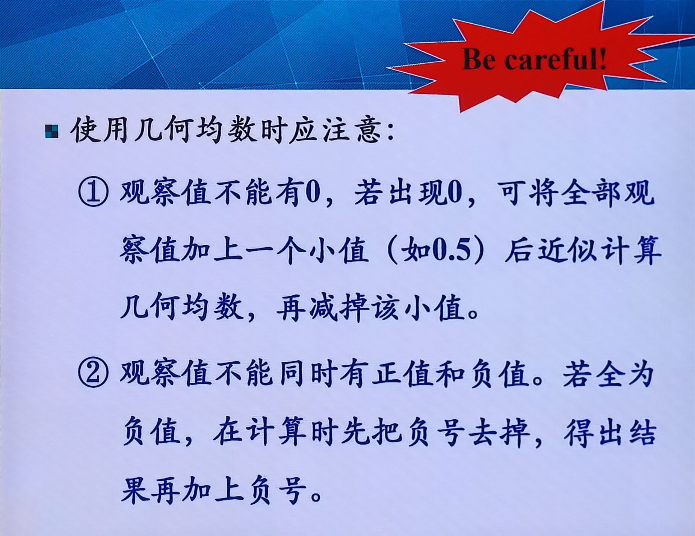

#### 注意一：观测值不能有零

老师原话："在计算几何均数的时候还要注意一些问题。首先呢，就是这个值里面不能有零……如果真的出现零的话，那我们就要去核查一下是不是人为的手误，又或者说真的出现零这个情况。"

**处理方法**：若确有零值，给每个观测值加上一个小常数（如 0.5），计算完成后再减去该常数。

老师原话："给每一个观测值都加上一个小值，比如说加一个 0.5，那这样的话零就消失了，我们就可以把这个数给算出来。然后呢算完之后再把这个小值给减掉。"

> 【教材补充】为什么不能有零？因为零取对数无意义（$\lg 0 = -\infty$），且乘积中含零则几何均数为零，失去意义。

#### 注意二：不能同时有正值和负值

老师原话："观测值里面不能同时有正值和负值。因为我们知道零取不了对数，负数是不是也取不了对数啊。"

**处理方法**：若全部为负值，先取绝对值计算几何均数，再在结果前加负号。

老师原话："如果全部都是负数的话呢，这个倒没关系……我们就先把这个负号无视掉，把结果算出来之后呢，再把这个负号请回来。为什么怎么这样也可以呢？这个就是因为如果全部都是负值的话，那说明你一开始这个负值的方向就已经弄反了。"

> 【教材补充】同一组资料的几何均数 ≤ 算术均数（当且仅当所有观测值相等时取等号）。这是因为对数变换是凹函数，由 Jensen 不等式可得。

---

## 五、中位数（Median, M）【考点·重点】

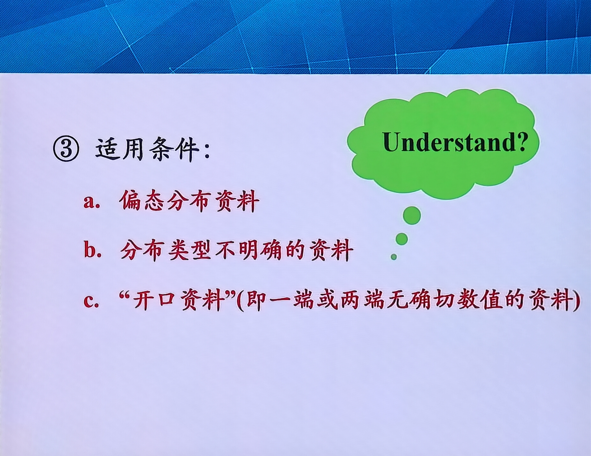

### 5.1 定义

**中位数**用大写 **M** 表示，是将一组观测值由小到大排列后，**位次居中**的那个观察值。它将全部观察值分为两部分：一半比它小，一半比它大。

老师原话："中位数的符号用大写 M 表示。它只是我们一组数据由小到大排序之后，这个位置居中的这个数值呢，就是它的中位数。那中位数它就不像我们均数那样是要算出来的，它更多像是观察出来的。所以它是一个位置的指标，告诉你坐在中间位置的值是多少。"

**中位数 = 第50百分位数（P₅₀）**。

### 5.2 计算方法

#### 方法一：直接法（原始资料，n 较小）

先将观察值由小到大排序：

- **n 为奇数**：$M = X_{\left(\frac{n+1}{2}\right)}$，即第 (n+1)/2 位的观察值；
- **n 为偶数**：$M = \frac{X_{\left(\frac{n}{2}\right)} + X_{\left(\frac{n}{2}+1\right)}}{2}$，即第 n/2 位和第 (n/2+1) 位两个观察值的均数。

**课堂例题**：10只小白鼠接种后生存时间（已排序），n=10为偶数，中间两位是第5位（63）和第6位（65），中位数 M = (63+65)/2 = 64。

老师原话："64这个值在不在我们原来这组数据里面呢？就不在。所以它仅仅就是告诉我们坐在64这个位置就可以把它们一分为二，因此它就叫中位数。"

> 【注意】中位数不一定是原始数据中的值（偶数时为两中间值的平均）。

#### 方法二：频数表法（n 较大，已编制频数表）

中位数的计算公式（插值法）：

$$M = P_{50} = L + \frac{i}{f_M} \left(\frac{n}{2} - \sum f_L\right)$$

式中：
- $L$：中位数所在组段的下限；
- $i$：中位数所在组段的组距；
- $f_M$：中位数所在组段的频数；
- $n$：总例数；
- $\sum f_L$：中位数所在组段之前各组段的累计频数。

**课堂例题**：200名食物中毒患者潜伏期资料：
- 中位数在"12~24"组段（因为累计到前一组"0~12"为30人，累计到"12~24"超过100人）；
- L = 12，i = 12，f_M = 71，n/2 = 100，∑f_L = 30；
- M = 12 + (12/71) × (100 − 30) = 12 + (12/71) × 70 = 12 + 11.83 = 23.83 ≈ 24小时。

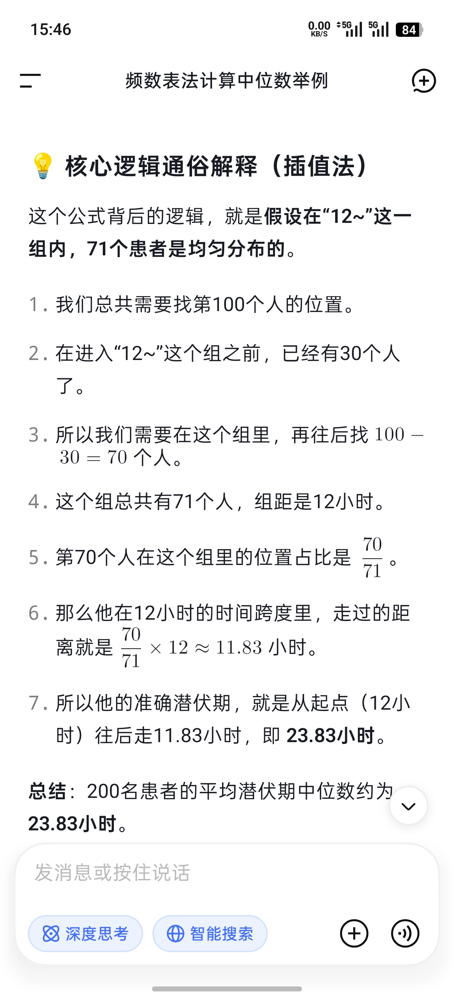

老师原话："这个值呢？就是23.8，所以大家发现我说是约等于24有没有错啊？"

**公式理解（老师的直观解释）**：
1. 中位数至少在 L 以上（先写 L）；
2. 中间位置是第 n/2 = 100 号人；
3. 前一组已累计 30 人，所以从第 31 号开始数，数到第 100 号，共 70 人；
4. 假设本组段内潜伏期均匀分布，71人分摊12小时，每人分摊 12/71 小时；
5. 70人共分摊 (12/71) × 70 小时，加到 L 上即得中位数。

### 5.3 中位数的优缺点

**优点**：
1. **不受极端值影响**（抗干扰能力强）：老师原话——"中位数它看各种极端骚扰的能力很强，因为你原来这个数据一端或者两端之间有一些极端值在里面的话，对我们的均数影响太大了，但是对我们的中位数有没有影响啊？……就算你这里面塞了个富豪在里面，是不是也不怕，因为他有多少钱，都不会影响你坐中间位置的人。"
2. **可用于开口资料**（一端或两端无确定值）；
3. **理论上所有资料都可计算中位数**，应用范围广。

**缺点**：
1. **不是首选指标**：老师原话——"尽管如此，我们仍然不是首选中位数，而是首选算术均数。这个就是因为算术均数在某些数学性质上面，它有一些优良的传统，使得我们可以在它的基础之上开发出很多统计方法。但是中位数在这一点上面呢就比较难，它很难有一些什么规律，它的这个开发的方法呢，也是这几年才有一些新的进展。"
2. 仅利用了中间1~2个数据的信息，未充分利用全部数据；
3. 正态分布时，中位数的效率低于均数。

### 5.4 中位数的适用条件【考点·必考·三条】

老师原话："中位数用在什么情况下呢？就是这三个条件，这个大家要掌握啊。因为这一个不仅仅是我们中位数的条件，我们后面凡是讲到非参数方法，它的这个条件的话，也是这三条啊。"

| 序号 | 适用条件 | 说明 |
|------|----------|------|
| ① | **偏态分布资料** | 正偏态或负偏态，极端值不影响中位数 |
| ② | **分布类型不明的资料** | 若为正态分布，均数=中位数，用中位数无差别；若为偏态，中位数更合适 |
| ③ | **开口资料** | 一端或两端无确定值（如">5年"），无法计算均数 |

> 【考点·重要关联】这三条条件也是后续**非参数检验（如秩和检验）**的适用条件！老师明确强调："我们后面凡是讲到非参数方法，它的这个条件的话，也是这三条。"

**开口资料举例**：随访12名癌症病人，随访5年时第12名仍在世，但研究终止，记录为">5年"。此时无法计算均数，但中位数不受影响。

---

## 六、百分位数（Percentile, Pₓ）【考点】

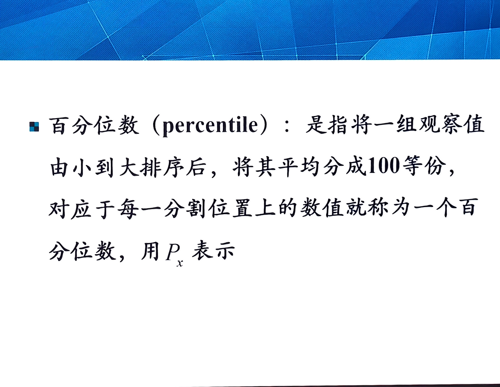

### 6.1 定义

**百分位数**：将一组观测值由小到大排序后，将其平均分为100个等份，对应每个分割位置上的数值。符号用 **Pₓ** 表示，下标 x 表示第几百分位数。

老师原话："百分位数的意思就是把我们一组观测值呢，由小到大排序之后，将其平均为100个等份。那对应的每一个分割位置上面的数值，我们就叫做某一个百分位数，百分位数的符号，我们用 Pₓ 来表示。那这个下标 x 呢，就表示它是第几百分位数。"

**含义**：Pₓ 表示有 x% 的观察值小于或等于该值，有 (100−x)% 的观察值大于该值。

### 6.2 生活中的应用

老师举例：某老师支付宝年消费18700多元，超过全国79.82%的用户。这意味着 P₈₀ ≈ 18700元——有80%的人消费不到这个数，20%的人超过这个数。

老师原话："这个第80百分位数是不是就是等于18733？它可以说明什么？说明有80%的人，他的消费是不到这个18700多块钱的。但是还有20%的人怎么样呢？这个消费啊，超过了这个数字。"

### 6.3 特殊百分位数【考点·易混】

| 百分位数 | 名称 | 意义 |
|----------|------|------|
| **P₅₀** | **中位数（M）** | 将数据一分为二 |
| **P₂₅** | **下四分位数（Q₁）** | 第25百分位数 |
| **P₇₅** | **上四分位数（Q₃）** | 第75百分位数 |
| **P₀** | 最小值 | 没有人比它更小 |
| **P₁₀₀** | 最大值 | 没有人比它更大 |

**四分位数（quartiles）**：P₂₅、P₅₀、P₇₅ 三个数合称四分位数，三个点将数据分为四段，每段含25%的数据。

老师原话："中位数又叫做什么呢？第50百分位数……另外两个就是我们的下四分位数，第25百分位数以及上四分位数第75百分位数。这三个数字加起来就合称叫做四分位数。所以大家知道四分位数其实就三个数啊……为什么叫做四分位啊？因为三个点刚好把这个数分成四段是吧？"

### 6.4 百分位数的计算公式

频数表法计算任意百分位数 Pₓ：

$$P_x = L + \frac{i}{f_x} \left(n \cdot x\% - \sum f_L\right)$$

式中：
- $L$：Pₓ 所在组段的下限；
- $i$：Pₓ 所在组段的组距；
- $f_x$：Pₓ 所在组段的频数；
- $n \cdot x\%$：Pₓ 对应的位次（如 P₅₀ 对应 n×50% = n/2）；
- $\sum f_L$：Pₓ 所在组段之前各组段的累计频数。

老师原话："我们的百分位数的计算公式呢？其实跟中位数计算公式是一样的，它关键变化的地方就在这里。如果我们现在是任意的一个百分位数的话，那这个 n 就是乘以百分之 x，80% 那就是80分位数。那中位数是不是就是乘以50%啊？"

**课堂例题**：食物中毒潜伏期资料中：
- P₂₅ = 15.4小时（25%的人发病时间小于15.4小时，发病较快）；
- P₇₅ = 36小时（25%的人发病较晚，36小时后才发病）。

### 6.5 百分位数的用途【教材补充·下节课关联】

1. **描述数据在某百分位置上的水平**：如 P₉₅ 表示95%的人不超过该值（常用于医学参考值范围的制定）；
2. **确定偏态分布资料的参考值范围**：如双侧95%参考值范围为 P₂.₅ ~ P₉₇.₅；
3. **计算四分位数间距（Q = P₇₅ − P₂₅）**：用于描述偏态分布资料的离散趋势（下节课内容）。

老师原话："我们下节课马上会讲到用这个75分位数减25分位数啊，得到这个差呢，叫做四分位数间距，它也是一个拿来描述我们资料的离散趋势的一个指标。"

---

## 七、集中趋势指标选择总结【考点·必考·综合表】

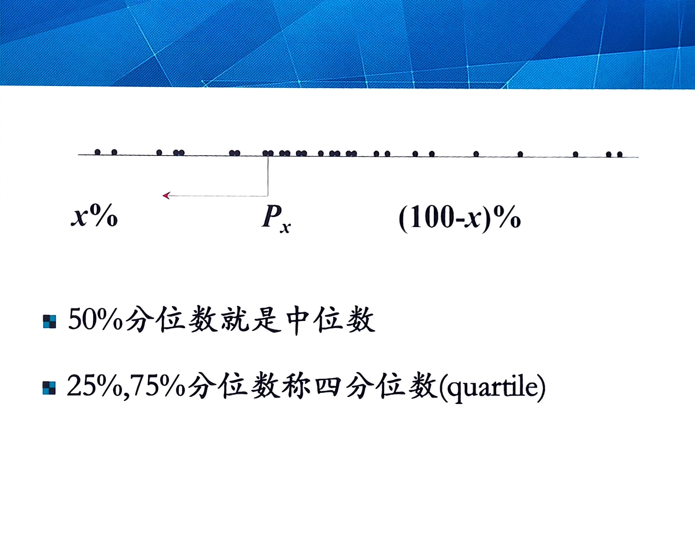

### 7.1 三种平均数对比表

| 对比项 | 算术均数（X̄） | 几何均数（G） | 中位数（M） |
|--------|----------------|---------------|-------------|
| **定义** | 观测值之和除以 n | n个观测值乘积开n次方 | 排序后位次居中的值 |
| **计算基础** | 加法 | 乘法（对数变换后加法） | 排序定位 |
| **适用分布** | 单峰对称/正态分布 | 等比级数/对数正态分布 | 偏态/分布不明/开口资料 |
| **受极端值影响** | **大** | 较小 | **不受影响** |
| **利用数据信息** | 充分利用全部数据 | 充分利用全部数据 | 仅利用中间1~2个数据 |
| **数学性质** | 优良（离均差平方和最小） | 较好 | 较差 |
| **能否进一步统计推断** | 能（参数方法基础） | 能（对数变换后） | 较难（非参数方法） |
| **典型医学应用** | 身高、体重、血压、血红蛋白 | 抗体滴度、效价、有害物质浓度、潜伏期 | 收入、住院天数、生存时间（开口） |

### 7.2 不同分布类型的指标选择

| 资料分布类型 | 首选集中趋势指标 | 说明 |
|-------------|-----------------|------|
| **正态分布/近似正态** | 算术均数 | 均数=中位数，均数效率最高 |
| **正偏态分布** | 中位数 | 极端大值不影响中位数；若取对数后正态可用几何均数 |
| **负偏态分布** | 中位数 | 极端小值不影响中位数 |
| **等比级数（倍数关系）** | 几何均数 | 抗体滴度、效价——看到"滴度""效价"直接选G |
| **对数正态分布** | 几何均数 | 原变量正偏态，取对数后近似正态 |
| **分布类型不明** | 中位数 | 正态时与均数等价，偏态时更合适 |
| **开口资料** | 中位数 | 一端或两端无确定值，无法计算均数 |
| **双峰分布** | 分组后分别计算均数 | 数据有异质性，不宜用单一指标概括 |

### 7.3 课堂练习题解析【考点·易错题】

**题目**："少数几个数据比大部分大几百倍，描述平均水平应选？"
- 正确答案：**中位数**
- 易错答案：几何均数（看到"倍数"条件反射选G）

老师原话："大部分选错都选择谁呢？……选B几何均数。那我也能猜到什么原因。他们可能读题读的太快了，看到个倍数，哎，条件反射的话就选B……其实呢，这里他说少数几个数据比大部分大几百倍，那说明这几个数据要做什么？叫做极端值或者说可疑值，这种情况下应该用中位数，而不是几何均数。如果是真的是几何均数的话，那这些数据之间是不是要成一种倍数的关系啊？"

> 【易混辨析关键】几何均数要求**所有数据之间**呈倍数关系（等比级数）；而"少数几个极端大值"是偏态分布，应选中位数。

---

## 八、本课高频考点速记清单

1. **加权法**：X̄ = ΣfX₀/Σf，结果为近似值，差0点几正常，差很多是算错。
2. **均数性质一**：Σ(x−X̄)=0（正负抵消）。
3. **均数性质二**：Σ(x−X̄)² ≤ Σ(x−A)²（离均差平方和最小），**更重要**，关联最小二乘法/回归。
4. **均数适用条件**：单峰对称/正态分布；双峰分布应分组分析。
5. **均数缺点**：易受极端值影响（"被平均"）。
6. **几何均数 G**：n个值乘积开n次方；又称倍数均数。
7. **几何均数计算**：直接法、对数法（取对数→求均数→反对数）、加权法。
8. **几何均数应用**：①等比级数（抗体滴度/效价——看到直接选G）；②对数正态分布（有害物质浓度、农药残留、传染病潜伏期）。
9. **几何均数注意**：①不能有零（加0.5算完再减）；②不能同时有正负值（全负先取绝对值算完加负号）。
10. **中位数 M**：排序后位次居中的值 = P₅₀；位置指标，不是算出来的。
11. **中位数计算**：直接法（n奇取中间，n偶取中间两值平均）；频数表法 M = L + (i/f_M)(n/2 − Σf_L)。
12. **中位数适用三条件**（也是非参数检验条件）：①偏态分布；②分布不明；③开口资料。
13. **百分位数 Pₓ**：x%的观察值≤该值；P₅₀=中位数，P₂₅=下四分位数，P₇₅=上四分位数，P₀=最小值，P₁₀₀=最大值。
14. **四分位数间距** = P₇₅ − P₂₅（下节课讲，描述离散趋势）。
15. **指标选择**：正态→均数；等比/对数正态→几何均数；偏态/不明/开口→中位数。

---

## 九、与第1课及后续课程的关联

- **第1课关联**：第1课讲了资料类型（定量/计数/等级），本课的集中趋势指标仅适用于**定量资料**。计数资料用率/构成比，等级资料用中位数/秩和。
- **下节课预告**：离散趋势指标（极差、四分位数间距、方差、标准差、变异系数）+ 正态分布。本课提到的"四分位数间距 = P₇₅ − P₂₅"将在下节课详细展开。
- **后续关联**：均数的"离均差平方和最小"性质 → 最小二乘法 → 线性回归；中位数的三条适用条件 → 非参数检验（秩和检验）。
