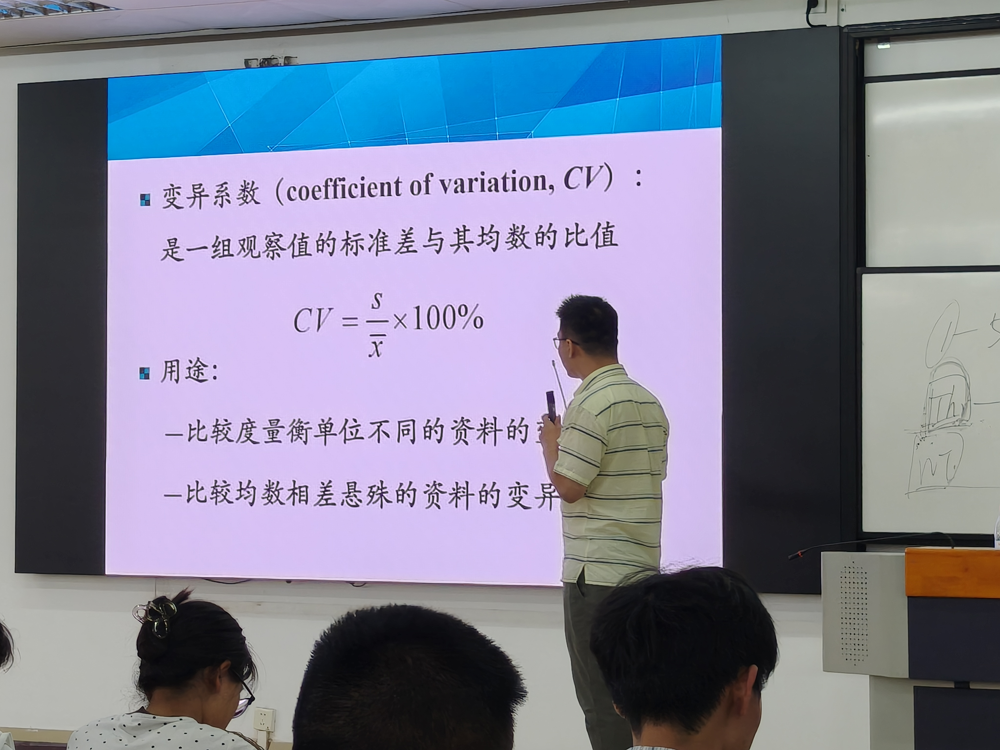
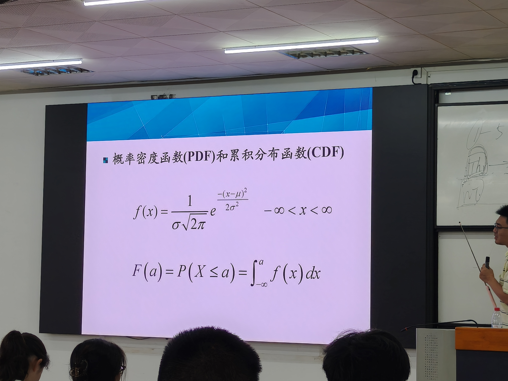

# 卫生统计学 第3课：离散趋势指标与正态分布

> 授课时间：2026-09-15（周二）10:35–12:05 | 转写 703 行
> 本课内容：离散趋势四大指标 → 正态分布 → 标准正态分布 → 医学参考值范围 → 质量控制
> 教材：科学出版社《卫生统计学》第2版（用户上课教材）

---

## 一、为什么需要描述离散趋势

**背景**：甲乙丙三组学生得分，算术均数都是10、中位数也是10（对称分布）——**平均水平相同，但三组得分的情况完全不同**：

- 甲组：成绩彼此接近，水平更**稳定**
- 丙组：有高有低，差异大

**结论**：仅用集中趋势指标（均数/中位数/几何均数）描述资料**不够**，必须同时描述**离散趋势（变异程度）**。

**常用离散趋势指标**：极差、四分位数间距、方差（标准差）、变异系数。

---

## 二、离散趋势指标详解

### 1. 极差（全距，range，R）

**定义**：一组数据的**最大值 − 最小值**。

**特点**：

| 特点 | 说明 |
|------|------|
| 计算最简单 | 频数表制作第一步就要算极差 |
| 粗糙 | 只看最大和最小两个值，中间数据一概不管 |
| 样本量增大时**只增不减** | 出现新的更大/更小值，极差就变大；绝不会变小 |
| 不适合样本量相差悬殊的资料比较 | 样本越多越容易碰到极端值 |

**用途**：单峰对称的小样本资料的变异程度初步描述；了解资料范围（如某病**最短潜伏期~最长潜伏期**的范围）。

**局限性**：①只考虑最大最小值；②不能充分反映数据变异程度。

### 2. 四分位数间距（interquartile range，IQR）

**四分位数**：把一组数据分为四等份的三个分位数：

- **P25（下四分位数，QL）**：从小到大排列后第25%位
- **P50**：中位数
- **P75（上四分位数，QU）**：第75%位

**四分位数间距**：**IQR = QU − QL**（即 P75 − P25）

**理解**：IQR相当于**中间50%数据的"极差"**——把最小的25%和最大的25%丢掉，只看中间50%的跨度。

**例题**：200名食物中毒患者潜伏期，P25与P75算出来一减，IQR = 20.6小时。

**特点**：

| 对比项 | 极差 | 四分位数间距 |
|--------|------|-------------|
| 抵抗极端值能力 | 弱（只看两端） | **较强**（只看两个分位数） |
| 数据利用 | 只利用最大最小值 | 仍未充分利用（中间50%内部不管） |

**应用条件（重要）**：**偏态分布、分布类型不明、一端或两端无确切数值**资料的离散程度描述——与**中位数**搭配使用（集中趋势用中位数，离散趋势就用IQR）。

### 3. 方差（variance）

**推导思路（理解记忆）**：

1. 变异 = 每个观测值与其均数的差距 → 计算**离均差（X−μ）**
2. 问题：把所有离均差相加 = **离均差之和 = 0**（正负抵消）→ 无法衡量变异
3. 方案一：加**绝对值**——可行但后续数学计算麻烦
4. 方案二（常用）：**平方**——离均差平方后全部≥0，再求和得到**离均差平方和**

**定义**：把离均差平方和（总变异）**平摊到每个观测单位**上，即平均每个观测值的变异水平。

**公式**：

| 总体方差 | 样本方差 |
|----------|----------|
| σ² = Σ(X−μ)² / N | s² = Σ(X−X̄)² / (n−1) |

**为什么样本方差除以 (n−1) 而不是 n？**

- 如果用样本方差估计总体方差，除以n会**偏低（低估）**
- 除以 (n−1) 才是总体方差的**无偏估计**
- **(n−1) 称为自由度（degree of freedom）**

**自由度的含义（老师讲解）**：允许自由取值的变量值的个数。
- 例：n=10个数据，可算出X̄；若X̄已知，前9个数据可任意取值，但第9个确定后**第10个就不能自由取值**了（必须由X̄反推）
- 所以自由取值的个数 = n−1；"少的那一个"用在X̄上

**方差的问题**：单位被平方了（如身高cm → cm²），解释困难（"人被压扁了"）→ 需要开方。

### 4. 标准差（standard deviation，SD，s）

**定义**：方差的平方根（正平方根）。

**意义**：**单位还原**为原始变量单位，是最常用的离散趋势指标。

**公式**：

- 定义式：s = √[Σ(X−X̄)² / (n−1)]
- **等价计算式（推荐，手算方便）**：s = √{[ΣX² − (ΣX)²/n] / (n−1)}
- **频数表资料**：把X换成组中值、并乘以频数f：
  s = √{[ΣfX² − (ΣfX)²/n] / (n−1)}（X为组中值）

**例题**：
- 10位脑出血患者血尿素氮（7.4、6.7…6.6）：s = √{[ΣX² − (ΣX)²/10] / 9} = **0.61**
- 频数表资料：先确定组中值 → 组中值×频数 → 组中值²×频数，代入公式 = **4.79**

**应用条件**：**对称分布，尤其是正态分布或近似正态分布**资料的变异程度——与**均数**搭配使用（报告均数后马上报告标准差）。

**方差并没有被淘汰**：方差分析、相关与回归分析中方差仍发挥重要作用。

### 5. 变异系数（coefficient of variation，CV）

**定义**：一组观测值的**标准差与均数之比**。

**公式**：CV = s / X̄ × 100%

**为什么需要它？（两个案例）**

| 案例 | 问题 | 结论 |
|------|------|------|
| 5岁男孩身高（均数≈110cm，SD=4.5cm）vs 体重（均数≈20kg，SD=0.6kg） | 直接比较SD：4.5>0.6，研究者认为身高变异大 | **错**！单位不同，4.5cm与0.6kg不可比 |
| 10只小白鼠（均数22g）vs 10只家兔（均数1500g） | 家兔SD大→认为家兔变异大 | **错**！单位虽同，但SD规模随均数同步放大，忽略均数规模会被错误估计 |

**用途（两个）**：
1. **比较度量衡单位不同的资料**的变异程度
2. **比较均数相差悬殊的资料**的变异程度

📝 **批注**：本课PPT原文。**CV = S/X̄ × 100%**（标准差/均数，别写反！）。两大用途：①比较**度量衡单位不同**的资料变异（如身高cm vs 体重kg）；②比较**均数相差悬殊**的资料变异（如小白鼠22g vs 家兔1500g）。

**例题结果**：
- 身高 CV = 3.89%，体重 CV = 2.77% → **身高变异程度大于体重** ✓
- 小白鼠 CV = 14.5%，家兔 CV = 6.6% → **小白鼠变异程度大于家兔** ✓

---

## 三、集中趋势与离散趋势指标配套总结（必背）

| 指标 | 反映 | 应用条件 | 搭配 |
|------|------|----------|------|
| 均数（X̄） | 平均数量水平 | 正态/近似正态/对称分布 | **标准差** |
| 几何均数（G） | 平均倍数 | 等比级数资料、对数正态分布 | — |
| 中位数（M） | 位置居中水平 | 偏态/分布不明/开口资料（任何资料都可算） | **四分位数间距** |
| 极差（R） | 范围 | 单峰对称小样本初步描述 | — |
| 四分位数间距（IQR） | 中间50%数据的极差 | 偏态/分布不明/两端无确切值 | 中位数 |
| 方差（σ²/s²） | 平均变异水平 | 对称/正态 | — |
| 标准差（s） | 平均变异水平（单位还原） | 对称尤其正态 | 均数 |
| 变异系数（CV） | 相对变异 | 单位不同或均数相差悬殊的比较 | — |

---

## 四、统计描述的报告（论文表达方式，考试易出题）

**原则**：根据分布类型决定报告方式。

### 1. 正态分布资料：均数 ± 标准差

> 例：某地抽样调查120名18~35岁健康成年居民血清碘含量为 **18.61 ± 4.34 μmol/L**

- **18.61 = 均数**，**4.34 = 标准差**
- ⚠️ **±号后面是标准差，不是范围**！不要误解为"范围在14~22之间"
- 国内期刊惯例：定量资料服从正态分布 → 用"均数±标准差"表达

### 2. 偏态分布资料：中位数（P25 ~ P75）

> 例：50例链球菌咽峡炎患者潜伏期为 **49.09（36.82 ~ 72.2）小时**

- **49.09 = 中位数**（传染病的潜伏期往往是偏态分布）
- **36.82 = P25（下四分位数）**，**72.2 = P75（上四分位数）**
- 现在投稿习惯把两个分位数写出来，不必专门求IQR差值——这也是四分位数间距的一种表示
- 判别偏态：36.82→49.09差13，49.09→72.2差23（右侧尾巴更长）→ **正偏态（右偏）**

---

## 五、正态分布（normal distribution）

### 1. 概念

- 又称**高斯分布（Gaussian distribution）**
- 最重要的**连续型随机变量**的概率分布，自然界最常见
- 医学规律：**正常生理指标**基本上都是正态分布；**病理指标**多为偏态分布（"大部分人平庸、集中在均数周围，少数特别优秀或特别差"）
- 频数图的演化：频数分布图 → 增大样本量、加密组段 → 样本无穷大时形成**光滑的正态曲线（钟形曲线）**

### 2. 概率密度函数（PDF）与累积分布函数（CDF）

- **PDF**：某取值下的概率密度；正态分布在 **X = μ 时概率密度最大**
- **CDF（累积分布函数）**：求区间概率用积分——曲线下**面积 = 概率**；单点概率 = 0（如"身高正好1.40m的人被抽中的概率"=0），都是求区间概率

📝 **批注**：PPT原文公式（必记）：
**PDF**：$f(x)=\frac{1}{\sigma\sqrt{2\pi}}e^{-\frac{(x-\mu)^2}{2\sigma^2}},\ -\infty<x<\infty$（正态分布概率密度函数）
**CDF**：$F(a)=P(X\le a)=\int_{-\infty}^{a}f(x)dx$（累积分布函数=曲线下从-∞到a的面积=概率）
注意：单点的PDF值≠概率（概率=面积），考试常考"单点概率为0"。

### 3. 正态曲线的特征（考点）

| 特征 | 内容 |
|------|------|
| 形状 | 中间高、两边低，**左右对称**（以μ为中心） |
| 外观 | 像寺庙里的钟 → **钟形曲线** |
| 渐近线 | 越往两边尾巴越贴近X轴，但**永远不与X轴相交** |
| 位置参数 | **μ（均数）**：决定曲线**峰的位置**（μ变→曲线左右平移，形状不变） |
| 形状参数 | **σ（标准差）**：决定曲线的**高矮肥瘦**（σ大→矮胖、数据分散；σ小→高瘦、数据集中） |

**σ变化理解**：曲线下总面积固定为1——把数据压缩（σ小），曲线只能向上升高变尖；把数据拉伸（σ大），曲线变矮变宽。

### 4. 正态曲线下面积规律（必背！）

| 区间 | 面积（占总面积比例） |
|------|---------------------|
| μ ± 1σ | **68.27%** |
| μ ± 1.96σ | **95%** |
| μ ± 2.58σ | **99%** |

> 记忆：1σ≈68%，1.96σ≈95%，2.58σ≈99%——1.96和2.58是必须背的两个数。

### 5. 判断资料是否正态的4种方法

| 方法 | 要点 |
|------|------|
| ① 频数图法 | 频数分布图中间高两边低、左右大体对称 → 正态；峰偏向一边、拖尾 → 偏态 |
| ② 专业知识判断 | 身高、体重等生理指标→正态；期末成绩取决于试卷难度（适中→近似正态，很难/很简单→偏态） |
| ③ 经验判断 | 若**标准差 > 均数**，怀疑偏态；若**标准差 > 3倍均数**，很有理由怀疑偏态 |
| ④ 正态性检验 | 用**偏度系数、峰度系数**、**Shapiro-Wilk检验（夏皮罗-威尔克检验）**等 |

**为什么重要**：正态是后面许多统计方法（t检验、方差分析、相关回归）的**应用前提**。

---

## 六、标准正态分布

### 1. 标准化变换（z变换）

**z = (X − μ) / σ**

- 含义：观测值离均数相差**多少个标准差**
- 所有正态分布经变换后都变成标准正态分布——无数个正态曲线，但**标准正态分布只有一个**

### 2. 标准正态分布

- **均数 = 0，标准差 = 1**，记作 N(0, 1)
- 变换后计算曲线下面积（查表）非常方便

### 3. 查表（附表三，z值表）

- 用法：z值整数+一位小数看行，两位小数看列，交叉处为曲线下面积
- 例：Φ(−1.64) = **0.0505**
- 表只给负z值从−∞到0的面积；**正z值用对称性**：
  **Φ(z) = 1 − Φ(−z)**，即Φ(1.64) = 1 − 0.0505 = 0.9495

---

## 七、正态分布的应用

### 应用1：估计频数分布（估计参考范围内人数比例）

**例题1**：2013年18岁男大学生身高，均数=172.7cm（转写中166.8为题目值），σ=4.01，身高服从正态。求身高≤166.8cm的比例：

- z = (166.8 − μ) / σ = **−1.96**
- μ−1.96σ内占95%，两侧各2.5% → 166.8cm以下占 **2.5%**

**例题2**：求身高在162.35~183.05cm之间的比例：

- z₁ = −2.58（面积0.005），z₂ = +2.58（面积0.995）
- 两者之差 = **0.99（99%）**——与"μ±2.58σ占99%"吻合
- 比162cm矮或比183cm高的人只占1%（"恭喜你，很罕见"）

### 应用2：制定医学参考值范围（重要，与临床相关）

#### 名称演变

"正常值范围" → **"参考值范围"**：因为超出范围**不一定**是病态（如姚明身高2m+不是生病，是天赋），参考值只作参考、不作诊断。

#### 基本概念

- **定义**：绝大多数正常人某项观测指标的波动范围
- **"绝大多数"**：90%、95%或99%均可，**未特别说明默认95%**
- **"正常人"**：不是完全健康的人，而是**排除了对所研究指标有影响的疾病或因素之后的同质人群**（如制定红细胞计数参考值，要排除血液病、服用影响红细胞的保健品者；出车祸的人只要不影响该指标也可纳入）
- **样本含量要足够大**（一般要求n≥100，否则结果不稳定）

#### 制定原则（考点）

| 原则 | 要点 |
|------|------|
| ① 同质正常人为对象 | 排除影响因素和疾病的人群 |
| ② 控制测量误差 | 仪器/试剂/方法不准→结果误导 |
| ③ 判断是否分组 | 性别（身高男女差异大）、年龄（儿童~老年）差异大→分组制定 |
| ④ 决定单侧/双侧 | 见下方 |
| ⑤ 选择百分界值 | 默认95% |
| ⑥ 按分布类型选方法 | 正态分布法 / 百分位数法 |

**单侧 vs 双侧（判断依据=专业知识）**：

| 类型 | 含义 | 举例 |
|------|------|------|
| 单侧下限 | 指标**越高越好**（只设下限） | IQ（90以上正常）、血氧 |
| 单侧上限 | 指标**越低越好**（只设上限） | 转氨酶（超过某水平→肝受损）、尿汞 |
| 双侧 | 过高过低都异常 | 白细胞计数（过高→白血病，过低→免疫问题）、总胆固醇 |

#### 计算方法

**① 正态分布法**（资料正态或近似正态）：

| 范围 | 公式 |
|------|------|
| 双侧95% | X̄ ± 1.96s |
| 双侧99% | X̄ ± 2.58s |
| 单侧95%上限 | X̄ + **1.64s** |
| 单侧95%下限 | X̄ − **1.64s** |

> ⚠️ **单侧用1.64（1.645），不是1.96！** 原因：单侧时把两侧各2.5%合并到一侧变成5%，对应z值更靠近中间（z=1.64 < 1.96）。

**② 百分位数法**（偏态资料，任何分布都适用，但样本量要足够大）：

| 范围 | 公式 |
|------|------|
| 双侧95% | P2.5 ~ P97.5 |
| 单侧95%下限 | P5 |
| 单侧95%上限 | P95 |

#### 计算例题

**例题1（正态分布法）**：18岁男大学生身高，X̄=172.7cm，s=4.01：

- 95%参考值范围 = 172.7 ± 1.96×4.01 = **164.84 ~ 184.56 cm**

**例题2（百分位数法，单侧上限）**：尿汞资料呈偏态分布（频数前高后低）：

- 选择单侧上限，95%参考值范围 = **P95 = 39.2**
- 尿汞值≤39.2视为正常，>39.2怀疑异常

> 课堂选择题：尿汞资料用什么方法估计参考值范围？答：**百分位数法，单侧上限（P95）**。

### 应用3：质量控制

- 原理：同一标准样品重复测量结果应围绕均数（X̄）波动
- 质控图：X̄ ± 2s、X̄ ± 3s 控制限
- 若某批次样品结果**超过3s**——出现概率极低，要怀疑**样品有问题或仪器未校准**
- 具体有12条质控规则（Westgard规则），工程管理内容，本课不展开

### 应用4：正态分布是许多统计方法的理论基础

- t检验、方差分析、相关与回归分析等**都要求资料服从（或近似服从）正态分布**
- 不服从则换其他方法（如非参数检验）

---

## 八、课堂练习（期末真题改编，必做）

> 12名进展期胃癌患者生存期（月）数据含一个极端值155。

**第1问：计算患者的一般生存期 → 选C（30.5）**
- 因为有极端值155，算均数会偏高 → 用**中位数**（12个数据，第6、7位中间值）
- 易错：数错位置得出29.5（应数到第6、7个之间的均值）

**第2问：描述离散趋势 → 选B（IQR = 10.5）**
- 12个数据：P25在第3、4位之间 = 28.5；P75在第9、10位之间 = 39
- IQR = 39 − 28.5 = **10.5**

**第3问：报告方式 → 选B**
- 第1问用中位数 → 报告"中位数（P25~P75）"格式
- 若选A（均数±标准差）就与前两问矛盾；若没直接给IQR而给范围也对
- 此问当年只有3%的人答对，注意逻辑连贯

**第4问：样本量增大只会变大、不会变小的指标 → 选A（极差）**
- 极差：出现新的更大/更小值只会变大
- B/C/D/E（IQR、方差、标准差、CV等）变化方向不确定（可能变大也可能变小）

---

## 九、本课必背数字速记

| 数字 | 含义 |
|------|------|
| 68.27% | μ±1σ 面积 |
| 95% | μ±1.96σ 面积；默认参考值范围百分界值 |
| 99% | μ±2.58σ 面积 |
| 1.96 / 2.58 / 1.64 | 双侧95% / 双侧99% / 单侧95% 的z值 |
| n−1 | 样本方差的分母（自由度） |
| 0.61 / 4.79 | 例题：原始资料/频数表资料标准差 |
| 3.89% / 2.77% | 身高/体重变异系数 |
| 14.5% / 6.6% | 小白鼠/家兔变异系数 |
| 18.61±4.34 | 血清碘含量报告示例（均数±标准差） |
| 49.09（36.82~72.2） | 潜伏期报告示例（中位数与P25~P75） |
| 164.84~184.56 | 身高95%参考值范围 |
| 39.2 | 尿汞P95（单侧上限） |

---

## 十、转写错误纠正记录（本课）

| 转写原文 | 正确内容 |
|----------|---------|
| "理想趋势" | 离散趋势 |
| "4分位数" | 四分位数 |
| "反差" | 方差 |
| "萨普罗维尔特检" | Shapiro-Wilk检验（夏皮罗-威尔克检验） |
| "中型曲线" | 钟形曲线 |
| "蛋白性检验" | 正态性检验 |
| "T75/T95" | P75 / P95（百分位数） |
| "控制它的正常的人" | 同质的正常人群 |
