# 生理学第1课：绪论——课程介绍

> 授课时间：2026-09-07 14:30
> 内容范围：绪论（生理学概述、研究方法、生命基本特征、内环境与稳态、生物节律、生理功能调节、自动控制系统）
> 教材依据：《生理学》第10版，罗自强/管又飞主编，人民卫生出版社，2024年，第一章绪论（教材第1~12页）

---

## 一、生理学概述

### 1.1 生理学的定义

**生理学（physiology）** 是生物学的一个重要分支，是一门研究**机体生命活动的各种现象及其功能活动规律**的科学。所谓机体，指的是有生命活动的个体，即生物体，是自然界中有生命的物体的总称。生理学因研究对象的不同而形成了不同的生理学科：按研究对象可分为动物生理学、植物生理学、人体生理学等；按研究的器官、系统划分，又产生了神经生理学、心血管生理学、消化生理学、肾脏生理学等。

【考点】老师原话："生理学它是生物学的重要分支，研究机体生命活动的各种现象，还有它们的功能活动的规律。"对于医学生而言，我们学习的是**人体生理学（human physiology）**，即研究人体功能活动及其规律的科学。

### 1.2 生理学的任务

人体生理学的任务主要包括两个层面：一方面要研究**人体各系统、器官、细胞乃至分子之间的相互联系**，阐明生命活动规律的内在机制；另一方面要研究机体各细胞、器官、系统所有功能活动互相作用、统一整合的总和。也就是说，生理学不仅要告诉我们"正常的功能是什么"，更要阐明"为什么会产生这个功能""它的机制是什么"。

【教材补充】教材第1页指出：随着分子生物学研究的不断深入，细胞生理学的研究也不断向纵深发展。转化医学的问世使生理学的研究与生物化学、病理学、病理生理学、药理学和各临床学科产生密切的互相联系，生理学也不断从研究正常的生命活动规律和功能活动的内在机制，跨越到研究这种活动与疾病发生发展、治疗干预效果的内在关系，成为各临床学科开展预防、诊断、治疗、康复和临床医学研究的重要基石，成为连接基础和临床学科的重要桥梁学科。

### 1.3 生理学在医学中的地位与桥梁作用

生理学在医学教育体系中具有**基础医学主干课程**和**桥梁课程**的双重地位。在解剖学、组织胚胎学等形态学课程中，我们学习的是"结构"——机体由哪些组织、器官构成，它们的形态位置如何。但光知道结构还不够，有了这样的结构会产生什么样的功能？这就是生理学要回答的问题。

【考点】老师原话："前面学了解剖，还学了骨胚……学完生理之后，下学期同学们就要学到病理，生理病理啊，后面还有药理以及个人的临床专业课。"

由此构成了一条完整的学习逻辑链：**掌握正常生理功能 → 理解疾病发生机制 → 指导诊断与治疗**。只有掌握了正常的生理活动规律，我们才能判断在疾病状态下哪些功能发生了异常改变，进而理解疾病的发病机制，最终有针对性地进行治疗。例如，强心苷类药物治疗心力衰竭的机制，正是基于对心肌细胞膜上钠-钾泵活动的深入理解（详见第2~3课）。

【教材补充】教材第1~2页补充了一个经典案例：美国外科医生威廉·博蒙特（William Beaumont）在1822年通过观察因猎枪走火导致胃瘘的患者，发现了胃运动和胃液分泌规律，这是人体生理学研究的经典范例。

### 1.4 生理学的认识层次

生理学的认识层次分为三个水平，三者互相联系、互相补充、互相促进：

| 研究水平 | 定义 | 举例 |
|---------|------|------|
| **整体水平** | 以完整机体为研究对象，分析不同器官系统之间的联系与配合 | 整体对环境变化（如高温、低氧）的反应 |
| **器官系统水平** | 研究各器官系统的功能活动规律及其机制 | 心脏的泵血功能、肺的通气功能 |
| **细胞分子水平** | 在器官功能基础上深入研究其细胞和分子机制 | 心肌自律性细胞的电生理活动机制 |

老师特别强调：心脏之所以能在人的一生中不停地收缩舒张，是因为心脏内存在具有**自律性**的特殊细胞，而这种自律性的本质又在于这些细胞膜上特殊的电生理特性。从器官水平（心脏泵血）→细胞水平（自律细胞）→分子水平（离子通道活动），正是生理学认识不断深入的体现。

【教材补充】教材第3页强调：细胞和分子水平的研究大多采用离体的方法，所得结果往往不能完全代表其在完整机体中的功能。因此，细胞和分子水平的研究始终要和器官、系统乃至整体水平的研究结合起来，才能更全面、更深入地阐明生命活动的本质。

---

## 二、教学安排与成绩构成

### 2.1 授课形式与成绩构成

本课程采用**混合式教学**：线上通过超星学习通平台开展智慧课程学习，线下由教师进行课堂讲授。

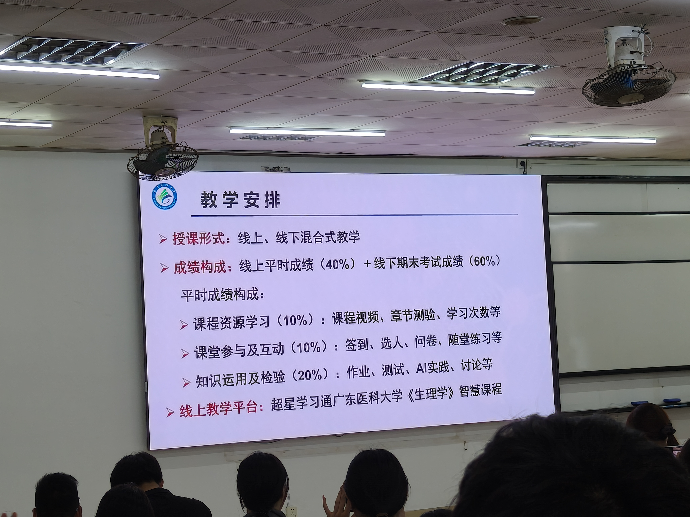

| 组成部分 | 占比 | 详细内容 |
|---------|------|---------|
| **线上平时成绩** | **40%** | 见下方细则 |
| **线下期末考试** | **60%** | 期末考试 |

### 2.2 平时成绩（40%）构成细则

根据课堂PPT，平时成绩40%又细分为：

1. **课程资源学习（10%）**：超星学习通智慧课程的视频观看完成度、章节测验完成情况、视频观看次数与时长
2. **课堂参与及互动（10%）**：签到、选人回答、问卷、随堂练习等
3. **知识运用及检验（20%）**：每章发布作业、测试、AI实践、讨论等

【考点】老师特别强调作业的时效性："一般一个学时就是两道题左右，发布之后一般你48小时之内就完成……到了期末考试了再来说老师我作业没交，能不能重发肯定是不行的。"所有平时活动均有时效性，逾期不补。

---

## 三、生理学的研究方法

### 3.1 动物实验——生理学研究的主要手段

由于生命伦理学的限制，不能将对机体有害或存在潜在伤害的实验直接在人体上进行，因此生理学研究以**动物实验**为主要手段。动物实验按其过程通常分为**急性实验**和**慢性实验**两大类。

【教材补充】教材第4页指出：为了规范使用实验动物的研究行为，科学界提出了减少、替代和优化（reduction, replacement, refinement）的"3R"原则，通过减少、替代和优化，尽量减少实验动物的使用数量，尽量减轻对动物的伤害，从而科学、合理、人道地使用实验动物。

#### 3.1.1 急性动物实验

急性实验（acute experiment）是以动物活体标本或完整动物为实验对象，人为控制实验条件，在短时间内对动物标本或动物整体特定的生理活动进行观察和干预。急性实验又可分为：

- **在体实验（in vivo experiment）**：在麻醉或清醒状态下的动物身上进行的观察或实验，也称活体解剖实验。例如，观察电刺激膈下迷走神经对家兔胃肠运动的影响——先观察正常家兔的胃肠运动，再电刺激膈下迷走神经，观察胃肠运动的变化。后续机能学实验中对家兔的操作多属于此类。

- **离体实验（in vitro experiment）**：从活着或刚处死的动物身上取出所需的器官、组织或细胞，置于能保持其正常功能活动的人工环境中，观察某些人为干预因素对其功能活动的影响。例如，蛙心灌注实验——将蛙心取出，在适宜的任氏液灌注条件下，心脏仍可保持一段时间的节律性收缩，此时灌注不同的液体（如氯化钙溶液、去甲肾上腺素溶液）即可观察心脏收缩力的变化。又如蛙坐骨神经干动作电位记录，也是将蛙的坐骨-腓神经干分离出来后在离体条件下进行。

急性实验的优点是实验条件易于控制、实验结果分析较为明确；缺点是离体或麻醉状态下的结果不一定能完全代表自然状态下的整体功能。

#### 3.1.2 慢性动物实验

慢性实验（chronic experiment）是指以完整、清醒的动物为研究对象，尽量使动物所处的外界环境接近自然常态，在一段时间内、在同一动物身上反复多次观察完整机体内某些器官功能或生理指标变化的实验。

【考点】老师举例：巴甫洛夫的**假饲实验**——在狗的食道上做一个瘘管，同时做胃瘘，食物从口中进入后从食道瘘流出而不能进入胃，但胃液却从胃瘘分泌出来。这一慢性实验揭示了神经反射在胃液分泌中的调节作用。慢性实验的优点是更接近整体的生理功能状态，缺点是实验条件要求高、影响因素多、结果不易分析。

### 3.2 人体生理研究

由于伦理学限制，早期人体生理研究主要以调查和记录人体的一些生理参数资料为主，如人体身高、体重、血压、心率、肺活量、血细胞数量等。随着现代科学技术的发展，人体无创研究成为可能，心电图、脑电图、超声、计算机断层扫描（CT）、功能磁共振成像（fMRI）等技术为人体器官和系统形态功能的研究提供了条件。

---

## 四、生命活动的基本特征

### 4.1 五大基本特征

无论是单细胞还是高等动物，各种生物体都具有一些共同的基本生命特征，包括**新陈代谢、兴奋性、适应性、生殖和衰老**五大方面。

### 4.2 新陈代谢

机体要生存，就必须不断与环境进行物质和能量交换，摄取营养物质以合成自身的物质，同时不断分解自身衰老退化的物质，并将分解产物排出体外。这种自我更新的过程称为**新陈代谢（metabolism）**，包括物质代谢（合成代谢与分解代谢）和能量代谢（能量产生与转换利用）。新陈代谢一旦停止，生命活动就会结束，因此新陈代谢是机体生命活动最基本的特征。

### 4.3 兴奋性——重点概念

**兴奋性（excitability）** 是指活的组织细胞接受**刺激（stimulus）**后产生**反应（response）**的能力或特性。这是生理学中非常重要的基础概念，在后续第二章（细胞的电活动）中将深入展开。

**反应的两种形式**：
- **兴奋（excitation）**：由静止状态转变为活动状态，或活动由弱变强。现代生理学将细胞接受刺激后产生动作电位的现象统称为兴奋。
- **抑制（inhibition）**：由活动状态转变为静止状态，或活动由强变弱。

**兴奋性的衡量指标——阈值（阈强度，threshold intensity）**：

要引起组织细胞发生反应，刺激必须达到三个条件：足够的**刺激强度**、足够的**刺激作用时间**和适当的**强度-时间变化率**。当固定作用时间和强度-时间变化率时，刚能引起组织细胞产生反应的最小刺激强度称为**阈强度（threshold intensity）**，简称**阈值（threshold）**。

【考点】兴奋性与阈值的关系：**兴奋性 ∝ 1/阈值**。所需刺激越小（阈值低），说明组织细胞的兴奋性越高；所需刺激越大（阈值高），说明兴奋性越低。低于阈值的刺激称为**阈下刺激**，不能引起组织兴奋；高于阈值的刺激称为**阈上刺激**，可引起组织兴奋；等于阈值的刺激称为**阈刺激**。

### 4.4 适应性

机体在长期的进化过程中，逐步建立了一套通过自我调节以适应生存环境改变的方式，这种按环境变化调整自身生理功能的能力称为**适应性（adaptability）**。例如，长期居住高原地区的人，其血液中红细胞数量和血红蛋白含量比平原地区的人要高，以适应高原低氧环境——这属于生理性适应。

### 4.5 生殖与衰老

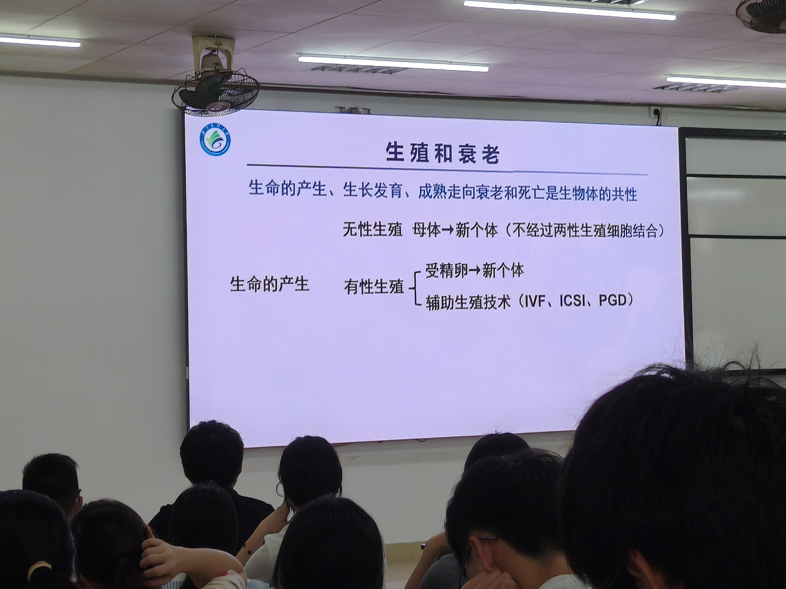

**生殖（reproduction）** 是机体繁殖后代、延续种系的一种特征性活动。成熟个体通过无性或有性繁殖方式产生或形成与本身相似的子代个体。

- **无性生殖**：不经过两性生殖细胞结合，由母体直接产生新个体（如分裂生殖）
- **有性生殖**：需要两个生殖细胞——精子和卵细胞结合形成**受精卵**，再发育为新个体
- **辅助生殖技术**：IVF（体外受精）、ICSI（卵胞浆内单精子注射）、PGD（胚胎植入前遗传学诊断）

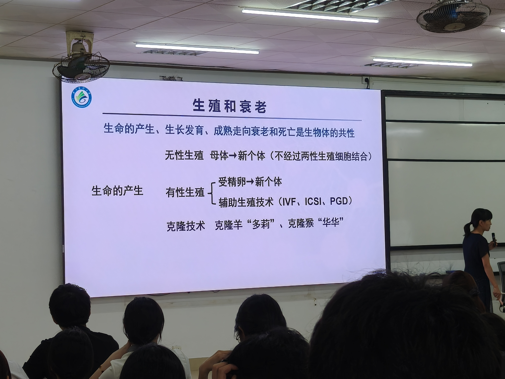

【教材补充】教材第6~7页记载：1996年第一只克隆羊"多莉"诞生；2018年我国科学家突破了现有技术无法克隆灵长类动物的世界难题，中国克隆猴"中中""华华"成功诞生。克隆技术的不断发展也对伦理学和传统生殖方式提出了新的挑战。

**衰老（aging）** 是生命周期中一个随着时间的进展而表现出结构退行性改变和功能活动不断衰退的过程。人体随着年龄的增长，各器官系统及其组织细胞功能出现退行性变化或衰退，对内、外环境适应能力逐渐减弱。

---

## 五、机体的内环境、稳态和生物节律（核心重点）

### 5.1 体液的分布

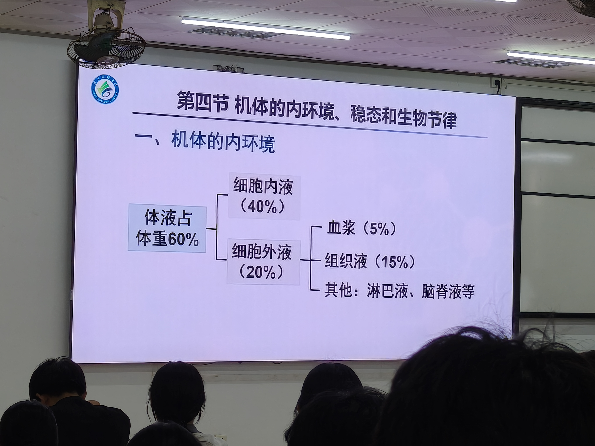

人体内的液体总称为**体液（body fluid）**，约占体重的**60%**。体液可分为两大部分：

| 体液类型 | 占体重比例 | 说明 |
|---------|-----------|------|
| **体液总量** | **60%** | 体内所有液体的总称 |
| 细胞内液（intracellular fluid） | **40%**（约占体液的2/3） | 分布于细胞内的液体 |
| 细胞外液（extracellular fluid） | **20%**（约占体液的1/3） | 分布于细胞外的液体 |
| ├─ 血浆 | **5%** | 血管内的液体 |
| ├─ 组织液 | **15%** | 组织细胞间隙的液体 |
| └─ 淋巴液、脑脊液等 | 少量 | — |

【考点】判断题常考点：**胃液、膀胱内尿液等与外界相通的液体不属于细胞外液**，因为它们通过消化道、尿道等与外界环境直接相通，不属于机体的内环境范畴。老师在课堂随堂练习中特别强调了这一点。

### 5.2 内环境

**内环境（internal environment）** 是指细胞直接接触和赖以生存的环境，即**细胞外液**。这一概念由法国生理学家**克劳德·伯纳德（Claude Bernard）**于1857年提出。他观察到：尽管机体所处的外环境温度变化很大（冬夏温差可达数十摄氏度），但机体内部的温度和各种理化性质却始终保持相对稳定。因此他指出：**内环境的相对稳定是机体能自由和独立生存的首要条件**。这一观点对后来稳态概念的提出具有重要的意义。

### 5.3 稳态

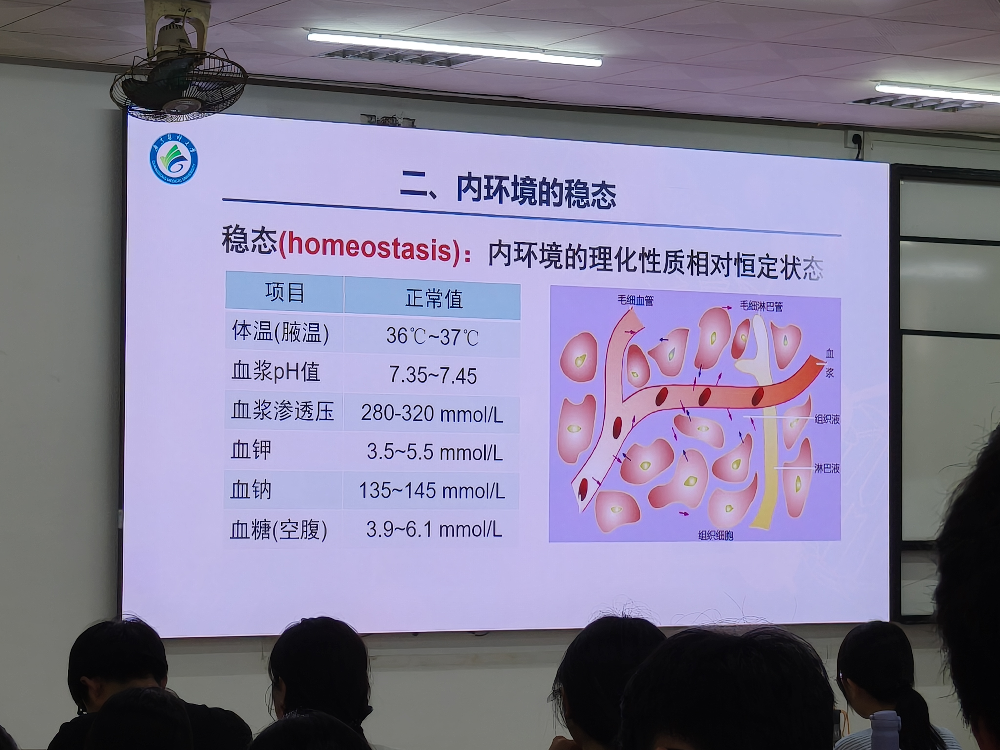

**稳态（homeostasis）** 是指内环境的理化性质（如温度、酸碱度、渗透压和各种液体成分）的相对恒定状态。这一概念由美国生理学家**沃尔特·坎农（Walter B. Cannon）**于1926年提出，他将希腊语的homeo与stasis合成为homeostasis一词来表述稳态。

**常见指标正常范围**（根据课堂PPT）：

| 项目 | 正常值 | 临床意义 |
|------|--------|---------|
| 体温（腋温） | **36~37℃** | 超过37.3℃为发热 |
| 血浆pH值 | **7.35~7.45** | <7.35为酸中毒，>7.45为碱中毒 |
| 血浆渗透压 | **280~320 mmol/L** | <280为低渗，>320为高渗 |
| 血钾 | **3.5~5.5 mmol/L** | <3.5为低钾血症，>5.5为高钾血症 |
| 血钠 | **135~145 mmol/L** | <135为低钠血症 |
| 血糖（空腹） | **3.9~6.1 mmol/L** | >7.0为糖尿病诊断阈值 |

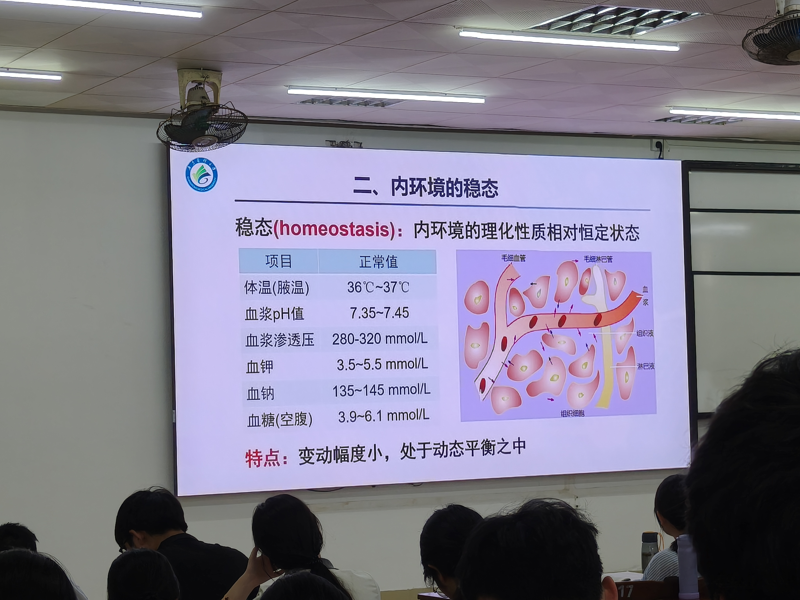

**稳态的特点**：
1. 内环境的理化性质**不是静止不变的固定状态**，而是各种理化因素在各种生理活动的调节下趋于动态平衡的相对恒定状态
2. 可以有波动，但波动幅度很小
3. 是一种**动态平衡**，而非绝对恒定

【考点】老师原话："稳态指的是什么？指的就是内环境的理化性质相对恒定的状态……它有波动，但是你要在正常的范围内波动。"随堂练习中考过："稳态是指细胞外液的理化性质和化学成分保持**绝对**恒定"——这个说法是**错误**的，正确表述应为"相对恒定"。

### 5.4 稳态的维持及生理意义

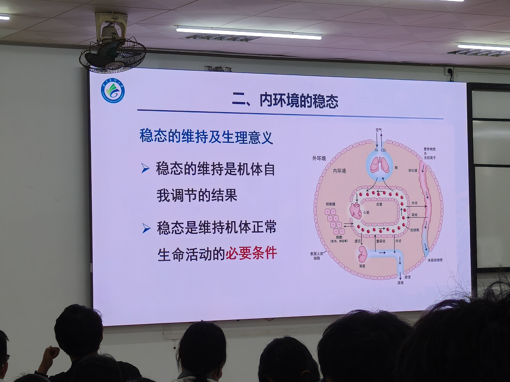

**稳态的维持及生理意义**：

1. **稳态的维持是机体自我调节的结果**：正常情况下，由细胞代谢引起的营养物质消耗和代谢产物变化，或外界环境的变化（如高温、严寒、低氧以及呕吐或腹泻）都会导致细胞外液理化性质的变化，从而干扰稳态。但机体可通过多个系统和器官的活动以及负反馈控制系统，使遭受干扰的内环境及时得到恢复。

2. **稳态是维持机体正常生命活动的必要条件**：因为细胞的各种代谢活动都是酶促生化反应，所以细胞外液中需要有足够的营养物质、氧气和水分，还要适宜的温度、离子浓度、酸碱度和渗透压等。细胞膜两侧不同的离子浓度分布也是可兴奋细胞保持其兴奋性和产生生物电的基本保证。如果内环境的理化条件发生重大变化或急骤变化，超过机体本身调节与维持稳态的能力，则机体的正常功能会受到严重影响，如高热、低氧、水/电解质及酸碱平衡紊乱等都将损害细胞功能，引起疾病，甚至危及生命。

【考点】老师原话："实际上我们后面的每一章都是在学习，怎么样去维持这个稳态，只不过不同章节它侧重的点有所不同而已。"——内环境稳态是贯穿整个生理学学习的核心线索。

【教材补充】教材第8页指出：目前关于稳态的概念不再局限于内环境理化性质的稳态，已可扩大到泛指机体内从细胞分子水平、器官和系统水平到整体水平的各种功能活动在神经和体液等因素调节下保持相对稳定状态，如血压的稳态。

### 5.5 生物节律

**生物节律（biorhythm）** 是指机体内各种功能活动按一定时间顺序发生周期性变化的现象。

| 节律类型 | 周期 | 举例 |
|---------|------|------|
| **日节律（昼夜节律）** | ~24小时 | 皮质醇分泌（夜间低、午后最高）、生长激素（睡眠期高峰）、体温（清晨2~6时最低，13~18时最高） |
| **月节律** | ~1月 | 月经周期 |
| **季节节律** | ~1年 | 甲状腺激素分泌（冬季高、夏季低） |

【教材补充】教材第8页记载：人的体温在24小时的日周期中，以2~6时最低，此时人体处于熟睡状态，体内多数生命活动处于相对静息状态；机体以最节能的方式维持基本生命活动。清醒后，为适应新一天的生活工作的需要，体温逐渐升高，在13~18时达到最高。

**生物节律的调控**：从17世纪就已注意到生物节律现象。目前研究表明，**下丘脑视交叉上核**（suprachiasmatic nucleus）可能是日周期节律的控制中心。杰弗里·霍尔（Jeffrey C. Hall）、迈克尔·罗斯巴什（Michael Rosbash）和迈克尔·杨（Michael W. Young）因在果蝇中发现period、timeless、doubletime等与生物节律相关的基因，阐明了调控昼夜节律的分子机制，因此共同获得了**2017年诺贝尔生理学或医学奖**。

---

## 六、机体生理功能的调节

### 6.1 三种调节方式总览

当机体内、外环境发生变化时，为了保证机体能够适应这种变化，维持内环境的相对稳定，机体内部必须进行一系列的调节活动。主要的调节方式有三种：**神经调节、体液调节和自身调节**。

| 调节方式 | 特点 | 举例 |
|---------|------|------|
| **神经调节（nervous regulation）** | 迅速、精确、短暂 | 膝跳反射、缩手反射 |
| **体液调节（humoral regulation）** | 缓慢、持久、弥散 | 胰岛素降血糖 |
| **自身调节（autoregulation）** | 调节幅度小、作用局限 | 肾血流量的自身调节 |

### 6.2 神经调节

**神经调节** 是在神经系统的参与下，通过**反射（reflex）**活动而调节机体生理功能的一种调节方式。神经调节是人体生理功能调节中**最主要**的调节形式。

**反射** 是指在中枢神经系统的参与下，机体对内外环境变化所做出的规律性应答。反射活动的结构基础是**反射弧（reflex arc）**，由五个基本部分组成：

1. **感受器（receptor）**：接受刺激、感受环境变化
2. **传入神经（afferent nerve）**：将感受器的信息传导至中枢
3. **神经中枢（center）**：整合信息、发出指令
4. **传出神经（efferent nerve）**：将中枢指令传导至效应器
5. **效应器（effector）**：产生反应

【考点】反射弧任何一个部分受损，反射活动将无法进行。这是因为反射弧是一个完整的功能链路，五部分缺一不可。

**神经调节的特点**：反应迅速、作用精确、持续时间短暂。以膝跳反射为例：叩击髌腱→牵拉股四头肌内的肌梭感受器→传入神经→脊髓→传出神经→股四头肌收缩→小腿前踢。整个过程在瞬间完成。

【教材补充】教材第9页指出：通常神经反射包括非条件反射和条件反射（详见第十章神经系统）。

### 6.3 体液调节

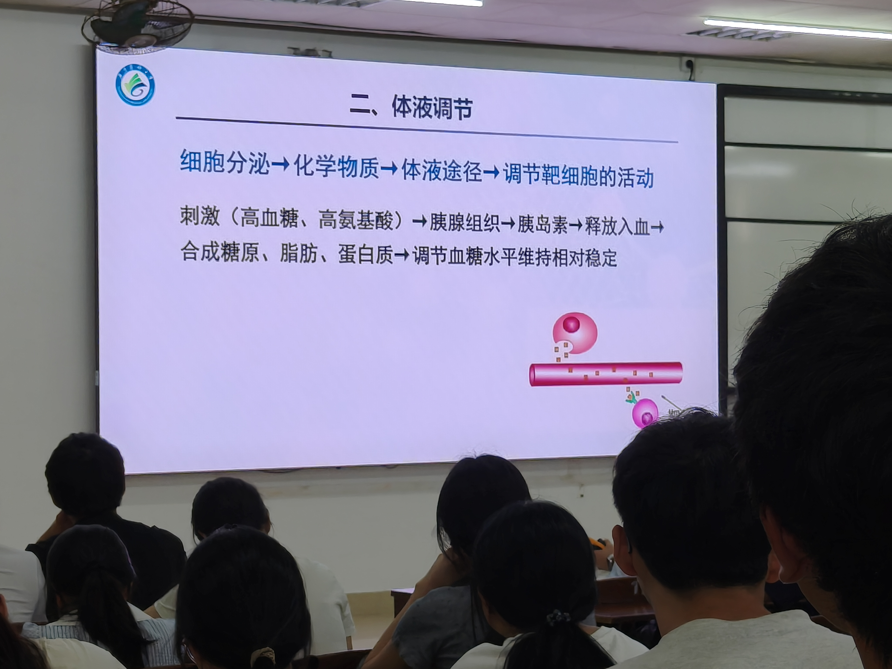

**体液调节** 是指体内产生的一些特殊化学物质通过体液途径到达并作用于靶细胞，从而影响靶细胞生理活动的调节方式。这些化学物质可以是内分泌细胞或内分泌腺分泌的激素（如甲状腺激素、胰岛素、糖皮质激素），也可以是某些组织细胞产生的特殊化学物质。

**经典举例——胰岛素调节血糖**：进食后碳水化合物在消化道分解为葡萄糖吸收入血，导致血糖升高→高血糖刺激胰腺β细胞分泌胰岛素→胰岛素经血液循环到达全身靶细胞（靶细胞膜上有胰岛素受体）→促进组织细胞摄取、利用和储存葡萄糖（合成糖原、转化为脂肪和蛋白质）→血糖水平降低，维持在正常范围。

**体液调节的特点**：与神经调节相比，体液调节是一种较为**原始**的调节方式，其作用缓慢而持久，作用面广，对机体生命活动（新陈代谢、生长发育、生殖等）的调节和自身稳态的维持起着十分重要的作用。

【教材补充】教材第9页将体液调节细分为：
- **远距分泌（telecrine）**：激素经血液循环运输到达靶细胞（如胰岛素）
- **旁分泌（paracrine）**：组织细胞分泌的化学物质不经血液循环而直接进入周围组织液，经扩散作用到达邻近细胞（如胰腺α细胞分泌的胰高血糖素刺激邻近β细胞分泌胰岛素）
- **自分泌（autocrine）**：激素在局部扩散后又返回作用于该激素分泌细胞自身（如胰岛素可抑制β细胞自身分泌胰岛素）
- **神经分泌（neurocrine）**：下丘脑内一些神经细胞合成激素后，随轴浆流至末梢释放入血（如血管升压素）

### 6.4 神经-体液调节

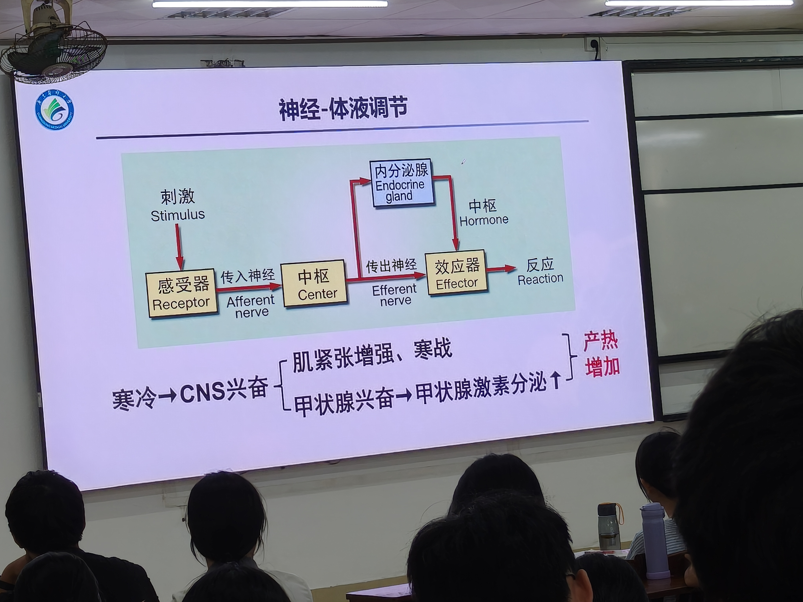

在人体，很多内分泌腺直接或间接地接受神经系统的调节，这种情况下的体液调节实际上是神经调节传出环节的延伸，称为**神经-体液调节（neurohumoral regulation）**。

**经典举例——寒冷条件下的产热反应**：
1. 突然寒冷刺激→皮肤冷觉感受器兴奋→传入神经→体温调节中枢（下丘脑）
2. **神经调节部分（迅速）**：中枢发出冲动经躯体神经→骨骼肌肌紧张增强、寒战→快速增加产热
3. **体液调节部分（持久）**：中枢通过交感神经→甲状腺受神经支配→甲状腺激素分泌增加→提高细胞代谢率、持久增加产热

【考点】老师以此例对比了两种调节方式的特点：神经调节"迅速但短暂"（寒战不能持续太久），体液调节"缓慢但持久"（甲状腺激素作用持久），两者配合才能维持长时间的体温稳定。

### 6.5 自身调节

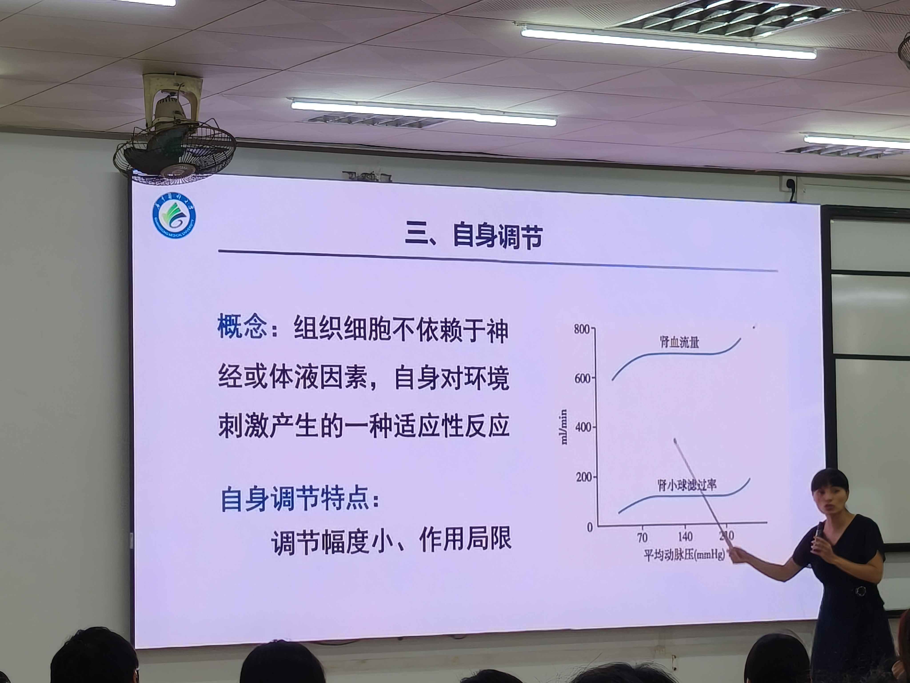

**自身调节（autoregulation）** 是指某些细胞或组织器官凭借本身内在特性，而不依赖神经和体液调节，对内环境变化产生特定适应性反应的过程。

**注意**："不依赖于"不等于"不受神经体液因素调节"——自身调节的组织器官仍然可以接受外来神经和体液因素的调节，只是它自身还具有不依赖于外来调节的内在特性。

**经典举例——肾血流量的自身调节**：当动脉血压在约**80~180 mmHg**范围内变动时，肾血流量和肾小球滤过率基本保持不变。这是因为肾内小动脉平滑肌在受到牵张刺激时可自动发生收缩，使血流阻力相应改变，从而维持肾血流量和肾小球滤过率的相对稳定。

**自身调节的特点**：调节强度较弱、影响范围小、灵敏度较低，调节常局限于某些器官或组织细胞内。但对于该器官或组织细胞的生理功能活动的调节仍具有重要意义。

---

## 七、人体内的自动控制系统

### 7.1 概述

人体内存在许多不同类型的复杂控制系统，精密地调节着人体生命活动。运用工程技术领域中的自动控制论知识，有助于认识和理解人体内控制系统的运作规律。控制系统分为**非自动控制系统**（开环系统，体内少见，不做重点讨论）和**自动控制系统**（闭环系统）。自动控制系统又分为**反馈控制系统**和**前馈控制系统**。

### 7.2 反馈控制系统

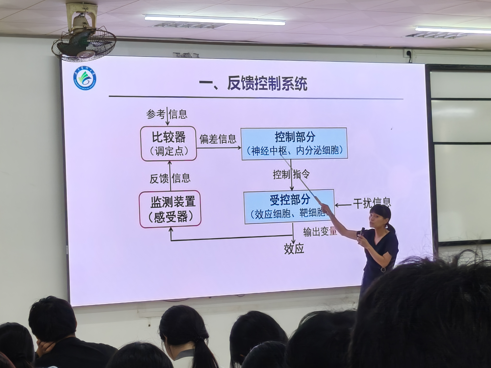

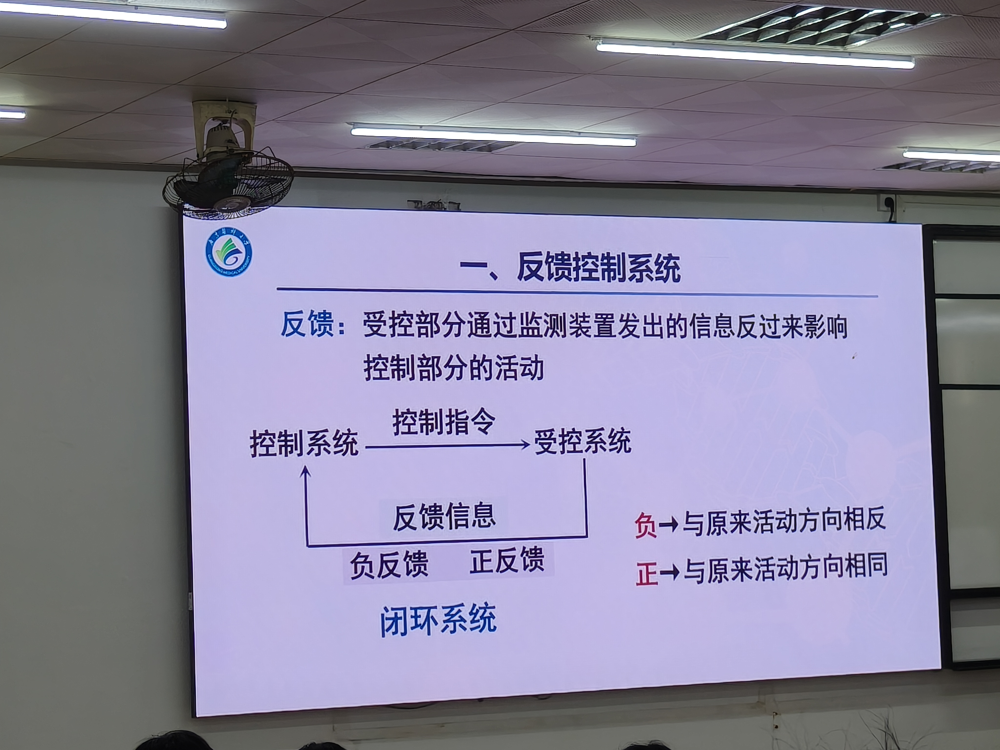

**反馈控制系统** 是由比较器、控制部分、受控部分及检测装置组成的一个**闭环系统（closed-loop system）**。其工作过程为：

控制部分发出指令控制受控部分的活动，输出变量反映受控部分的活动情况，监测装置对输出变量进行采样，并发出反馈信息回输到比较器。比较器将反馈信息与系统原先由**调定点（set point）**设定的参考水平进行比较，产生的偏差信息传输至控制部分，控制部分接收偏差信息后进行整合、分析并做出决定，发出控制信息对受控部分的活动进行调整，以纠正干扰信息对受控部分活动的扰乱。

**反馈（feedback）** 是指受控部分通过监测装置发出的信息反过来影响控制部分的活动。根据反馈信息的作用效果，可将反馈分为两种：**负反馈（negative feedback）**和**正反馈（positive feedback）**。

### 7.3 负反馈

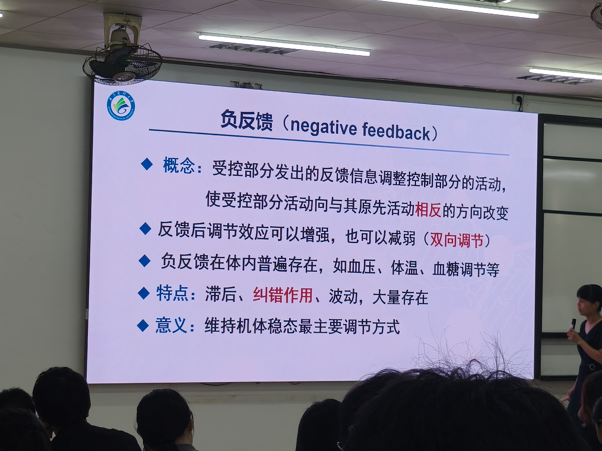

**负反馈** 是指受控部分发出的反馈信息调整控制部分的活动，最终使受控部分的活动向与其原先活动**相反**的方向改变。

**负反馈的特点**：
- **双向调节**：反馈后调节效应既可增强也可减弱（血压高了调低、低了调高）
- **滞后性**：只有当输出变量发生偏差后才进行纠正，因此总是"事后纠正"
- **纠错作用**：存在一定的波动，但波动在正常范围内
- **体内大量存在**：是维持稳态最重要的调节方式

**负反馈的生理意义**：负反馈调节的意义在于使系统处于一种稳定状态。在正常生理情况下，体内的控制系统绝大多数都属于负反馈控制系统，它们在维持机体内环境稳态中起重要作用。

**经典举例——体温调节**：

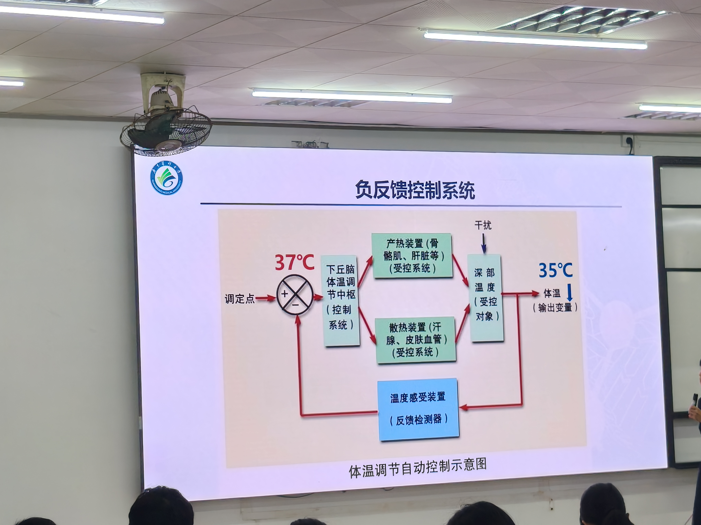

体温的调定点设定在**37℃**。当体温降低至35℃（干扰因素）时：温度感受装置检测到体温变化→反馈信息传至下丘脑体温调节中枢→与调定点37℃比较发现偏差→控制系统发出指令→增强产热装置（骨骼肌寒战、肝脏代谢增强）活动、减弱散热装置（汗腺分泌减少、皮肤血管收缩）活动→体温回升至37℃。反之，当体温升高超过37℃时，机体则通过增强散热、减少产热使体温回降。

其他常见的负反馈例子还有：血压调节、血糖调节、血液pH调节、循环血量和渗透压调节等。

### 7.4 正反馈

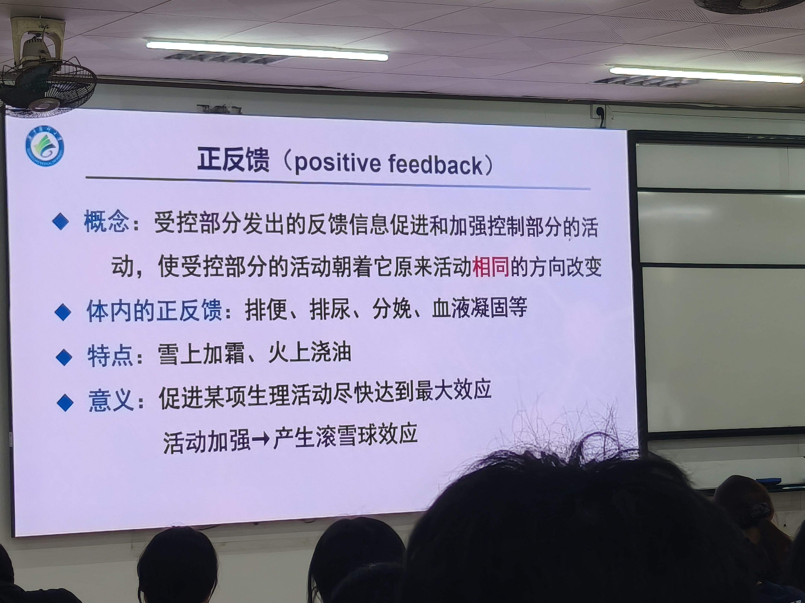

**正反馈** 是指受控部分发出的反馈信息调整控制部分的活动，最终使受控部分的活动朝着与其原先活动**相同**的方向改变。

**正反馈的特点**：
- 反馈控制系统处于再生状态，活动**不断加强**
- **"雪上加霜、火上浇油"**——一旦启动，活动迅速增强
- 产生**滚雪球效应**，使某项生理活动尽快完成或尽快达到最大效应
- 体内正反馈远较负反馈为少

**常见的正反馈例子**（需牢记）：

| 正反馈过程 | 机制简述 |
|-----------|---------|
| **血液凝固** | 凝血因子相继激活，最终形成血凝块 |
| **排尿反射** | 尿液进入尿道刺激感受器，进一步加强排尿 |
| **排便反射** | 类似排尿反射的正反馈过程 |
| **分娩** | 催产素释放促进子宫收缩，子宫收缩进一步刺激催产素释放 |

**经典举例——排尿反射中的正反馈**：

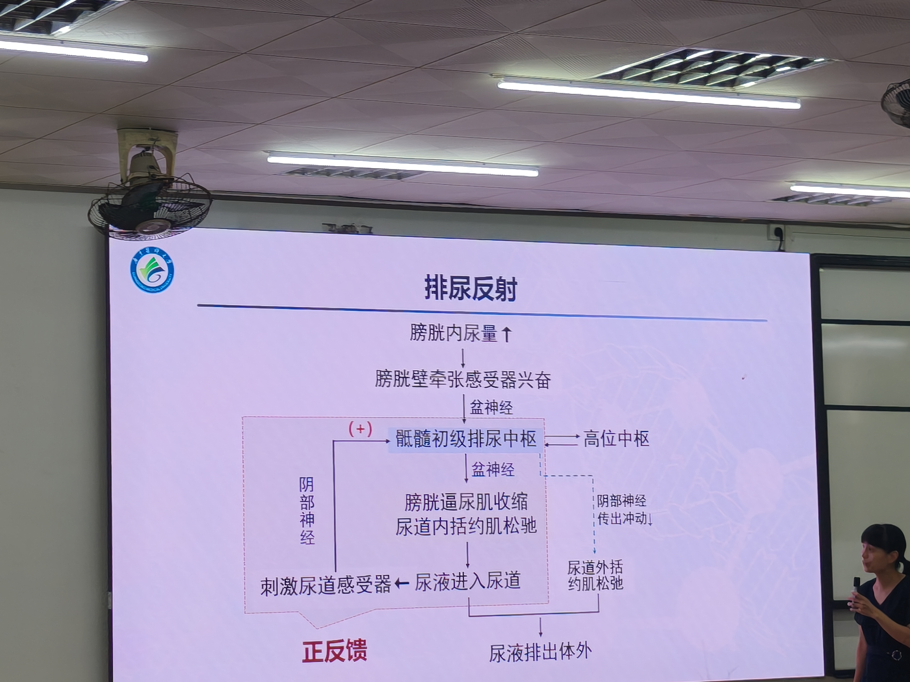

当膀胱内尿量达**400~500 mL**时，膀胱壁牵张感受器兴奋→盆神经传入冲动→骶髓初级排尿中枢→经盆神经传出→膀胱逼尿肌收缩、尿道内括约肌松弛→尿液进入尿道。尿液进入尿道后**刺激尿道感受器**，冲动经阴部神经再次传到初级排尿中枢，**进一步加强**初级排尿中枢的活动，使膀胱进一步收缩、排尿加速——这就是正反馈环节。如此反复加强，直至尿液排尽为止。

【考点】老师原话："正反馈的特点那就是雪上加霜、火上浇油……也就是促使某项生理活动尽快的达到一个最大的效应，就是正反馈的生理意义。"

【教材补充】教材第11页特别指出：正常机体中的一些正反馈活动是为了维持整个机体的稳态，如排尿过程通过正反馈不断加强膀胱逼尿肌收缩，虽然打破了膀胱原有的扩张充盈状态，但随着尿液排出，对于维持整体内环境的稳态有重要意义。但在异常情况下，过强的正反馈也会导致病理性改变，形成恶性循环（vicious cycle），如机体某处小血管破裂时，各种凝血因子通过正反馈相继激活，使血液凝固形成血凝块，若这种正反馈活动失去控制而过强，则可能因凝血过强而形成病理性血栓。

### 7.5 前馈控制系统

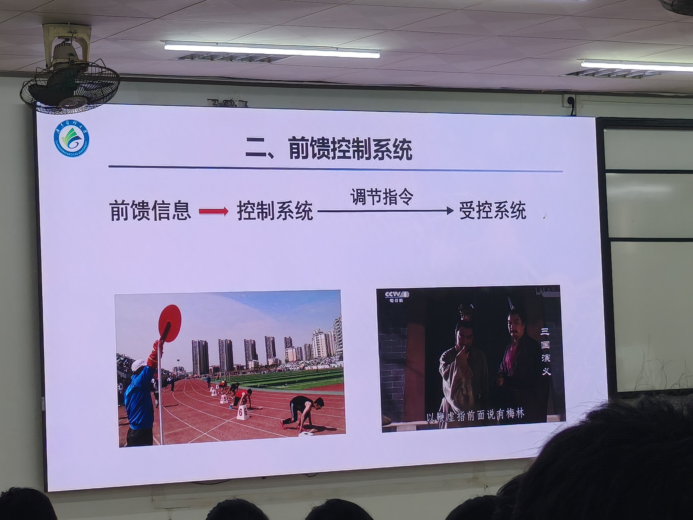

**前馈控制系统（feed-forward control system）** 是指控制部分在反馈信息尚未到达前已受到前馈信息（干扰信号）的影响，及时纠正其指令可能出现的偏差。

**前馈与反馈的区别**：
- 反馈控制系统是**闭环**系统，存在"滞后性"——必须等到输出变量出现偏差后才纠正
- 前馈控制系统是**开环**系统，在干扰信号影响输出变量之前就通过监测装置发出前馈信息，提前做出适应性反应

**前馈的特点**：
- **预见性**：能在内外环境因素面临变化之前就对其可能的影响做出反应
- **适应性**：提前调整受控部分的活动，避免负反馈调节中因输出变量出现偏差才调节的滞后现象
- **可能失误**：前馈控制的效果有时受机体适应状态的影响而出现偏差

**经典举例**：
1. **赛跑前的准备状态**：运动员在听到枪声尚未开始赛跑时，心率已加快、呼吸加深、肾上腺素分泌增加——机体预见到即将开始剧烈运动，提前调整心血管和呼吸功能以适应运动需要
2. **望梅止渴**：提到杨梅（甚至尚未吃到）即引起唾液分泌——条件反射建立的前馈，提前为进食做好消化准备。但如果实际上没有吃到杨梅，唾液的分泌就是一种"失误"

【考点】随堂练习中考过："望梅止渴"属于**前馈控制**，而非负反馈。

---

## 八、随堂练习要点回顾

课后通过超星学习通完成了3道随堂练习，核心考点如下：

1. **不属于机体内环境范围的是**：**细胞内液**。内环境 = 细胞外液（包括血浆、组织液、淋巴液、脑脊液等），细胞内液不属于内环境。
2. **稳态的正确描述**：内环境理化性质保持**相对恒定**（而非"绝对恒定"），处于动态平衡之中。
3. **"望梅止渴"属于**：**前馈控制**，不属于负反馈。

---

## 九、本课核心数字速记

| 项目 | 数值 | 备注 |
|------|------|------|
| 体液占体重 | **60%** | 其中细胞内液40%，细胞外液20% |
| 血浆占体重 | **5%** | 组织液15% |
| 体温（腋温） | **36~37℃** | 调定点约37℃ |
| 血浆pH | **7.35~7.45** | |
| 血浆渗透压 | **280~320 mmol/L** | |
| 血钾 | **3.5~5.5 mmol/L** | |
| 血钠 | **135~145 mmol/L** | |
| 空腹血糖 | **3.9~6.1 mmol/L** | |
| 肾自身调节血压范围 | **80~180 mmHg** | 肾血流量/GFR基本不变 |
| 膀胱尿量触发排尿 | **400~500 mL** | 牵张感受器兴奋 |
| 内环境概念提出 | **1857年** | Claude Bernard |
| 稳态概念提出 | **1926年** | Walter B. Cannon |
| 平时成绩占比 | **40%** | 期末60% |
