# 生理学第2课：绪论小结与细胞膜物质转运

> 授课时间：2026-09-08 16:10
> 内容范围：绪论复习、细胞膜的结构、跨细胞膜的物质转运（被动转运：单纯扩散、易化扩散；主动转运：原发性主动转运——钠泵、钙泵）
> 教材依据：《生理学》第10版，第二章第一节（教材第13~19页）

---

## 一、绪论知识小结

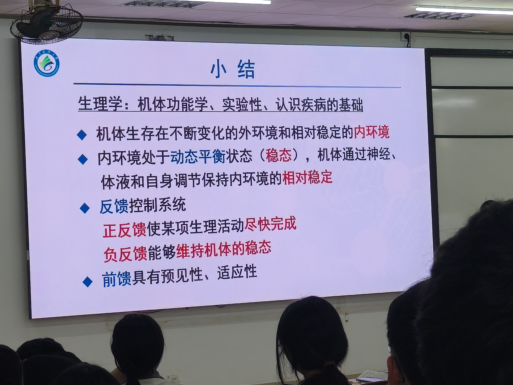

上节课结束后，老师带领复习了绪论的核心要点：

1. **生理学**是一门机体功能学、实验性学科，是认识疾病的基础
2. 机体生存在不断变化的外环境和相对稳定的内环境中
3. **内环境处于动态平衡状态（稳态）**，机体通过神经、体液和自身调节保持内环境的相对稳定
4. **反馈控制系统**：正反馈使某项生理活动尽快完成；负反馈能够维持机体的稳态
5. **前馈**具有预见性、适应性

老师特别提醒："为什么学习生理学，就是为了掌握正常生命活动的规律。只有掌握了正常的，在临床上、医学上才能判断异常的。"这一思路贯穿整门课程。

---

## 二、细胞膜的结构

### 2.1 细胞膜的基本概念

**细胞膜（cell membrane）**，也称质膜（plasma membrane），是分隔细胞质与细胞周围环境的一层膜结构，厚度约**7~8 nm**。细胞膜和细胞器膜的膜结构及其化学成分基本相同，主要由脂质、蛋白质及少量糖类组成。

【教材补充】教材第13页指出：膜的脂质双层和膜蛋白共同构成了**液态镶嵌模型（fluid mosaic model）**，由辛格（Singer）和尼克尔森（Nicholson）于1972年提出。该学说认为：液态脂质双层构成膜的基本构架，不同结构和功能的蛋白质镶嵌在其中，而糖类分子则与脂质、蛋白结合后附在质膜的外表面。

### 2.2 细胞膜的脂质

膜脂质主要由**磷脂（phospholipid）**、**胆固醇（cholesterol）**和少量**糖脂（glycolipid）**构成。在大多数细胞的膜脂质中，磷脂占总量的**70%以上**，胆固醇不超过**30%**，糖脂不超过**10%**。

磷脂是一类含有磷酸的脂类，其中含量最多的是**磷脂酰胆碱**（磷脂酰丝氨酸、磷脂酰乙醇胺、磷脂酰肌醇等）。膜脂质分子都具有**亲水性和疏水性**的两性分子特性，因此在水环境中形成**脂质双层（lipid bilayer）**——两层脂质分子的亲水端分别朝向细胞外液或胞质，疏水的脂肪酸烃链则彼此相对，形成膜内部的疏水区。

### 2.3 细胞膜的蛋白

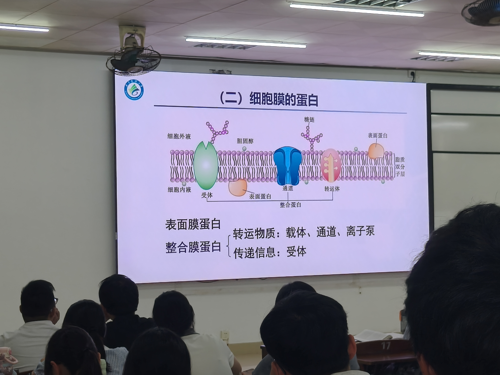

细胞膜的功能主要是通过**膜蛋白（membrane protein）**实现的。根据膜蛋白在膜上的存在方式，可将其分为：

| 分类 | 占膜蛋白总量 | 特点 | 举例 |
|------|------------|------|------|
| **表面膜蛋白（peripheral membrane protein）** | 20%~30% | 主要附着于细胞膜的内表面，以肽链非共价结合在膜表面 | 膜骨架蛋白、锚定蛋白 |
| **整合膜蛋白（integral membrane protein）** | 70%~80% | 肽链一次或反复多次穿越脂质双层 | 载体、通道、离子泵、G蛋白耦联受体 |

【考点】老师原话："与物质转运功能和受体功能有关的蛋白都属于整合膜蛋白……是镶嵌在细胞膜上面，跟物质转运相关的载体、通道，以及离子泵、受体都属于整合膜蛋白。"

整合膜蛋白分子都有一个贯穿脂质双层的α-螺旋结构，具有特定的物质转运或信号转导功能。表面膜蛋白则主要起维持膜结构、锚定膜蛋白位置的作用。

### 2.4 细胞膜的糖类

细胞膜中的糖类主要是一些寡糖和多糖，以共价键的形式与膜蛋白或膜脂质结合形成**糖蛋白（glycoprotein）**或**糖脂（glycolipid）**。大多数整合膜蛋白都是糖蛋白。糖链分布在细胞膜的**外表面**，可作为分子标记参与细胞识别和信息传递（如ABO血型抗原）。

---

## 三、跨细胞膜的物质转运——总论

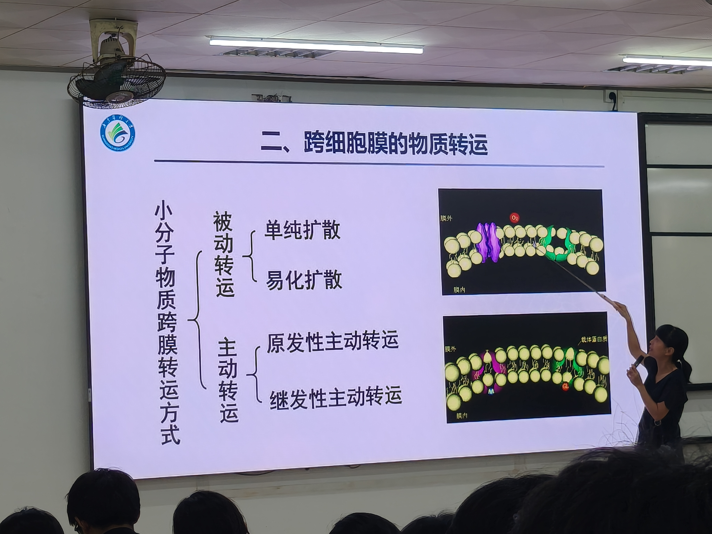

细胞膜的脂质双层是一个天然屏障，又能选择性地进行物质转运，以满足细胞的正常生命活动。根据转运物质的分子量大小和转运方式的不同，跨膜物质转运可分为两大类：

### 3.1 小分子物质的跨膜转运

| 转运方式 | 是否耗能 | 方向 | 膜蛋白 |
|---------|---------|------|--------|
| **被动转运（passive transport）** | 不消耗能量 | 顺浓度差/电位差（从高到低） | 经通道、经载体 |
| ├─ 单纯扩散 | 不耗能 | 脂溶性物质直接穿过脂质双层 | 无 |
| └─ 易化扩散 | 不耗能 | 非脂溶性物质需膜蛋白帮助 | 通道/载体 |
| **主动转运（active transport）** | 消耗ATP | 逆浓度差/电位差（从低到高） | 离子泵/转运体 |
| ├─ 原发性主动转运 | 直接分解ATP | 直接利用ATP | 钠泵、钙泵、质子泵 |
| └─ 继发性主动转运 | 间接利用ATP | 利用Na⁺/H⁺浓度梯度势能 | 同向/反向转运体 |

### 3.2 大分子物质的跨膜转运

大分子和颗粒物质进出细胞并不直接穿过细胞膜，而是由膜包围形成囊泡，通过膜包裹、膜融合和膜离断等一系列过程完成转运，称为**膜泡运输（vesicular transport）**，包括**出胞（exocytosis）**和**入胞（endocytosis）**。膜泡运输是一个主动过程，需要消耗能量（详见后续课程）。

【考点】老师原话："转运物质所需要的能量约占细胞耗能总量的2/3。"——细胞把大部分能量都花在了物质转运上。

---

## 四、被动转运

### 4.1 单纯扩散

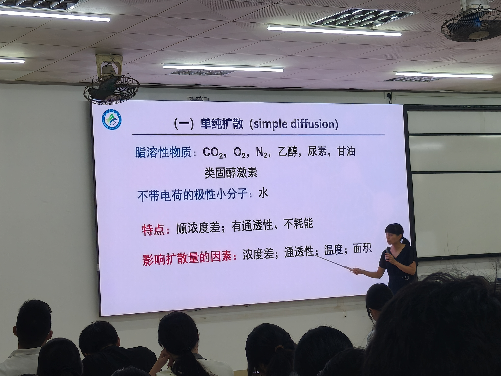

**单纯扩散（simple diffusion）** 是指物质从质膜的高浓度一侧通过脂质分子间隙向低浓度一侧进行的跨膜扩散。这是一种物理现象，没有生物学机制的参与，无需代谢耗能，属于被动转运。

**转运物质**：
- **脂溶性物质（非极性分子）**：**O₂、CO₂、N₂、类固醇激素、乙醇、尿素、甘油**等。这些物质疏水，能溶于膜脂质的疏水端，自由穿过脂质双层。
- **不带电荷的极性小分子**：**水（H₂O）**。虽然水分子是极性分子，但因其极小（分子量18），可以自由通过脂质双层的分子间隙。

**特点**：
1. **顺浓度差**（从高浓度→低浓度）
2. **有通透性**（取决于物质的脂溶性和大小）
3. **不耗能**（不消耗细胞代谢能量）

**影响扩散量的因素**：
1. **浓度差**：膜两侧同一物质的浓度梯度越大，扩散越快
2. **通透性**：膜对该物质的通透能力越强，扩散越快
3. **温度**：温度越高，分子运动越剧烈，扩散越快
4. **膜面积**：有效面积越大，扩散越快

【教材补充】教材第14~15页指出：根据相似相溶原理，高脂溶性物质容易穿越脂质双层。因此O₂、CO₂、N₂等高脂溶性小分子的跨膜扩散速度很快（如呼吸时肺毛细血管与肺泡之间的气体交换）。水是不带电荷的极性小分子，也能以单纯扩散的方式通过细胞膜，但脂质双层对水的通透性很低，故扩散速度很慢。

### 4.2 易化扩散

**易化扩散（facilitated diffusion）** 是指非脂溶性的小分子物质或带电离子在跨膜蛋白帮助下，顺浓度梯度和（或）电位梯度进行的跨膜转运。根据膜蛋白的不同，易化扩散可分为**经通道易化扩散**和**经载体易化扩散**两种形式。两者都属于被动转运，无ATP消耗。

#### 4.2.1 经通道易化扩散

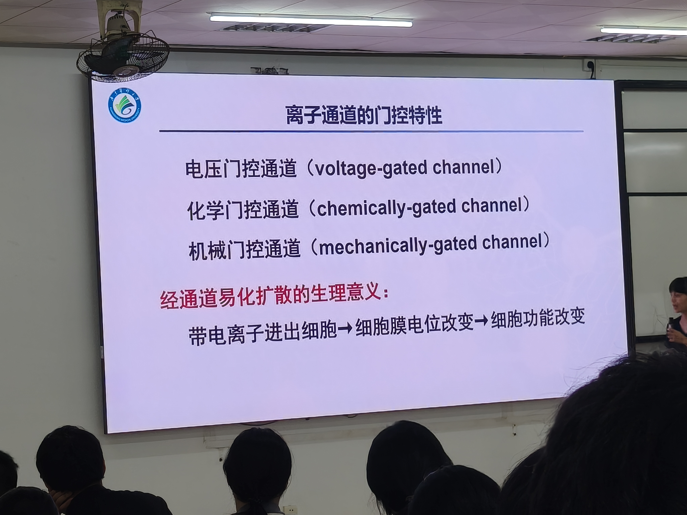

**经通道易化扩散（facilitated diffusion via channel）** 是指各种带电离子在通道蛋白的介导下，顺浓度梯度和（或）电位梯度的跨膜转运。

**通道蛋白（ion channel）** 贯穿脂质双层，中央有亲水性孔道（pore）。通道开放时，离子可从膜的高浓度一侧向低浓度一侧扩散，且离子通过时无需与通道蛋白结合，因此转运速率极快——每秒可达**10⁶~10⁸个**离子，远快于载体转运。

**离子通道的两个基本特征**：

1. **离子选择性（ion selectivity）**：每种通道只对一种或几种离子有较高的通透能力，对其他离子通透性很小或不通透。例如，钾通道对K⁺的通透性比Na⁺大1000倍以上；乙酰胆碱受体阳离子通道对Na⁺、K⁺高度通透，但对Cl⁻不能通透。

2. **门控特性（gating）**：大部分通道蛋白分子内有一些可移动的结构或化学基团，在通道开口处起"闸门"作用。根据闸门对不同刺激的敏感性，可将离子通道分为三类：

| 门控类型 | 定义 | 举例 |
|---------|------|------|
| **电压门控通道（voltage-gated ion channel）** | 受膜电位变化控制 | 神经轴突膜上的电压门控Na⁺通道 |
| **化学门控通道（chemically-gated ion channel）** | 受化学物质（配体）控制 | 骨骼肌终板膜上的N₂型乙酰胆碱受体阳离子通道 |
| **机械门控通道（mechanically-gated ion channel）** | 受机械刺激控制 | 耳蜗基底毛细胞上的机械门控通道 |

**经通道易化扩散的生理意义**：带电离子跨膜流动→细胞膜电位改变→细胞功能改变。这是细胞电活动（静息电位、动作电位）产生的基础，将在第3课详细学习。

【教材补充】教材第16页提到：有些通道始终处于开放状态，称为**非门控通道**，如神经纤维膜上的**钾漏通道（potassium leak channel）**、心肌细胞的内向整流钾通道（Iₖ₁通道）。这类通道是产生静息电位的重要基础。

#### 4.2.2 经载体易化扩散

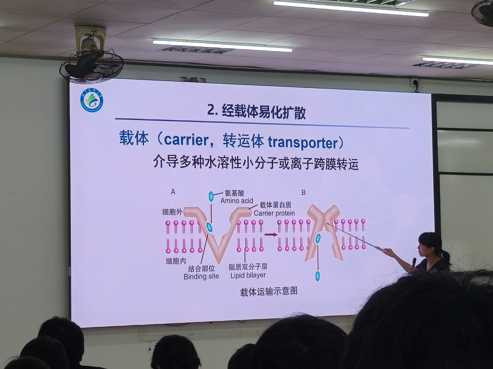

**经载体易化扩散（facilitated diffusion via carrier）** 是指水溶性小分子物质在载体蛋白介导下顺浓度梯度进行的跨膜转运。

**载体（carrier，也称转运体 transporter）** 是介导多种水溶性小分子或离子跨膜转运的一类整合膜蛋白。与通道或水通道不同，各种载体蛋白不存在贯穿整个细胞膜的孔道结构，但能与一个或几个溶质分子特异性结合。

**转运机制**（如图所示A→B→C过程）：
1. 被转运物（底物）在膜的一侧与载体蛋白的**结合位点**结合
2. 载体蛋白发生**构象改变**，将底物翻转至对侧
3. 底物与载体蛋白解离，释放到膜的另一侧

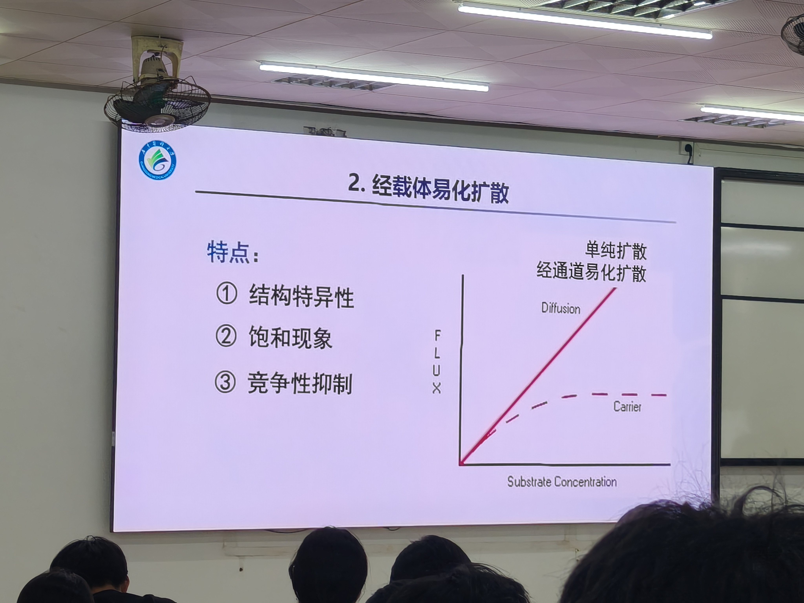

**经载体易化扩散的三个重要特点**：

| 特点 | 解释 | 机制 |
|------|------|------|
| **① 结构特异性** | 每种载体只能识别并结合具有特定化学结构的底物 | 例如，葡萄糖转运体对右旋葡萄糖转运远快于左旋葡萄糖 |
| **② 饱和现象（saturation）** | 当底物浓度增加到一定程度时，转运速率不再增加，达到最大值Vmax | 膜上载体蛋白数量有限，当所有载体都被结合后（饱和），转运速率达到上限 |
| **③ 竞争性抑制（competitive inhibition）** | 若两种结构相似的物质都能被同一载体转运，加入浓度较高者会抑制浓度较低者的转运 | 两种底物竞争同一结合位点 |

**饱和现象的图解**：单纯扩散的转运速率与底物浓度呈**直线关系**（无上限）；而经载体易化扩散的转运速率随底物浓度升高逐渐趋于平坦，最终达到**最大转运速率（Vmax）**。转运速率达到Vmax一半时的底物浓度称为**Km（米氏常数）**，Km越小表示载体对底物的亲和力越高、转运效率越高。

**典型举例**：
- **葡萄糖经GLUT（葡萄糖转运体）进入细胞**：GLUT1分布于几乎所有细胞，GLUT4分布于骨骼肌和脂肪组织，受胰岛素调控
- **氨基酸**经相应载体进入细胞

【教材补充】教材第17页表2-1列出了常见葡萄糖转运体（GLUT）的种类和分布：GLUT1（几乎所有细胞，基础葡萄糖转运）、GLUT2（肝细胞、胰岛β细胞，双向转运）、GLUT3（神经元）、GLUT4（骨骼肌、心肌和脂肪组织，介导葡萄糖向肌细胞和脂肪细胞的单向转运）。教材特别指出：有些糖尿病患者伴有GLUT4数量或功能降低，即使胰岛素水平正常但仍不能有效转运葡萄糖，出现**胰岛素抵抗**。

### 4.3 单纯扩散与易化扩散对比

| 比较项目 | 单纯扩散 | 经通道易化扩散 | 经载体易化扩散 |
|---------|---------|--------------|--------------|
| **转运物质** | 脂溶性小分子（O₂、CO₂、类固醇等） | 带电离子（Na⁺、K⁺、Ca²⁺等） | 水溶性小分子（葡萄糖、氨基酸等） |
| **膜蛋白** | 不需要 | 通道蛋白 | 载体蛋白 |
| **浓度梯度** | 顺浓度差 | 顺浓度差和电位差 | 顺浓度差 |
| **是否耗能** | 不耗能 | 不耗能 | 不耗能 |
| **转运速率** | 快 | 极快（10⁶~10⁸/s） | 慢（200~50000/s） |
| **饱和现象** | 无 | 无（但受通道开放数影响） | **有** |
| **结构特异性** | 无 | 有（对离子选择性） | **强** |
| **竞争性抑制** | 无 | 无 | **有** |
| **门控特性** | 无 | **有**（电压/化学/机械门控） | 无 |

---

## 五、主动转运——总论

**主动转运（active transport）** 是指某些物质在膜蛋白的帮助下，由细胞代谢提供能量而进行的逆浓度梯度和（或）电位梯度的跨膜转运。主动转运是各种细胞膜最重要的功能活动之一。

**分类**：根据膜蛋白是否直接消耗能量，主动转运可分为：
- **原发性主动转运（primary active transport）**：直接利用ATP分解供能
- **继发性主动转运（secondary active transport）**：间接利用ATP（利用Na⁺或H⁺浓度梯度势能）

---

## 六、原发性主动转运——钠-钾泵（重点中的重点）

### 6.1 钠泵的基本概念

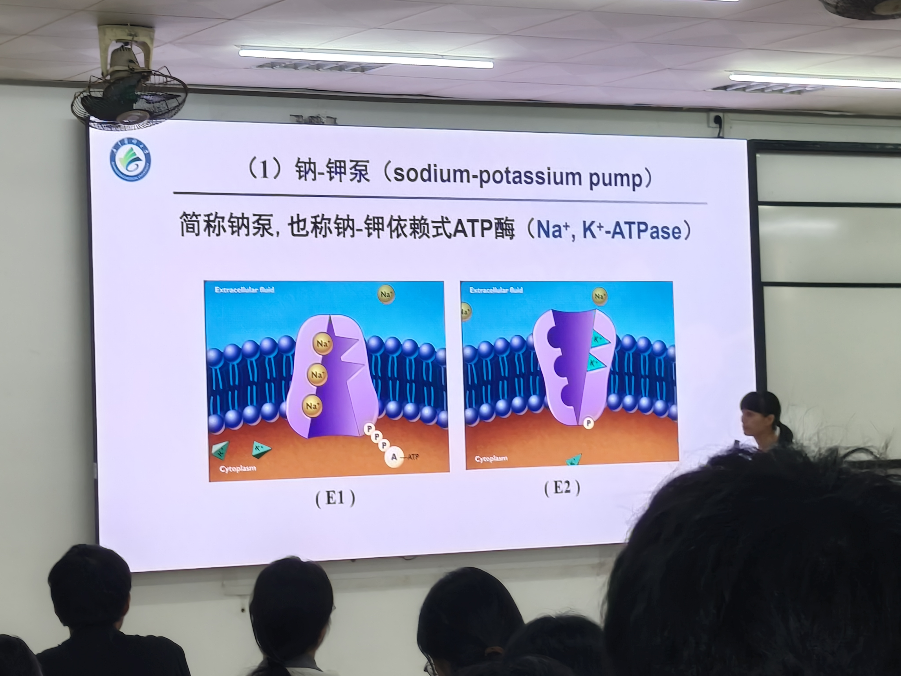

**钠-钾泵（sodium-potassium pump）**，简称**钠泵（sodium pump）**，也称**Na⁺-K⁺依赖性ATP酶（Na⁺, K⁺-ATPase）**。

钠泵是哺乳动物细胞膜中普遍存在的离子泵，由**α和β两个亚单位**组成二聚体。其中：
- **α亚单位**：催化亚单位，具有ATP酶活性，是实现转运功能的核心部分。胞内Na⁺结合位点在α亚单位上
- **β亚单位**：调节亚单位，起稳定结构的作用

【考点】老师原话："钠泵它的发现——生物化学家延斯·克里斯蒂安·斯科（Jens C. Skou）发现了钠泵，因此获得了1997年的诺贝尔化学奖。"

### 6.2 钠泵的工作过程

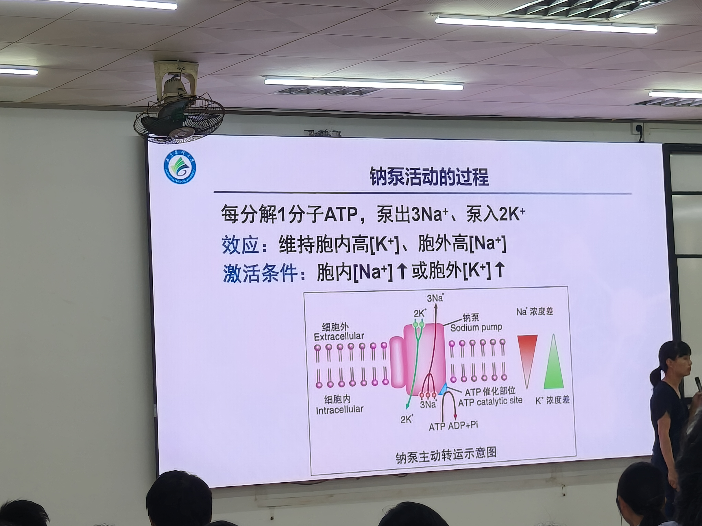

钠泵每分解1分子ATP，将**3个Na⁺移出胞外**、**2个K⁺移入胞内**——即**3Na⁺出胞、2K⁺入胞**。

**工作步骤（E1→E2构象循环）**：
1. **静息状态（E1构象）**：钠泵α亚单位面向细胞内，有3个Na⁺结合位点。当胞内Na⁺浓度升高时，3个Na⁺与E1构象结合
2. **ATP水解与磷酸化**：结合Na⁺后，钠泵催化ATP水解为ADP和磷酸（Pi），α亚单位被**磷酸化**
3. **构象改变（E1→E2）**：磷酸化导致α亚单位构象改变，转为E2构象——朝向细胞外，对Na⁺亲和力降低、对K⁺亲和力增高
4. **Na⁺释放、K⁺结合**：释放3个Na⁺到细胞外，同时结合2个胞外K⁺
5. **去磷酸化与构象恢复（E2→E1）**：结合K⁺后，钠泵去磷酸化，构象恢复为E1，朝向细胞内，对K⁺亲和力降低、对Na⁺亲和力恢复
6. **K⁺释放入胞**：将2个K⁺释放到胞内，完成一个循环

**激活条件**：
- 胞内**[Na⁺]升高**（通常胞内Na⁺浓度达10~30 mmol/L时激活）
- 胞外**[K⁺]升高**

### 6.3 钠泵活动的特点

| 项目 | 数值 | 说明 |
|------|------|------|
| **转运比例** | 3 Na⁺出 : 2 K⁺入 | 每次循环 |
| **分解ATP** | 1分子ATP/循环 | 直接耗能 |
| **循环周期** | 约**10毫秒** | 极快 |
| **最大转运速率** | 500个离子/秒 | |
| **生电效应** | 每次泵出3个正电荷、泵入2个正电荷 | 净出1个正电荷→超极化 |

【考点】老师原话："因为它每泵出来3个钠，但是只换进来2个钾——那相当于每一个循环出来了一个什么？一个正电荷。出去了一个正电荷，那你说电位是变大还是变小？变大——因为正电荷跑了，你相当于在负极嘛，那就是它超极化。"

### 6.4 钠泵活动的生理意义

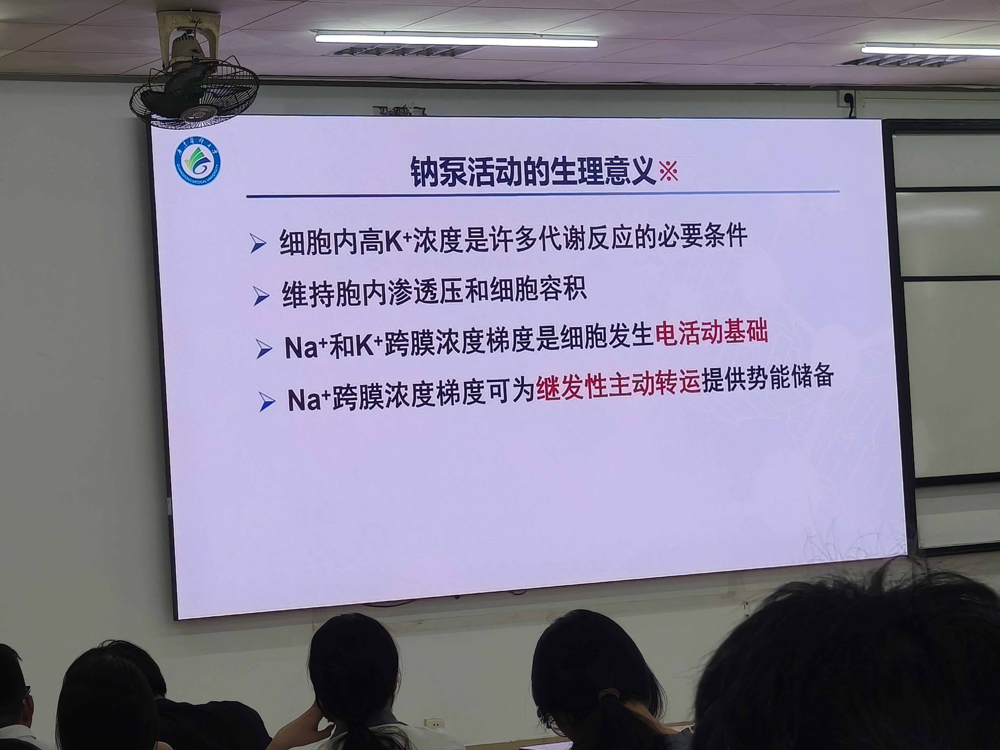

钠泵活动的生理意义非常重要，**几乎是本章的核心考点之一**：

1. **维持细胞内高K⁺状态，是胞质代谢反应的必要条件**
   细胞内许多代谢过程（如蛋白质合成、糖酵解关键酶活性）都需要高K⁺环境。如果钠泵活动被抑制（如强心苷），细胞内K⁺浓度下降，代谢活动受阻。

2. **维持细胞内渗透压和细胞容积**
   钠泵通过不断将漏入胞内的Na⁺转运出胞，维持细胞内外离子平衡和渗透压平衡，防止细胞水肿。如果钠泵活动被抑制，胞内Na⁺增多→渗透压升高→水进入细胞→细胞肿胀（严重时可导致细胞破裂）。

3. **Na⁺和K⁺的跨膜浓度梯度是细胞生物电活动的基础**
   钠泵维持的**胞外高Na⁺、胞内高K⁺**状态，是产生静息电位和动作电位的离子浓度梯度前提。没有钠泵持续活动建立的浓度梯度，静息电位和动作电位都无法产生。这一点将在第3课详细展开。

4. **Na⁺跨膜浓度梯度为继发性主动转运提供势能储备**
   钠泵维持的胞外高Na⁺状态本身就储存了势能。当Na⁺顺浓度梯度回流时，释放的能量可用于驱动其他物质逆浓度梯度转运（如葡萄糖在小肠上皮的吸收），这就是继发性主动转运的能量来源。

5. **钠泵活动的生电效应可直接使膜电位增大（超极化）**
   每次循环净出1个正电荷，直接使膜内负值增大，对静息电位有一定贡献（约占静息电位的5%~10%）。

### 6.5 钠泵的临床联系

【考点】老师原话："强心苷类药物，对吧？它们有抑制钠泵的作用。"

**临床应用——强心苷类药物**：
- 代表药物：**地高辛（digoxin）、洋地黄毒苷（digitoxin）、哇巴因（ouabain）**
- 作用机制：抑制心肌细胞膜上的Na⁺-K⁺-ATP酶（钠泵）
- 药理效应：抑制钠泵→胞内Na⁺增多→通过Na⁺-Ca²⁺交换体（继发性主动转运）使胞内Ca²⁺增多→心肌收缩力增强（正性肌力作用）
- 临床用途：治疗**充血性心力衰竭**
- 毒性反应：过量抑制钠泵→细胞内K⁺丢失→细胞静息电位减小→心肌自律性异常→**心律失常**（如室性早搏、室颤）。所以使用强心苷类药物时必须监测血钾浓度。

【教材补充】教材第19页指出：钠泵抑制剂**哇巴因（ouabain）**与钠泵E2状态下的细胞外部结构有较高的亲和力，可以改变钠泵构象，抑制钠泵活动。在哺乳动物神经细胞中，钠泵活动消耗的能量通常占细胞代谢产能的20%~30%，在某些功能活跃的神经细胞中甚至可占到70%——说明钠泵是极其耗能的"主动工作者"。

---

## 七、原发性主动转运的其他类型

### 7.1 钙泵

**钙泵（calcium pump）**，也称**Ca²⁺-ATP酶**，是哺乳动物细胞中广泛分布的另一种离子泵。钙泵不仅分布于质膜上，还集中分布于**肌质网（骨骼肌、心肌的肌质网）和内质网**上。

| 类型 | 全称 | 分布 | 作用 |
|------|------|------|------|
| **质膜钙ATP酶（PMCA）** | plasma membrane Ca²⁺-ATPase | 细胞膜上 | 将胞质Ca²⁺泵出细胞 |
| **肌质网/内质网钙ATP酶（SERCA）** | sarcoplasmic/endoplasmic reticulum Ca²⁺-ATPase | 肌质网/内质网膜上 | 将胞质Ca²⁺泵入肌质网/内质网储存 |

**工作机制**：与钠泵类似，钙泵也通过ATP磷酸化-去磷酸化的构象改变转运Ca²⁺。PMCA每分解1分子ATP，可将结合的1个Ca²⁺由胞质内转运至胞外；SERCA每分解1分子ATP，可将2个Ca²⁺从胞质内转运至肌质网内。

**生理意义**：两种钙泵共同作用，使胞质游离Ca²⁺浓度保持在**0.1~0.2 μmol/L**的低水平，仅为细胞外液Ca²⁺浓度（1~2 mmol/L）的**万分之一**。如此低浓度的游离Ca²⁺背景，使胞质内Ca²⁺浓度的微小增加都变得非常敏感，这是**肌肉收缩、腺体分泌、神经递质释放**等生理过程的关键信号机制。

**临床联系**：钙泵功能异常与肌肉收缩异常有关。当心肌细胞受损时（如心肌梗死），肌质网钙泵功能障碍，胞质Ca²⁺处理异常，可导致心肌舒张功能障碍。

### 7.2 质子泵

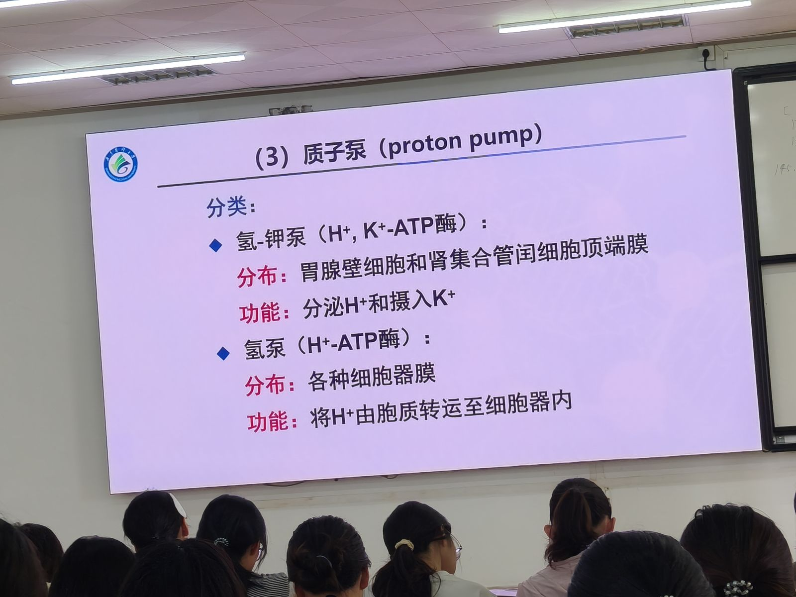

**质子泵（proton pump）** 是一类主要分布于**胃腺壁细胞和肾脏集合管闰细胞顶端膜**上的H⁺, K⁺-ATP酶，也称**钠钾泵**。

**主要类型**：
- **H⁺, K⁺-ATP酶（质子泵）**：分布于胃腺壁细胞和肾脏集合管闰细胞，由两个亚单位组成，与钠-钾泵同属一个家族。a亚单位的活动机制类似于钠-钾泵。质子泵的主要功能是分泌H⁺入胃酸和肾小管中，可逆浓度梯度将H⁺有效地分泌到胃腔或尿液中。

**临床联系**：
- **质子泵抑制剂（PPI）**：如**奥美拉唑（omeprazole）**，通过特异性抑制胃腺壁细胞的质子泵，阻断胃酸分泌，是治疗**胃溃疡和十二指肠溃疡**的一线药物。
- 教材记载：胃腺壁细胞的质子泵可逆**100万倍**的H⁺浓度差转运H⁺——这是极其强大的逆浓度梯度转运。

---

## 八、易混概念辨析

### 8.1 被动转运 vs 主动转运

| 比较项目 | 被动转运 | 主动转运 |
|---------|---------|---------|
| **浓度梯度方向** | 顺浓度差（高→低） | 逆浓度差（低→高） |
| **能量来源** | 物质自身的浓度梯度势能 | 细胞代谢产生的ATP |
| **是否需要膜蛋白** | 经通道/经载体需要，单纯扩散不需要 | 必须需要（离子泵/转运体） |
| **饱和现象** | 经载体有饱和，经通道/单纯扩散无 | 有（泵数量有限） |
| **举例** | O₂入胞、葡萄糖经GLUT入胞 | 钠泵、钙泵、葡萄糖小肠吸收 |

### 8.2 经通道易化扩散 vs 经载体易化扩散

| 比较项目 | 经通道易化扩散 | 经载体易化扩散 |
|---------|--------------|--------------|
| **转运物质** | 带电离子 | 水溶性小分子（葡萄糖、氨基酸） |
| **转运速率** | 极快（10⁶~10⁸/s） | 慢（200~50000/s） |
| **结构特异性** | 有（离子选择性） | 更强（特定化学结构） |
| **饱和现象** | 无 | **有** |
| **竞争性抑制** | 无 | **有** |
| **门控特性** | **有**（电压/化学/机械门控） | 无 |
| **构象改变** | 通道蛋白孔道开放/关闭 | 载体蛋白结合位点变构 |

### 8.3 原发性 vs 继发性主动转运

| 比较项目 | 原发性主动转运 | 继发性主动转运 |
|---------|--------------|--------------|
| **能量来源** | **直接分解ATP** | **间接利用Na⁺/H⁺浓度梯度势能**（最终仍来自ATP） |
| **转运蛋白** | 离子泵（钠泵、钙泵、质子泵） | 同向转运体、反向转运体 |
| **直接利用ATP** | 是 | 否（利用钠泵建立的Na⁺梯度） |
| **举例** | Na⁺-K⁺-ATP酶、Ca²⁺-ATP酶 | Na⁺-葡萄糖同向转运、Na⁺-Ca²⁺交换 |
| **抑制剂** | 哇巴因（钠泵抑制剂） | 哇巴因间接抑制继发性主动转运 |

> 继发性主动转运将在第3课详细讲解。

---

## 九、本课核心数字速记

| 项目 | 数值 | 备注 |
|------|------|------|
| 细胞膜厚度 | **7~8 nm** | |
| 膜脂质中磷脂占比 | **>70%** | 胆固醇<30%，糖脂<10% |
| 整合膜蛋白占膜蛋白 | **70%~80%** | 表面膜蛋白20%~30% |
| 经通道转运速率 | **10⁶~10⁸ 个/秒** | 极快 |
| 经载体转运速率 | **200~50000 个/秒** | 慢 |
| 钠泵循环转运比例 | **3 Na⁺出 : 2 K⁺入** | 每循环分解1 ATP |
| 钠泵循环周期 | **约10毫秒** | 最大速率500个离子/秒 |
| 钠泵耗能占比 | **20%~30%**（神经细胞可达70%） | |
| 细胞外Na⁺:细胞内Na⁺ | 约**10:1** | 胞外约145 mmol/L，胞内约15 mmol/L |
| 细胞内K⁺:细胞外K⁺ | 约**30:1** | 胞内约150 mmol/L，胞外约4~5.5 mmol/L |
| 胞质游离Ca²⁺ | **0.1~0.2 μmol/L** | 仅为胞外的万分之一 |
| 质子泵H⁺浓度梯度 | **100万倍** | 胃腺壁细胞 |
| 钠泵发现诺贝尔奖 | **1997年** | Jens C. Skou，诺贝尔化学奖 |
