# 生理学第3课：主动转运与细胞膜电活动

> 授课时间：2026-09-09 14:30
> 内容范围：继发性主动转运、小分子转运小结、细胞膜生物电现象（静息电位、动作电位）、电化学驱动力、钠学说证据、膜电导变化、锋电位机制、钠通道三状态
> 教材依据：《生理学》第10版，第二章第一节后半部分（教材第20~21页）和第二章第三节细胞的电活动（教材第28~36页）

---

## 一、继发性主动转运

### 1.1 定义

**继发性主动转运（secondary active transport）** 是指某些物质的主动转运不直接来自ATP的分解，而是利用原发性主动转运机制建立起的**Na⁺或H⁺的浓度梯度**，在Na⁺或H⁺顺浓度梯度扩散的同时，使其他物质逆浓度梯度和（或）电位梯度跨膜转运。这种间接利用ATP能量的主动转运过程即为继发性主动转运。

**关键理解**：继发性主动转运间接利用ATP，但最终的能量来源仍然是ATP——因为Na⁺浓度梯度是由钠泵（原发性主动转运）消耗ATP建立的。如果用哇巴因（钠泵抑制剂）抑制钠泵活动，Na⁺浓度梯度逐渐消失，继发性主动转运也会随之减弱甚至消失。

### 1.2 同向转运与反向转运

根据被转运物与Na⁺（或H⁺）转运方向的异同，继发性主动转运分为两种形式：

| 类型 | 定义 | 载体名称 | 举例 |
|------|------|---------|------|
| **同向转运（symport）** | 被转运物与Na⁺**向同一方向**跨膜 | 同向转运体（symporter） | Na⁺-葡萄糖同向转运、Na⁺-氨基酸同向转运 |
| **反向转运（antiport/exchange）** | 被转运物与Na⁺**向相反方向**跨膜 | 反向转运体/交换体（antiporter/exchanger） | Na⁺-Ca²⁺交换、Na⁺-H⁺交换 |

### 1.3 同向转运举例

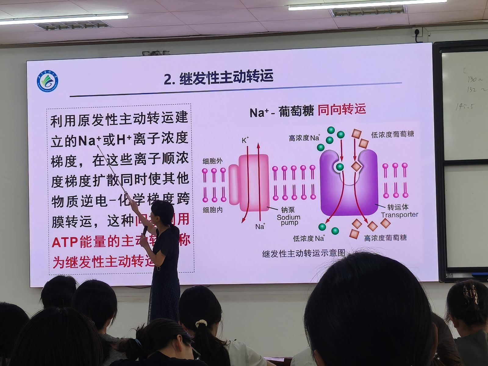

**Na⁺-葡萄糖同向转运体（SGLT）**：
- 分布：小肠黏膜上皮细胞顶端膜、肾小管上皮细胞顶端膜
- 工作机制：Na⁺顺浓度梯度从胞外进入胞内（顺电化学梯度，释放势能），同时葡萄糖**逆浓度梯度**被"带入"胞内
- 生理意义：这是**肠道吸收葡萄糖和肾小管重吸收葡萄糖**的主要机制——即使肠腔/小管液中葡萄糖浓度低于细胞内浓度，仍能被完全吸收

**其他同向转运体**：
- Na⁺-K⁺-2Cl⁻同向转运体：分布于肾小管髓袢升支粗段，参与NaCl的重吸收
- Na⁺-HCO₃⁻同向转运体：分布于多种上皮细胞
- Na⁺-I⁻同向转运体：分布于甲状腺滤泡上皮细胞，参与碘摄取

### 1.4 反向转运举例

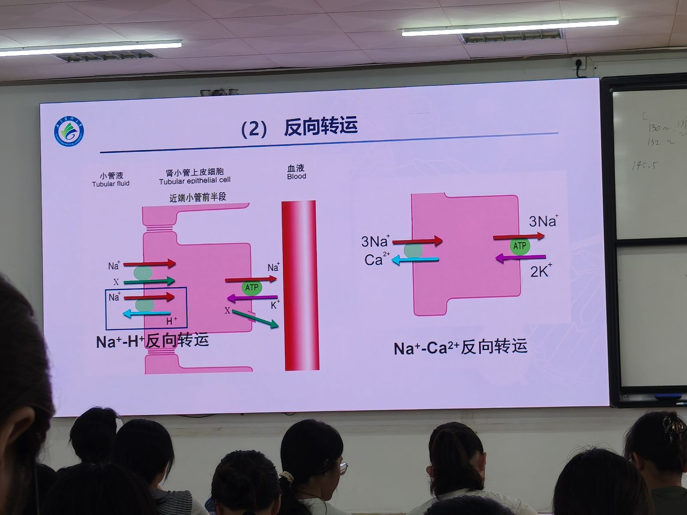

**Na⁺-Ca²⁺交换体（NCX）**：
- 分布：细胞膜上，尤其心肌细胞膜上丰富
- 工作机制：3个Na⁺顺浓度梯度入胞（释放势能），同时1个Ca²⁺逆浓度梯度出胞
- 生理意义：**心肌细胞舒张时将Ca²⁺排出胞外**，是维持胞内低Ca²⁺浓度的重要机制
- 临床联系：强心苷类药物抑制钠泵→胞内Na⁺增多→Na⁺-Ca²⁺交换活动减弱→胞内Ca²⁺排出减少→胞内Ca²⁺增多→心肌收缩力增强（这正是强心苷治疗心衰的药理机制，与第2课呼应）

**Na⁺-H⁺交换体（NHE）**：
- 分布：肾小管上皮细胞顶端膜
- 工作机制：Na⁺顺浓度梯度入胞，同时H⁺逆浓度梯度出胞
- 生理意义：**参与肾脏排酸保碱**，维持机体酸碱平衡

### 1.5 继发性主动转运与经载体易化扩散的区别

| 比较项目 | 继发性主动转运 | 经载体易化扩散 |
|---------|--------------|--------------|
| **能量来源** | 间接利用ATP（Na⁺梯度势能） | 不耗能，顺浓度差 |
| **转运方向** | 被转运物**逆浓度梯度** | 顺浓度梯度 |
| **是否利用Na⁺梯度** | **是** | 否 |
| **载体结构** | 可同时结合两种以上物质 | 通常结合一种底物 |
| **举例** | 葡萄糖小肠吸收、Na⁺-Ca²⁺交换 | 葡萄糖经GLUT进入骨骼肌细胞 |

---

## 二、小分子物质跨膜转运小结

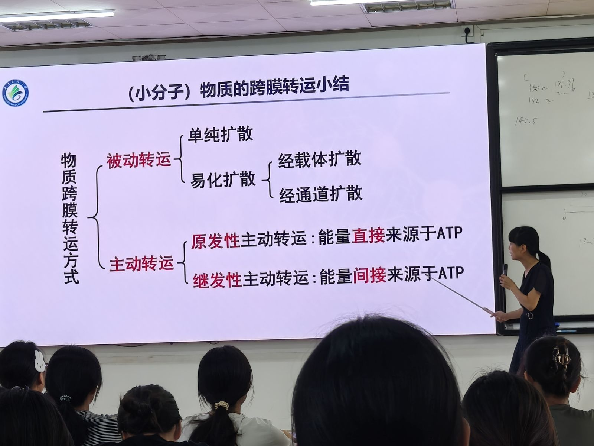

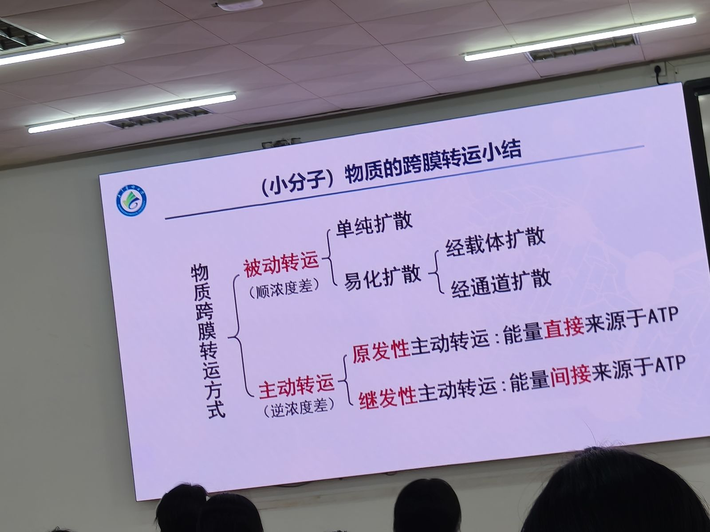

将三节课所学的小分子跨膜转运方式总结如下：

```
小分子跨膜转运
├─ 被动转运（不耗能，顺浓度差）
│   ├─ 单纯扩散：O₂、CO₂、类固醇、尿素、水（少量）
│   └─ 易化扩散
│       ├─ 经通道：Na⁺、K⁺、Ca²⁺等带电离子（门控特性）
│       └─ 经载体：葡萄糖、氨基酸（有饱和性、竞争性）
└─ 主动转运（耗能，逆浓度差）
    ├─ 原发性主动转运：直接分解ATP
    │   ├─ 钠泵（Na⁺-K⁺-ATP酶）：3Na⁺出/2K⁺入
    │   ├─ 钙泵（Ca²⁺-ATP酶）：胞质Ca²⁺↓
    │   └─ 质子泵（H⁺, K⁺-ATP酶）：胃酸分泌
    └─ 继发性主动转运：利用Na⁺梯度势能
        ├─ 同向转运：Na⁺-葡萄糖、Na⁺-氨基酸、Na⁺-K⁺-2Cl⁻
        └─ 反向转运：Na⁺-Ca²⁺、Na⁺-H⁺
```

【考点】老师强调："要注意区分这些转运方式的特点。它们各自转运什么物质，各自有什么特点，要分清楚。"

---

## 三、细胞膜的电活动——概述

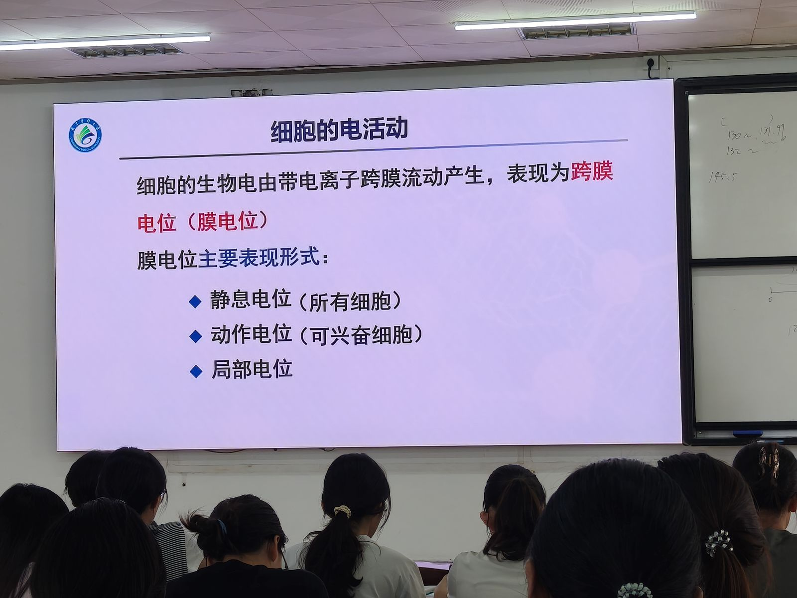

生物体在生命活动时常伴随电现象，称为**生物电（bioelectricity）**。细胞生物电是由一些带电离子（如Na⁺、K⁺、Cl⁻、Ca²⁺等）跨膜流动而产生的，表现为一定的**跨膜电位（transmembrane potential）**，即**膜电位（membrane potential）**。

根据膜电位的不同表现形式，生物电主要分为：

| 表现形式 | 定义 | 分布 |
|---------|------|------|
| **静息电位（resting potential, RP）** | 安静状态下存在于膜内外两侧的电位差 | **所有细胞**都有 |
| **动作电位（action potential, AP）** | 细胞受到有效刺激后产生的快速、可逆、可传播的电位变化 | **可兴奋细胞**（神经、肌细胞、部分腺细胞） |
| **局部电位** | 局部刺激产生的小幅度电位变化 | 可兴奋细胞局部 |

【考点】老师原话："动作电位它的基础就是我们的离子流动，也就是我们前面说的各种物质转运。"——物质转运和电活动是紧密联系的。

---

## 四、静息电位

### 4.1 静息电位的定义与记录

**静息电位（resting potential, RP）** 是指细胞在安静状态下（未受刺激时）存在于细胞膜内外两侧的电位差。

**记录方法**：参考电极置于细胞外液（接地，定义为0电位），记录电极刺入细胞内。当记录电极在细胞外时，示波器光点在零电位水平扫描，两电极间没有电位差；当记录电极插入细胞内的瞬间，荧光屏上的扫描线立即下移，表示电位降到零电位以下，并保持稳定。这种静息状态下存在于细胞膜内外两侧的电位差，称为静息膜电位。

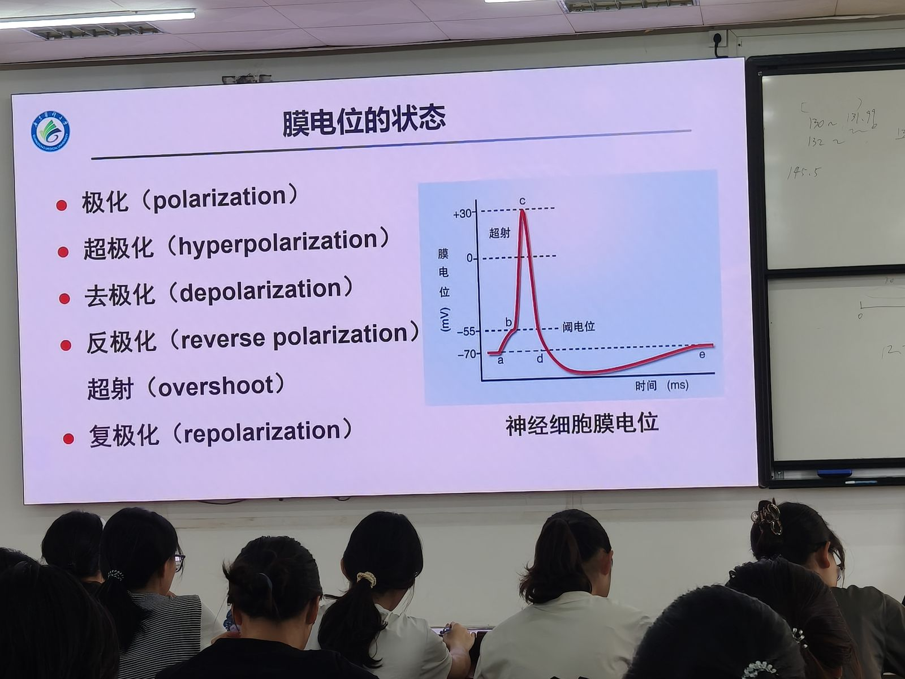

**典型数值**：
- 神经细胞：约 **-70 mV**
- 骨骼肌细胞：约 **-90 mV**
- 平滑肌细胞：约 **-55 mV**
- 红细胞：约 **-10 mV**

【考点】**"内负外正"**：静息电位时，膜内电位为负、膜外电位为正，这种状态称为**极化（polarization）**。

### 4.2 静息电位的相关状态术语

| 状态 | 定义 | 变化 |
|------|------|------|
| **极化（polarization）** | 静息电位时膜内负外正的稳定状态 | — |
| **去极化（depolarization）** | 膜电位负值减小（如从-70mV→-50mV） | 向0电位方向靠近 |
| **超极化（hyperpolarization）** | 膜电位负值增大（如从-70mV→-90mV） | 离0电位更远 |
| **复极化（repolarization）** | 去极化后再向静息电位方向恢复 | 恢复为极化状态 |
| **反极化（reverse polarization）** | 膜电位变为内正外负（如+30mV） | 极性反转 |
| **超射（overshoot）** | 膜电位大于0的部分（如+30mV中超过0的部分） | 反极化的顶端 |

### 4.3 静息电位的产生机制

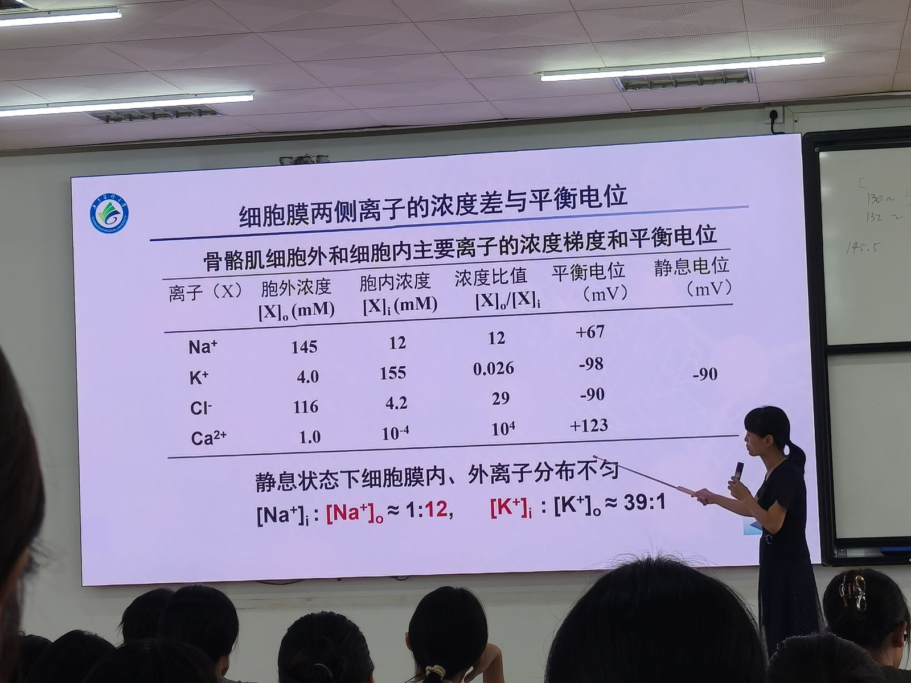

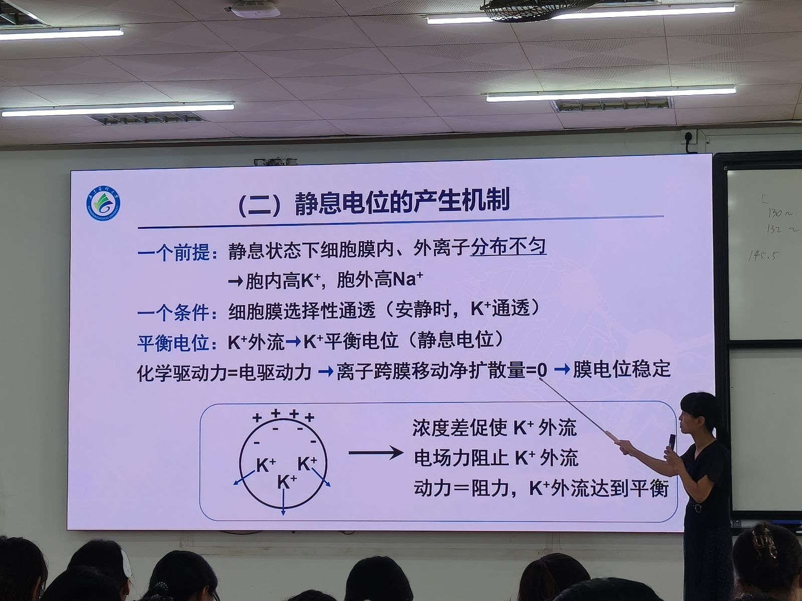

静息电位的产生机制可以归纳为"**一个前提、一个条件、一个结果**"：

**前提——细胞膜内外离子分布不均匀**：
- 细胞内高K⁺（约150 mmol/L），细胞外低K⁺（约4 mmol/L）——K⁺浓度比约**30~39:1**
- 细胞外高Na⁺（约145 mmol/L），细胞内低Na⁺（约15 mmol/L）——Na⁺浓度比约**10:1**
- 这种不均匀分布主要靠**钠泵**活动维持

**条件——安静时细胞膜对K⁺有选择性通透**：
- 安静状态下，细胞膜主要对**K⁺**有通透性（通过钾漏通道）
- 此时膜对Na⁺的通透性很低（仅为K⁺通透性的1/50~1/100）

**结果——K⁺外流形成K⁺平衡电位**：
- 由于膜内K⁺浓度远高于膜外，K⁺顺浓度梯度向膜外扩散
- K⁺外流时，膜内带负电的大分子（如蛋白质、磷酸根等阴离子）不能随K⁺外流而被"留"在膜内
- 因此，K⁺外流使膜内变负、膜外变正，形成**内负外正**的跨膜电位
- 这个电位差形成的电场力会**阻止**K⁺继续外流（因为膜外正电荷排斥带正电的K⁺继续外出）

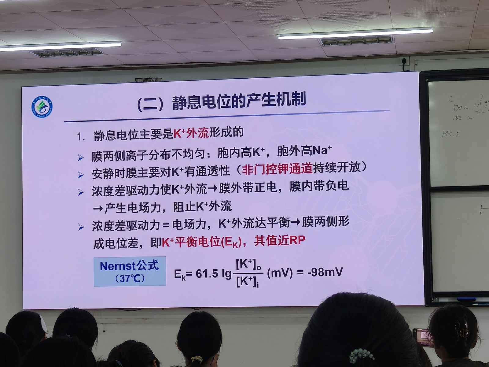

**平衡电位的概念**：当K⁺外流形成的电场力恰好等于浓度差推动的化学驱动力时，K⁺的净外流为零，此时的跨膜电位就是**K⁺平衡电位（E_K）**。

**Nernst公式（37℃）**：
$$E_X = 61.5 \log \frac{[X]_o}{[X]_i} \quad (\text{mV})$$

代入神经细胞K⁺浓度（[K⁺]ₒ=5.5 mmol/L，[K⁺]ᵢ=150 mmol/L）：
$$E_K = 61.5 \log \frac{5.5}{150} \approx -88 \text{ mV}$$

实验测得神经细胞静息电位约-70mV，**略大于（更接近于0）E_K（-88mV）**，这是因为安静时膜对Na⁺也有少量通透（少量Na⁺内流使膜电位略微去极化）。

【考点】老师原话："安静的时候钾通道是开放的。钾往外面跑——因为浓度差的作用，钾往外面跑。但是跑出去之后膜外的正电荷会怎么样？越来越多，它会阻止什么？阻止钾继续外移……当这两个力——化学驱动力和电场力相等的时候，钾离子的跨膜移动就达到了一个平衡。"

### 4.4 静息电位产生机制的总结

1. **钠泵**活动维持了膜内外Na⁺、K⁺的不均匀分布（浓度梯度）
2. 安静时膜对**K⁺**选择性通透（钾漏通道开放）
3. K⁺顺浓度梯度外流，形成**内负外正**的跨膜电位
4. 当化学驱动力=电驱动力时，K⁺净移动为零，此时的电位即**K⁺平衡电位（E_K）**
5. 静息电位的实际值略小于E_K（略偏正），因为有少量Na⁺内流和钠泵的生电效应

---

## 五、动作电位

### 5.1 动作电位的定义

**动作电位（action potential, AP）** 是指细胞受到一个**有效刺激**（阈刺激或阈上刺激）后，在静息电位基础上产生的一次**快速、可逆、可远距离传播**的电位波动。

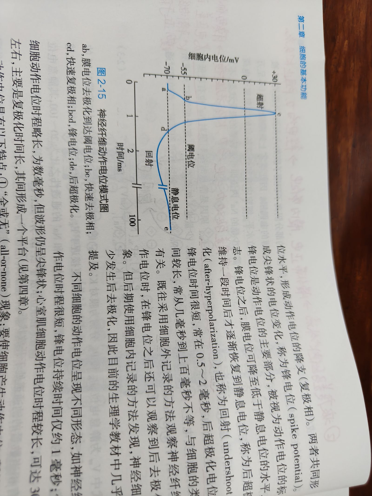

**动作电位的组成**（以神经纤维为例）：

| 时相 | 定义 | 离子机制 |
|------|------|---------|
| **去极相（上升支）** | 从静息电位-70mV快速去极化至+30mV（超射） | 电压门控Na⁺通道开放→Na⁺快速内流 |
| **复极相（下降支）** | 从+30mV快速恢复至-70mV | 电压门控K⁺通道开放→K⁺快速外流 |
| **锋电位（spike potential）** | 去极相+复极相的尖锋部分（ab段） | 动作电位的主要成分 |
| **后超极化（after-hyperpolarization）** | 复极后短暂超过静息电位的部分（de段） | K⁺通道延迟关闭，K⁺持续外流 |

### 5.2 动作电位的特征

1. **"全或无"现象（all or none）**：刺激强度未达到阈值时不产生动作电位；一旦达到阈值，即产生最大幅度的动作电位，不会随刺激强度增大而增大
2. **不衰减传播**：动作电位一旦产生，可沿细胞膜向周围传播，且幅度和形状不随传播距离增加而减小
3. **脉冲式发放**：连续刺激产生的多个动作电位之间总有一定间隔，不会融合

### 5.3 内向电流与外向电流

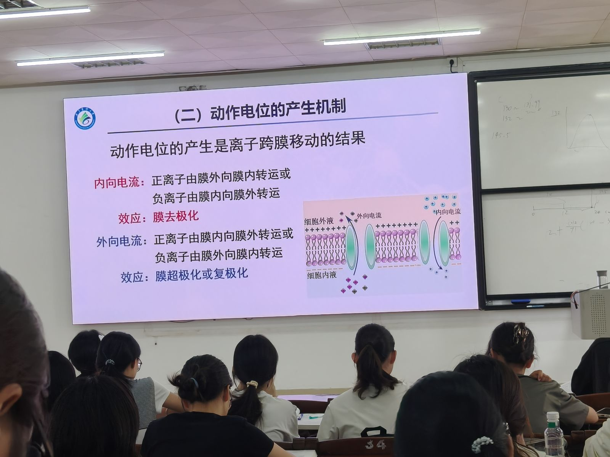

- **内向电流（inward current）**：正离子**内流**（如Na⁺内流）或负离子外流→使膜去极化（膜内负值减小）
- **外向电流（outward current）**：正离子**外流**（如K⁺外流）或负离子内流→使膜复极化或超极化（膜内负值增大）

动作电位的上升支由内向电流（Na⁺内流）引起，下降支由外向电流（K⁺外流）引起。

---

## 六、动作电位产生的离子机制

### 6.1 电化学驱动力

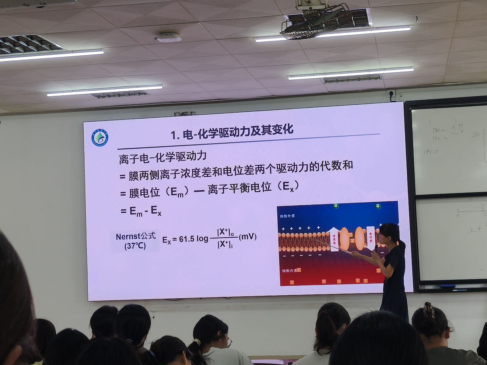

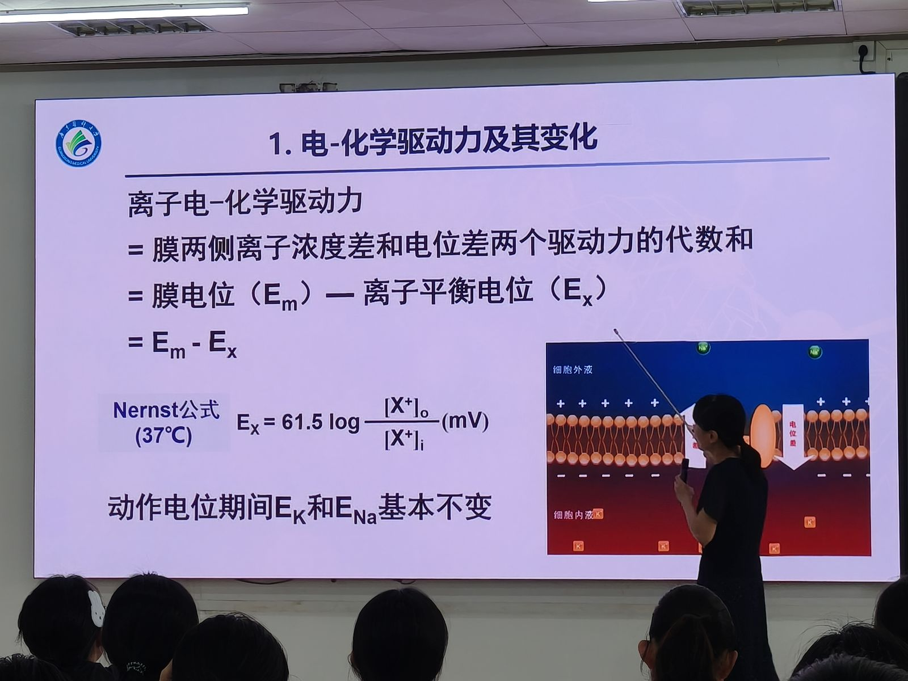

**电化学驱动力（electrochemical driving force）** 是指离子跨膜移动的净驱动力，等于**膜电位（V_m）与该离子平衡电位（E_X）之差**：

$$\text{电化学驱动力} = V_m - E_X$$

**关键理解**：
- 驱动力为正→离子外流（如K⁺在静息电位时，V_m=-70mV，E_K=-88mV，驱动力=+18mV→K⁺外流）
- 驱动力为负→离子内流（如Na⁺在静息电位时，V_m=-70mV，E_Na=+60mV，驱动力=-130mV→Na⁺内流）

**计算实例（神经细胞，V_m=-70mV）**：

| 离子 | 平衡电位E_X | 电化学驱动力 V_m - E_X | 方向 |
|------|-----------|---------------------|------|
| Na⁺ | +60 mV | **-130 mV** | 内流（很强的内向驱动力） |
| K⁺ | -88 mV | **+18 mV** | 外流（较弱的外向驱动力） |

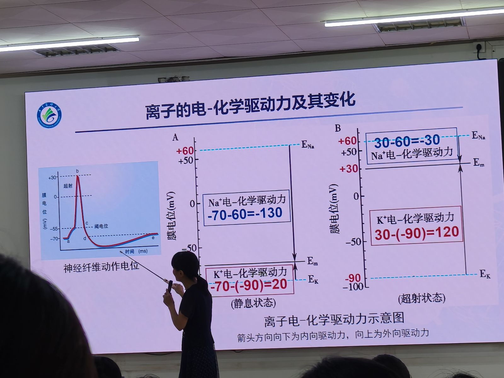

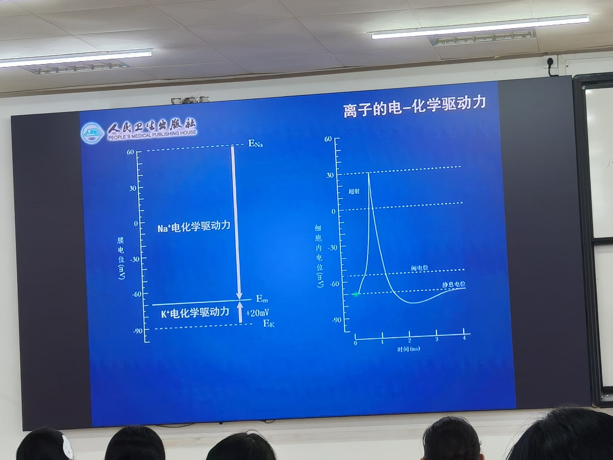

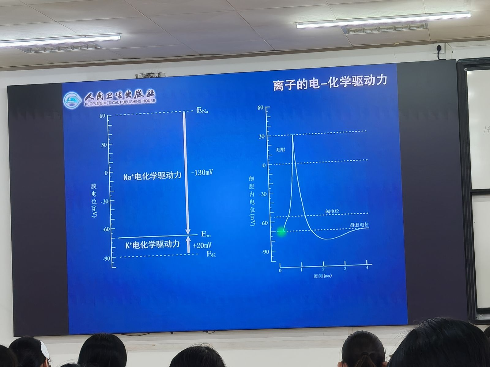

**在超射状态（V_m=+30mV）时**：
- Na⁺驱动力 = +30 - (+60) = **-30 mV**（仍为内流，但比静息时弱了很多）
- K⁺驱动力 = +30 - (-88) = **+118 mV**（很强的外向驱动力）

【考点】老师原话："在静息电位（极化）状态下，Na⁺的内向驱动力明显大于K⁺的外向驱动力……当膜电位去极化到顶峰时，K⁺的外向驱动力达到最大。"

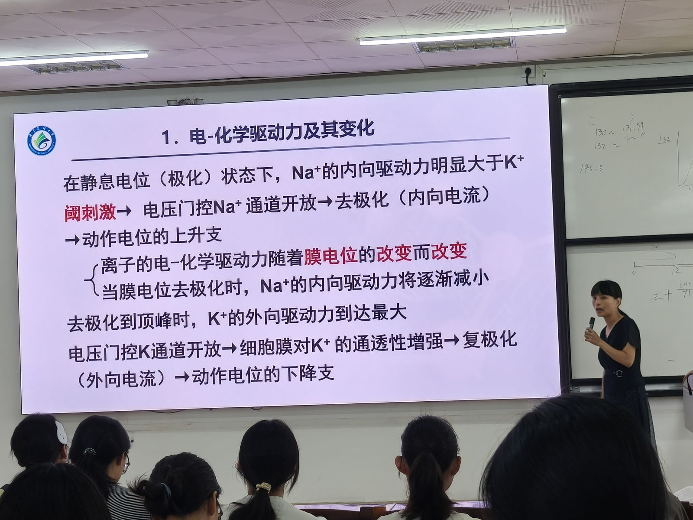

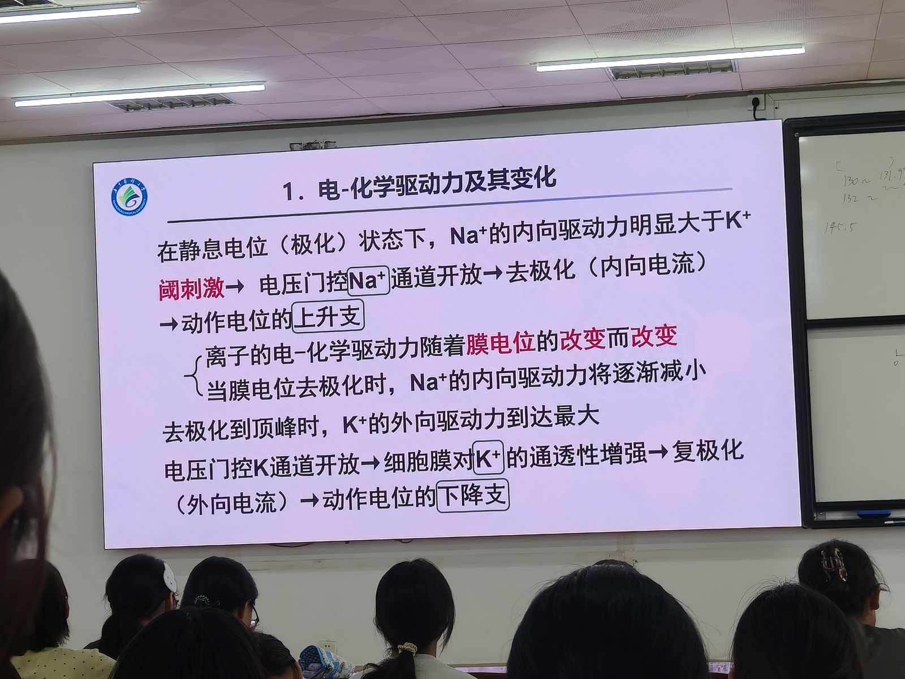

**动作电位期间E_K和E_Na基本不变**：因为离子浓度梯度在一次动作电位中几乎不发生改变（每次动作电位只有极少量Na⁺进入和K⁺出胞，浓度梯度的改变可忽略）。因此，动作电位期间电化学驱动力的变化完全来自**膜电位本身的变化**。

### 6.2 Na⁺学说的实验证据

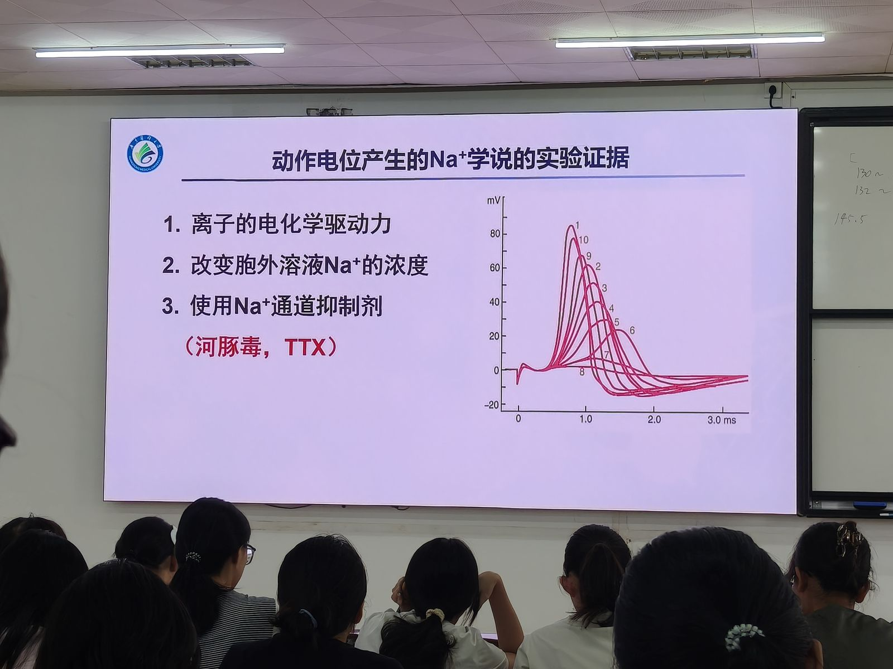

"动作电位的产生是Na⁺内流"这一学说的实验证据：

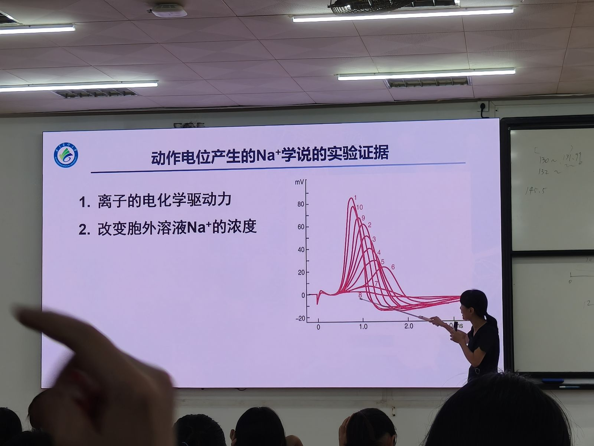

**证据1：改变胞外Na⁺浓度**
- 降低细胞外液Na⁺浓度→动作电位的超射值（峰值）减小
- 增加细胞外液Na⁺浓度→动作电位的超射值增大
- 峰值的变化与E_Na的变化一致→证明动作电位的去极相是Na⁺内流形成的

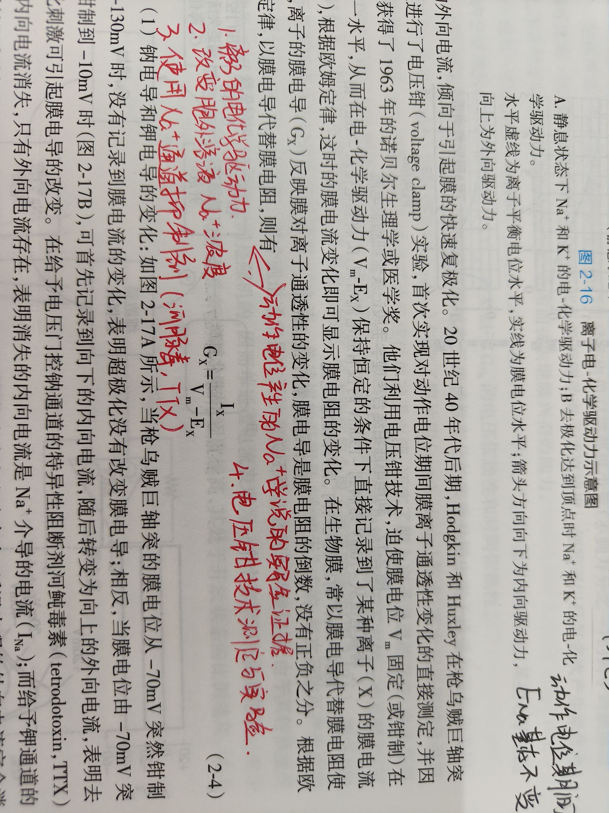

**证据2：使用Na⁺通道特异性抑制剂**
- **河豚毒（tetrodotoxin, TTX）**：特异性阻断电压门控Na⁺通道→动作电位的上升支消失（去极相不能产生）
- **四乙胺（tetraethylammonium, TEA）**：特异性阻断电压门控K⁺通道→动作电位的下降支延长（复极变慢）
- 这两种工具药分别"切掉"了上升支和下降支，直接证明了Na⁺内流负责上升支、K⁺外流负责下降支

**证据3：电压钳（voltage clamp）实验直接记录离子电流**
- Hodgkin和Huxley利用电压钳技术，在1949~1952年间系统记录了枪乌贼巨大神经轴突的膜电流
- 发现去极化初期先出现短暂的**内向电流**（Na⁺内流），随后出现延迟的**外向电流**（K⁺外流）
- 这一发现使他们获得了**1963年诺贝尔生理学或医学奖**

【教材补充】教材第33页记载：Na⁺通道和K⁺通道的激活与失活动力学可以用膜电导G_X来定量描述：G_X = I_X / (V_m - E_X)。G_Na表现为快速一过性激活，激活后很快自动降低（失活）；G_K表现为缓慢激活，不会自动降低，随膜复极化才逐渐降低。

### 6.3 膜电导的电压依赖性和时间依赖性

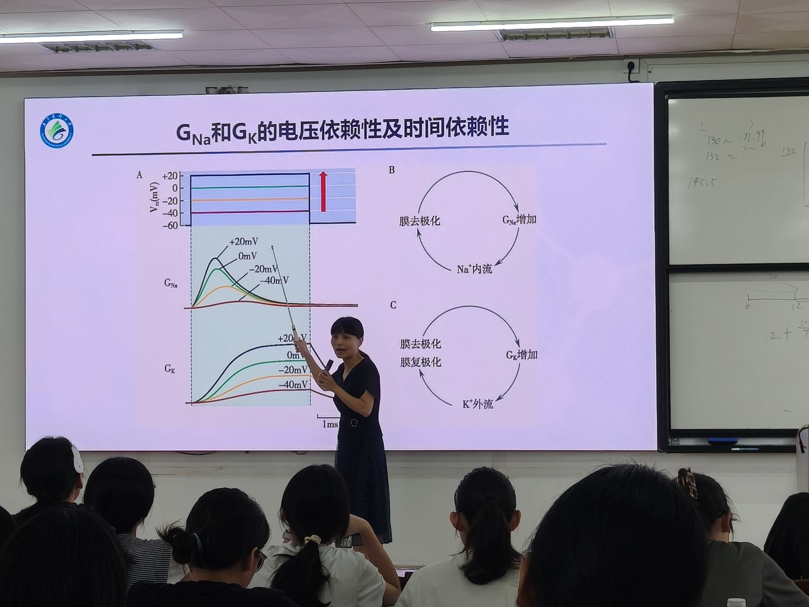

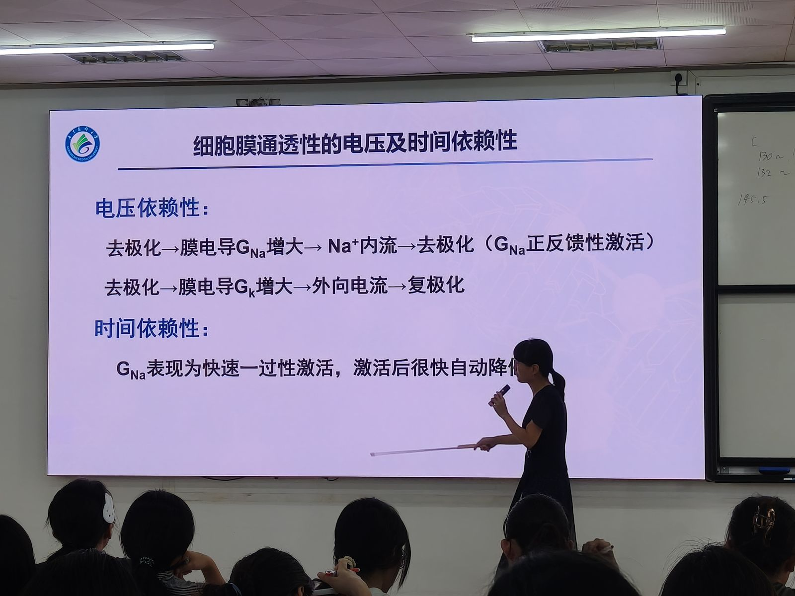

**电压依赖性**：
- 去极化→膜电导G_Na增大→Na⁺内流增多→进一步去极化（**G_Na正反馈性激活**）
- 去极化→膜电导G_K增大→K⁺外流增多→复极化（**G_K负反馈性调节**）

**时间依赖性**：
- **G_Na**：表现为**快速一过性激活**——去极化后迅速激活，但激活后**很快自动失活**（即使膜仍处于去极化状态）
- **G_K**：表现为**缓慢激活**——去极化后延迟激活，且**不会自动失活**，只有当膜复极化后G_K才逐渐降低

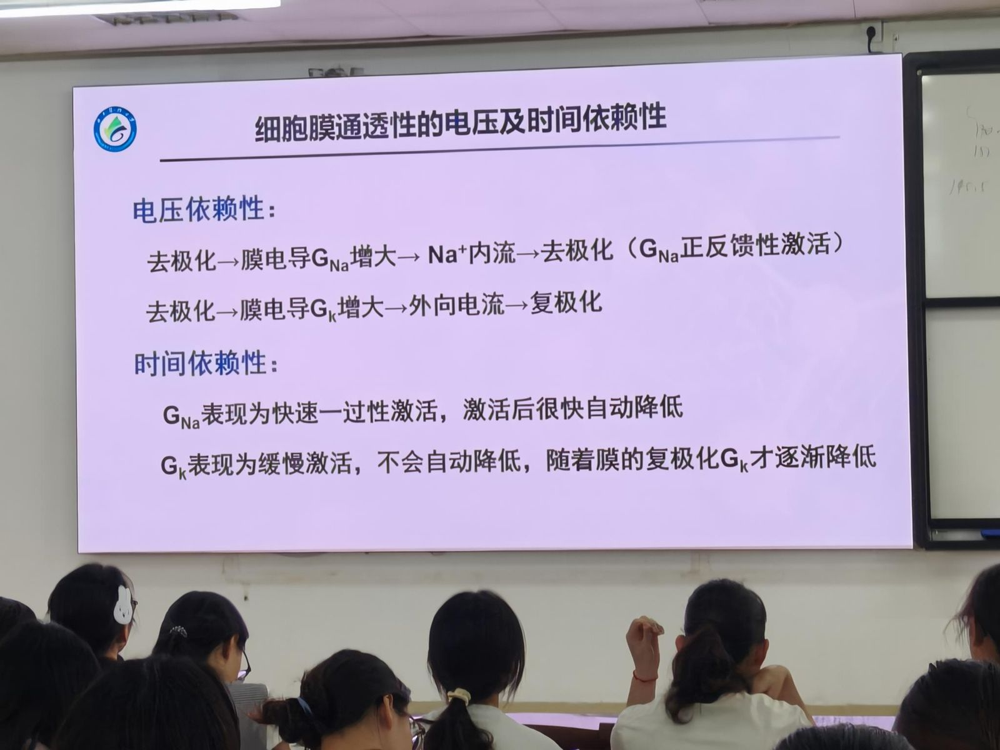

【教材补充】教材第34页图2-19介绍了Neher和Sakmann利用**膜片钳（patch clamp）**技术记录单通道电流的工作，他们因此获得了**1991年诺贝尔生理学或医学奖**。膜片钳技术可以记录单个离子通道的开放和关闭，揭示了通道活动的微观本质。

---

## 七、锋电位的产生机制

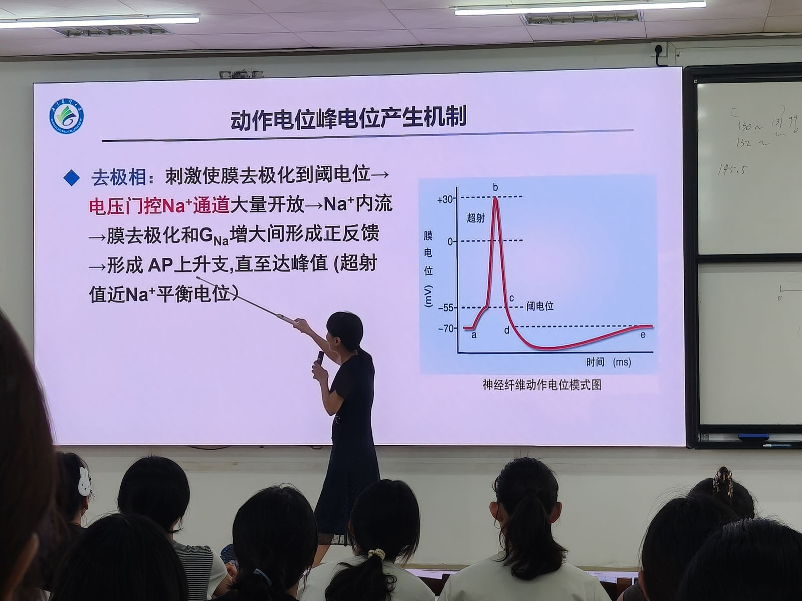

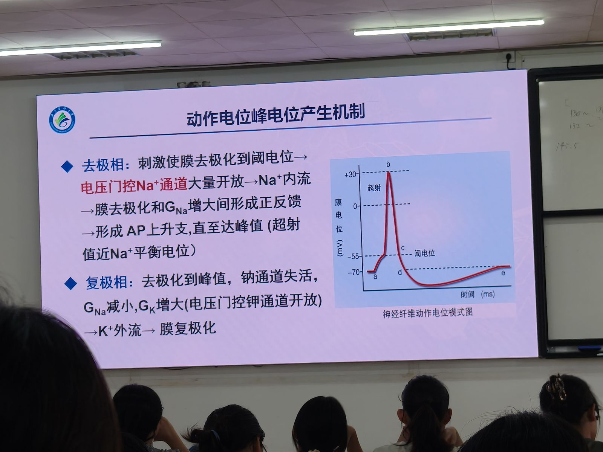

### 7.1 去极相（上升支）

**过程**：
1. 刺激使膜去极化达到**阈电位（threshold potential）**——神经细胞约**-55mV**
2. 电压门控Na⁺通道大量开放
3. Na⁺顺电化学驱动力快速内流
4. Na⁺内流使膜进一步去极化→更多Na⁺通道开放→更多Na⁺内流……形成**正反馈**（再生性循环）
5. 膜电位迅速去极化，直至接近**Na⁺平衡电位（E_Na≈+60mV）**——动作电位峰值

**关键**：从阈电位到动作电位峰值的过程是一个**正反馈**过程，一旦启动就不可逆转，迅速完成。

### 7.2 复极相（下降支）

**过程**：
1. Na⁺通道快速**失活**（G_Na自动下降）
2. 电压门控K⁺通道延迟激活（G_K缓慢上升）
3. K⁺顺电化学驱动力快速外流
4. 膜电位从峰值迅速向静息电位方向恢复
5. 最终回到静息电位水平

### 7.3 后超极化

复极相结束后，G_K仍维持较高水平一小段时间，K⁺持续外流使膜电位短暂**超过静息电位**（更负），称为**后超极化**。随后G_K逐渐降低，钠泵活动将内流的Na⁺泵出、外流的K⁺泵入，恢复初始离子分布。

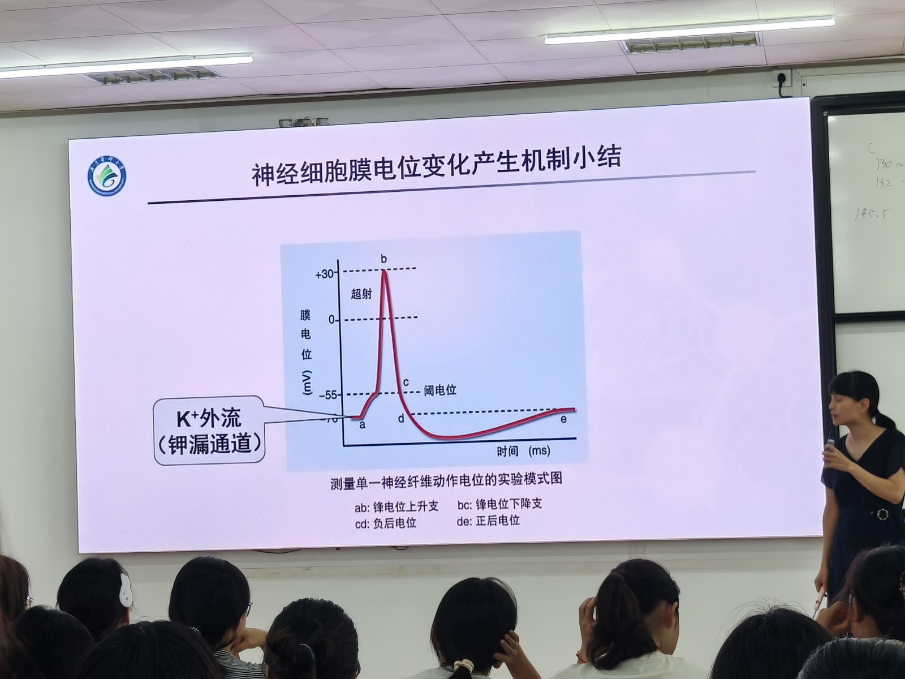

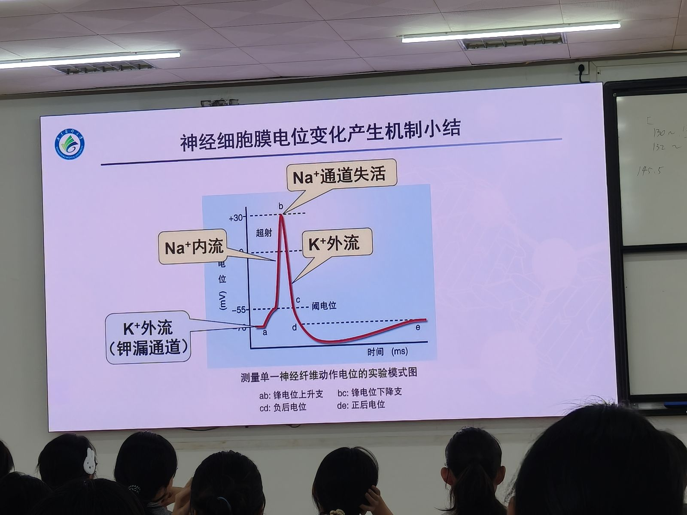

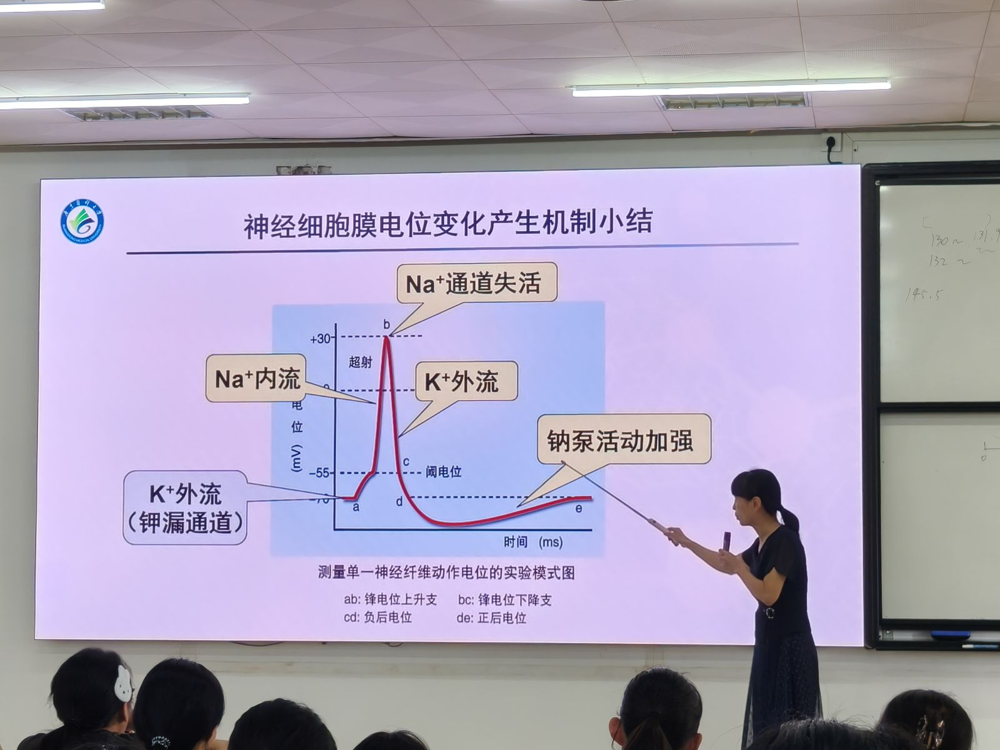

---

## 八、钠通道的功能状态

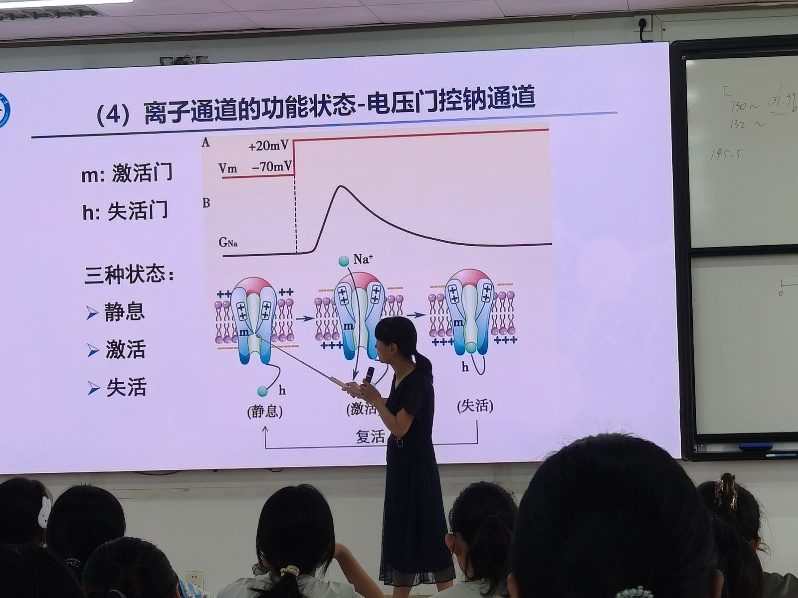

【教材补充】教材第35页图2-20详细描述了电压门控钠通道的三个功能状态：

| 状态 | 别称 | 门控状态 | 功能 |
|------|------|---------|------|
| **静息态（resting state）** | 备用状态 | m门（激活门）关闭，h门（失活门）开放 | 可被激活，接受刺激后可开放 |
| **激活态（activated state）** | 开放状态 | m门开放，h门开放 | Na⁺通道开放，Na⁺内流 |
| **失活态（inactivated state）** | 关闭但不可用 | m门开放，h门关闭 | 不能被激活，即使强刺激也不能开放 |

**关键理解**：
- **静息态→激活态**：去极化使m门（激活门）迅速开放→Na⁺内流
- **激活态→失活态**：h门（失活门）缓慢关闭→Na⁺通道关闭
- **失活态→静息态**：必须等膜复极化（恢复到静息电位水平）后，h门才能重新开放、m门关闭，钠通道才能"复活"回到静息态

**临床联系——局部麻醉药**：

【教材补充】教材第35页指出：局部麻醉药如**普鲁卡因、利多卡因、丁卡因**等可以暂时阻断神经纤维膜上的Na⁺通道，阻断动作电位的产生和痛觉的传导。其机制是这些药物优先结合并**锁定钠通道于失活态**，使通道不能复活为静息态，从而阻断兴奋传导。

**临床联系——低钙惊厥**：

【教材补充】教材第35页记载：细胞外Ca²⁺水平可影响钠通道的状态。当细胞外Ca²⁺浓度升高时，可减小膜对Na⁺的通透性，使阈电位上移，细胞兴奋性降低；相反，细胞外Ca²⁺浓度降低，可使阈电位下移，向静息电位水平靠近，细胞的兴奋性升高——**低钙惊厥**就是由此产生的。

---

## 九、阈电位与局部电位

### 9.1 阈电位

**阈电位（threshold potential）** 是指细胞去极化达到**刚好能触发动作电位**的临界膜电位水平。一般比静息电位小**10~20 mV**。

- 神经细胞静息电位约**-70 mV**，阈电位约**-55 mV**
- 阈电位不是细胞本身固有的电位值，而是取决于**电压门控Na⁺通道在膜中的分布密度、功能状态及细胞外Ca²⁺水平**

【教材补充】教材第35页指出：阈电位水平是影响细胞兴奋性的最重要因素。钠离子通道密度较大时，只需较小的膜去极化即可形成较大的Na⁺电流，因此阈电位水平较低、更接近静息电位，膜兴奋性较高。

### 9.2 局部电位

**局部电位（local potential）** 是指由阈下刺激引起的、局限在受刺激部位的、不能远距离传播的小幅度电位变化。

**局部电位的特点**：
1. **不是"全或无"**：随刺激强度增大而增大
2. **电紧张性扩布**：只能在局部形成电紧张性扩布，随距离增大而衰减
3. **可以总和**：多个局部电位可以在时间上（时间性总和）或空间上（空间性总和）叠加，一旦总和达到阈电位即可触发动作电位

---

## 十、易混概念辨析

### 10.1 静息电位 vs 动作电位

| 比较项目 | 静息电位（RP） | 动作电位（AP） |
|---------|--------------|--------------|
| **状态** | 安静未受刺激时 | 受有效刺激后产生 |
| **电位水平** | 稳定在-70mV（神经） | 快速波动：-70→+30→-70mV |
| **离子基础** | K⁺外流为主（钾漏通道） | Na⁺内流（上升支）+ K⁺外流（下降支） |
| **通道类型** | 非门控钾漏通道 | 电压门控Na⁺/K⁺通道 |
| **"全或无"** | 不涉及 | **有**（阈下刺激不产生） |
| **传播** | 不传播 | **不衰减传播** |
| **能量消耗** | 钠泵维持梯度（持续耗能） | 离子顺梯度流动（被动），恢复靠钠泵 |

### 10.2 阈电位 vs 锋电位

| 比较项目 | 阈电位 | 锋电位 |
|---------|--------|--------|
| **定义** | 触发动作电位的临界膜电位 | 动作电位的尖锋部分（去极相+复极相） |
| **数值** | 约-55mV（比RP小10~20mV） | 从-55mV到+30mV再回到-70mV |
| **性质** | 一个电位水平（阈值） | 一段电位变化过程 |
| **关系** | 去极化达到阈电位→触发锋电位 | 锋电位是动作电位的主要成分 |

### 10.3 内向电流 vs 外向电流

| 类型 | 离子方向 | 对膜电位的影响 | 主要发生时相 |
|------|---------|--------------|------------|
| **内向电流** | 正离子内流（Na⁺内流）或负离子外流 | **去极化**（膜内负值减小） | 动作电位上升支 |
| **外向电流** | 正离子外流（K⁺外流）或负离子内流 | **复极化/超极化**（膜内负值增大） | 动作电位下降支、后超极化 |

### 10.4 钠通道三状态对比

| 状态 | m门（激活门） | h门（失活门） | 是否可被激活 |
|------|-------------|-------------|------------|
| **静息态** | 关闭 | 开放 | **是**（接受去极化刺激即开放） |
| **激活态** | 开放 | 开放 | —（已开放，Na⁺内流） |
| **失活态** | 开放 | **关闭** | **否**（即使强刺激也不能开放） |

---

## 十一、临床联系汇总

| 知识点 | 临床应用 | 机制 |
|--------|---------|------|
| **钠泵抑制** | 强心苷类（地高辛、洋地黄）治疗心衰 | 抑制Na⁺-K⁺-ATP酶→胞内Na⁺↑→Na⁺-Ca²⁺交换↓→胞内Ca²⁺↑→心肌收缩力↑ |
| **Na⁺通道阻断** | 局部麻醉药（普鲁卡因、利多卡因、丁卡因） | 阻断电压门控Na⁺通道→动作电位不能产生和传导→痛觉传导阻滞 |
| **Na⁺通道阻断** | 河豚毒（TTX）→实验工具药 | 特异性阻断Na⁺通道，动作电位上升支消失 |
| **K⁺通道阻断** | 四乙胺（TEA）→实验工具药 | 特异性阻断K⁺通道，动作电位复极相延长 |
| **K⁺通道与心律失常** | Ⅲ类抗心律失常药（胺碘酮） | 阻断K⁺通道→延长复极→延长动作电位时程和有效不应期 |
| **钙泵与肌肉舒张** | 心肌舒张功能障碍 | 肌质网钙泵（SERCA）功能↓→胞质Ca²⁺不能及时回收→舒张迟缓 |
| **质子泵抑制** | 奥美拉唑（PPI）治疗消化性溃疡 | 抑制胃壁细胞H⁺,K⁺-ATP酶→胃酸分泌↓ |
| **低钙惊厥** | 低血钙引起抽搐 | 细胞外Ca²⁺↓→阈电位下移→兴奋性异常增高→惊厥 |
| **Na⁺通道病** | 遗传性长QT综合征 | 钠通道缺陷→复极异常→心律失常→猝死风险 |

---

## 十二、本课核心数字速记

| 项目 | 数值 | 备注 |
|------|------|------|
| 神经细胞静息电位 | **-70 mV** | 骨骼肌-90mV，平滑肌-55mV |
| 神经细胞阈电位 | **-55 mV** | 比静息电位小10~20mV |
| 动作电位超射值 | **+30 mV** | 接近E_Na（+60mV）但不完全达到 |
| Na⁺平衡电位（E_Na） | **+60 mV** | |
| K⁺平衡电位（E_K） | **-88 mV** | |
| 胞外Na⁺:胞内Na⁺ | **10:1** | 145:15 mmol/L |
| 胞内K⁺:胞外K⁺ | **30~39:1** | 150:5.5 mmol/L |
| 静息时Na⁺电化学驱动力 | **-130 mV** | 很强的内向驱动力 |
| 静息时K⁺电化学驱动力 | **+18 mV** | 较弱的外向驱动力 |
| 超射时K⁺电化学驱动力 | **+118 mV** | 很强的外向驱动力 |
| 神经细胞动作电位幅度 | **约100 mV** | 从-70mV到+30mV |
| 钠通道激活门（m门） | 快速开放 | |
| 钠通道失活门（h门） | 缓慢关闭 | |
| 膜片钳技术诺贝尔奖 | **1991年** | Neher和Sakmann |
| 电压钳技术诺贝尔奖 | **1963年** | Hodgkin和Huxley |
| 钠泵发现诺贝尔奖 | **1997年** | Jens C. Skou（化学奖） |
