# 生理学第4课：动作电位机制与肌细胞收缩（教材精讲版）

> 授课时间：2026-09-14 14:29~16:50（录音连续，无暂停）
> 内容范围：动作电位的触发/传播/兴奋性变化/电紧张电位与局部电位（第二章第三节后半）＋ 神经-肌肉接头/横纹肌结构/肌丝滑行/兴奋-收缩耦联/收缩效能（第二章第四节"肌细胞的收缩"）
> **教材依据：《生理学》第10版（人卫，罗自强/管又飞主编）教材第36~49页**，本总结以教材原文为主线精讲，课堂照片只保留关键辅助图
> 阅读建议：先读文字吃透机制，再看图验证理解；老师强调的考点标【考点】

---

## 第一部分 动作电位的触发（教材第36~37页）

### 1.1 刺激与阈强度

**为什么需要"刺激"？** 细胞安静时膜电位稳定在静息电位（约-70mV），要产生动作电位，必须先有一个外界变化（刺激）打破这个平衡。

**刺激三要素**（教材：刺激量通常包括三个参数）：
1. **刺激强度**——刺激的强弱
2. **刺激持续时间**——刺激作用时间
3. **强度-时间变化率**——刺激上升的快慢

> 实验中常用**电刺激**，因为它三参数容易控制、重复性好、对组织损伤小。

**阈强度（阈值）**：固定持续时间和变化率后，**能引起AP的最小刺激强度**。
- 阈刺激＝等于阈强度的刺激；阈上刺激>阈强度；阈下刺激<阈强度
- **有效刺激＝阈刺激或阈上刺激**

【理解】为什么必须有"阈值"？因为动作电位依赖电压门控钠通道的**正反馈激活**（钠通道开放→Na⁺内流→膜进一步去极化→更多钠通道开放）。只有足够强的刺激让足够多的钠通道同时开放，正反馈才能"滚雪球"一样启动。刺激太弱，开几个钠通道的电流会被钾漏通道的K⁺外流抵消，雪球滚不起来。

【考点】刺激三要素＝方波刺激图的**波高/波宽/斜率**。

### 1.2 阈电位——动作电位的"扳机"

**阈电位**：能触发动作电位的**膜电位临界值**（教材定义：能启动膜上钠通道正反馈激活和Na⁺再生性内流的临界膜电位）。

**关键数值**：阈电位通常比静息电位**小10~20mV**。神经细胞静息-70mV → 阈电位约**-55mV**。

【理解】"全或无"的机制就在这：刺激强度只决定膜电位能否**到达阈电位**；一旦到达，AP的去极化幅度和速度由**钠通道本身性质和Na⁺电-化学驱动力**决定，与原始刺激强度无关——所以AP要么不产生，产生了就是固定大小的（全或无）。

**影响阈电位的因素**（教材+老师强调）：

| 因素 | 变化 | 对阈电位/兴奋性影响 | 临床实例 |
|------|------|---------------------|---------|
| 钠通道分布密度 | 密度大（如轴突始段） | 阈电位下移、兴奋性高 | 轴突始段最易爆发AP |
| 钠通道功能状态 | 失活态比例升高 | 阈电位上移 | — |
| 细胞外Ca²⁺ | **增高** | 减小膜对Na⁺通透性→阈电位**上移**→兴奋性**下降** | — |
| 细胞外Ca²⁺ | **降低** | 阈电位**下移**→兴奋性**升高** | **低钙惊厥（手足搐搦）** |
| 局麻药（普鲁卡因等） | 阻断Na⁺通道 | 阻滞AP产生和痛觉传导 | 局部麻醉 |

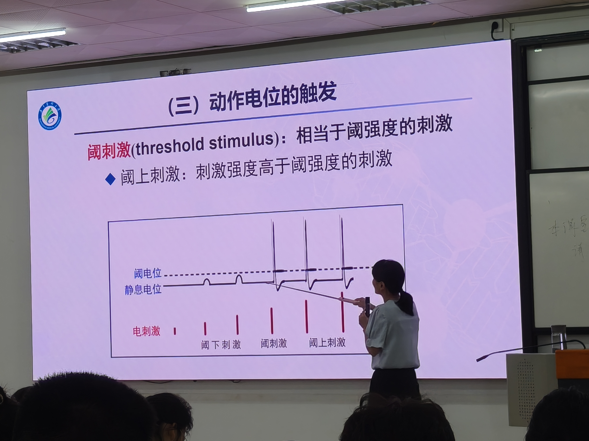

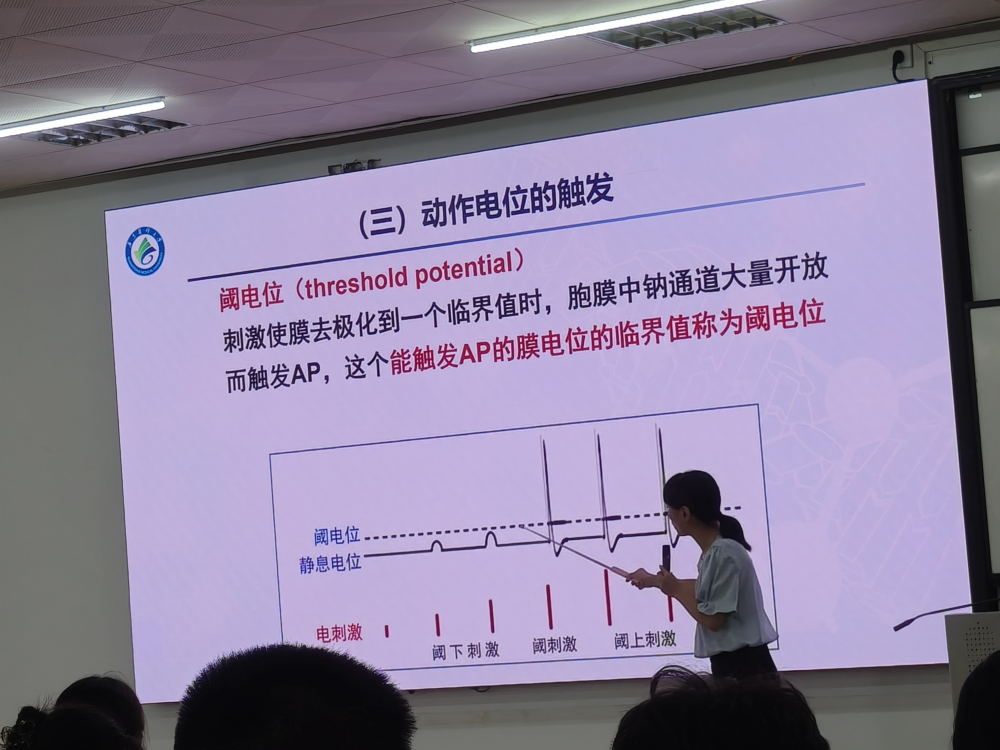

> 📝 **看图要点**：记住"阈电位≈-55mV，比静息电位小10~20mV"，以及低钙→阈电位下移→易兴奋这条因果链。

### 1.3 电压门控钠通道的功能状态（教材第36页）

钠通道有两种闸门：**激活门（m门，膜外侧）**＋**失活门（h门，膜内侧）**，由此形成三种功能状态：

| 状态 | m门（激活门） | h门（失活门） | 通道 | 说明 |
|------|:---:|:---:|:---:|------|
| **静息态** | 关 | 开（接近完全开放） | 不通 | 备用状态，可被激活 |
| **激活态** | 开 | 逐渐关闭（慢） | **短暂导通** | 瞬态！膜对Na⁺通透性可增500~5000倍 |
| **失活态** | 开（去极化仍存在） | 关 | 不通 | 对刺激不再反应 |

- **失活→复活**：只有膜**复极化**后，失活门退出、激活门返回中央，通道才能回到静息态，重新可用。
- **静息态和失活态是稳态；激活态是瞬态**——这就是"兴奋后立即进入不应期"的分子基础。

**电压门控钾通道**：没有失活门，只有激活门（n门），只有静息态和激活态两种状态。它的激活比钠通道**慢得多**（约1ms，延迟激活），多数在钠通道失活后才开放。

【理解】这个时间差是动作电位的关键编排：**Na⁺内流（去极化）在前，K⁺外流（复极化）在后，两者不会同时发生而互相抵消**。

【考点】钠通道三状态图必背（m/h门开闭组合）；"失活"是绝对不应期和AP单向性的根本原因。
**临床**：钾通道/钠通道缺陷→**遗传性长QT综合征**（离子通道病）。

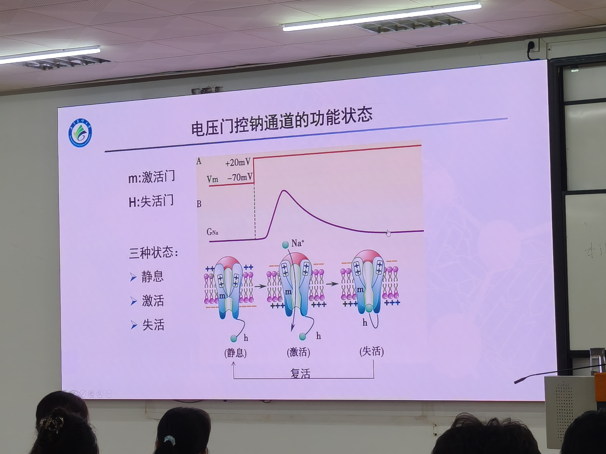

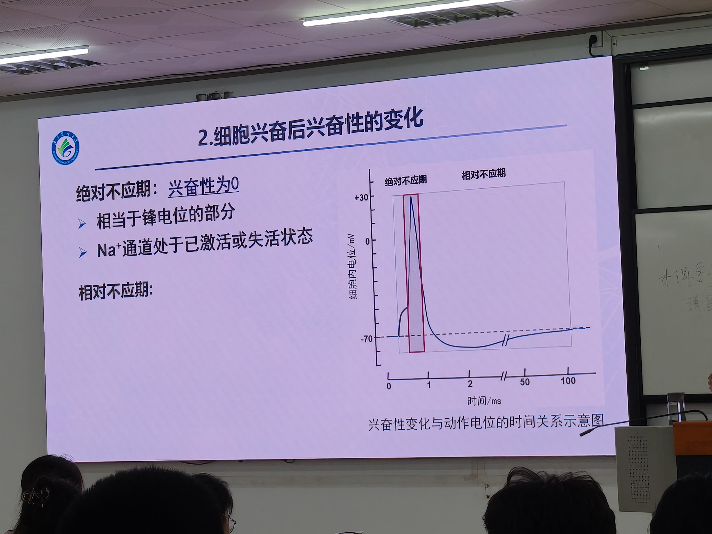

> 📝 **看图要点**：记住静息(m关h开)/激活(m开h开)/失活(m开h关)三组开关状态即可。

---

## 第二部分 动作电位的传播（教材第37~38页）

### 2.1 同一细胞上的传播——局部电流（连续传导）

**原理（局部电流学说）**：兴奋区膜电位内正外负（反极化），邻近未兴奋区仍内负外正（极化），两者之间有电位差→形成**局部电流**（膜内：兴奋区→未兴奋区；膜外：反向流回）。局部电流使未兴奋区去极化达阈电位→爆发新AP→成为新的兴奋区。如此逐段推进，**像多米诺骨牌**。

**两大特点**：
1. **不衰减传导**：每个节段都重新产生一次完整AP，幅度不随距离减小
2. **传导"安全"**：兴奋区与未兴奋区电位差最高达100mV（AP幅值），而去极化到阈电位只需10~20mV，安全系数大

### 2.2 有髓纤维——跳跃式传导（教材第38页）

- **髓鞘**：胶质细胞反复包绕，最高达**300层**；髓鞘包裹区几乎无钠通道、膜电阻极大→不能产生AP
- **郎飞结**：髓鞘每隔0.3~2mm中断，裸露区1~2μm；此处钠通道密集（**10⁴~10⁵个/μm²**）→能产生AP
- AP只在郎飞结产生，从一个郎飞结"跳跃"到下一个 → **跳跃式传导**

**两大进化优势**：
1. **速度快**：直径4μm的有髓纤维＝600μm无髓纤维（25m/s）；有髓纤维最高**100m/s以上**
2. **节能**：只有郎飞结处离子跨膜进出，重建离子浓度梯度的耗能大大减少

**临床联系**：髓鞘损伤→传导显著削弱→**多发性硬化症**。

### 2.3 细胞间传播——缝隙连接（教材第38页）

普通相邻细胞间电阻大，AP不能跨细胞传播。但**缝隙连接**（连接蛋白connexin组装成的非门控孔道，孔径1.2~2nm）允许小分子（<1.0kD）和离子通过→形成跨细胞局部电流→AP在细胞间直接传播。

- 神经系统里缝隙连接＝**电突触**（vs 化学突触：速度极快、双向）
- **意义：使功能一致的同类细胞群同步化活动**——心肌同步收缩利于泵血、子宫平滑肌同步收缩利于分娩、呼吸中枢神经元同步兴奋参与呼吸节律、胃肠道平滑肌同步蠕动
- 缝隙连接是**心肌电信号传导的结构基础**

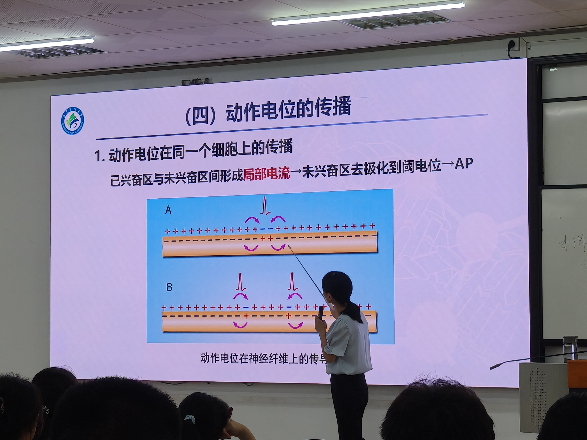

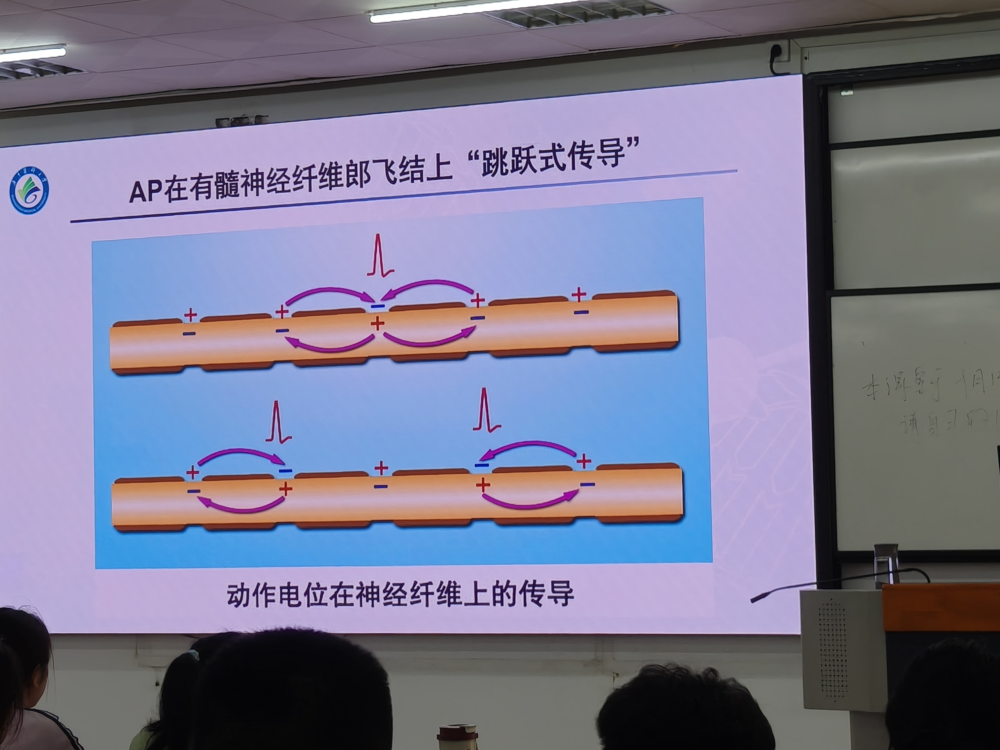

> 📝 **看图要点**：对比记——无髓=顺序连续，有髓=跳跃，缝隙连接=跨细胞同步。

---

## 第三部分 兴奋性及其变化（教材第38~39页）

### 3.1 兴奋性与可兴奋细胞

- **兴奋性**：组织或细胞接受刺激发生反应的能力/特性；也可狭义定义为**产生动作电位的能力**
- **可兴奋细胞**＝神经细胞、肌细胞、腺细胞（三类）——共同点：存在较多电压门控钠/钙通道，刺激能引起AP
- 兴奋标志＝产生动作电位
- **兴奋性高低用阈值衡量，阈值越小兴奋性越高（反比）**

### 3.2 绝对不应期（ARP）

- **时间**：相当于AP的**锋电位**（或其主体部分）
- **表现**：无论多强刺激都不能再兴奋，**兴奋性为零**
- **机制**：电压门控钠（或钙）通道已激活或进入失活态，无法再接受刺激
- **意义**：①锋电位不会融合（神经/骨骼肌）②限制最大放电频率——神经细胞ARP约**2ms**→理论最大频率不超过**500次/s**

### 3.3 相对不应期（RRP）

- **时间**：绝对不应期之后，相当于复极化晚期＋后超极化期
- **表现**：给予**足够强的阈上刺激**可以引起新的AP
- **机制**：失活的钠通道正在逐渐复活（但未完全恢复）；同时电压门控钾通道未完全关闭、K⁺外流增多→膜轻度超极化→距阈电位更远→兴奋性仍低于正常
- 可持续十几至上百毫秒

【考点】老师明确说"细胞兴奋后兴奋性的变化是重点"，且**生理学实验课会测神经干AP绝对不应期**（刺激伪迹＋第二个AP消失）。

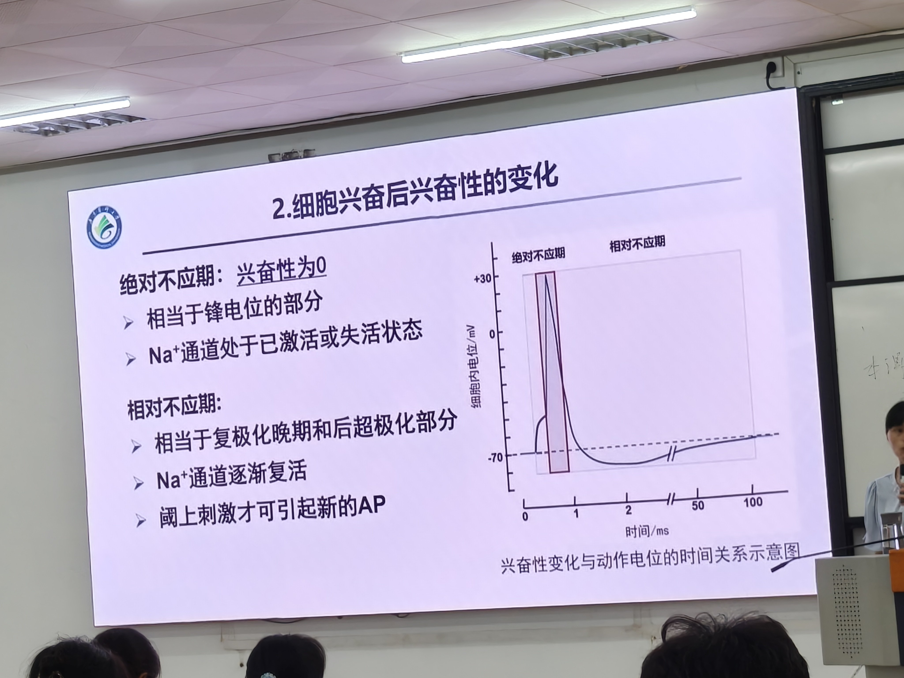

> 📝 **看图要点**：在AP曲线上标出：绝对不应期=锋电位段，相对不应期=复极化晚期+后超极化段。

---

## 第四部分 电紧张电位与局部电位（教材第39~42页）

### 4.1 细胞膜的被动电学特性

把膜和胞质当作静态电学元件看，有三个参数：

| 参数 | 含义 | 数值/特点 |
|------|------|----------|
| **膜电容 Cm** | 膜＝平行板电容器（脂质双层绝缘、两侧导电液） | 约**1μF/cm²**，与面积成正比 |
| **膜电阻 Rm** | 脂质双层几乎绝缘（10⁶~10⁹Ω/cm²），但镶嵌离子通道/转运体后 | 实际约**10³Ω**；通道越多活动越强，Rm越小 |
| **轴向电阻 Ri** | 胞质沿长轴的电阻 | 直径越小、越长，Ri越大 |

### 4.2 电紧张电位

**概念**：由膜的**被动电学特性**决定其空间分布和时间变化的膜电位（向轴突注入电流产生，无离子通道激活、无膜电导改变）。

**两个关键参数**：
- **空间常数 λ**：膜电位衰减至最大值的**1/e（约37%）**所扩布的距离（0.1~3mm）。λ越大，传播范围越大。**增大膜电阻（髓鞘）或减小轴向电阻（加大直径）→λ加大**。
- **时间常数 τ**：膜电位充电到最大值的**1-1/e（约63%）**或放电降到**1/e（约37%）**所需时间（1~20ms）。τ越小，生成越快。**减小膜电阻和膜电容→τ减小**。

**极性**：细胞内注射正电荷→去极化电紧张电位；负电荷→超极化电紧张电位。双电极都在膜外时，**负电极下方去极化（才可能生AP），正电极下方超极化**。

**电紧张电位三大特征**：①等级性（幅度随刺激增大）②衰减性（随距离指数衰减）③可总和（无不应期，可叠加）。

【理解】为什么有髓纤维传导快？髓鞘包裹→膜电阻加大、膜电容减小→**λ加大、τ减小**→电紧张电位传得远、生成快→更快到达阈电位。

### 4.3 局部电位

**概念**：细胞受刺激后，**部分离子通道开放**（有膜主动特性参与）形成的、**不能向远距离传播**的膜电位改变。

**类型**（都是局部电位）：去极化型——终板电位（EPP）、兴奋性突触后电位（EPSP）、感受器/发生器电位；超极化型——抑制性突触后电位（IPSP）、感光细胞感受器电位。

**三大特征（与电紧张电位相同，与AP相反）**：
1. **等级性**——幅度与刺激强度相关，无"全或无"
2. **衰减性传导**——以电紧张方式向周围扩布，随距离衰减
3. **无不应期，可总和**——①空间总和（相距近的多个局部电位叠加）②时间总和（同一部位连续产生叠加）；总和达到阈电位→爆发AP

**意义**：局部电位是体内除AP之外另一类信息传递和处理的重要电信号，可发生在不能产生AP的细胞上，通过幅度变化、空间/时间总和实现信号编码与整合。

**局部电位 vs 动作电位对比（必背）**：

| 比较项 | 局部电位 | 动作电位 |
|--------|---------|---------|
| 刺激强度关系 | 等级性（随刺激增大） | 全或无 |
| 传播 | 衰减性（电紧张扩布） | 不衰减（局部电流重新产生） |
| 不应期 | 无，可总和 | 有（绝对+相对） |
| 机制 | 部分通道开放 | 钠通道正反馈激活 |
| 可发生的细胞 | 各种细胞 | 可兴奋细胞 |

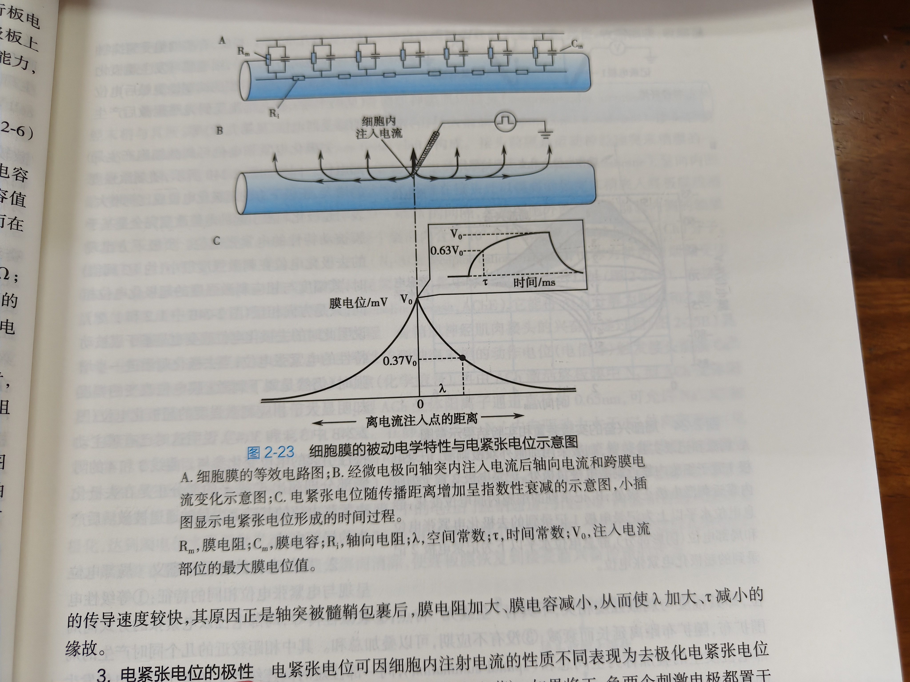

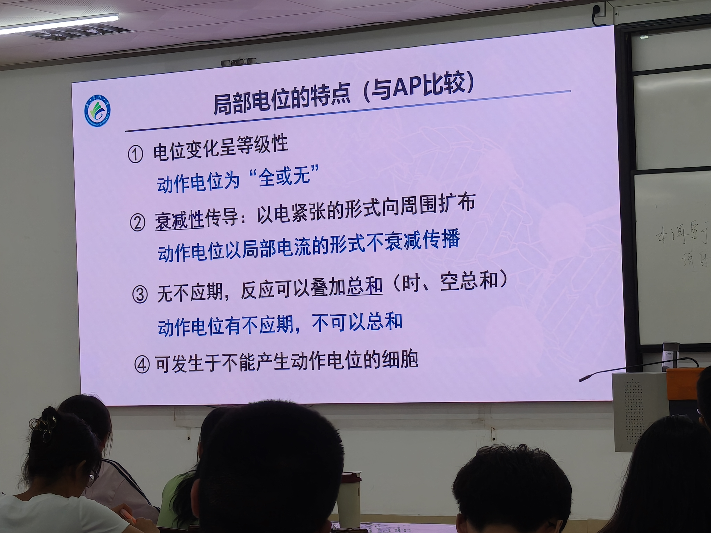

> 📝 **看图要点**：λ、τ的定义看图最直观；局部电位vs AP对比表直接背。

---

## 第五部分 神经-肌肉接头兴奋传递（教材第43~44页）

### 5.1 结构（三部分）

| 结构 | 特点 |
|------|------|
| **接头前膜** | 运动神经轴突末梢膜；内含约**3×10⁵个突触囊泡**，每个囊泡含约**10⁶个ACh分子**；膜上有电压门控钙通道 |
| **接头间隙** | 前膜与后膜之间**20~30nm**的间隔，充满细胞外液 |
| **接头后膜（终板膜）** | 骨骼肌细胞膜向内凹陷形成浅槽，有许多皱褶增大面积；上有**N₂型ACh受体阳离子通道**（肌肉型烟碱受体，直径约0.65nm，允许Na⁺/K⁺/Ca²⁺通过，主要是Na⁺内流）；间隙面有**乙酰胆碱酯酶（AChE）**分解ACh |

### 5.2 传递过程——"电-化学-电"7步

1. 运动神经末梢AP（**电**）→ 接头前膜去极化
2. 电压门控钙通道开放，Ca²⁺进入末梢
3. 突触囊泡**出胞**，ACh释放入接头间隙（**化学**）
4. ACh与终板膜N₂受体结合，阳离子通道开放
5. Na⁺内流为主（静息时Na⁺内向驱动力>K⁺外向驱动力）→ 终板膜去极化→**终板电位EPP**（幅度50~75mV，属**局部电位**）
6. EPP以电紧张方式扩布→激活邻近普通肌膜电压门控钠通道→达阈电位→**肌膜AP**（**电**）→传遍整个肌细胞
7. ACh在释放后几毫秒内被AChE分解为胆碱和乙酸→终板膜恢复

【理解】EPP是局部电位（等级性、可总和），一个囊泡的量不够触发AP——**必须多个囊泡同步释放（量子总和）**。这是"全或无"之前的"积累"环节。

### 5.3 量子式释放（教材第44页）

- ACh释放**以囊泡为基本单位（1囊泡=1量子）**，倾囊而出
- 一次AP约引发**125个囊泡**释放，激活约**2×10⁵个通道**，产生EPP
- 静息时单个囊泡随机自发释放→**微终板电位（mEPP）**：幅度约**0.4mV**，频率约1次/s
- **EPP = 大量mEPP的总和**
- **冯德培**：首先提出接头前膜ACh释放的Ca²⁺依赖性；发现强直后增强（PTP）

### 5.4 影响因素（药物/病理，重点临床联系）

| 因素 | 作用环节 | 结果 |
|------|---------|------|
| **筒箭毒碱、α-银环蛇毒** | 特异性阻滞N₂型ACh受体 | 肌肉松弛（肌松药原理） |
| **重症肌无力** | 自身抗体破坏N₂受体 | 肌无力；**新斯的明**抑制AChE→ACh积聚→改善症状 |
| **有机磷农药中毒** | AChE被磷酸化失活 | ACh堆积→中毒症状 |
| **肉毒杆菌毒素** | 抑制ACh释放 | 肌肉麻痹 |
| **强直后增强（PTP）** | 强直刺激后EPP持续增大数分钟 | 首次报告的突触可塑性现象 |

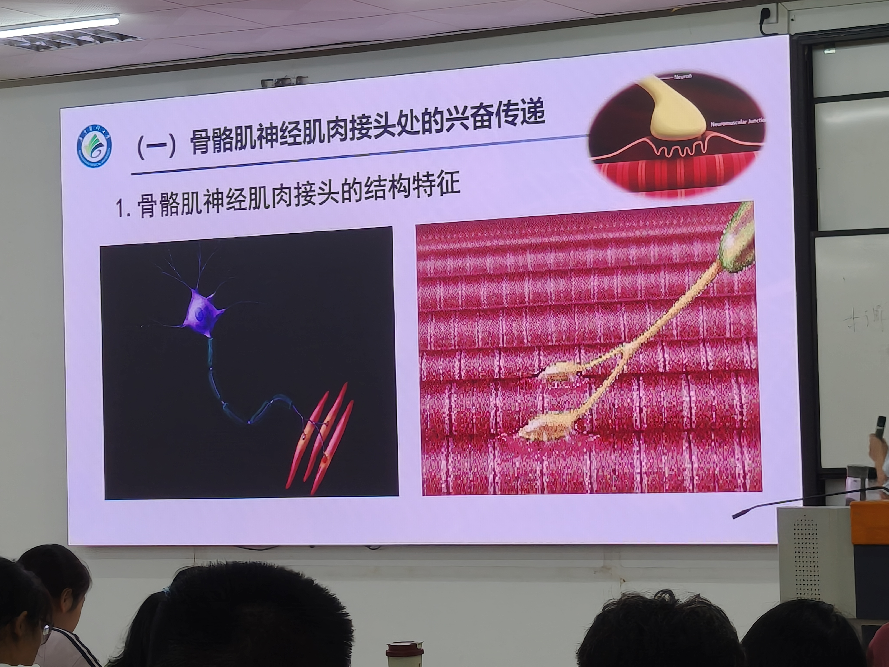

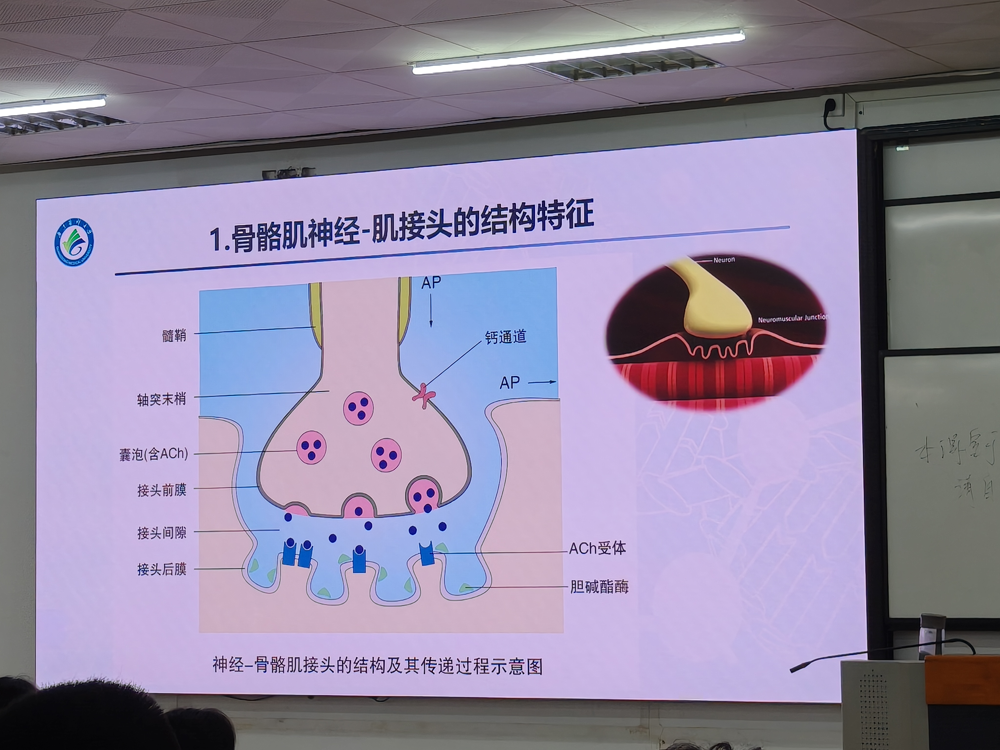

> 📝 **看图要点**：对着图把7步流程走一遍，重点记三个结构名和"电-化学-电"。

---

## 第六部分 横纹肌细胞的结构（教材第44~45页）

横纹肌＝**骨骼肌＋心肌**（光镜下明暗交替横纹）；骨骼肌随意肌、心肌非随意肌。本课重点看横纹肌。

### 6.1 肌原纤维与肌节

- 肌原纤维：直径1~2μm，上千条纵向平行排列，由粗肌丝+细肌丝规则排列
- 光镜横纹：**暗带（A带）**与**明带（I带）**交替
- 暗带中央有**M线**，M线两侧较亮区域＝**H带**；明带中央有**Z线**
- **肌节**：相邻两Z线之间的区段，是**肌肉收缩和舒张的基本单位**

【考点】收缩时**暗带（A带）宽度不变，只有明带（I带）和H带变窄**——这就是肌丝滑行说的光镜证据。

### 6.2 肌管系统

| 系统 | 结构 | 功能 |
|------|------|------|
| **横管（T管）** | 与肌原纤维垂直，肌细胞膜内陷而成 | **传导AP**入肌细胞深部 |
| **纵管（L管）＝肌质网SR** | 与肌原纤维平行 | 储/放/回收Ca²⁺ |
| 其中：**纵行肌质网LSR** | 包绕交织成网 | 膜上有**钙泵**，逆浓度梯度回摄Ca²⁺ |
| 其中：**连接肌质网JSR（终池）** | 接近T管的末端膨大 | 释放Ca²⁺；内含**雷诺丁受体RyR**（骨骼肌RyR1/心肌RyR2）；JSR内Ca²⁺比胞质高近万倍 |

- **三联体**（骨骼肌）：T管+两侧终池；**二联体**（心肌）：T管+单侧终池——都是**兴奋-收缩耦联的关键部位**
- 中国科学家首次用单颗粒冷冻电镜解析了RyR1/RyR2近原子分辨率结构

### 6.3 肌丝的分子结构（必背）

**粗肌丝**（长约1.6μm）＝**肌球蛋白**（myosin）：
- 豆芽状：杆部（主干，尾端朝向M线）+ 2个球形头部
- 头部向外伸出形成**横桥**，每条粗肌丝约**300~400个横桥**（近M线约0.2μm无横桥）
- 横桥有**ATP酶活性**、能与肌动蛋白结合、可向M线方向扭动——**肌丝滑行的动力来源**

**细肌丝**（长约1.0μm）＝3种蛋白，**比例7:1:1**：

| 蛋白 | 角色 | 功能 |
|------|------|------|
| **肌动蛋白（actin）** | 主干 | 有多个横桥结合位点 |
| **原肌球蛋白（tropomyosin）** | 覆盖 | 舒张时恰好**掩盖**肌动蛋白上的横桥结合位点 |
| **肌钙蛋白（troponin）** | 感受器 | **TnT**结合原肌球蛋白、**TnI**结合肌动蛋白、**TnC**结合**4个Ca²⁺** |

**收缩蛋白 vs 调节蛋白**：
- **收缩蛋白**：肌球蛋白＋肌动蛋白（直接参与收缩）
- **调节蛋白**：原肌球蛋白＋肌钙蛋白（调控收缩蛋白相互作用，不直接参与）

【理解】细肌丝="机关枪"结构：肌动蛋白是"扳机"，原肌球蛋白是"保险栓"，肌钙蛋白是"感应器"。Ca²⁺来了→TnC结合Ca²⁺→肌钙蛋白构象变化→TnI与肌动蛋白结合减弱→原肌球蛋白滑入沟槽深部→暴露出横桥结合位点→收缩开始。

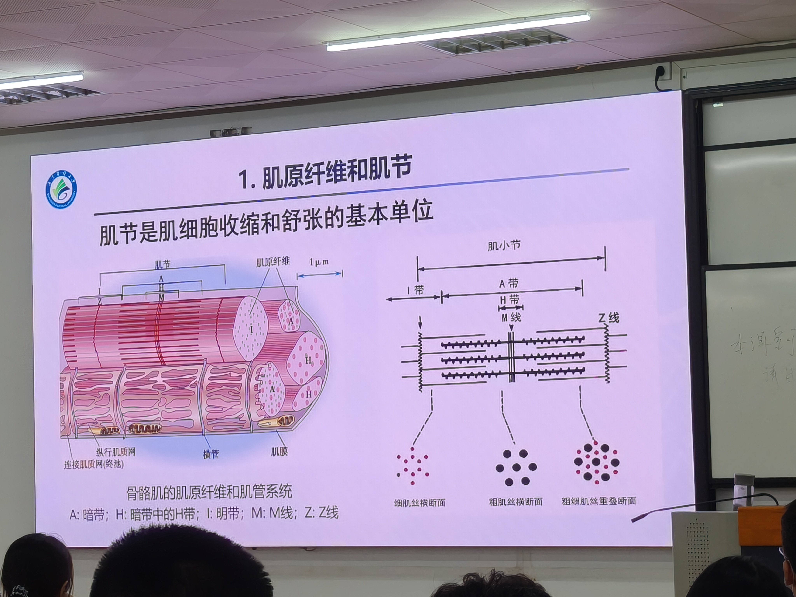

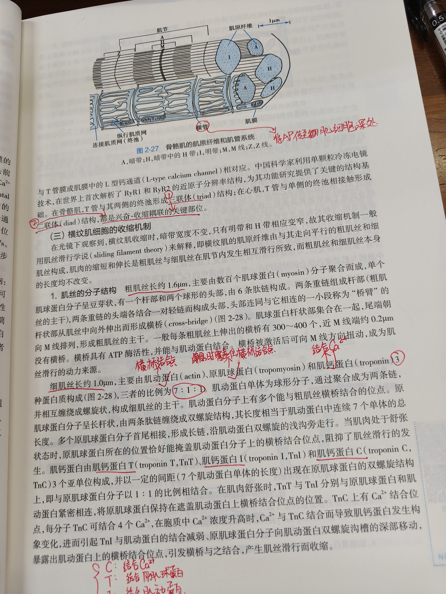

> 📝 **看图要点**：两图对照着背——A带/I带/H带/M线/Z线定位，7:1:1三种蛋白与横桥。

---

## 第七部分 肌丝滑行与横桥周期（教材第45~46页）

### 7.1 肌丝滑行学说

收缩时**粗肌丝与细肌丝在肌节内相互滑行**（细肌丝向M线方向滑行），两种肌丝本身长度不变。光镜证据：A带不变，I带和H带变窄。

### 7.2 横桥周期4步（教材第46页，必背）

1. **复位**（舒张状态）：横桥ATP酶分解ATP→上次扭动的横桥复位；横桥与ADP+磷酸结合，处于**高势能、高亲和力**状态
2. **结合**：胞质Ca²⁺浓度升高→触发横桥与肌动蛋白结合（启动横桥周期）
3. **扭动发力**：横桥构象改变，头部向桥臂方向**扭动45°**（"棘齿作用"）→拖动细肌丝向M线滑行→ADP和无机磷酸解离（化学能→机械能）
4. **解离**：横桥再与ATP结合→亲和力降低→与肌动蛋白分离→ATP分解→横桥复位，对应新结合位点，重复循环

- 一个横桥周期**20~200ms**，其中横桥与肌动蛋白结合时间约占一半
- 胞质Ca²⁺浓度**升高→启动**横桥周期；**降低→停止**

【理解】横桥周期像"划船"：横桥是桨，肌动蛋白是水，ATP是划桨的力气。Ca²⁺来了才下水划，Ca²⁺走了就停。

**收缩表现与横桥的关系**：
- 肌肉产生的**张力**＝每一瞬间与肌动蛋白结合的**横桥数**决定
- 肌肉**缩短速度**＝横桥周期的长短决定
- 等长状态（长度不变）：横桥扭动拉长弹性桥臂→产生张力（肌丝不滑行）；张力克服阻力→肌丝滑行→表现为缩短

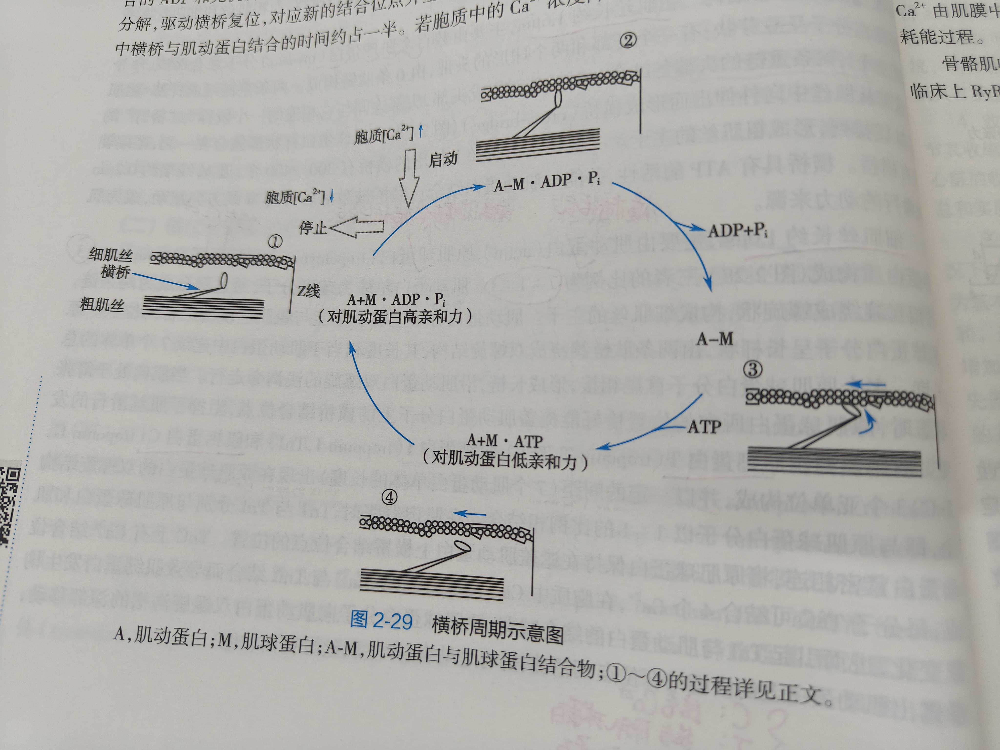

> 📝 **看图要点**：4步循环（①复位→②结合→③扭动45°→④解离）看着箭头走一遍。

---

## 第八部分 兴奋-收缩耦联（教材第47页）

**概念**：把横纹肌细胞产生AP的电兴奋过程与肌丝滑行的机械收缩联系起来的中介机制。
**关键耦联因子：Ca²⁺**；耦联发生在**三联体（骨骼肌）或二联体（心肌）**。

**4个基本步骤**：
1. **T管传导AP**：肌膜AP沿T管膜传至细胞深部，激活T管膜和肌膜中的**L型钙通道**
2. **JSR释放Ca²⁺**：骨骼肌——L型钙通道电压敏感肽段位移→"**拔塞样**"构象改变→直接打开RyR1（**构象变化触发钙释放**）；心肌——L型钙通道开放→少量Ca²⁺内流→Ca²⁺结合RyR2的钙结合位点→大量释放（**钙致钙释放 CICR**）。胞质Ca²⁺由静息0.1μmol/L升高**百倍以上**
3. **Ca²⁺触发肌丝滑行**：Ca²⁺与TnC结合→启动收缩
4. **JSR回摄Ca²⁺**：骨骼肌——几乎全部由LSR钙泵回摄；心肌——大部分LSR钙泵回收，**10%~20%**由肌膜Na⁺-Ca²⁺交换体和钙泵排出胞外。胞质Ca²⁺降低→舒张

【考点】**骨骼肌 vs 心肌钙释放机制对比**（必背）：

| 比较 | 骨骼肌 | 心肌 |
|------|--------|------|
| 结构 | 三联体（T管+两侧终池） | 二联体（T管+单侧终池） |
| L型钙通道作用 | 电压传感器（变构"拔塞"） | 通道本身（少量Ca²⁺内流） |
| RyR亚型 | RyR1 | RyR2 |
| 释放机制 | 构象变化触发钙释放 | 钙致钙释放（CICR） |
| Ca²⁺回收 | 几乎全由LSR钙泵 | LSR钙泵为主+10%~20%排至胞外 |

**临床联系——恶性高热**：RyR1基因突变易感者，药物（如吸入麻醉药）触发→肌张力增高、突发高热、骨骼肌代谢亢进、横纹肌溶解（常染色体显性遗传，致命）。早期应用**丹曲林**抑制RyR1可逆转。骨骼肌收缩和舒张都是耗能（产热）过程。

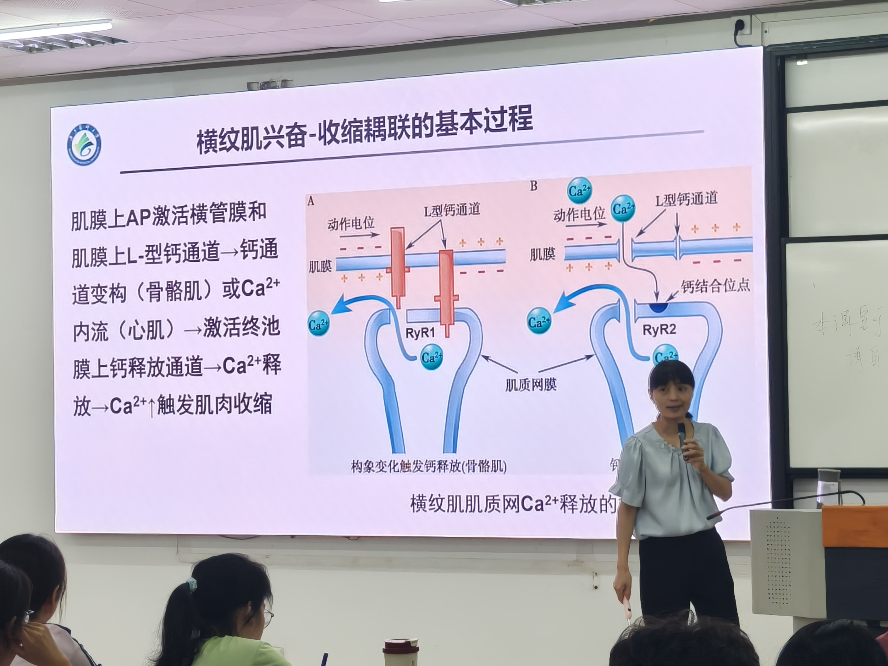

> 📝 **看图要点**：左"拔塞"右"钙触发钙"，对照背。

---

## 第九部分 影响横纹肌收缩效能的因素（教材第48~49页）

**收缩效能**：肌肉收缩产生的张力大小、缩短程度以及产生张力或缩短的速度。

**收缩两种形式**：
- **等长收缩**：长度不变、张力增加
- **等张收缩**：张力不变、长度缩短
- 最常见形式：**先等长后等张**

### 9.1 前负荷（preload）

- 定义：肌肉**收缩前**所承受的负荷；决定**初长度**（初长度≈前负荷的同义词）
- **长度-张力关系曲线**：一定范围内，主动张力随初长度增大而增大；过度拉长反而下降→存在**最适初长度**
- **最适初长度对应肌节长度2.0~2.2μm**：此时横桥与细肌丝重叠比例最大、肌丝间关系最适合横桥活动→最大收缩张力
- 主动张力＝总张力－被动张力（被动张力来自弹性成分被牵拉）
- **正常人体肌肉一般都处于最适初长度**（如心室舒张末期容积适度增大→收缩力增强，Frank-Starling机制的前奏）

### 9.2 后负荷（afterload）

- 定义：肌肉**收缩后**所承受的负荷；等张收缩时收缩张力与后负荷大小相等方向相反
- **张力-速度关系曲线**：后负荷增大→收缩张力和缩短速度呈**反变关系**
- 后负荷为0→缩短速度最大（**Vmax**，等张收缩）；后负荷大到不能缩短→张力最大（**P0**，等长收缩）；中间状态→先等长后等张
- 机制：后负荷大→横桥摆动慢→横桥周期延长→每瞬间处于张力状态的横桥数多→张力大但缩短慢

### 9.3 肌肉收缩能力（contractility）

- 定义：**与负荷无关**、能影响收缩效能的肌肉**内在特性**
- 包括：兴奋-收缩耦联中胞质Ca²⁺浓度变化、横桥ATP酶活性、肌细胞能量代谢水平、功能蛋白表达水平、肌原纤维肥大程度
- 收缩能力↑→长度-张力曲线上移、张力-速度曲线右上移
- 神经体液调节、致病因素、治疗药物通过影响内在特性调节收缩能力——**在心肌比骨骼肌更重要**（强心苷类药物等）

### 9.4 收缩总和（summation）

**① 多纤维总和（多运动单位总和）**：以**运动单位**（一个运动神经元+其支配的全部肌纤维）为基本单位，叠加效应＝参与同步收缩运动单位数目的增加。
- **大小原则（size principle）**：收缩逐渐增强时**先小后大**（先加小的运动单位，再加大的）；舒张时反过来**先大后小**。既有效调控强度，又利于精细活动。

**② 频率总和**：提高刺激频率，后一AP触发的收缩叠加在前一次收缩上。
- **单收缩**：频率很低，每次AP后有完整收缩+舒张
- **不完全强直收缩**：后一次收缩叠加在前一次的**舒张期**
- **完全强直收缩**：后一次收缩叠加在前一次的**收缩期**（波形平滑无锯齿）
- 生理情况下骨骼肌几乎都是**完全强直收缩**

【考点】老师强调：前负荷/后负荷/肌肉收缩能力/收缩总和四大因素必背；大小原则"收缩先小后大、舒张先大后小"。

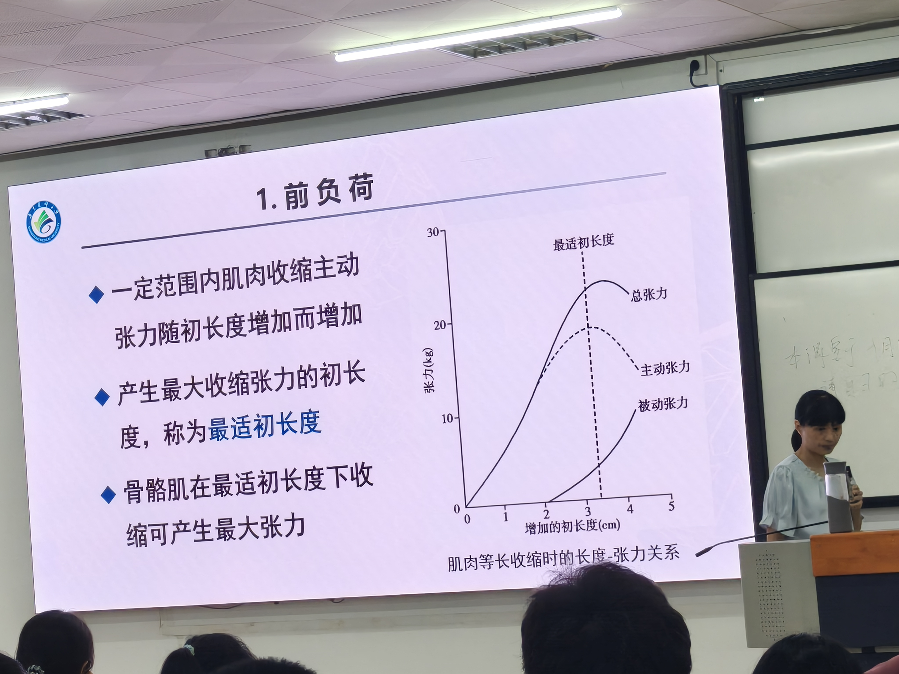

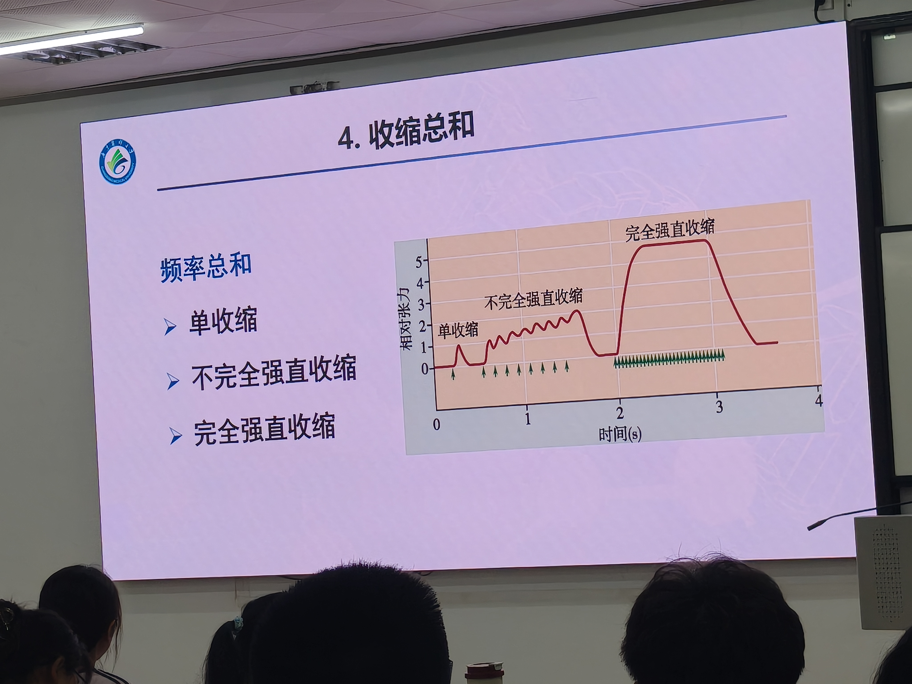

> 📝 **看图要点**：记住2.0~2.2μm与"总=主动+被动"；三种收缩波形区别。

---

## 第十部分 数字速记与逻辑链

**必背数字**：

| 数字 | 含义 |
|------|------|
| -55mV | 神经细胞阈电位（比静息-70mV小10~20mV） |
| 2ms / 500次/s | 神经细胞绝对不应期 / 最大放电频率 |
| λ 0.1~3mm、τ 1~20ms | 空间常数 / 时间常数 |
| 20~30nm | 接头间隙宽度 |
| 3×10⁵个 / 10⁶个 | 接头前膜囊泡总数 / 每囊泡ACh分子数 |
| 125个 / 2×10⁵个 / 0.4mV | 一次AP释放囊泡数 / 激活通道数 / mEPP幅度 |
| 1.6μm / 1.0μm / 7:1:1 | 粗肌丝长 / 细肌丝长 / 细肌丝三种蛋白比 |
| 300~400个 / 45° / 20~200ms | 每条粗肌丝横桥数 / 横桥扭动角度 / 一个横桥周期 |
| 2.0~2.2μm | 最适初长度对应肌节长度 |
| 10⁴~10⁵个/μm² | 郎飞结处钠通道密度 |

**全课逻辑链（一句话复述）**：
> 刺激达阈强度→膜去极化达阈电位(-55mV)→钠通道正反馈开放（三状态，失活致不应期）→AP沿膜局部电流/郎飞结/缝隙连接传播→到达神经末梢→电-化学-电经接头（量子释放ACh→EPP）→肌膜AP沿T管→三联体触发Ca²⁺释放→Ca²⁺与TnC结合→原肌球蛋白移位暴露结合位点→横桥周期（结合→扭动45°→解离→复位，耗ATP）→肌丝滑行收缩；Ca²⁺被钙泵回摄→舒张。收缩效能受前负荷（初长度）、后负荷、肌肉收缩能力、收缩总和（大小原则+频率总和）调节。

**复习建议**：本课是第二章收尾+第四节整节，期末绝对重点。先用本总结吃透机制文字，再看考点与术语.md背清单，最后用科目根目录的思维导图复述逻辑链。
