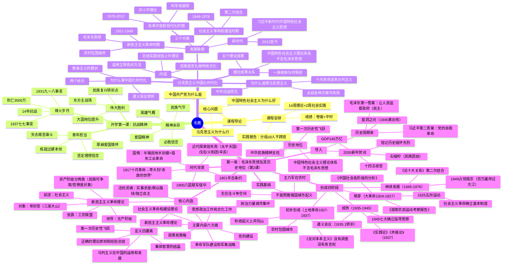

# 06_毛概 — 知识框架与思维导图

> 全课程整合版（基于已学1课时内容整理）

---

## 一、Mermaid 思维导图

---

## 二、层级知识框架

### 第一篇：开学第一课——抗战精神

#### 一、时间节点
- 9月3日：抗战胜利纪念日
- 1931年九一八事变：局部抗战开始（14年抗战起点）
- 1937年七七事变：全面抗战开始
- 1945年9月2日：日本签署投降书

#### 二、抗战精神四方面
1. 天下兴亡、匹夫有责的爱国精神
2. 视死如归、宁死不屈的民族气节
3. 不畏强暴、血战到底的英雄气概
4. 百折不挠、坚忍不拔的必胜信念

#### 三、当代青年四个担当
1. 坚定理想信念（用习思想武装头脑）
2. 厚植爱国情怀（理性看待社会问题）
3. 练就过硬本领（突破卡脖子技术）
4. 矢志艰苦奋斗（在基层一线锻炼）

---

### 第二篇：导论——马克思主义中国化时代化

#### 一、为什么选择马克思主义
1. 历史背景：半殖民地半封建社会，亡国灭种危机
2. 此前救国方案全部失败：太平天国、洋务运动、戊戌变法、辛亥革命
3. 十月革命送来马克思列宁主义
4. 中国共产党应运而生（历史和人民的选择）
5. 根本原因：马克思主义能解决救亡图存的历史性课题

#### 二、为什么要中国化时代化
1. 教条主义教训：照搬苏联模式导致革命挫折
2. 关键节点：
   - 1935年遵义会议：确立毛泽东领导
   - 1938年六届六中全会：首次提出"马克思主义中国化"
   - 党的七大：毛泽东思想=中国化的马克思主义
   - 2009年十七届四中全会：提出"马克思主义时代化"
3. **两个结合**：
   - 同中国具体实际相结合
   - 同中华优秀传统文化相结合

#### 三、内涵（三方面）
1. 运用马克思主义立场观点方法观察时代、把握时代、引领时代
   - 农村包围城市道路
   - 社会主义市场经济
   - 精准扶贫、绿水青山
2. 总结实践经验上升为理论，丰富发展马克思主义
3. 用民族语言讲述马克思主义，扎根中华优秀传统文化
   - 群众路线
   - 六尺巷的故事

#### 四、发展脉络（四个时期）

| 时期 | 时间 | 理论成果 |
|------|------|---------|
| 新民主主义革命 | 1921~1949 | 毛泽东思想 |
| 社会主义革命和建设 | 1949~1978 | 毛泽东思想（第二次结合） |
| 改革开放和现代化 | 1978~2012 | 邓小平理论→三个代表→科学发展观 |
| 新时代 | 2012至今 | 习近平新时代中国特色社会主义思想 |

#### 五、理论成果关系
1. 五大成果：毛泽东思想、邓小平理论、三个代表、科学发展观、习近平新时代中国特色社会主义思想
2. **马克思主义中国化时代化** = 全部5个
3. **中国特色社会主义理论体系** = 后4个（不含毛泽东思想）
4. 一脉相承：
   - 都坚持马克思列宁主义指导
   - 都为民族复兴而奋斗
   - 都坚持实事求是、群众路线、独立自主

---

### 第三篇：第一章——毛泽东思想及其历史地位（第2课）

#### 一、延安窑洞之问与历史周期率
- **历史周期率**：其兴也勃焉、其亡也忽焉的王朝兴亡循环
- **1945年黄炎培延安窑洞之问**：中共能否跳出周期率？
- **毛泽东第一答案**：让人民来监督政府（新路=民主）
- **习近平第二答案**：党的自我革命（永葆先进性和纯洁性）

#### 二、时代背景
1. 1900年八国联军侵华、1901年《辛丑条约》——中国以屈辱进入20世纪
2. 近代救国探索皆失败：太平天国、戊戌变法、义和团、辛亥革命
3. 1917年十月革命送来马列主义；李大钊《庶民的胜利》《布尔什维主义的胜利》——"看将来的环球，必是赤旗的世界"
4. 国情：错失工业革命机遇 + 1840鸦片战争后半殖民地半封建社会

#### 三、实践基础（为什么不能照搬俄国）
1. 反动统治力量在城市集中强大
2. 无资产阶级民主制度下的合法斗争空间
3. 革命主力军在农村（农民是中国革命的主力军）

#### 四、形成发展四阶段
| 阶段 | 时间 | 标志性事件/著作 |
|------|------|----------------|
| 萌芽 | 大革命时期 1924~1927 | 五卅运动、《中国社会各阶级的分析》《湖南农民运动考察报告》 |
| 初步形成 | 土地革命 1927~1937 | 秋收起义上井冈山、农村包围城市、《反对本本主义》"没有调查没有发言权" |
| 成熟 | 1935~1945 | 遵义会议（转折）、《实践论》《矛盾论》、1945七大确立指导思想 |
| 继续发展 | 1945~1976 | 占领南京"百万雄师过大江"、确立社会主义制度、《论十大关系》"第二次结合" |

#### 五、核心内涵
1. **定义四要素**：马列主义在中国的运用和发展；正确的理论原则和经验总结；集体智慧的结晶；第一次历史性飞跃
2. **主要内容6方面**：新民主主义革命理论 / 社会主义革命和建设理论 / 革命军队建设和军事战略 / 政策和策略 / 思想政治工作和文化工作 / 党的建设
3. **新民主主义革命理论**：无产阶级领导、工农联盟、反帝反封建反官僚资本主义、前途社会主义；民族资产阶级（两面性，既联合又斗争）≠官僚资产阶级（革命对象）
4. **活的灵魂**：实事求是、群众路线、独立自主

#### 六、历史地位
- 马克思主义中国化的第一次历史性飞跃
- 中华民族的精神支柱
- **"中国特色社会主义理论体系"不包括毛泽东思想**

---

## 三、本轮扩写补充数字与案例（2026-09-10）

- **抗战数字**：军民伤亡3500万、死亡约2000万；牵制日本陆军主力约2/3；敌后根据地19个；刘老庄连82人全部牺牲、平均年龄<25岁。
- **课程成绩**：48学时/14周理论+2周实践/3学分；期末卷面50%+学习通平时50%；平时=作业30%+分组任务50%（≤8人不跨班实践报告）+签到5%+课程积分5%+讨论10%。
- **2026春晚四会场**：合肥=创新、义乌=开放、哈尔滨=绿色、宜宾=生态。
- **"十四五"成就数字**：经济增量超35万亿、对世界增长贡献率约30%；2024粮食1.4万亿斤/人均500kg；养老保险参保10.72亿/95%；人均预期寿命79岁；519个世界冠军/68次世界纪录。
- **新增案例**：游击战十六字诀（敌进我退…）、《中国社会各阶级的分析》《湖南农民运动考察报告》、六尺巷、刘长春单人参赛vs冬奥286人、北斗系统独立自主。
