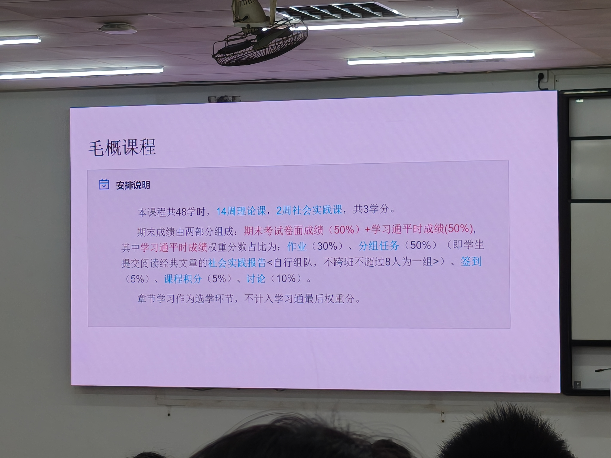

# 毛概第1课：开学第一课安排与抗战精神 — 知识点总结（考试版）

> 课程：06 毛泽东思想和中国特色社会主义理论体系概论（简称"毛概"）
> 授课时间：2026-09-07 09:45
> 内容：课程安排与考核 + 开学第一课（抗战精神）+ 导论（马克思主义中国化时代化的历史进程与理论成果）

---

## 一、课程安排与考核方式

### 1.1 课时与学分

> 上图为老师课件"毛概课程—安排说明"原文：
> - 本课程共 **48学时，14周理论课，2周社会实践课，共3学分**；
> - 期末成绩 = **期末考试卷面成绩（50%）+ 学习通平时成绩（50%）**；
> - 学习通平时成绩权重：**作业（30%）、分组任务（50%）**（即提交阅读经典文章的社会实践报告，**自行组队、不跨班、不超过8人一组**）、**签到（5%）、课程积分（5%）、讨论（10%）**；
> - 章节学习作为选学环节，**不计入**学习通最后权重分。

### 1.2 社会实践报告要求
- 自行组队，**不超过8人**（4~6人均可）；
- **不跨班组队**，一个班级内自行组队；
- 一组交一份实践报告；
- 具体形式到期末前公布。

### 1.3 课堂提问说明
- 老师会在学习通/课程群里发讨论或提问；
- 问题贴近生活，**不考专业难题**（如不会问"社会主义的本质是什么"这种偏题），不用紧张。

---

## 二、开学第一课：抗战精神

### 2.1 关键时间节点（必背数字）

- **9月3日**：中国人民抗日战争暨世界反法西斯战争**胜利纪念日**；
- 2026年为抗战胜利**81周年**；
- 日本签署投降书为**1945年9月2日**；因时差，消息传到国内为次日，故我国定 **9月3日** 为胜利纪念日；
- 抗战年限表述：从传统的"**8年抗战**"发展为官方的"**14年抗战**"：
  - **起点：1931年九一八事变**（局部抗战开始，东北沦陷）；
  - **全面抗战：1937年七七事变**。

### 2.2 烽火岁月——14年浴血奋战

- **1931年九一八事变**：东北三省沦陷，标志局部抗战开始（沈阳建有"九一八"历史纪念馆）；
- **1937年七七事变**：全面抗战开始；
- 重要战役：平型关大捷、百团大战等；
- **伤亡数字**（必背）：
  - 中国军民**伤亡3500万人**（含受伤）；
  - 其中**死亡约2000万人**；
- **1945年9月2日**：日本正式签署投降书；中国收复全部失地。

### 2.3 伟大胜利——三大历史意义

1. **民族复兴的转折点**；
2. **世界反法西斯战争的东方主战场**：
   - 中国是牵制日本**时间最早、持续时间最长**的国家；
   - 长期牵制日本陆军主力约 **2/3** 兵力；
   - 有力支援了盟国在太平洋战场和欧洲战场的作战，打破了法西斯轴心国的整体战略部署；
3. **大国地位的历史积淀**：
   - 参与发起联合国，成为**联合国安理会五大常任理事国**之一；
   - 废除部分不平等条约，收回台湾及澎湖列岛等地；
   - 真正以大国姿态屹立于世界民族之林。

这三大意义层层递进：第一层讲民族命运（粉碎殖民奴役图谋、转败为胜），第二层讲世界贡献（东方主战场牵制日军、支援盟国），第三层讲国际地位（联合国创始成员、大国回归）。三者共同回答了"抗日战争为什么是中华民族伟大复兴的转折点"——它不仅打赢了一场战争，更重塑了民族自信与世界认知。

### 2.4 精神永存——抗战精神内涵（四句话必背）

【考点】抗战精神的官方表述共四条，须逐条背熟：

1. **天下兴亡、匹夫有责的爱国情怀**：面对民族危机，全体中华儿女不分天南海北、不分老弱皆投身抗战；
2. **视死如归、宁死不屈的民族气节**：只身陷入敌营、以血肉之躯抗敌，如电影中孤身炸碉堡、充当人肉炸弹的情节；
3. **不畏强暴、血战到底的英雄气概**：典型如**刘老庄连**——82名官兵为掩护群众转移全部牺牲，**平均年龄不到25岁**；
4. **百折不挠、坚忍不拔的必胜信念**：在14年最黑暗岁月中坚持，中国共产党提出持久战总方针，敌后根据地发展到**19个**，成为抗战的中流砥柱。

### 2.5 青年担当——当代青年四个要求

1. **坚定理想信念**：用习近平新时代中国特色社会主义思想武装头脑；从历史逻辑、理论逻辑、实践逻辑上理解"**中国共产党为什么能、马克思主义为什么行、中国特色社会主义为什么好**"；
2. **厚植爱国情怀**：把报国情怀融入民族复兴伟大奋斗；**理性看待社会问题，不激进**（在社交网站发表观点要站在第三者角度）；
3. **练就过硬本领**：求真学问、练真本领；在**人工智能、芯片制造、生物医药**等领域突破"卡脖子"技术；
4. **矢志艰苦奋斗**：勇做奋进者、开拓者、奉献者；在基层一线和急难险重任务中锻炼本领。

### 2.6 抗战精神的当代价值

抗战精神不是陈列在纪念馆里的"过去时"，而是激励当代中国应对风险挑战的精神动能。其当代价值至少体现在三个层面：其一，面对百年未有之大变局和外部技术封锁、贸易摩擦，"不畏强暴、血战到底"的英雄气概转化为自主创新、攻坚克难的决心，这正是国家反复强调突破"卡脖子"技术（芯片、高端制造、生物医药）的精神源头；其二，面对改革发展中的利益分化和认识分歧，"百折不挠、坚忍不拔"提醒我们民族复兴绝不可能一蹴而就，必须保持战略定力、一张蓝图绘到底；其三，面对历史虚无主义和歪曲侵略历史的错误言行，铭记"天下兴亡、匹夫有责"的爱国情怀，要求青年树立正确历史观，把爱国情、强国志、报国行统一起来。

【考点】老师特别提醒：青年爱国要"**理性**"——在社交平台发表观点时要站在第三者角度，不被情绪裹挟、不走向激进，这本身就是"厚植爱国情怀"的题中应有之义。

---

## 三、导论：马克思主义中国化时代化

### 3.1 导入：2026年春晚四大会场（理解"两个结合"的现实案例）

| 分会场 | 主题 | 体现理念 |
|--------|------|---------|
| **安徽合肥** | 运满江淮 | **创新**（科教兴国、创新驱动发展；量子通信、深空探测） |
| **浙江义乌** | 世界义乌·中国年 | **开放**（"世界超市"、高水平对外开放、民营经济活力、人类命运共同体） |
| **黑龙江哈尔滨** | 冰雪暖世界 | **绿色**（"冰天雪地也是金山银山"、绿色发展、东北振兴） |
| **四川宜宾** | 长江首城 | **生态**（长江大保护、生态文明；五粮液+长江生态保护） |

- 四大会场横跨东南西北，构成新时代**中国式现代化的全景图**；
- 四张名片对应：**创新、开放、绿色、生态**；
- 背后的思想指引：**习近平新时代中国特色社会主义思想**。

### 3.2 三个核心问题
1. 为什么党始终强调不断推进马克思主义中国化时代化？
2. 马克思主义为什么能在中国落地生根？
3. 马克思主义中国化时代化的内涵是什么？

【考点】马克思主义**从来不是一成不变的教条**，它提供的是一种立场、观点和方法，而不是现成答案。能不能用好它，关键在于"**两个结合**"。

---

## 四、马克思主义中国化时代化的提出（核心内涵）

### 4.1 中国为什么选择马克思主义？

- **历史背景**：1840年鸦片战争后，中国沦为半殖民地半封建社会，面临亡国灭种危机；
- **此前各种救国方案全部失败**：
  - 太平天国运动（农民起义，内部分裂失败）；
  - 洋务运动（全盘学习西方技术，未成功）；
  - 戊戌变法（君主立宪，未成功）；
  - 辛亥革命（推翻帝制建共和国，未改变社会性质）；
  - 其他思潮：改良主义、无政府主义、自由主义、社会达尔文主义等；
- **残酷真相**：没有科学理论、没有正确领导，救国救民就是空谈；**资本主义道路在中国走不通**；
- **十月革命一声炮响，给我们送来了马克思列宁主义**——让中国先进分子看到了社会主义道路的全新可能；
- 李大钊、陈独秀、毛泽东等先驱也**不是天生的马克思主义者**，而是在不断学习、探索、革命实践中逐步认识到"只有马克思主义、只有社会主义才能救中国"。

### 4.2 中国共产党的诞生
- 马克思列宁主义与中国工人运动相结合 → **中国共产党应运而生**；
- 党的诞生是**历史和人民的选择**，是马克思主义在中国传播发展的必然结果；
- 党从成立之日起就明确把马克思列宁主义确立为指导思想，担负起"**为中国人民谋幸福、为中华民族谋复兴**"的历史使命。

### 4.3 根本原因
- 一个国家实行什么样的主义，关键看它能不能解决这个国家面临的**历史性课题**；
- 马克思主义之所以被中国选择，根本在于它**本来就行**——能够解决近代中国救亡图存、民族复兴的历史性课题。

---

## 五、马克思主义为什么要中国化时代化？

### 5.1 教条主义的惨痛教训
- 曾有人以马克思主义者自居，却**教条式理解**马克思主义，企图完全照搬苏联经验；
- **土地革命时期**："左"倾教条主义者无视中国农村实际，照搬"城市武装起义"模式，强行要求红军攻打大城市、放弃农村根据地 → 红军重大损失、根据地大面积缩小，革命陷入严重挫折甚至绝境；
- 教训：强大的思想武器**用不好、用不对，同样不能解决中国实际问题**。

### 5.2 关键历史节点（时间线考点）

| 时间 | 事件 | 意义 |
|------|------|------|
| 1935年 | **遵义会议** | 确立毛泽东在党中央和红军的领导地位，党从严重"左"倾错误中走出来 |
| 1938年 | **党的六届六中全会**，毛泽东作《论新阶段》报告 | **首次明确提出"马克思主义中国化"**命题 |
| 党的七大 | 刘少奇作《关于修改党章的报告》 | 系统阐释马克思主义中国化，指出**毛泽东思想就是中国化的马克思主义** |
| 2009年 | **党的十七届四中全会** | 明确提出"**马克思主义时代化**" |
| 党的十八大以来 | 新时代 | 反复强调持续推进马克思主义中国化时代化 |
| 党的二十大 | — | 把"不断谱写马克思主义中国化时代化新篇章"作为中国共产党人的庄严历史责任 |

### 5.3 两个结合（高频考点）
马克思主义中国化时代化的关键在于：
1. **同中国具体实际相结合**；
2. **同中华优秀传统文化相结合**。

---

## 六、马克思主义中国化时代化的内涵（本质特征）

### 6.1 教材定义
> 立足中国国情和时代特点，坚持把马克思主义基本原理**同中国具体实际相结合、同中华优秀传统文化相结合**，深入研究和解决中国革命、建设、改革不同历史时期的实际问题，真正搞懂面临的时代课题，不断吸收新的时代内容，科学回答时代提出的重大理论和实践课题，创造新的理论成果。

### 6.2 三方面解读

**第一：运用马克思主义立场观点方法，观察时代、把握时代、引领时代**
- 以正在做的事情为中心，解决中国革命、建设、改革中的实际问题；
- 推动中国经济社会发展，为解决全球性问题提供**中国智慧和中国方案**。
- **历史例证**：
  - 革命时期：毛泽东摒弃"城市中心论"，走**农村包围城市、武装夺取政权**道路 → 毛泽东思想（第一次历史性飞跃）；
  - 建设改革时期：邓小平运用实践论，解放思想、实事求是 → 确立社会主义初级阶段路线，建立社会主义市场经济体制 → 经济总量跃居世界第二；
  - 新时代：精准扶贫（近1亿农村贫困人口脱贫）、"绿水青山就是金山银山"（摒弃先污染后治理老路）。

**第二：总结提炼实践经验，上升为理论，丰富发展马克思主义**
- 不是简单复述经典作家思想，而是结合新实践进行新的理论创造，提出原创性概念，推进理论体系化、学理化。

**第三：运用人民喜闻乐见的民族语言，使马克思主义根植于中华优秀传统文化**
- 具有**中国特色、中国风格、中国气派**；
- **群众路线**是最典型的创造性运用；
- **举例——六尺巷**：清代张英家人与邻居争宅基地，张英写诗"千里修书只为墙，让他三尺又何妨"，家人让三尺、邻居亦让三尺，形成"六尺巷"。
  - 同具体实际相结合：用礼让而非职权强压解决人民内部矛盾；
  - 同传统文化相结合：谦敬礼让、以和为贵与公仆意识、为民情怀相统一。

### 6.3 三点要求
1. 推进马克思主义中国化时代化是一个**追求真理、揭示真理、笃行真理**的过程；
2. 准确把握科学内涵，坚持**坚持马克思主义与发展马克思主义相统一**；
3. 必须坚持**两个结合**。

---

## 七、马克思主义中国化时代化的发展脉络（四个历史时期）

| 时期 | 时间 | 代表人物 | 理论成果 | 主要贡献 |
|------|------|---------|---------|---------|
| **新民主主义革命时期** | 1921~1949 | 毛泽东 | **毛泽东思想** | 农村包围城市道路，推翻三座大山，建立新中国 |
| **社会主义革命和建设时期** | 1949~1978 | 毛泽东 | 毛泽东思想（丰富发展，"第二次结合"） | 确立社会主义基本制度，两弹一星等成就 |
| **改革开放和社会主义现代化时期** | 1978~2012 | 邓小平、江泽民、胡锦涛 | **邓小平理论**、"三个代表"重要思想、**科学发展观** | 改革开放、社会主义市场经济、全面小康 |
| **中国特色社会主义新时代** | 2012至今 | 习近平 | **习近平新时代中国特色社会主义思想** | 脱贫攻坚、全面小康、现代化建设 |

### 7.1 新民主主义革命时期（1921~1949）
- 中国半殖民地半封建社会，**农民占绝大多数**；
- 毛泽东深入调研：《中国社会各阶级的分析》《湖南农民运动考察报告》；
- 秋收起义后转向**井冈山**，创建第一个农村革命根据地；
- 游击战十六字诀："**敌进我退、敌驻我扰、敌疲我打、敌退我追**"；
- 《星星之火，可以燎原》：标志**农村包围城市、武装夺取政权**道路正式形成；
- 最终推翻三座大山，赢得新民主主义革命胜利。

### 7.2 社会主义革命和建设时期（1949~1978）
- 实现中华民族有史以来最广泛而深刻的社会变革；
- 以自力更生、奋发图强创造伟大成就（两弹一星、雷达技术跻身世界前列）；
- 毛泽东提出把马克思列宁主义基本原理同中国具体实际进行"**第二次结合**"；
- 宣告：只有社会主义才能救中国，只有社会主义才能发展中国。

### 7.3 改革开放和社会主义现代化时期（1978~2012）
- **1978年十一届三中全会**：伟大历史转折，开启改革开放；
- **邓小平理论**：回答"什么是社会主义、怎样建设社会主义"；社会主义本质 = 解放和发展生产力，消灭剥削、消除两极分化，最终实现共同富裕；制定到21世纪中叶（2050年）"**三步走**"基本实现社会主义现代化战略；
- **"三个代表"重要思想**（江泽民）：回答"建设什么样的党、怎样建设党"；
- **科学发展观**（胡锦涛）：回答"实现什么样的发展、怎样发展"。

### 7.4 新时代（2012至今）
- **习近平新时代中国特色社会主义思想**：坚持"两个结合"，实现马克思主义中国化时代化**新的飞跃**；
- 中华民族迎来从**站起来、富起来到强起来**的伟大飞跃。

### 7.5 新时代成就举例（"十四五"时期2021~2025，数字必背）
- **经济**：经济增量超 **35万亿元**，对世界增长贡献率保持约 **30%**；广东一省GDP相当于一个韩国/意大利；
- **粮食安全**：2024年粮食产量首次突破 **1.4万亿斤**，人均占有量 **500kg**（国际安全线400kg）；"中国人的饭碗要牢牢端在自己手里"；
- **社会保障**：养老保险参保 **10.72亿人**，参保率从91%提升至 **95%**；
- **人均预期寿命**：达 **79岁**；
- **体育**：获 **519个** 世界冠军，创 **68次** 世界纪录；北京冬奥会为历史最佳。

> 【拓展对比】1932年刘长春孤身一人、举旗参加洛杉矶奥运会，因长途跋涉体力不支预赛出局、甚至无钱回国；到今天中国冬奥代表团286人、126名运动员——从"一个人的孤军奋战"到"百人的并肩前行"，正是马克思主义中国化时代化理论力量的生动写照。

---

## 八、理论成果的关系（成果关联）

### 8.1 五大理论成果
毛泽东思想、邓小平理论、"三个代表"重要思想、科学发展观、习近平新时代中国特色社会主义思想。

### 8.2 关键区分（必考易错）
- **马克思主义中国化时代化理论成果**：包括上述**全部五个**；
- **中国特色社会主义理论体系**：**不包括毛泽东思想**，只包括后四个。

### 8.3 一脉相承、与时俱进
五大成果之间：
1. **不是割裂的、不是否定的**；
2. **理论上一脉相承**：都坚持马克思列宁主义为指导，坚守其立场观点方法；
3. **理论主题上一脉相承**：都是为实现中华民族伟大复兴而奋斗；
4. **理论品质上一脉相承**：都坚持实事求是思想路线、群众路线、独立自主。

> **举例**：独立自主——从革命年代自力更生研制"两弹一星"，到自主研发**北斗系统**摆脱对美国GPS的依赖（战时若美国关闭GPS信号，我国将沦为"盲人"），都是独立自主路线的体现。

---

## 九、本课高频考点速查

| 考点 | 答案 |
|------|------|
| 抗战胜利纪念日 | 9月3日（日本签投降书为9月2日，时差所致） |
| 抗战年限 | 14年（1931九一八—1945），局部抗战起点1931，全面抗战1937 |
| 中国军民伤亡 | 3500万，其中死亡约2000万 |
| 抗战精神四句话 | 爱国情怀、民族气节、英雄气概、必胜信念 |
| 刘老庄连 | 82名官兵全部牺牲，平均年龄<25岁 |
| 两个结合 | 同具体实际相结合、同中华优秀传统文化相结合 |
| 马克思主义中国化首次提出 | 1938年六届六中全会《论新阶段》 |
| 马克思主义时代化提出 | 2009年十七届四中全会 |
| 中国特色社会主义理论体系 | 不含毛泽东思想（仅后四个） |
| 经济对世界增长贡献率 | 约30%；粮食产量1.4万亿斤；人均寿命79岁 |
