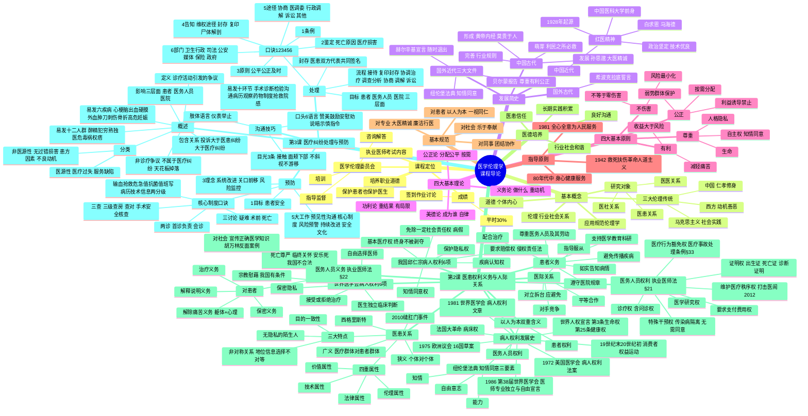

# 07 医学伦理学 — 知识框架与思维导图

## 一、Mermaid 思维导图

---

## 二、层级列表版

### 1. 课程定位
- 培养职业道德；保护患者也保护医生；
- 市级以上单位涉人研究应设医学伦理委员会；
- 平时分30%；执业医师考试内容。

### 2. 基本概念
- 道德：个体内心、善恶评价；
- 伦理：社会/行业关系规范；
- 医学伦理学 = 应用规范伦理学；
- 研究对象：医患、医医、医社三大关系。

### 3. 发展简史
- 中国古代四时期：萌芽（利民之所必救）→形成（黄帝内经、莫贵于人）→发展（孙思邈《大医精诚》）→完善（行业规则）；
- 国外古代：希波克拉底誓言；
- 中国近代：红医精神（1928年起源、中国医科大学前身、政治坚定技术优良；白求恩、马海德）；
- 国外近代：纽伦堡法典、赫尔辛基宣言、贝尔蒙报告。

### 4. 四大基本理论
- 美德论：我要成为怎样的医生，重自律；
- 义务论：我应该做什么，重动机；
- 功利论：重结果，有违生命平等之局限；
- 公正论：分配公平，按需处理。

### 5. 四大基本原则
- 尊重：生命、人格、隐私、自主权（知情同意）；
- 不伤害：≠零伤害，风险最小化；
- 有利：收益大于风险，减轻痛苦；
- 公正：按需分配，弱势群体保护，禁止利益诱导。

### 6. 指导原则与基本规范
- 指导原则：1942年题词→1981年全心全意为人民服务→80年代身心健康服务；
- 基本规范：对患者、对专业（廉洁行医）、对同事、对社会。

### 7. 医德培养
- 长期实践积累；
- 良好沟通→医患信任→诊疗与研究顺利；
- 个人→行业→社会和谐。

---

## 三、第2课补充层级列表（医患权利义务与人际关系）

### 8. 病人权利发展史
- 思想源头：《世界人权宣言》第3条（生命、自由、人身安全）、第25条（健康与医疗）；
- 起源：法国大革命提出"一个病人一张病床"的健康权；
- 推进：19世纪末—20世纪初消费者权益运动；
- 里程碑：纽伦堡法典（二战甲级战犯审判；731部队、奥斯维辛人体实验）；
- 时间线：1972 AMA病人权利法案→1975欧洲议会16国草案→1981 WMA→1986第38届WMA《医师专业独立与自由宣言》。

### 9. 知情同意三要素
- 知情、自由意志、能力；
- 即使知情且不愿意，无能力拒绝仍不被伦理接受。

### 10. 世界医学会病人权利6项
- 自由选择医师；医生独立判断；接受/拒绝治疗；保密隐私；死亡尊严；宗教慰藉；
- 我国适用性：前4项可行；第5项有条件（安乐死不合法）；第6项不接受病房大型宗教仪式。

### 11. 我国病人权利（邱仁宗6项）
- 基本医疗权（终身不被剥夺）、疾病认知权、知情同意权、保护隐私权、免除一定社会责任权、要求赔偿权；
- 法律散见于宪法、民法通则、执业医师法、侵权责任法；
- 实习/见习须依《医学教育临床实践管理暂行规定》（2009-01-01）告知、同意、保安全。

### 12. 患者义务（6项）
- 如实告知；配合治疗；避免传播疾病；尊重医务人员及劳动；遵守医院规章；支持医学教育科研。

### 13. 医务人员权利（《执业医师法》§21，伦理概括7项）
- 诊疗权（含问诊权）、证明权、要求支付费用权、医学研究权、维护医疗秩序权、特殊干预权、医疗行为豁免权。

### 14. 医务人员义务（《执业医师法》§22，伦理两方面）
- 对社会：宣传正确医学知识（胡万林反面案例）；
- 对患者：治疗、解释说明、解除痛苦（躯体+心理）、保密。

### 15. 医患关系
- 狭义：医生个体—患者个体；
- 广义：医疗群体（医、护、技、行政、机构）—患者群体（患者、家属、亲友）；
- 三大特点：目的一致性、无隐私的陌生人、非对称关系（地位/信息/选择不对等）；
- 四重属性：技术、伦理、法律、价值；
- 经典案例：2010年缝肛门事件。

### 16. 医际关系
- 医疗单位之间、医务人员之间、医务人员与单位之间；
- 四种模式：平等合作、指导服从、对手竞争、对立拆台（避免）。

---

## 四、第3课补充层级列表（医疗纠纷的处理与预防）

### 17. 医疗纠纷概述
- **定义**：医患双方因**诊疗活动**引发的争议（非诊疗活动引发→不属于医疗纠纷：地板滑/天花板掉落案例）
- **包含关系**：投诉 > 医患纠纷 > 医疗纠纷
- **影响三层面**：患者（伤害+经济压力）→医务人员（压力+伤医+职业倦怠）→医院（成本+秩序+声誉）
- **分类**：医源性（医疗过失/服务缺陷）vs 非医源性（无过错损害/患方因素/不良动机/其他）
- **易发环节10**：手术/临床诊断/检验检查/医患沟通/病历记录/病情观察与处理/药物相关/核心制度执行/抢救/医院感染
- **易发疾病6**：心梗或心律失常/脑出血/硬膜外血肿/刀刺伤/骨折/高危妊娠
- **易发人群12**：饮酒/精神异常/犯罪前科/经济拮据/职工家属熟人/独生子女/家属学医/多器官病变/吸毒/车祸斗殴/家属高干/地痞黑社会

### 18. 医疗纠纷的处理
- **目标**：患者（挽救伤害）、医务人员（帮助+人身安全）、医院（化解矛盾控制影响）
- **流程**：接待（稳定情绪、引导理性表达、立即报告科主任和医务部）→复印封存（**医患双方代表共同签名**）→协调治疗→调查分析→处理协商→调解→诉讼
- **口诀123456**：1条例《医疗纠纷预防与处理条例》/2鉴定（死亡原因+医疗损害）/3原则（公平公正及时）/4告知（维权途径+封存+复印+尸体解剖）/5途径（协商+医调委+行政调解+诉讼+其他）/6部门（卫生行政+司法+公安+新闻媒体+保险+政府）

### 19. 医疗纠纷的预防
- **1目标**：患者安全
- **3理念**：系统改进 / 关口前移（重点科室：产科、新生儿科、麻醉科、急诊）/ 风险监控
- **5大工作**：预见性医患沟通 / 落实核心制度 / 医疗风险预警 / 医疗安全持续改进 / 患者安全文化
- **核心制度口诀**：两诊（首诊负责/会诊）三查（三级查房/查对/手术安全核查）三讨论（疑难/术前/死亡），输血（用血审核）抢救（急危重抢救）危急值（报告），抗菌（药物分级）值班（交接班）写病历（管理），技术（新项目准入）信息（安全）两分级（护理分级/手术分级）
- **持续改进**：质量安全事件点评 / 安全隐患分析整改 / 每月专题会议 / 过错纠纷强制上报不良事件

### 20. 医患沟通技巧
- **口头语言6技巧**：多用赞美 / 常用鼓励 / 善用安慰 / 巧用劝说 / 妙用暗示 / 慎用指令；礼貌性语言是基本要求
- **肢体语言**：举手投足、仪表举止（容貌/体态/姿势），赢得尊重与信任
- **目光3条**：保持接触 / 注视面颊下部（不盯眼睛）/ 不斜视不游移
- 经典案例：门急诊医生低头写病历被投诉（缺乏目光接触与倾听）
