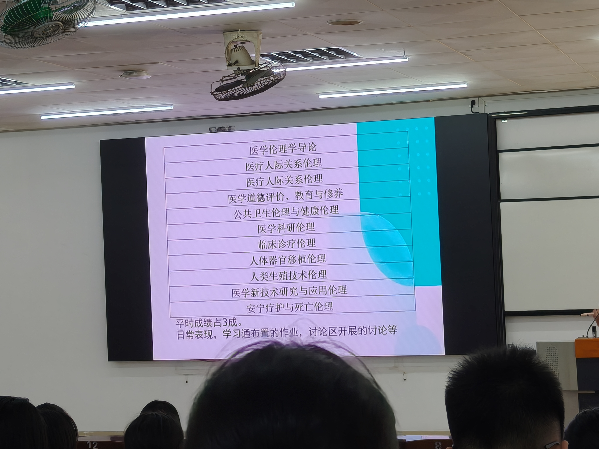
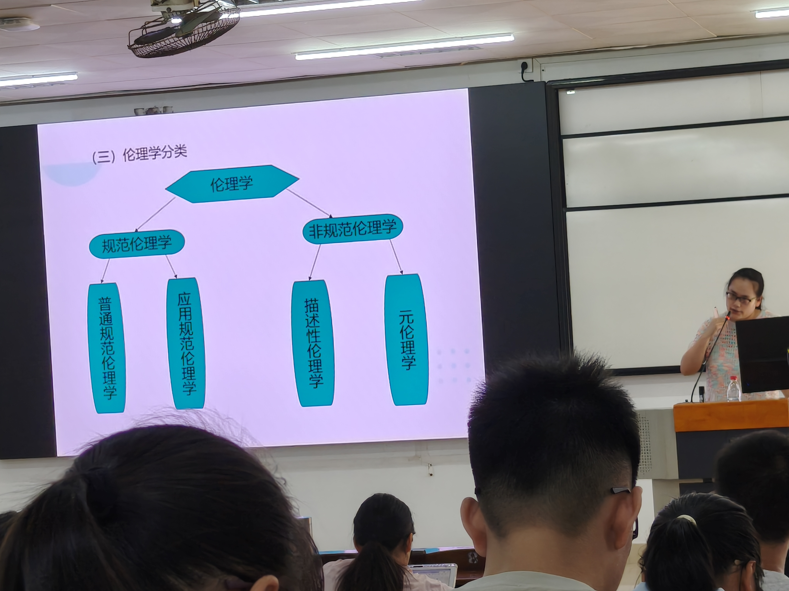
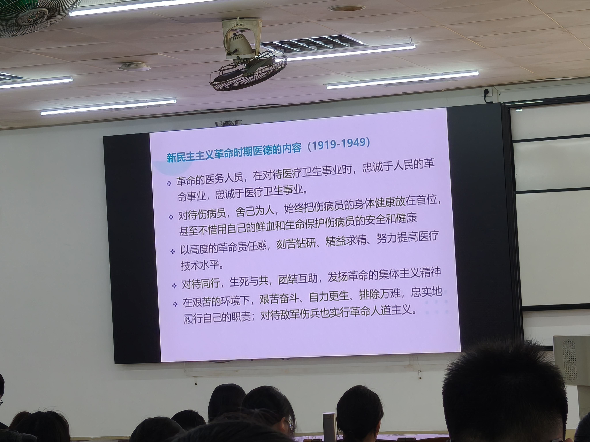
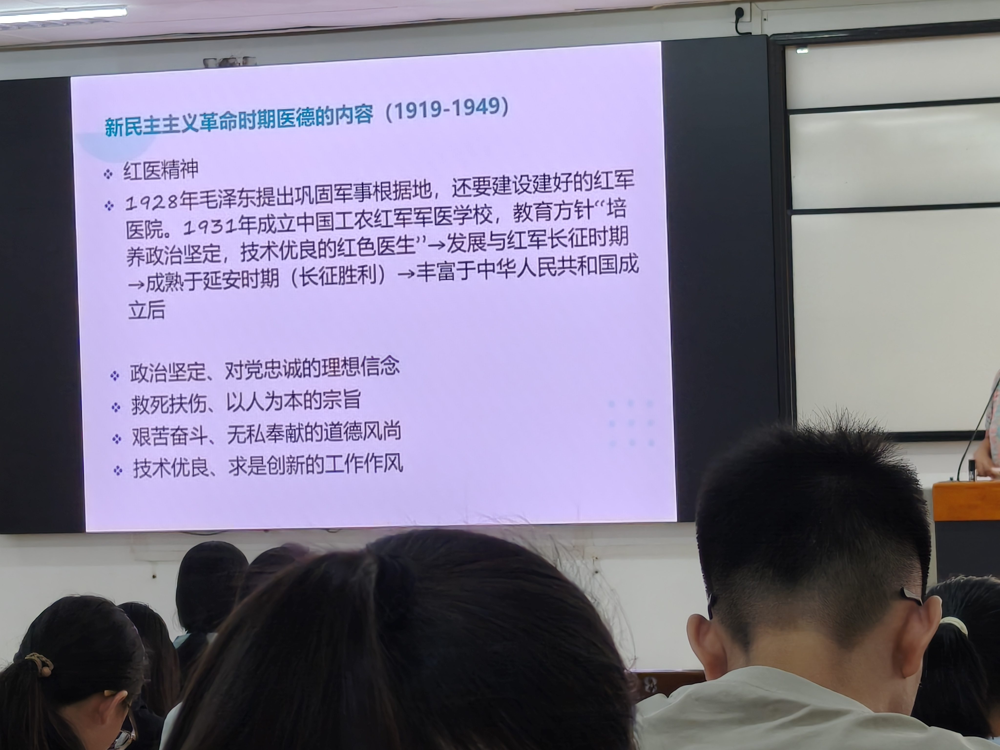

# 第1课 课程导论与医德培养 — 知识点总结（考试版）

> 课程：07 医学伦理学（Medical Ethics）
> 授课时间：2026-09-07
> 内容：课程导论、道德与伦理概念、医学伦理学学科定位、医学伦理发展简史、四大基本理论、基本原则与规范、医德培养
> 教材：郭乡村、黄妹、陈康主编《医学伦理学》，吉林人民出版社，2001年第1版（下称"教材"）

---

## 一、课程定位与学习目的

### 1.1 为什么要学医学伦理学（课程目的）

医学伦理学（Medical Ethics）不是一门"背概念、划重点"的思想政治课，而是一门**直接指导未来临床与科研实践**的应用学科。它的根本目的，是培养临床医务工作者与医学研究者的**职业道德（professional ethics）**，帮助大家处理在工作中真实会遇到的伦理两难问题。老师在开课第一句话就点明：这门课"培养或者说培育你们作为临床的医务工作者……在我们培养这些职业道德，来去处理你们在工作当中可能会遇到的一些问题"。

它的作用是**双向**的，这一点必须牢记：

1. **保护患者**：它确立并保障患者的**知情权、同意权、隐私权**等基本权利；
2. **保护医务人员自己**：它以规章制度、行业准则和法律形式，同样保护未来医务工作者和临床研究者的**合法权益**。

【考点】老师原话强调："我们不要把这门课程，简简单单理解为啊，我好像又多了一个思想政治课一样。它不仅仅是说能告诉我们这种医生的职业道德……大家作为未来的医务工作者，在未来工作实践当中，确实可能会遇到一些实践问题，我们怎么样去做。"——即医学伦理学是**实践导向**的，不是单纯的思想说教。

学习这门课的具体收益包括：①培育良好医德，提高工作效率、获得患者信任；②掌握作为医生的**权利、义务及相应法律法规**，在工作中懂得自我保护；③建立对生命高度负责的态度，为今后临床医疗活动打下基础。

### 1.2 医学伦理委员会制度

国家要求：凡是**市级以上**、开展涉及**人的生命科学和医学研究**的单位，都应当设立**医学伦理委员会（Institutional Review Board, IRB / Ethics Committee）**。其职责有三：

1. 定期开展**培训**，提升医务人员职业道德；
2. 对涉及人的生命科学和医学研究进行**指导与监督**；
3. 对研究过程中遇到的伦理问题提供**咨询解答**。

【教材补充·p.4】教材进一步指出：当代医学伦理学的研究范围已扩展至生命科学和整个医疗保健领域，形成了"**生命伦理学（Bioethics）**"这一崭新学科；医学科研道德是医学科研的**灵魂**，它要求研究者包括严谨治学、实事求是、配合协作、尊重同道、合理分配荣誉等品德。

### 1.3 成绩构成与教材说明

- **平时成绩占总成绩的30%（三成）**；
- 平时分来源：日常表现、课堂签到、学习通布置的作业、讨论区讨论等；
- 老师提醒：后续课程会**随机签到**，务必准时上课。

> 上图为老师课件所示本课程章节体系：医学伦理学导论、医疗人际关系伦理、医学道德评价/教育与修养、公共卫生伦理与健康伦理、医学科研伦理、临床诊疗伦理、人体器官移植伦理、人类生殖技术伦理、医学新技术研究与应用伦理、安宁疗护与死亡伦理。左下角标注"平时成绩占3成；日常表现、学习通布置的作业、讨论区开展的讨论等"。

- 教材说明："医学道德评价、教育、修养"一章本书未收录；教研室另订教材，已扫描为PDF上传**学习通**，可自行下载查看。

---

## 二、道德、伦理与医学伦理学的基本概念

### 2.1 道德的定义

**道德（Moral）**：是人类在社会生活实践中形成的、由**经济基础决定的上层建筑**，依靠**传统习俗、社会舆论、内心信念**三种力量维系，以**善恶**为评价方式，调节人与人、人与社会之间关系的行为规范总和。

这一定义有三个关键词必须掌握：①它属于**上层建筑**，由经济基础决定，因此具有时代性和阶级性；②它的维系力量不是法律强制，而是**习俗、舆论、信念**这"三位一体"的柔性机制；③它的评价标准是**善恶**，而非对错或利害。

### 2.2 道德与伦理的区别（易混辨析）

"伦理"与"道德"相互联系但侧重不同，二者不可混用：

| 概念 | 英文 | 侧重点 | 举例 |
|------|------|--------|------|
| **道德** | Morality | 强调**主体/个体**——个人内心信念、个人展现出的品质与行为总和 | "我这个人医德高尚" |
| **伦理** | Ethics | 偏重**社会/行业层面**——人与人之间应当遵循的关系准则，即某一行业的行为规范 | "医学伦理要求知情同意" |

【教材补充·p.1】教材指出：在中国古代，"伦理"一词是对有关人伦事理、思想规范和行为准则等道德现象的概括；儒家的《论语》《孟子》是具有中国特色的伦理著作。伦理学是关于道德的科学，亦称**道德哲学**，在西方发端于公元前四世纪，由亚里士多德创立。

### 2.3 医学伦理学的学科性质（重点考点）

【教材补充·p.1】教材明确："**医学伦理学属于应用伦理学，是医学和伦理学相交叉的学科**。医学伦理学是一般伦理学原理在医疗实践中的具体运用，是运用伦理学的理论来解决医疗实践和医学科学发展中人们相互之间、医学团体与社会之间关系的一门学科。"

因此医学伦理学具有双重身份：
- 它是**规范伦理学**的一个分支（应用规范伦理学）；
- 它又是**医学的组成部分**，医学中蕴含着伦理因素，伦理学贯穿于医学实践全过程。

> 上图为老师课件所示"伦理学分类"树状图：伦理学分为**规范伦理学**与**非规范伦理学**两大支。
> - 规范伦理学又分为：**普通规范伦理学**（研究普遍道德原则）与**应用规范伦理学**（将规范运用于具体领域，**医学伦理学即属此类**）；
> - 非规范伦理学又分为：**描述性伦理学**（Ethics as descriptive，对道德现象作客观描述、人类学/社会学研究）与**元伦理学**（Meta-ethics，研究道德语言、道德概念本身的意义）。
>
> 【考点】医学伦理学 = **应用规范伦理学**，是规范伦理学在医学领域的具体运用。

### 2.4 人类伦理思想三大传统

1. **中国传统伦理**：以"**仁**"为核心、以"**孝**"为本；注重个人品德修养，将"**修身、齐家、治国、平天下**"相联系，是一种向内求的德性伦理。
2. **西方伦理**：从**动机**出发，追问"什么应当做、什么不应当做"，区分善恶与义务。
3. **马克思主义伦理**：强调伦理从**社会实践**中产生、由社会存在决定。【考点】由此推出：医德不是天上掉下来的，而要在学习与临床实践中逐步积累——"你们也要从你们现在的学习当中开始，到你们的临床工作，慢慢从实践中发现去积累"。

### 2.5 医学伦理学的研究对象（三大关系）

【教材补充·p.1–3】教材把医学伦理学的研究对象界定为以**医患关系为核心**的医疗、预防、科研、保健及生命科学中的所有道德现象。老师在课堂上归纳为三大关系：

1. **医患关系（医生—患者关系）**：医生与患者、患者家属之间的沟通、病情解释与人文关怀。教材强调医患之间是**服务与被服务**的关系，患者处于主导地位，处理原则是"医者把患者利益放在第一位，全心全意为患者身心健康服务"。
2. **医医关系（医际关系）**：医务人员之间、医护之间、科室与会诊科室之间的协作。教材提出处理原则是**平等互助、分工协作、公平竞争**。
3. **医疗卫生领域与社会的关系**：医疗资源使用、公共卫生方案制定、与上级机构及其他单位的协调，本质是医疗整体效益与社会群体间的**公平**问题。

【教材补充·p.2–4】教材还把医德现象细分为三类，这是一个常考点：
- **医德意识现象**（主观）：医德观念、情感、意志、信念、理论体系；
- **医德规范现象**（客观要求）：在医学实践中评价和调整医务人员行为的准则；
- **医德活动现象**（实践）：医德评价、医德教育、医德修养。
> 三者关系：医学道德既以观念、理论等意识形式存在于研究者头脑中，又以原则、规范形式构成规范体系，指导医务人员实践。

---

## 三、医学伦理的历史发展

### 3.1 中国古代医德发展四时期

1. **萌芽时期**：远古人类医药活动伴随道德意识萌芽，形成"**利民之所必救**"的朴素理念——告诉人们何为不良、如何规避，以保障其生命健康。
2. **形成时期（认识时期）**：
   - 明确"医学是帮助人的事业"，医生应具**仁爱之心**；
   - **《黄帝内经》**已有专门的医德论述；
   - 【教材补充·p.10–11】儒家"仁"对医德思想影响深远，医学人道主义萌出"**仁术**""**医乃仁术**""**仁者爱人**"思想，要求医家治病以"无伤"为原则；《黄帝内经》强调"**天覆地载，万物悉备，莫贵于人**""人命之贵，一失不可复得"——人的生命最重要。
   - 这与当代伟大抗疫精神中的"**生命至上**"一脉相承。
3. **发展时期**：
   - 唐代**孙思邈《大医精诚》**是这一时期的标志；
   - 核心要求：医生不仅要有仁爱之心，还要有**精湛医术**，即"精"——追求高超技艺；
   - 【考点】要求**医德与医术相统一**，方为高尚而优秀的医家（"精诚"二字：一为医术之"精"，二为医德之"诚"）。
4. **完善时期**：医德从对个人的道德要求，发展为明确的**行业规则**（如"五禁施药"、历代医律），覆盖对个人、对技术、对患者、对同行的全面要求。

### 3.2 国外古代医德

以古希腊**希波克拉底（Hippocrates）《希波克拉底誓言》**为代表，确立了医者对患者利益至上、保密、不伤害等基本原则，是西方医学伦理的源头。随医学发展、对人体研究增多，伦理要求不断提高：从早期未经同意进行人体实验，逐步发展到获得受试者同意，再到患者权利日益扩大。

### 3.3 中国近代：新民主主义革命时期的医德（1919–1949）

时代背景是**反帝、反封建、反官僚资本主义**的革命，由此形成两大精神内核：**爱国主义 + 革命人道主义**。

> 上图为老师课件原文，新民主主义革命时期医德内容（1919–1949）共五条：
> 1. 革命的医务人员，在对待医疗卫生事业时，忠诚于人民的革命事业，忠诚于医疗卫生事业；
> 2. 对待伤病员，舍己为人，始终把伤病员的身体健康放在首位，甚至不惜用自己的鲜血和生命保护伤病员的安全和健康；
> 3. 以高度的革命责任感，刻苦钻研、精益求精，努力提高医疗技术水平；
> 4. 对待同行，生死与共，团结互助，发扬革命的集体主义精神；
> 5. 在艰苦的环境下，艰苦奋斗、自力更生、排除万难，忠实地履行自己的职责；对待敌军伤兵也实行革命人道主义。

#### 红医精神

> 上图为老师课件：红医精神的历史脉络与内涵。
> - **起源**：1928年毛泽东提出"巩固军事根据地，还要建设好的红军医院"；
> - **1931年**成立中国工农红军军医学校，教育方针为"**培养政治坚定、技术优良的红色医生**"；
> - **发展**于红军长征时期 → **成熟**于延安时期（长征胜利后）→ **丰富**于中华人民共和国成立后；
> - **内涵四条**：政治坚定、对党忠诚的理想信念；救死扶伤、以人为本的宗旨；艰苦奋斗、无私奉献的道德风尚；技术优良、求是创新的工作作风。

红医精神是**中国医科大学的前身**教育传统，是革命人道主义在医疗战线的具体体现。

**典型例证**（老师课堂举例，可作论述题素材）：
- **长征医务人员**：抱着"牺牲自己也要救护伤员"的信念；
- **当代援鄂医护**：明知环境恶劣、前途危险，仍主动请缨奔赴一线，坚守岗位、甘于奉献——这是"政治坚定、忠于党和人民"在和平年代的延续；
- **白求恩（Norman Bethune）**：在根据地建立流动手术台，提高救治率，体现"技术优良、追求卓越"；
- **马海德（George Hatem）**：外籍医生，认同中国共产党理念后留华治疗麻风病，与患者**同吃同住**，奠定我国麻风病治疗基础，体现"以人为本、友善"；
- **集体主义**：战争年代建立"伤兵分类救治链"高效轮转；当代医院倡导多科室、多部门协作（MDT）。

### 3.4 国外近代：三大人体研究伦理文件（高频考点）

随着现代医学发展、人体研究增多，伦理约束也从粗到细、从原则到细则。三大标志性文件：

| 文件 | 年代 | 核心贡献 |
|------|------|----------|
| **《纽伦堡法典》**（Nuremberg Code） | 1947 | 二战后纽伦堡审判产物：首先要把受试者当**人**尊重，必须获得**知情同意（informed consent）** |
| **《赫尔辛基宣言》**（Declaration of Helsinki） | 1964起多次修订 | 对受试对象的选择有标准要求；必须向受试者**告知风险**；受试者有**随时退出权** |
| **《贝尔蒙报告》**（Belmont Report） | 1979 | 提出**尊重（Respect）、有利（Beneficence）、公正（Justice）**三原则；我国现行规定在此基础上扩展为**四大原则** |

【考点】老师强调一条主线："随着医学技术的不断发展，伦理问题越来越复杂，但对伦理执行的细节更加详细——这**既是保护患者、受试者的权利，也是保护我们作为医务工作者**（全过程留底、可备查）。"

我国《涉及人的生命科学和医学研究伦理审查办法》的核心要求：
- 知情同意书须用**受试者能理解的语言**书写，避免堆砌专业术语，必要时逐条解释；
- 告知实验目的、配合方式、**风险与受益**；
- 实验过程中受试者随时可咨询、可**随时无理由退出**；
- 若实际操作与告知不符，受试者有权向**医学伦理委员会**投诉监督；
- 即使伦理委员会已批准，研究者仍须严格按提交方案执行，委员会全程监督——**批准 ≠ 放任自流**。

【教材补充·p.156–167（第十一章 医学研究与人体实验道德）】教材设有专章讨论医学研究的道德本质、道德要求、人体实验道德与尸体解剖道德，强调医学研究必须坚持医学人道主义精神，坚持受试者健康利益与医学发展整体利益的内在统一。

---

## 四、医学伦理学四大基本理论（核心考点）

四大理论分别回答不同的根本问题，务必区分清楚：

| 理论 | 英文 | 核心追问 | 评价依据 | 一句话记忆 |
|------|------|----------|----------|------------|
| **美德论** | Virtue Theory | 我要**成为怎样的人/医生** | 医者的品格、德性 | 做有德之人，强调**自律** |
| **义务论** | Deontology | 我**应当做什么** | 行为的动机是否正当、是否尽义务 | 看动机、重义务 |
| **功利论（效用论）** | Utilitarianism | 做了之后**结果如何** | 效用/福祉最大化 | 看结果，救最多的人 |
| **公正论（正义论）** | Justice Theory | 资源/利益**如何公平分配** | 人人平等、按需分配 | 分配要公平 |

### 4.1 美德论（Virtue Theory）

以**美德**为中心，探讨"应当成为怎样的人、怎样的医生"。在医学领域，即探讨医务人员应具备何种医德、如何培养医德。它强调**自律**——医德不是一时一事，而是内心信念长期内化、转化为行动后的积淀。

【考点】老师强调："不要要求自己一下子达到很高的品质……这种品质需要大家在社会实践中去不断发展。"实践路径：从现在起在沟通技巧、学习习惯、团队协作等日常小事中积累——例如参加医学科普志愿活动，面对不同理解水平的公众，锻炼"看人下菜碟"式的沟通能力，就是在培养医德。

### 4.2 义务论（Deontology）

探讨**义务**，注重**动机**，回答"我应该做什么"。它以行为本身是否正当、是否"应当"作为道德评价标准，研究医务人员与临床研究者的行为准则，强调**约束**。义务论与功利论的根本分野在于：义务论问"这件事该不该做"，功利论问"做了划不划算"。

### 4.3 功利论（Utilitarianism，效用论）

注重**结果**，以效用（整体福祉）最大化作为评价依据。
- **应用示例**：疫情期间呼吸机只有一台，功利论会优先救治**成活率高、救活后对社会贡献大**者。
- **局限性**（考点）：
  1. 它**违背生命平等原则**——默认老年、治愈率低者可被"牺牲"；
  2. 它**未征得患者本人及家属意愿**，剥夺了其知情与选择权；
  3. 难以解决贫困地区医疗资源分配不公的问题。
- 因此功利论**不能单独使用**，需引入公正论加以平衡。

### 4.4 公正论（Justice Theory，正义论）

强调**人人生而平等**，每个人都享有健康权。资源短缺时需配套机制，平衡**效率与公平**。
- 但公正**不等于机械排队**：急诊场景必须**按需处理**。老师举例：一位手外伤流血需处理，一位车祸已昏迷——不能"谁先来谁先看"，而应按病情危重程度优先处理昏迷者。这就是"**分力差的差相权**"，即差异情况下的权衡。
- 结论：**功利论需公正论补充，公正论也需考虑"按需"**——二者互为矫正。

#### 健康中国战略对公正原则的实践

- 人人享有医疗服务权，不因地域、经济、身份差异而不同；
- **分级诊疗**：基层首诊、双向转诊，优化资源配置，缓解大医院拥堵；
- **县域医共体**：县级医院与乡镇医院捆绑管理，保障基层就诊，减轻贫困患者交通、食宿负担；
- **机会公平**：人才下沉、三甲医生定期下乡坐诊、远程会诊、规范"飞刀"（国家文件已明确保障多点执业医生权益）；
- **数字医疗**：远程手术跨越5000余公里（本校实例）；
- **援疆、援非**：留下一支"带不走的三甲团队"，促进医疗公益性与基层公平。

---

## 五、医学伦理学的指导原则、基本原则与基本规范

### 5.1 指导原则（历史演进）

| 时期 | 文件/事件 | 内容 |
|------|-----------|------|
| 1942年 | 毛泽东为中国红军医科大学题词 | **救死扶伤，实行革命的人道主义** |
| 1981年 | 第一届医德学讨论会 | 防病治病、救死扶伤、实行社会主义人道主义、**全心全意为人民服务** |
| 20世纪80年代中期至今 | 进一步发展 | 增加"身心"——**全心全意为人民身心健康服务** |

【考点】演进背后的逻辑：患者不仅"有病"，他身体上有痛苦、对疾病未知而恐惧、对死亡有担忧、作为人有尊严。因此现代医学从"治病"走向"**治病+关怀身心**"。

### 5.2 四大基本原则（高频考点，务必背熟）

1. **尊重原则（Respect）**
   - 尊重患者**生命与生命价值**（享有生命健康权）；
   - 尊重**人格与隐私**（治疗过程中隐私不得外泄）；
   - 尊重**自主权（autonomy）**：通过知情同意，告知病情、治疗方案、风险与受益；
   - 前提：判断患者是否具有相应**行为能力**，能否理解告知内容；神志清楚、具有完全民事行为能力者，应在充分告知后**自愿**作出决定，且该决定不得严重损害他人和社会利益。

2. **不伤害原则（Non-maleficence）**
   - 【考点】**不伤害 ≠ 零伤害**——治疗过程中不可避免有一定伤害；
   - 要避免的是**不必要**的伤害；预见并规避可预见的风险，将风险**降至最低**；
   - 对有伤害/风险的医疗措施进行评价，必须**收益 > 风险**，否则伦理委员会可要求终止实验。

3. **有利原则（Beneficence）**
   - 一切诊疗与研究方案应**有利于患者和受试者**；
   - 减轻痛苦、提供最佳治疗方案、促进健康；
   - 若治疗效果与已有方案相同，但能**降低费用**、减轻患者经济负担，亦属"有利"。

   > 【易混辨析】不伤害 vs 有利：不伤害强调"控制风险、避免不必要伤害"（守住下限）；有利强调"主动谋利、促进健康、减轻痛苦"（追求上限）。

4. **公正原则（Justice）**
   - 不是所有人完全一样，而是按**医学标准**和**按需**合理分配；
   - 公平选择受试者：非特殊病情需要，**不得选择弱势群体**（无行为能力人、限制行为能力人）；
   - 公平招募，**不得以利益诱导**（如贫困人群为交通/营养补贴勉强参加）。
   - 弱势群体特殊规定：须经**监护人同意**，同时以其本人能理解的方式告知并取得其本人同意（双重同意）。

### 5.3 基本规范（按服务对象分类记忆）

| 服务对象 | 具体规范 |
|----------|----------|
| **对待患者** | 以人为本、生命至上；一视同仁、平等交流；举止端庄、语言文明；良好沟通；诚实守信；保护隐私 |
| **对待专业** | 大医精诚、打好基础；精益求精；**廉洁行医**（拒收红包、遵纪守法） |
| **对待同事** | 互相学习、团结协作；多科室良好沟通 |
| **对待社会** | 乐于奉献、热情服务、热心公益 |

---

## 六、医德培养的意义、途径与本课程学习方法

### 6.1 医德培养的意义

- 医德是**内心内化的信念 → 行动 → 长期积累**的结果，不可能一蹴而就；
- 良性循环：**良好医德 → 良好沟通 → 患者信任与配合 → 提高诊疗质量、研究顺利开展**；
- 放大效应：个人医德 → 科室声誉 → 医院口碑 → 行业风气 → 社会尊重，最终促进**社会和谐**；
- 医学技术越发展，伦理问题越复杂，对患者和医务人员的保护也越细致，这是医学发展的**必然要求**。

### 6.2 医德培养的途径

教材与课堂共同指向三条基本途径：
1. **医德教育**：由伦理委员会、学校、医院系统培训；
2. **医德修养**：自我磨炼、自我反思，知行统一，在实践中培养医德情感、锤炼医德意志；
3. **医德评价**：通过社会舆论、传统习俗、内心信念评价医德行为。

【教材补充·p.8】教材强调学习医学伦理学的方法：一是**联系实际、掌握理论**（不只死记概念，要密切联系医学实际）；二是**知行统一、自觉修养**（从知到情、意、信、行的统一，身体力行、躬行践履）。

### 6.3 课程的其他定位

- 医学伦理学是**执业医师资格考试**笔试内容之一（临床专硕规培、工作后都会继续用到）；
- 学习方法：以**问题（论题）为导向**、**案例分析**、向榜样（优秀教师、好医生）学习；
- 这门课是医学人文的基础课程，是构建和谐医患关系、促进社会和谐的重要途径。

---

## 七、本课易混概念速查

| 易混点 | 区别 |
|--------|------|
| 道德 vs 伦理 | 道德偏个体内心；伦理偏社会/行业规范 |
| 普通规范伦理学 vs 应用规范伦理学 | 前者研究普遍原则；后者把原则用于具体领域（医学伦理学属后者） |
| 美德论 vs 义务论 | 美德论问"做怎样的人"；义务论问"应当做什么"，重动机 |
| 义务论 vs 功利论 | 义务论看动机；功利论看结果（效用最大化） |
| 功利论 vs 公正论 | 功利论追求最大效用但牺牲公平；公正论强调平等与按需分配，须互补 |
| 不伤害原则 vs 有利原则 | 不伤害=控制风险（下限）；有利=主动谋利（上限） |
| 知情同意 vs 随时退出权 | 前者是入组前的同意；后者是过程中无条件退出的自由 |
