# 医学伦理学第3课：医疗纠纷处理与医患沟通技巧（教材精讲版）

> 授课时间：2026-09-14 07:59~09:27（录音连续，无暂停）
> 内容范围：医疗纠纷的定义/分类/影响/易发环节/处理流程与口诀/预防/医患沟通技巧
> **教材依据**：课堂教材为《医学伦理学》（吉林人民出版社版）——现有PDF为试读版，不含本章；本总结以**老师课堂内容为主**，并补充**人卫临床助手《医疗纠纷概述》《医患关系建立与沟通技巧》**教材级知识（标注【教材补充】），帮助你把老师讲的口诀落到系统的知识框架上
> 阅读建议：口诀必背，教材补充帮助理解"为什么"

---

## 第一部分 医疗纠纷概述

### 1.1 定义——先看"是不是医疗纠纷"

**老师课堂版**：医疗纠纷＝医患双方因**诊疗活动**引发的争议。

> 判断标尺：争议是否由**诊疗活动**引发？
> - 是 → 医疗纠纷
> - 否（如患者在医院**地板滑倒、天花板掉落**受伤）→ **不属于**医疗纠纷（但医院可能承担其他民事/侵权责任）

**教材版定义【教材补充】**：医疗纠纷是指医患双方就医疗活动过程中**对患者权益的侵害及其导致原因、处理方法、责任认定和处理结果等不一致**而产生的分歧和争执。

**主体与客体【教材补充】**：
- **主体＝医患双方**：医方＝医疗机构及医务人员（医务人员行为属**职务行为**，故主体主要是医疗机构）；患方＝患者及其家属/利害关系人（配偶、子女、父母）
- **客体＝患者的生命权、健康权**（《民法通则》第98条：公民享有生命健康权）

**包含关系（必背）**：**投诉 ⊃ 医患纠纷 ⊃ 医疗纠纷**
- 投诉：患者不满意即可提出（范围最广）
- 医患纠纷：医患双方产生争议
- 医疗纠纷：争议由诊疗活动引发（范围最窄）

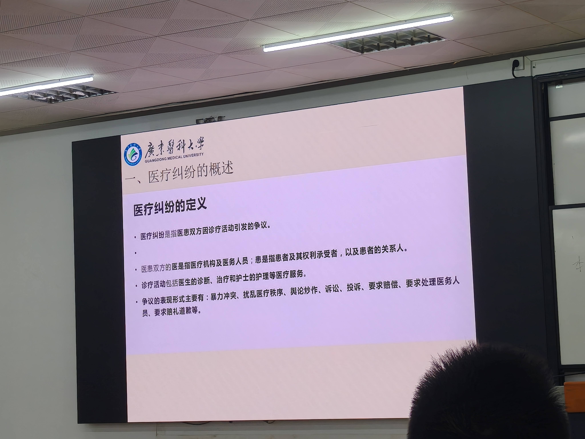

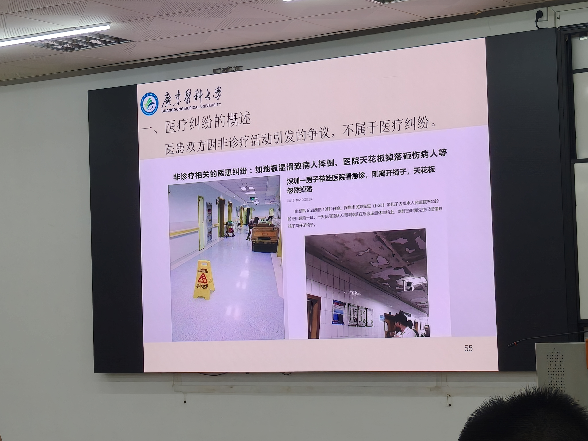

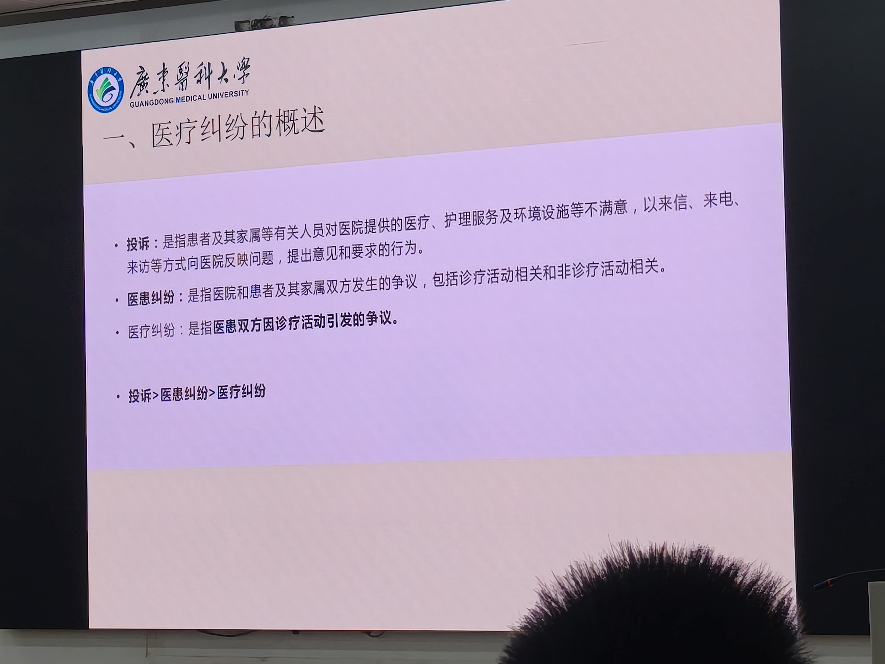

> 📝 **看图要点**：记住"是否由诊疗活动引发"这一把尺子。

### 1.2 分类

**课堂分类**：

| 类型 | 定义 | 例子 |
|------|------|------|
| **医源性纠纷** | 医方因素引发 | 医疗过失（诊疗护理过失）、服务缺陷（态度/沟通/管理） |
| **非医源性纠纷** | 非医方因素引发 | 无过错损害（疾病自然转归）、患方因素（期望过高/不信任）、不良动机（恶意索赔）、其他 |

**教材分类【教材补充】（法律视角，四类）**：
1. **医疗事故纠纷**——医患双方就医疗行为是否构成医疗事故及是否承担赔偿责任的纠纷
2. **非医疗事故纠纷**——医疗事故以外原因引起的医疗赔偿纠纷（如整形美容/变性手术损害、医院设施不安全、医院管理过失如抱错婴儿）
3. **医疗侵权纠纷**——就医疗机构及医务人员是否实施医疗侵权行为及是否承担侵权责任的纠纷
4. **医疗服务合同纠纷**——是否违反医疗服务合同及是否承担违约责任的纠纷（医方：未尽注意义务；患方：不缴费用、不遵医嘱）

**医疗事故的4个构成要件【教材补充】（填空/简答常考）**：
1. 必须发生在医疗机构及其医务人员的**医疗活动中**（非法行医不算）
2. 医疗行为具有**违法性**（违反医疗卫生管理法律、法规、规章和诊疗护理规范、常规）
3. 必须是**过失**造成患者**人身损害**（过失≠故意）
4. **过失行为与损害后果之间存在因果关系**

### 1.3 医疗纠纷的影响（三层面，必背）

| 层面 | 影响 |
|------|------|
| **患者** | 身心伤害＋经济损失 |
| **医务人员** | 心理压力、伤医事件威胁、职业倦怠 |
| **医院** | 医疗成本增加、秩序受扰、声誉受损 |

### 1.4 易发环节/疾病/人群（课堂，选择题高频）

- **易发环节10个**：手术、临床诊断、检验检查、医患沟通、病历记录、病情观察与处理、药物相关、核心制度执行、抢救、医院感染
- **易发疾病6类**：心梗或心律失常、脑出血、硬膜外血肿、刀刺伤、骨折、高危妊娠
- **易发人群12类**：饮酒、精神异常、犯罪前科、经济拮据、职工家属熟人、独生子女、家属学医、多器官病变、吸毒、车祸斗殴、家属高干、地痞黑社会

### 1.5 纠纷产生的原因【教材补充】（理解用）

- **患方原因**：对医疗效果期望过高；对医方不信任；自我维权把握失度（只讲维权不重自律）
- **医方原因**：医德医风问题、过度医疗、防御性医疗行为、沟通不足
- **社会原因**：医患诚信缺失、高额医疗赔偿（"同案异价"、天价索赔）、新闻媒体片面报道、社会体制因素（82.64%受访医师认为主要是"体制"造成的）

---

## 第二部分 医疗纠纷的处理（口诀123456，必背）

### 2.1 处理目标（三层面）

- **患者**：挽救伤害、安抚情绪
- **医务人员**：帮助、保护人身安全
- **医院**：化解矛盾、控制影响

### 2.2 处理流程（课堂）

**接待 → 复印/封存 → 协调治疗 → 调查分析 → 处理协商 → 调解 → 诉讼**

关键环节要点：
- **接待**：稳定情绪、引导理性表达、**立即报告科主任和医务部**
- **封存**：病历资料**医患双方代表共同签名**（防篡改）
- 封存与复印的区别：封存=双方签名封存原件防篡改；复印=患方留存复印件

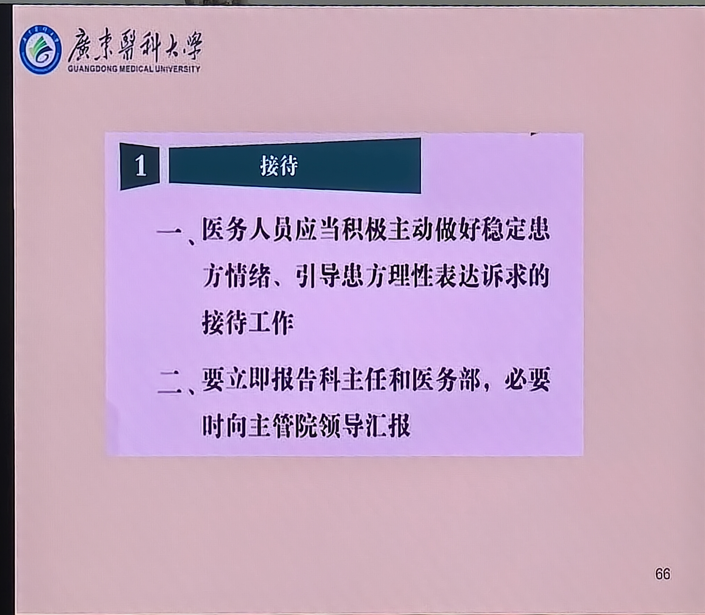

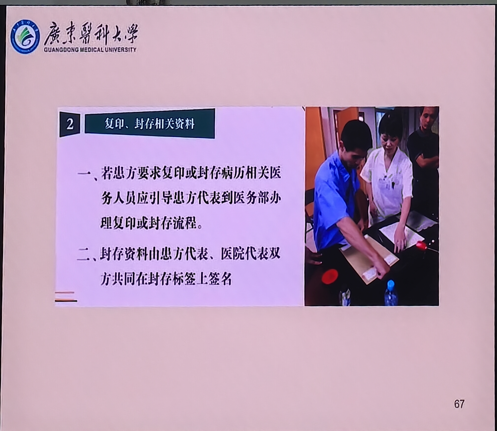

> 📝 **看图要点**：流程顺序和"双签名"是得分点。

### 2.3 处理口诀"123456"（老师原话强调）

| 数字 | 内容 |
|------|------|
| **1条例** | 《医疗纠纷预防和处理条例》（2018年国务院令） |
| **2鉴定** | 死亡原因鉴定（回答"怎么死的"）＋ 医疗损害鉴定（回答"诊疗是否有过错、过错与损害有无因果关系"） |
| **3原则** | **公平、公正、及时** |
| **4告知** | 维权途径、病历封存、病历复印、尸体解剖 |
| **5途径** | 双方自愿协商／申请**人民调解**（医调委）／申请行政调解／向人民法院提起诉讼／法律法规规定的其他途径 |
| **6部门** | 卫生行政部门、司法部门、公安机关、新闻媒体、保险部门、政府 |

【考点】"一旦发生医疗纠纷，可能就会出现两个鉴定……处理时一定要遵循三个原则，就是公平、公正、及时"——老师原话。2鉴定、3原则直接对应。

**法定解决途径补充【教材补充】**：《医疗纠纷预防和处理条例》第22条，5条途径：协商、人民调解、行政调解、诉讼、其他。注意：**医疗纠纷赔付金额1万元以上**的，公立医疗机构不得与患方自行协商处理，应走人民调解/行政调解/诉讼等途径。

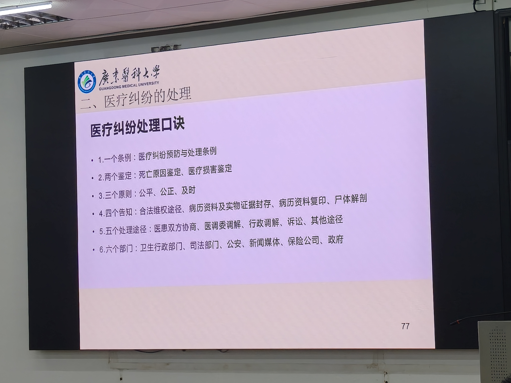

> 📝 **看图要点**：123456表格直接背，考试简答直接默写。

---

## 第三部分 医疗纠纷的预防

### 3.1 预防目标与三理念（课堂）

- **1个目标**：患者安全
- **3大理念**：
  1. **系统改进**——从系统找原因，而非单纯惩罚个人
  2. **关口前移**——加强**重点领域、重点部门、重点环节**的患者安全管理（老师举例：产科、新生儿科、麻醉科、急诊等）
  3. **风险监控**——持续监测、预警
- **5大工作**：预见性医患沟通、核心制度落实、风险预警、持续改进、安全文化

### 3.2 核心制度口诀（必背）

> **两诊三查三讨论，输血抢救危急值，抗菌值班写病历，技术信息两分级**

| 口诀 | 对应核心制度 |
|------|-------------|
| 两诊 | 首诊负责制、会诊制度（三级查房外的"两诊"） |
| 三查 | 查对制度（三查七对）等 |
| 三讨论 | 术前讨论、疑难病例讨论、死亡病例讨论（老师强调：加强术前的讨论、非计划的再次手术、三级查房患者的交接、院内的会诊） |
| 输血抢救危急值 | 临床用血审核、急危重患者抢救、危急值报告 |
| 抗菌值班写病历 | 抗菌药物分级管理、值班交接班、病历书写规范 |
| 技术信息两分级 | 手术分级管理、信息安全分级 |

### 3.3 持续改进（课堂）

- 医疗质量安全事件**点评**
- 医疗安全隐患**分析整改**
- 月度**专题会议**
- **过错投诉纠纷强制上报**不良事件（不报即错）

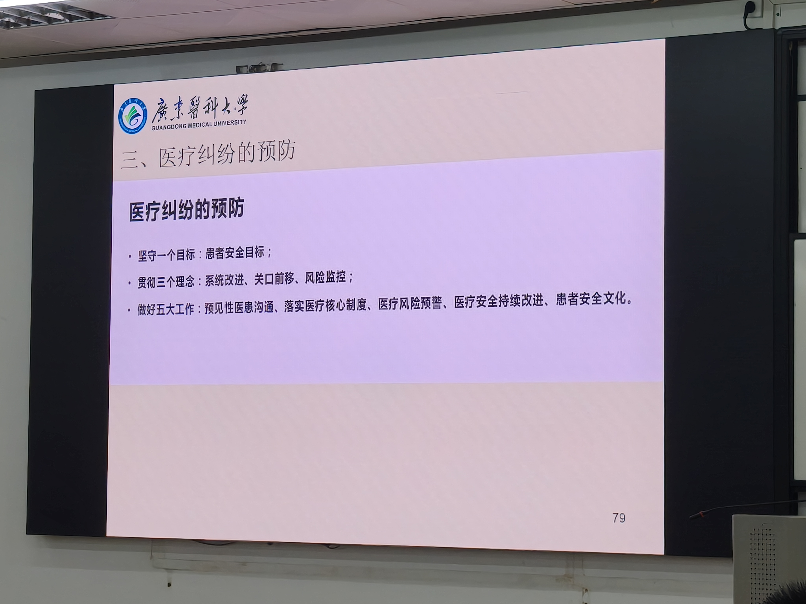

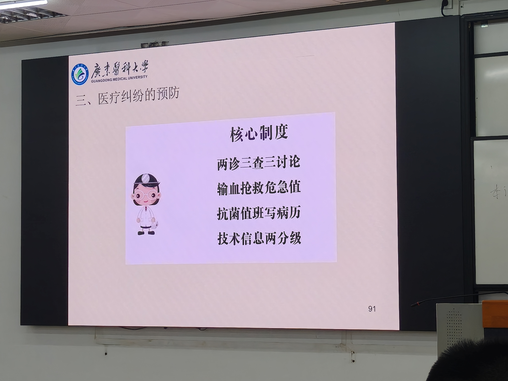

> 📝 **看图要点**："1目标3理念5工作"和核心制度口诀一起背。

---

## 第四部分 医患沟通（教材精讲+课堂技巧）

> 老师原话："医疗纠纷的处理实际上就是明确我们医务人员以及医院的责任，并且依法去承担责任的一个过程。其中**最关键的就是去有效沟通**。"

### 4.1 沟通的伦理原则8条【教材补充】（人卫）

1. **以人为本**——一切从患者出发，以患者为中心
2. **诚信原则**——沟通的基础和根本
3. **平等原则**——三层含义：人格平等（医者不以救助者自居）；对不同民族/性别/年龄/文化/经济背景的患者一视同仁；公平分配卫生资源
4. **尊重原则**——尊重尊严、价值观与信仰、基本权利（医疗权、知情权、决定权、隐私权、申诉权）
5. **同情原则**——对患者痛苦表现出关切
6. **保密原则**——保护隐私，不与无关人员讨论
7. **反馈原则**——语言+非语言反馈"听"的状态，准确解读患者非语言信息
8. **共同参与原则**——诊疗全程保持畅通信息沟通渠道

### 4.2 口头语言技巧（课堂6种+教材补充）

**课堂"6种语言"（记忆：多常善巧妙慎）**：
1. **多用赞美**——缓解患者消极心理，重建价值感
2. **常用鼓励**
3. **善用安慰**——安慰性、劝说性、鼓励性、积极暗示性言语
4. **巧用劝说**
5. **妙用暗示**（积极暗示）
6. **慎用指令**——忌"你是医生还是我是医生"式训斥

**教材补充【教材补充】**：
- **礼貌性语言是基本要求**（老师强调）；得体的称呼语是建立和谐关系的第一环节（"良言一句三冬暖，恶语一言六月寒"）
- **克服伤害性言语**：指责、埋怨、嘲讽、训斥——"钱重要还是命重要？""早干嘛去了？"都会引发纠纷
- **提问方式**：开放式（什么/怎样/为什么）深入了解；封闭式（明确答复/时间有限）；探索性追问；核实理解用"我说清楚了吗？"
- 语速不宜过快，合理运用语调

### 4.3 非语言交流（课堂+教材）

**关键数据【教材补充】**：日常沟通中**93%的信息通过非言语传递**，面部表情和身体动作占沟通效果的**55%**；当言语与非言语不一致时，人们**更相信非言语信号**。

- **目光3条（老师强调）**：①保持接触 ②注视**面颊下部**（不要一直盯着眼睛）③不斜视、不游移
- **肢体语言（课堂）**：举手投足、仪表举止（容貌/体态/姿势），非语言+语言结合
- **正确运用【教材补充】**：目光接触、点头、前倾身体、轻柔动作、温和表情、查体时手的温度
- **抑制不恰当信号【教材补充】**：埋头写病历不注视患者、频繁移动身体重心、反复看手表/手机、边听边接电话——都会让患者感到不受尊重

### 4.4 倾听技能【教材补充】（沟通中"听"比"说"更关键）

- **主动倾听**：把他人放在首位，反馈信息鼓励倾诉——既获诊断信息，又让患者感受尊重
- **完整倾听**：患者平均开始说话**18秒**后就被医生打断（Beckman & Frankel, 1984研究）——打断会造成病史遗漏和医患隔阂
- **倾听技巧**：不打断、点头+"哦/嗯"应答、概括复述（"你是说……"）、避免直接争论、边听边记关键词但别影响谈话氛围
- **扫除倾听障碍**：急于表达、选择性倾听、走神、一心二用、敲桌面/晃腿/嚼口香糖等

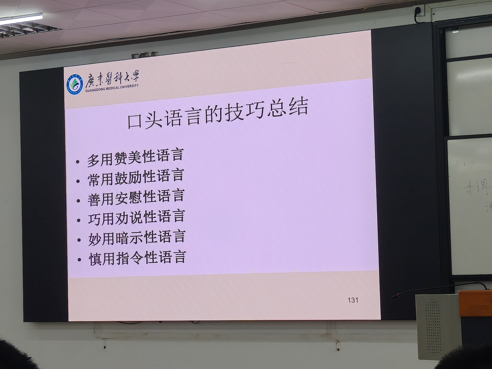

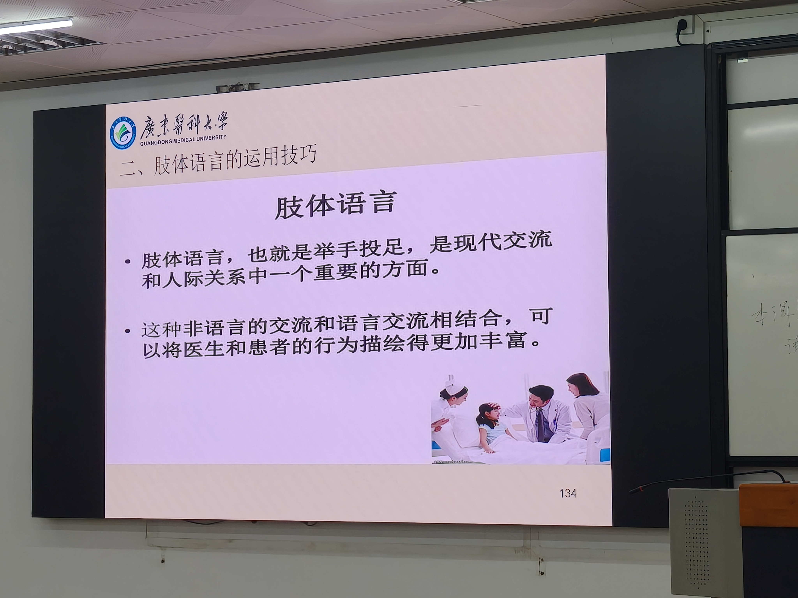

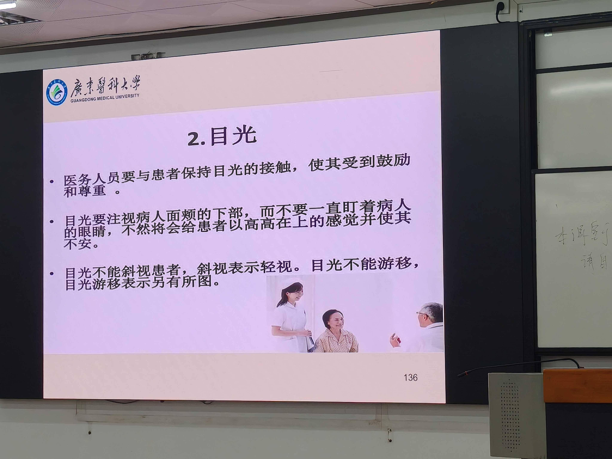

> 📝 **看图要点**：三条线下场景最容易出选择题——目光看面颊下部、不斜视。

---

## 第五部分 考点速记（本课浓缩）

**口诀四件套**：
1. **判断标尺**：是否由诊疗活动引发 → 是=医疗纠纷
2. **处理口诀123456**：1条例 2鉴定 3原则（公平公正及时）4告知 5途径 6部门
3. **核心制度口诀**：两诊三查三讨论，输血抢救危急值，抗菌值班写病历，技术信息两分级
4. **预防**：1目标（患者安全）3理念（系统改进/关口前移/风险监控）5工作

**答题模板（案例题）**：判断纠纷性质（诊疗活动？）→ 影响三层面 → 按流程处理（接待→封存双签名→鉴定→协商/调解/诉讼）→ 预防（沟通+核心制度+强制上报）

**易错点**：
- 投诉⊃医患纠纷⊃医疗纠纷（包含关系别反）
- 封存=双方签名防篡改；复印=患方留存
- 死亡原因鉴定 vs 医疗损害鉴定：前者"怎么死的"，后者"有无过错+因果关系"
- 医疗事故4要件：医疗活动中＋违法性＋过失致人身损害＋因果关系
- 医源性（医方因素）vs 非医源性（非医方因素）

**复习建议**：先读本总结理解框架（教材补充部分帮你知道"为什么这样规定"），再背考点与术语.md的口诀清单，最后用科目根目录思维导图复述。沟通技巧部分可结合见习/实习场景联想记忆。
